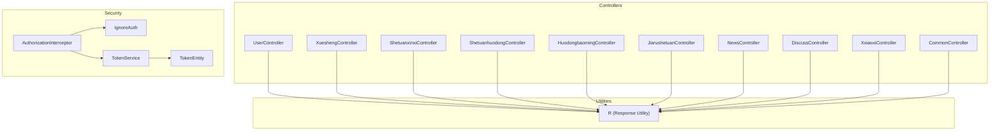
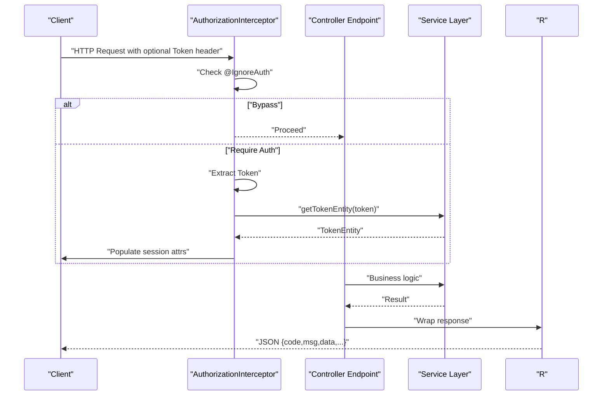
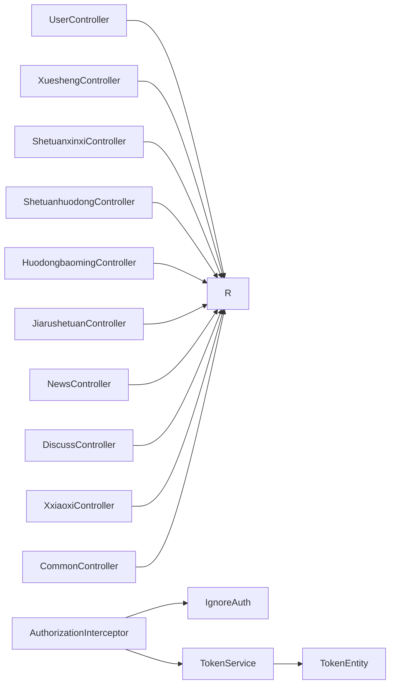

# API Reference

<cite>
**Referenced Files in This Document**
- [UserController.java](file://src/main/java/com/controller/UserController.java)
- [XueshengController.java](file://src/main/java/com/controller/XueshengController.java)
- [ShetuanxinxiController.java](file://src/main/java/com/controller/ShetuanxinxiController.java)
- [ShetuanhuodongController.java](file://src/main/java/com/controller/ShetuanhuodongController.java)
- [HuodongbaomingController.java](file://src/main/java/com/controller/HuodongbaomingController.java)
- [JiarushetuanController.java](file://src/main/java/com/controller/JiarushetuanController.java)
- [NewsController.java](file://src/main/java/com/controller/NewsController.java)
- [XxiaoxiController.java](file://src/main/java/com/controller/XxiaoxiController.java)
- [CommonController.java](file://src/main/java/com/controller/CommonController.java)
- [DiscussController.java](file://src/main/java/com/controller/DiscussController.java)
- [AuthorizationInterceptor.java](file://src/main/java/com/interceptor/AuthorizationInterceptor.java)
- [IgnoreAuth.java](file://src/main/java/com/annotation/IgnoreAuth.java)
- [R.java](file://src/main/java/com/utils/R.java)
- [TokenService.java](file://src/main/java/com/service/TokenService.java)
- [TokenEntity.java](file://src/main/java/com/entity/TokenEntity.java)
</cite>

## Table of Contents
1. [Introduction](#introduction)
2. [Project Structure](#project-structure)
3. [Core Components](#core-components)
4. [Architecture Overview](#architecture-overview)
5. [Detailed Component Analysis](#detailed-component-analysis)
6. [Dependency Analysis](#dependency-analysis)
7. [Performance Considerations](#performance-considerations)
8. [Troubleshooting Guide](#troubleshooting-guide)
9. [Conclusion](#conclusion)
10. [Appendices](#appendices)

## Introduction
This document provides comprehensive API documentation for the Student Club Activity Management System. It covers all RESTful endpoints, HTTP methods, URL patterns, request/response schemas, authentication, pagination, filtering, search, and error handling. It also includes examples for common operations such as user registration, club management, event participation, and messaging.

## Project Structure
The backend is organized by controllers grouped under the com.controller package. Each controller exposes REST endpoints for CRUD operations, paginated queries, reminders, and specialized workflows (e.g., activity publishing, membership requests, comments, notifications). Authentication is enforced via a global interceptor that reads a Token header and validates sessions.

**Diagram sources**
- [AuthorizationInterceptor.java:1-105](file://src/main/java/com/interceptor/AuthorizationInterceptor.java#L1-L105)
- [IgnoreAuth.java:1-14](file://src/main/java/com/annotation/IgnoreAuth.java#L1-L14)
- [TokenService.java:1-27](file://src/main/java/com/service/TokenService.java#L1-L27)
- [TokenEntity.java:1-133](file://src/main/java/com/entity/TokenEntity.java#L1-L133)
- [R.java:1-52](file://src/main/java/com/utils/R.java#L1-L52)

**Section sources**
- [AuthorizationInterceptor.java:1-105](file://src/main/java/com/interceptor/AuthorizationInterceptor.java#L1-L105)
- [IgnoreAuth.java:1-14](file://src/main/java/com/annotation/IgnoreAuth.java#L1-L14)
- [R.java:1-52](file://src/main/java/com/utils/R.java#L1-L52)

## Core Components
- Authentication and Authorization
  - Token header: "Token"
  - Session attributes populated after successful token validation: userId, role, tableName, username
  - Endpoints annotated with @IgnoreAuth bypass token checks
- Response Utility
  - R provides standardized response envelopes with code, msg, and data payload
- Pagination and Filtering
  - Endpoints commonly accept Map<String,Object> params for pagination and filters
  - Sorting and range filters are applied via utility helpers

**Section sources**
- [AuthorizationInterceptor.java:31-102](file://src/main/java/com/interceptor/AuthorizationInterceptor.java#L31-L102)
- [R.java:9-51](file://src/main/java/com/utils/R.java#L9-L51)
- [CommonController.java:113-198](file://src/main/java/com/controller/CommonController.java#L113-L198)

## Architecture Overview
The system enforces authentication globally via an interceptor. Controllers expose endpoints grouped by domain (users, students, clubs, activities, news, discussions, messages). Utilities encapsulate response formatting and common operations.

**Diagram sources**
- [AuthorizationInterceptor.java:36-102](file://src/main/java/com/interceptor/AuthorizationInterceptor.java#L36-L102)
- [TokenService.java:23-25](file://src/main/java/com/service/TokenService.java#L23-L25)
- [R.java:9-51](file://src/main/java/com/utils/R.java#L9-L51)

## Detailed Component Analysis

### Authentication and Users
- Base path: /users
- Endpoints
  - POST /login
    - Description: Authenticate user and return a JWT-like token
    - Headers: None required (no Token header)
    - Body: username, password, captcha
    - Response: {code, msg, data: {token}}
    - Errors: Invalid credentials
  - POST /register
    - Description: Register a new user
    - Headers: None required (no Token header)
    - Body: UserEntity fields
    - Response: {code, msg}
    - Errors: Duplicate username/email/phone
  - GET /logout
    - Description: Invalidate current session
    - Headers: None required
    - Response: {code, msg}
  - POST /resetPass
    - Description: Reset password to default
    - Headers: None required
    - Query: username
    - Response: {code, msg}
    - Errors: User not found
  - GET /session
    - Description: Get current logged-in user from session
    - Response: {code, msg, data: UserEntity}
  - POST /save
    - Description: Admin save a user
    - Response: {code, msg}
    - Errors: Duplicate username/email/phone
  - POST /update
    - Description: Admin update a user
    - Response: {code, msg}
    - Errors: Duplicate username/email/phone
  - POST /updateProfile
    - Description: Update profile using session-bound user ID
    - Response: {code, msg}
    - Errors: Duplicate email/phone
  - POST /updateSettings
    - Description: Update notification settings
    - Body: {settings: {notificationSettings: string}}
    - Response: {code, msg}
  - GET /page
    - Description: Paginated list with filters
    - Query: pagination/filter params
    - Response: {code, msg, data: {list, currPage, pageSize, totalPage, total}}
  - GET /list
    - Description: List with filters
    - Response: {code, msg, data: [UserEntity]}
  - GET /info/{id}
    - Description: Retrieve user by ID
    - Response: {code, msg, data: UserEntity}

- Authentication requirements
  - Most endpoints require a valid Token header
  - @IgnoreAuth on login/register/resetPass/logout/session bypasses token check

- Examples
  - Login
    - Request: POST /users/login with form fields username, password, captcha
    - Response: {code: 0, msg: "OK", data: {token: "..."}}
  - Register
    - Request: POST /users/register with UserEntity body
    - Response: {code: 0, msg: "OK"}
  - Logout
    - Request: GET /users/logout
    - Response: {code: 0, msg: "退出成功"}

**Section sources**
- [UserController.java:48-251](file://src/main/java/com/controller/UserController.java#L48-L251)
- [AuthorizationInterceptor.java:70-87](file://src/main/java/com/interceptor/AuthorizationInterceptor.java#L70-L87)
- [IgnoreAuth.java:1-14](file://src/main/java/com/annotation/IgnoreAuth.java#L1-L14)
- [R.java:9-51](file://src/main/java/com/utils/R.java#L9-L51)

### Students
- Base path: /xuesheng
- Endpoints
  - POST /login
    - Description: Authenticate student and return token
    - Body: username, password, captcha
    - Response: {code, msg, data: {token}}
  - POST /register
    - Description: Register a new student
    - Body: XueshengEntity fields
    - Response: {code, msg}
  - GET /logout
    - Description: Invalidate session
    - Response: {code, msg}
  - GET /session
    - Description: Get current student from session
    - Response: {code, msg, data: XueshengEntity}
  - POST /resetPass
    - Description: Reset student password
    - Query: username
    - Response: {code, msg}
  - GET /page | /list | /lists | /query | /info/{id} | /detail/{id}
    - Description: Standard CRUD and paginated queries
    - Response: {code, msg, data: ...}

- Notes
  - @IgnoreAuth on login/register/resetPass/logout/session
  - Token role is "学生"

**Section sources**
- [XueshengController.java:56-284](file://src/main/java/com/controller/XueshengController.java#L56-L284)
- [AuthorizationInterceptor.java:70-87](file://src/main/java/com/interceptor/AuthorizationInterceptor.java#L70-L87)

### Clubs (Club Information)
- Base path: /shetuanxinxi
- Endpoints
  - GET /page
    - Description: Paginated list with filters and sorting
    - Query: pagination/filter params
    - Response: {code, msg, data: {list, currPage, pageSize, totalPage, total}}
  - GET /list
    - Description: Frontend list (paginated)
    - Query: pagination/filter params
    - Response: {code, msg, data: {list, currPage, pageSize, totalPage, total}}
  - GET /lists
    - Description: Simple list with EQ filters
    - Response: {code, msg, data: [ShetuanxinxiEntity]}
  - GET /query
    - Description: Query view
    - Response: {code, msg, data: ShetuanxinxiView}
  - GET /info/{id}
    - Description: Backend detail with click increment
    - Response: {code, msg, data: ShetuanxinxiEntity}
  - GET /detail/{id}
    - Description: Frontend detail with click increment
    - Response: {code, msg, data: ShetuanxinxiEntity}
  - POST /save | /add
    - Description: Save new record
    - Response: {code, msg}
  - POST /update
    - Description: Update existing record
    - Response: {code, msg}
  - POST /delete
    - Description: Delete records
    - Response: {code, msg}
  - GET /remind/{columnName}/{type}
    - Description: Reminder count with date range support
    - Query: remindstart, remindend, or numeric thresholds
    - Response: {code, msg, data: {count}}

- Notes
  - @IgnoreAuth on /list and /autoSort (autoSort is present but not documented here)
  - Session-based role filtering applies for shezhang (club leader)

**Section sources**
- [ShetuanxinxiController.java:54-245](file://src/main/java/com/controller/ShetuanxinxiController.java#L54-L245)

### Activities (Club Events)
- Base path: /shetuanhuodong
- Endpoints
  - GET /page
    - Description: Paginated list with keyword, status, date range filters
    - Query: keyword, huodongzhuangtai, startDate, endDate
    - Response: {code, msg, data: {list, currPage, pageSize, totalPage, total}}
  - GET /list
    - Description: Published events list for frontend
    - Query: keyword, huodongzhuangtai, startDate, endDate
    - Response: {code, msg, data: {list, currPage, pageSize, totalPage, total}}
  - GET /lists
    - Description: List by zhanghao (leader account)
    - Query: zhanghao
    - Response: {code, msg, data: {list, currPage, pageSize, totalPage, total}}
  - GET /query
    - Description: Query view
    - Response: {code, msg, data: ShetuanhuodongView}
  - GET /info/{id}
    - Description: Detail
    - Response: {code, msg, data: ShetuanhuodongEntity}
  - GET /detail/{id}
    - Description: Frontend detail with computed participation counts
    - Response: {code, msg, data: {yibaomingrenshu, shengyuminge, ...}}
  - POST /save | /add
    - Description: Save new draft/published event
    - Response: {code, msg}
  - POST /saveDraft
    - Description: Save as draft
    - Response: {code, msg}
  - POST /publishNow
    - Description: Publish immediately and send notification
    - Response: {code, msg}
  - POST /closeBaoming/{id}
    - Description: Close registration for an event
    - Response: {code, msg}
  - POST /update
    - Description: Update event
    - Response: {code, msg}
  - POST /delete
    - Description: Soft-delete (mark deleted)
    - Response: {code, msg}
  - GET /remind/{columnName}/{type}
    - Description: Reminder count with date range support
    - Query: remindstart, remindend
    - Response: {code, msg, data: {count}}

- Notes
  - Registration capacity triggers notifications when reaching threshold
  - Session-based role filtering applies for shezhang

**Section sources**
- [ShetuanhuodongController.java:54-289](file://src/main/java/com/controller/ShetuanhuodongController.java#L54-L289)

### Event Participation (Registrations)
- Base path: /huodongbaoming
- Endpoints
  - GET /page
    - Description: Paginated list with filters
    - Query: pagination/filter params
    - Response: {code, msg, data: {list, currPage, pageSize, totalPage, total}}
  - GET /list
    - Description: List with filters
    - Response: {code, msg, data: {list, currPage, pageSize, totalPage, total}}
  - GET /lists
    - Description: List with optional sfsh filter
    - Response: {code, msg, data: {list, currPage, pageSize, totalPage, total}}
  - GET /query
    - Description: Query view
    - Response: {code, msg, data: HuodongbaomingView}
  - GET /info/{id} | /detail/{id}
    - Description: Detail
    - Response: {code, msg, data: HuodongbaomingEntity}
  - POST /save | /add
    - Description: Save registration; validates capacity and sends notifications when full
    - Response: {code, msg}
  - POST /update
    - Description: Update registration; sends approval notification when changed to approved
    - Response: {code, msg}
  - POST /delete
    - Description: Delete registrations
    - Response: {code, msg}
  - GET /remind/{columnName}/{type}
    - Description: Reminder count with date range support
    - Query: remindstart, remindend
    - Response: {code, msg, data: {count}}

- Notes
  - Capacity validation prevents over-registration
  - Approval change triggers notification to student

**Section sources**
- [HuodongbaomingController.java:55-287](file://src/main/java/com/controller/HuodongbaomingController.java#L55-L287)

### Membership Requests (Join Requests)
- Base path: /jiarushetuan
- Endpoints
  - GET /page | /list | /lists | /query | /info/{id} | /detail/{id}
    - Description: Standard CRUD and paginated queries
    - Response: {code, msg, data: ...}
  - POST /save | /add | /update | /delete
    - Description: Manage join requests
    - Response: {code, msg}
  - GET /remind/{columnName}/{type}
    - Description: Reminder count with date range support
    - Query: remindstart, remindend
    - Response: {code, msg, data: {count}}

- Notes
  - Role-based filtering via session attributes for shezhang/xuesheng

**Section sources**
- [JiarushetuanController.java:54-216](file://src/main/java/com/controller/JiarushetuanController.java#L54-L216)

### News (Club Announcements)
- Base path: /news
- Endpoints
  - GET /page | /list | /lists | /query | /info/{id} | /detail/{id}
    - Description: Standard CRUD and paginated queries
    - Response: {code, msg, data: ...}
  - POST /save | /add | /update | /delete
    - Description: Manage news
    - Response: {code, msg}
  - GET /remind/{columnName}/{type}
    - Description: Reminder count with date range support
    - Query: remindstart, remindend
    - Response: {code, msg, data: {count}}

- Notes
  - @IgnoreAuth on /list and /detail

**Section sources**
- [NewsController.java:54-204](file://src/main/java/com/controller/NewsController.java#L54-L204)

### Discussions (Comments)
- Base path: /discuss
- Endpoints
  - GET /page
    - Description: Paginated list of comments
    - Response: {code, msg, data: {list, currPage, pageSize, totalPage, total}}
  - GET /list/{objectType}/{objectId}
    - Description: Comments for a specific object
    - Response: {code, msg, data: {list, currPage, pageSize, totalPage, total}}
  - GET /info/{id}
    - Description: Detail
    - Response: {code, msg, data: DiscussEntity}
  - POST /save
    - Description: Save a comment; requires login
    - Response: {code, msg}
    - Errors: Unauthorized if not logged in
  - POST /update
    - Description: Update a comment; only owner can update
    - Response: {code, msg}
    - Errors: Unauthorized if not owner
  - POST /delete
    - Description: Delete comments; only owner can delete
    - Response: {code, msg}
    - Errors: Unauthorized if not owner
  - POST /like/{id} | /unlike/{id}
    - Description: Like/unlike a comment
    - Response: {code, msg}

- Notes
  - Requires session-bound user ID; @IgnoreAuth on list endpoint

**Section sources**
- [DiscussController.java:32-131](file://src/main/java/com/controller/DiscussController.java#L32-L131)

### Messaging (Notifications)
- Base path: /xiaoxi
- Endpoints
  - GET /list
    - Description: Paginated list of messages
    - Response: {code, msg, data: {list, currPage, pageSize, totalPage, total}}
  - POST /read/{id}
    - Description: Mark a message as read
    - Response: {code, msg}
  - POST /readAll
    - Description: Mark all messages for a user as read
    - Query: yonghu, yonghutable
    - Response: {code, msg}
  - GET /unreadCount
    - Description: Count unread messages for a user
    - Query: yonghu, yonghutable
    - Response: {code, msg, data: {count}}
  - POST /send
    - Description: Send a message
    - Body: XxiaoxiEntity
    - Response: {code, msg}

**Section sources**
- [XxiaoxiController.java:27-70](file://src/main/java/com/controller/XxiaoxiController.java#L27-L70)

### Common Utilities
- Base path: /common
- Endpoints
  - GET /location
    - Description: Convert coordinates to city information
    - Query: lng, lat
    - Response: {code, msg, data: {city, province, ...}}
  - GET /matchFace
    - Description: Compare two faces using external service
    - Query: face1, face2
    - Response: {code, msg, data: {...}}
  - GET /option/{tableName}/{columnName}
    - Description: Dropdown options for a column
    - Query: level, parent
    - Response: {code, msg, data: [string]}
  - GET /follow/{tableName}/{columnName}
    - Description: Fetch related record by column value
    - Query: columnValue
    - Response: {code, msg, data: map}
  - POST /sh/{tableName}
    - Description: Update status field (sfsh)
    - Body: {id, status, remark}
    - Response: {code, msg}
  - GET /remind/{tableName}/{columnName}/{type}
    - Description: Generic reminder count
    - Query: remindstart, remindend
    - Response: {code, msg, data: {count}}
  - GET /cal/{tableName}/{columnName}
    - Description: Sum aggregation
    - Response: {code, msg, data: map}
  - GET /group/{tableName}/{columnName}
    - Description: Group by column
    - Response: {code, msg, data: [map]}
  - GET /value/{tableName}/{xColumnName}/{yColumnName}
    - Description: Cross-column value stats
    - Response: {code, msg, data: [map]}

- Notes
  - Many endpoints are public (@IgnoreAuth)

**Section sources**
- [CommonController.java:50-254](file://src/main/java/com/controller/CommonController.java#L50-L254)

## Dependency Analysis

**Diagram sources**
- [AuthorizationInterceptor.java:19-34](file://src/main/java/com/interceptor/AuthorizationInterceptor.java#L19-L34)
- [IgnoreAuth.java:1-14](file://src/main/java/com/annotation/IgnoreAuth.java#L1-L14)
- [TokenService.java:1-27](file://src/main/java/com/service/TokenService.java#L1-L27)
- [TokenEntity.java:1-133](file://src/main/java/com/entity/TokenEntity.java#L1-L133)
- [R.java:1-52](file://src/main/java/com/utils/R.java#L1-L52)

**Section sources**
- [AuthorizationInterceptor.java:19-34](file://src/main/java/com/interceptor/AuthorizationInterceptor.java#L19-L34)
- [TokenService.java:1-27](file://src/main/java/com/service/TokenService.java#L1-L27)
- [TokenEntity.java:1-133](file://src/main/java/com/entity/TokenEntity.java#L1-L133)
- [R.java:1-52](file://src/main/java/com/utils/R.java#L1-L52)

## Performance Considerations
- Pagination
  - All list endpoints support pagination via params; use pageSize and page to limit payload size
- Filtering and Search
  - Use keyword and status/date range filters to reduce dataset size
- Sorting
  - Sorting is applied server-side; avoid requesting unneeded sort fields
- Caching
  - Consider caching frequently accessed dropdown options (/common/option) and location lookups (/common/location)
- Rate Limiting
  - Not implemented in the provided code; consider adding rate limiting at the gateway or controller level for sensitive endpoints (login, registration)

[No sources needed since this section provides general guidance]

## Troubleshooting Guide
- Authentication failures
  - Symptom: 401 Unauthorized with message "请先登录"
  - Cause: Missing or invalid Token header
  - Resolution: Obtain token via /users/login or /xuesheng/login; attach header "Token: <token>"
- Token bypass
  - Symptom: Some endpoints work without tokens
  - Cause: @IgnoreAuth annotation present
  - Resolution: These are intentionally open (login, register, list/detail)
- Validation errors
  - Symptom: Error responses indicating duplicates or invalid data
  - Causes: Duplicate username/email/phone, missing required fields
  - Resolution: Ensure uniqueness and provide valid fields per entity schema
- Capacity exceeded
  - Symptom: Registration rejected with "活动名额已满"
  - Cause: Participation count equals capacity
  - Resolution: Wait until spots free up or contact event organizer

**Section sources**
- [AuthorizationInterceptor.java:89-102](file://src/main/java/com/interceptor/AuthorizationInterceptor.java#L89-L102)
- [UserController.java:67-85](file://src/main/java/com/controller/UserController.java#L67-L85)
- [HuodongbaomingController.java:149-165](file://src/main/java/com/controller/HuodongbaomingController.java#L149-L165)

## Conclusion
The API follows a consistent pattern: controllers expose REST endpoints, utilities standardize responses, and a global interceptor enforces authentication. Endpoints are grouped by domain, support pagination and filtering, and include specialized workflows for club management, event participation, messaging, and comments. Clients should attach the Token header for protected endpoints and leverage pagination and filters for efficient data retrieval.

[No sources needed since this section summarizes without analyzing specific files]

## Appendices

### Authentication and Security
- Header
  - Name: Token
  - Purpose: Bearer-style token for session establishment
- Roles
  - users: generic user
  - xuesheng: student
- Bypass
  - Endpoints annotated with @IgnoreAuth do not require tokens

**Section sources**
- [AuthorizationInterceptor.java:31-87](file://src/main/java/com/interceptor/AuthorizationInterceptor.java#L31-L87)
- [IgnoreAuth.java:1-14](file://src/main/java/com/annotation/IgnoreAuth.java#L1-L14)
- [TokenEntity.java:37-38](file://src/main/java/com/entity/TokenEntity.java#L37-L38)

### Response Schema (R Utility)
- Success envelope
  - Fields: code (number), msg (string), data (object/array/null)
- Error envelope
  - Fields: code (non-zero), msg (string), data (optional)

**Section sources**
- [R.java:9-51](file://src/main/java/com/utils/R.java#L9-L51)

### Pagination and Filters
- Pagination
  - Fields: page (current page), pageSize (items per page)
- Filters
  - Keyword search: keyword
  - Status filter: huodongzhuangtai (activities)
  - Date range: startDate, endDate
  - Additional filters depend on entity; see individual endpoints

**Section sources**
- [ShetuanhuodongController.java:63-82](file://src/main/java/com/controller/ShetuanhuodongController.java#L63-L82)
- [CommonController.java:175-194](file://src/main/java/com/controller/CommonController.java#L175-L194)

### Client Implementation Guidelines
- General
  - Set header "Token: <your_token>" for protected endpoints
  - Use GET /users/session or GET /xuesheng/session to fetch current user after login
- Common operations
  - User registration: POST /users/register
  - Student registration: POST /xuesheng/register
  - Login: POST /users/login or POST /xuesheng/login
  - List activities: GET /shetuanhuodong/list (frontend)
  - Register for activity: POST /huodongbaoming/add
  - View notifications: GET /xiaoxi/list
  - Post comment: POST /discuss/save (requires login)
- Error handling
  - Inspect response.code and response.msg
  - On 401, re-authenticate and retry

**Section sources**
- [UserController.java:65-95](file://src/main/java/com/controller/UserController.java#L65-L95)
- [XueshengController.java:73-119](file://src/main/java/com/controller/XueshengController.java#L73-L119)
- [ShetuanhuodongController.java:88-117](file://src/main/java/com/controller/ShetuanhuodongController.java#L88-L117)
- [HuodongbaomingController.java:174-205](file://src/main/java/com/controller/HuodongbaomingController.java#L174-L205)
- [XxiaoxiController.java:30-70](file://src/main/java/com/controller/XxiaoxiController.java#L30-L70)
- [DiscussController.java:64-94](file://src/main/java/com/controller/DiscussController.java#L64-L94)