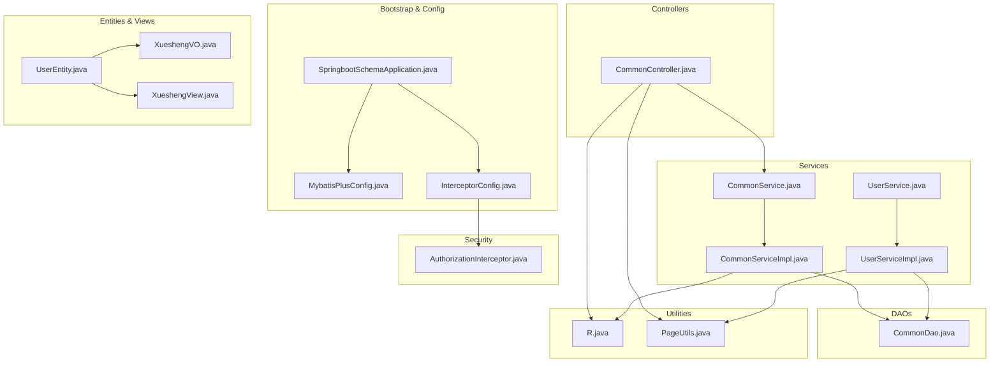
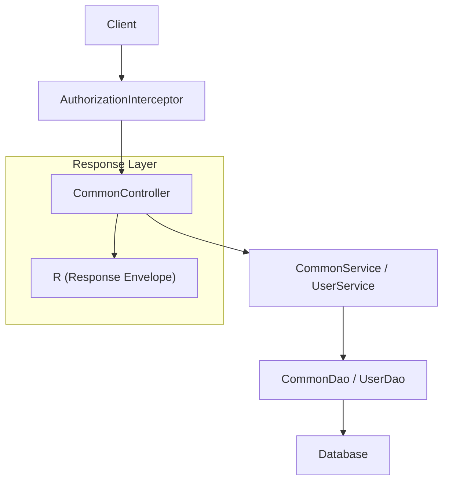
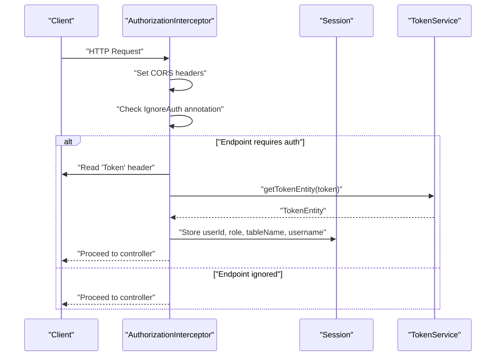
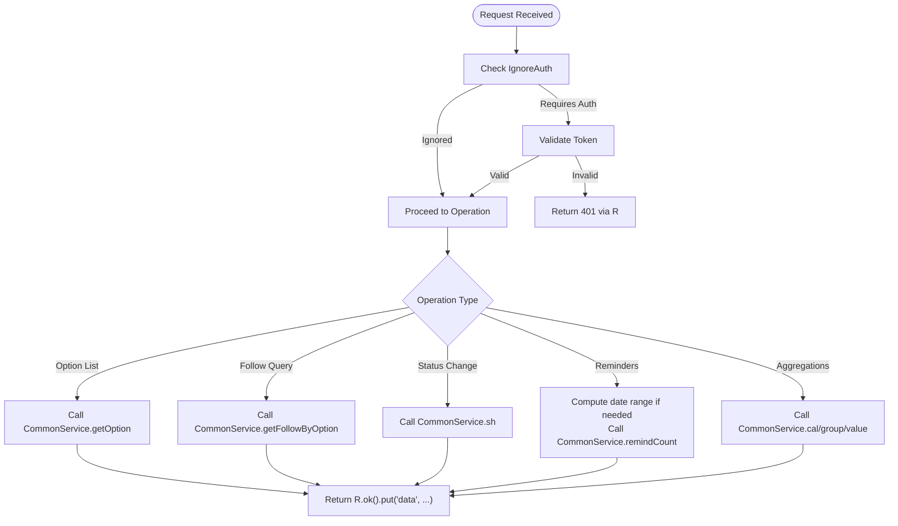
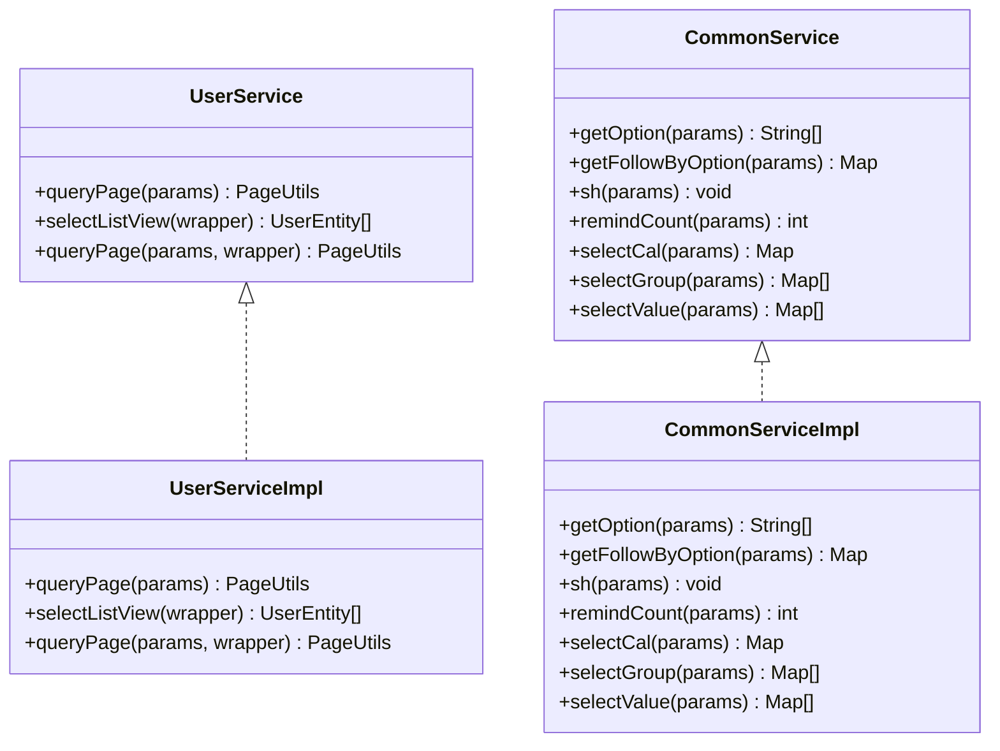
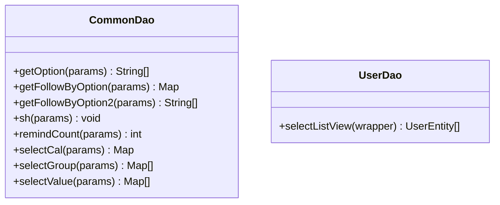
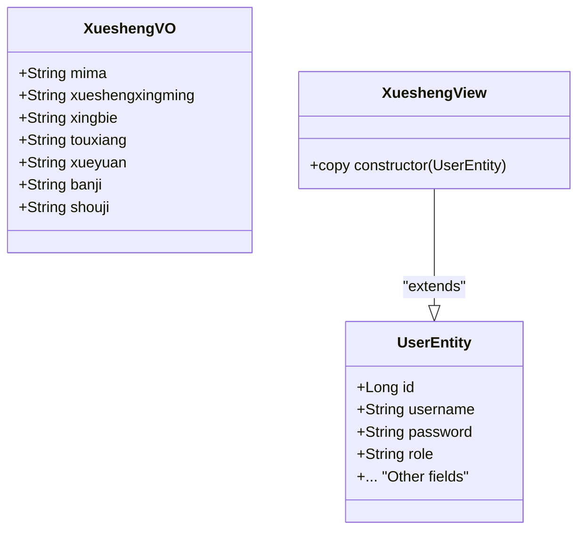
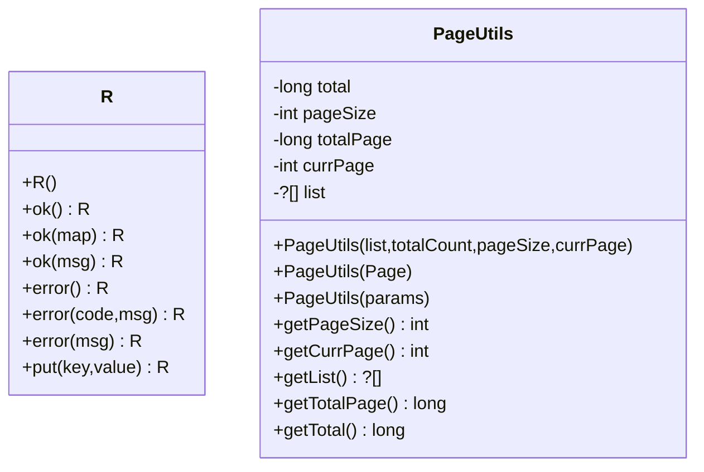
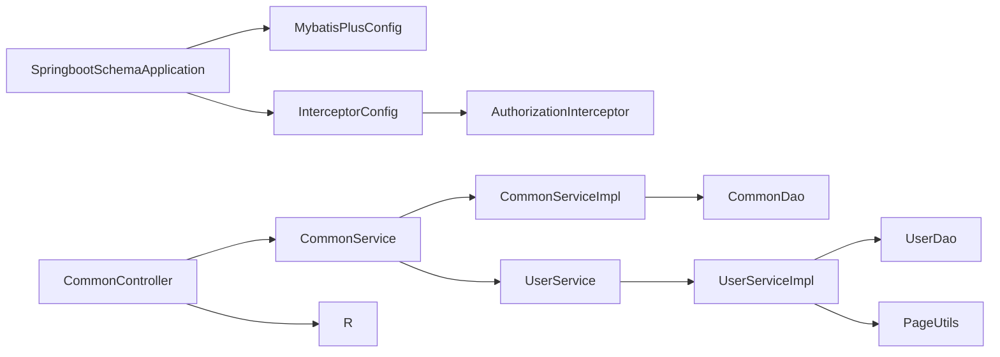

# Backend Modules

<cite>
**Referenced Files in This Document**
- [SpringbootSchemaApplication.java](file://src/main/java/com/SpringbootSchemaApplication.java)
- [MybatisPlusConfig.java](file://src/main/java/com/config/MybatisPlusConfig.java)
- [InterceptorConfig.java](file://src/main/java/com/config/InterceptorConfig.java)
- [AuthorizationInterceptor.java](file://src/main/java/com/interceptor/AuthorizationInterceptor.java)
- [CommonController.java](file://src/main/java/com/controller/CommonController.java)
- [CommonService.java](file://src/main/java/com/service/CommonService.java)
- [CommonServiceImpl.java](file://src/main/java/com/service/impl/CommonServiceImpl.java)
- [CommonDao.java](file://src/main/java/com/dao/CommonDao.java)
- [UserEntity.java](file://src/main/java/com/entity/UserEntity.java)
- [UserService.java](file://src/main/java/com/service/UserService.java)
- [UserServiceImpl.java](file://src/main/java/com/service/impl/UserServiceImpl.java)
- [R.java](file://src/main/java/com/utils/R.java)
- [PageUtils.java](file://src/main/java/com/utils/PageUtils.java)
- [XueshengVO.java](file://src/main/java/com/entity/vo/XueshengVO.java)
- [XueshengView.java](file://src/main/java/com/entity/view/XueshengView.java)
</cite>

## Table of Contents
1. [Introduction](#introduction)
2. [Project Structure](#project-structure)
3. [Core Components](#core-components)
4. [Architecture Overview](#architecture-overview)
5. [Detailed Component Analysis](#detailed-component-analysis)
6. [Dependency Analysis](#dependency-analysis)
7. [Performance Considerations](#performance-considerations)
8. [Troubleshooting Guide](#troubleshooting-guide)
9. [Conclusion](#conclusion)

## Introduction
This document describes the backend modules of the Student Club Activity Management System with a focus on the MVC architecture, service layer pattern, DAO pattern, entity model variants (Entity, VO, View), interceptor-based authentication and authorization, utility classes, and common controller functionality. It explains how controllers delegate to services, how services encapsulate business logic and integrate with DAOs via MyBatis-Plus abstractions, and how interceptors enforce authentication across selected API endpoints.

## Project Structure
The backend follows a layered structure:
- Application bootstrap and configuration
- Controllers (REST endpoints)
- Services (business logic and transactions)
- DAOs (data access via MyBatis-Plus)
- Entities and presentation models (Entity, VO, View)
- Utilities and interceptors
- MyBatis-Plus mapper XMLs

**Diagram sources**
- [SpringbootSchemaApplication.java:10-12](file://src/main/java/com/SpringbootSchemaApplication.java#L10-L12)
- [MybatisPlusConfig.java:19-22](file://src/main/java/com/config/MybatisPlusConfig.java#L19-L22)
- [InterceptorConfig.java:19-26](file://src/main/java/com/config/InterceptorConfig.java#L19-L26)
- [AuthorizationInterceptor.java:36-103](file://src/main/java/com/interceptor/AuthorizationInterceptor.java#L36-L103)
- [CommonController.java:40-257](file://src/main/java/com/controller/CommonController.java#L40-L257)
- [CommonService.java:6-20](file://src/main/java/com/service/CommonService.java#L6-L20)
- [CommonServiceImpl.java:18-59](file://src/main/java/com/service/impl/CommonServiceImpl.java#L18-L59)
- [CommonDao.java:10-26](file://src/main/java/com/dao/CommonDao.java#L10-L26)
- [UserService.java:18-25](file://src/main/java/com/service/UserService.java#L18-L25)
- [UserServiceImpl.java:24-49](file://src/main/java/com/service/impl/UserServiceImpl.java#L24-L49)
- [UserEntity.java:13-182](file://src/main/java/com/entity/UserEntity.java#L13-L182)
- [XueshengVO.java:21-179](file://src/main/java/com/entity/vo/XueshengVO.java#L21-L179)
- [XueshengView.java:20-36](file://src/main/java/com/entity/view/XueshengView.java#L20-L36)
- [R.java:9-51](file://src/main/java/com/utils/R.java#L9-L51)
- [PageUtils.java:13-101](file://src/main/java/com/utils/PageUtils.java#L13-L101)

**Section sources**
- [SpringbootSchemaApplication.java:10-12](file://src/main/java/com/SpringbootSchemaApplication.java#L10-L12)
- [MybatisPlusConfig.java:19-22](file://src/main/java/com/config/MybatisPlusConfig.java#L19-L22)
- [InterceptorConfig.java:19-26](file://src/main/java/com/config/InterceptorConfig.java#L19-L26)

## Core Components
- Application bootstrap and MyBatis-Plus scanning are configured at the application class.
- Interceptor configuration registers an authorization interceptor and defines path patterns and resource handlers.
- Common controller exposes shared operations: option lists, follow queries, status change, reminders, aggregation (sum, group, value).
- Service layer interfaces extend MyBatis-Plus IService, while implementations leverage ServiceImpl and delegate to DAOs.
- DAO layer defines MyBatis-Plus mapper interfaces for data access.
- Entity model variants:
  - Entity: persistent domain model annotated for MyBatis-Plus.
  - VO: view-object for mobile/external clients to limit returned fields.
  - View: extended view entity inheriting from Entity for joined or computed data.
- Utilities:
  - R: standardized response envelope.
  - PageUtils: pagination wrapper around MyBatis-Plus Page.

**Section sources**
- [CommonController.java:40-257](file://src/main/java/com/controller/CommonController.java#L40-L257)
- [CommonService.java:6-20](file://src/main/java/com/service/CommonService.java#L6-L20)
- [CommonServiceImpl.java:18-59](file://src/main/java/com/service/impl/CommonServiceImpl.java#L18-L59)
- [CommonDao.java:10-26](file://src/main/java/com/dao/CommonDao.java#L10-L26)
- [UserService.java:18-25](file://src/main/java/com/service/UserService.java#L18-L25)
- [UserServiceImpl.java:24-49](file://src/main/java/com/service/impl/UserServiceImpl.java#L24-L49)
- [UserEntity.java:13-182](file://src/main/java/com/entity/UserEntity.java#L13-L182)
- [XueshengVO.java:21-179](file://src/main/java/com/entity/vo/XueshengVO.java#L21-L179)
- [XueshengView.java:20-36](file://src/main/java/com/entity/view/XueshengView.java#L20-L36)
- [R.java:9-51](file://src/main/java/com/utils/R.java#L9-L51)
- [PageUtils.java:13-101](file://src/main/java/com/utils/PageUtils.java#L13-L101)

## Architecture Overview
The system enforces clear separation of concerns:
- Controllers handle HTTP requests and responses, delegating business logic to services.
- Services encapsulate business rules, coordinate transactions, and orchestrate DAOs.
- DAOs abstract persistence using MyBatis-Plus interfaces.
- Interceptors enforce authentication and authorization before controller execution.
- Utilities standardize responses and pagination.

**Diagram sources**
- [AuthorizationInterceptor.java:36-103](file://src/main/java/com/interceptor/AuthorizationInterceptor.java#L36-L103)
- [CommonController.java:40-257](file://src/main/java/com/controller/CommonController.java#L40-L257)
- [CommonService.java:6-20](file://src/main/java/com/service/CommonService.java#L6-L20)
- [CommonServiceImpl.java:18-59](file://src/main/java/com/service/impl/CommonServiceImpl.java#L18-L59)
- [CommonDao.java:10-26](file://src/main/java/com/dao/CommonDao.java#L10-L26)
- [UserService.java:18-25](file://src/main/java/com/service/UserService.java#L18-L25)
- [UserServiceImpl.java:24-49](file://src/main/java/com/service/impl/UserServiceImpl.java#L24-L49)
- [R.java:9-51](file://src/main/java/com/utils/R.java#L9-L51)

## Detailed Component Analysis

### Authentication and Authorization Interceptor
The interceptor enforces authentication for selected API paths, supports CORS preflight, and stores user identity in the session upon successful token validation. It also respects an IgnoreAuth annotation to bypass checks for specific endpoints.

**Diagram sources**
- [AuthorizationInterceptor.java:36-103](file://src/main/java/com/interceptor/AuthorizationInterceptor.java#L36-L103)
- [InterceptorConfig.java:19-26](file://src/main/java/com/config/InterceptorConfig.java#L19-L26)

**Section sources**
- [AuthorizationInterceptor.java:31-103](file://src/main/java/com/interceptor/AuthorizationInterceptor.java#L31-L103)
- [InterceptorConfig.java:19-41](file://src/main/java/com/config/InterceptorConfig.java#L19-L41)

### Common Controller and Shared Operations
The CommonController centralizes cross-cutting operations:
- Location resolution via configuration-backed API key
- Face matching using external service
- Option lists and follow-up queries for dynamic dropdowns
- Status change workflow (approval/rejection)
- Reminder counts with date range computation
- Aggregation endpoints: sum, group, and value statistics

**Diagram sources**
- [CommonController.java:52-254](file://src/main/java/com/controller/CommonController.java#L52-L254)
- [CommonService.java:6-20](file://src/main/java/com/service/CommonService.java#L6-L20)
- [CommonServiceImpl.java:18-59](file://src/main/java/com/service/impl/CommonServiceImpl.java#L18-L59)
- [CommonDao.java:10-26](file://src/main/java/com/dao/CommonDao.java#L10-L26)
- [R.java:9-51](file://src/main/java/com/utils/R.java#L9-L51)

**Section sources**
- [CommonController.java:52-254](file://src/main/java/com/controller/CommonController.java#L52-L254)

### Service Layer Pattern and Transaction Management
Services define business contracts and are backed by MyBatis-Plus implementations:
- UserService extends IService and delegates to UserDao via baseMapper.
- CommonService delegates to CommonDao for generic operations.
- ServiceImpl handles pagination and list view queries, returning PageUtils.

**Diagram sources**
- [UserService.java:18-25](file://src/main/java/com/service/UserService.java#L18-L25)
- [UserServiceImpl.java:24-49](file://src/main/java/com/service/impl/UserServiceImpl.java#L24-L49)
- [CommonService.java:6-20](file://src/main/java/com/service/CommonService.java#L6-L20)
- [CommonServiceImpl.java:18-59](file://src/main/java/com/service/impl/CommonServiceImpl.java#L18-L59)

**Section sources**
- [UserService.java:18-25](file://src/main/java/com/service/UserService.java#L18-L25)
- [UserServiceImpl.java:24-49](file://src/main/java/com/service/impl/UserServiceImpl.java#L24-L49)
- [CommonService.java:6-20](file://src/main/java/com/service/CommonService.java#L6-L20)
- [CommonServiceImpl.java:18-59](file://src/main/java/com/service/impl/CommonServiceImpl.java#L18-L59)

### DAO Pattern with MyBatis-Plus
DAO interfaces declare method contracts for data access. The implementation relies on MyBatis-Plus baseMapper and XML mappings under resources/mapper. Pagination and list view queries are supported via Query and Page.

**Diagram sources**
- [CommonDao.java:10-26](file://src/main/java/com/dao/CommonDao.java#L10-L26)

**Section sources**
- [CommonDao.java:10-26](file://src/main/java/com/dao/CommonDao.java#L10-L26)

### Entity Model Architecture (Entity, VO, View)
- Entity: persistent model annotated for MyBatis-Plus mapping.
- VO: lightweight view object tailored for client consumption, excluding sensitive fields.
- View: extended entity for joined or computed data, enabling richer backend responses.

**Diagram sources**
- [UserEntity.java:13-182](file://src/main/java/com/entity/UserEntity.java#L13-L182)
- [XueshengVO.java:21-179](file://src/main/java/com/entity/vo/XueshengVO.java#L21-L179)
- [XueshengView.java:20-36](file://src/main/java/com/entity/view/XueshengView.java#L20-L36)

**Section sources**
- [UserEntity.java:13-182](file://src/main/java/com/entity/UserEntity.java#L13-L182)
- [XueshengVO.java:21-179](file://src/main/java/com/entity/vo/XueshengVO.java#L21-L179)
- [XueshengView.java:20-36](file://src/main/java/com/entity/view/XueshengView.java#L20-L36)

### Utility Classes and Helper Functions
- R: standardized response envelope with convenience constructors for success/error.
- PageUtils: wraps MyBatis-Plus Page into a pagination DTO suitable for API responses.

**Diagram sources**
- [R.java:9-51](file://src/main/java/com/utils/R.java#L9-L51)
- [PageUtils.java:13-101](file://src/main/java/com/utils/PageUtils.java#L13-L101)

**Section sources**
- [R.java:9-51](file://src/main/java/com/utils/R.java#L9-L51)
- [PageUtils.java:13-101](file://src/main/java/com/utils/PageUtils.java#L13-L101)

## Dependency Analysis
- Application bootstrap scans DAO packages and enables scheduling.
- MyBatis-Plus configuration adds pagination support.
- Interceptor registration applies to API routes and excludes static resources.
- Controllers depend on services and utilities.
- Services depend on DAOs and MyBatis-Plus abstractions.
- Entities and views are decoupled from controllers/services, promoting reuse.

**Diagram sources**
- [SpringbootSchemaApplication.java:10-12](file://src/main/java/com/SpringbootSchemaApplication.java#L10-L12)
- [MybatisPlusConfig.java:19-22](file://src/main/java/com/config/MybatisPlusConfig.java#L19-L22)
- [InterceptorConfig.java:19-26](file://src/main/java/com/config/InterceptorConfig.java#L19-L26)
- [AuthorizationInterceptor.java:36-103](file://src/main/java/com/interceptor/AuthorizationInterceptor.java#L36-L103)
- [CommonController.java:40-257](file://src/main/java/com/controller/CommonController.java#L40-L257)
- [CommonService.java:6-20](file://src/main/java/com/service/CommonService.java#L6-L20)
- [CommonServiceImpl.java:18-59](file://src/main/java/com/service/impl/CommonServiceImpl.java#L18-L59)
- [CommonDao.java:10-26](file://src/main/java/com/dao/CommonDao.java#L10-L26)
- [UserService.java:18-25](file://src/main/java/com/service/UserService.java#L18-L25)
- [UserServiceImpl.java:24-49](file://src/main/java/com/service/impl/UserServiceImpl.java#L24-L49)
- [R.java:9-51](file://src/main/java/com/utils/R.java#L9-L51)
- [PageUtils.java:13-101](file://src/main/java/com/utils/PageUtils.java#L13-L101)

**Section sources**
- [SpringbootSchemaApplication.java:10-12](file://src/main/java/com/SpringbootSchemaApplication.java#L10-L12)
- [MybatisPlusConfig.java:19-22](file://src/main/java/com/config/MybatisPlusConfig.java#L19-L22)
- [InterceptorConfig.java:19-26](file://src/main/java/com/config/InterceptorConfig.java#L19-L26)

## Performance Considerations
- Pagination: Use PageUtils and MyBatis-Plus Page to avoid loading large datasets.
- Interceptor overhead: Keep token validation lightweight; caching token metadata can reduce repeated lookups.
- Aggregation endpoints: Ensure proper indexing on aggregated columns to optimize sum/group/value queries.
- Static resources: Properly mapped resource handlers prevent unnecessary controller processing.

[No sources needed since this section provides general guidance]

## Troubleshooting Guide
- Authentication failures:
  - Verify Token header presence and validity.
  - Confirm IgnoreAuth annotation usage for public endpoints.
  - Check session attributes after interceptor execution.
- Response envelopes:
  - Use R.error() and R.ok() consistently for uniform client handling.
- Pagination:
  - Ensure PageUtils is constructed from MyBatis-Plus Page to reflect accurate totals and cursors.

**Section sources**
- [AuthorizationInterceptor.java:36-103](file://src/main/java/com/interceptor/AuthorizationInterceptor.java#L36-L103)
- [R.java:9-51](file://src/main/java/com/utils/R.java#L9-L51)
- [PageUtils.java:13-101](file://src/main/java/com/utils/PageUtils.java#L13-L101)

## Conclusion
The backend employs a clean MVC architecture with well-defined layers:
- Controllers expose REST endpoints and orchestrate responses.
- Services encapsulate business logic and coordinate DAOs.
- DAOs abstract persistence via MyBatis-Plus.
- Interceptors provide centralized authentication and authorization.
- Utilities standardize responses and pagination.
- Entity variants (Entity, VO, View) separate persistence, client, and view concerns.
This modular design promotes maintainability, testability, and scalability across the Student Club Activity Management System.