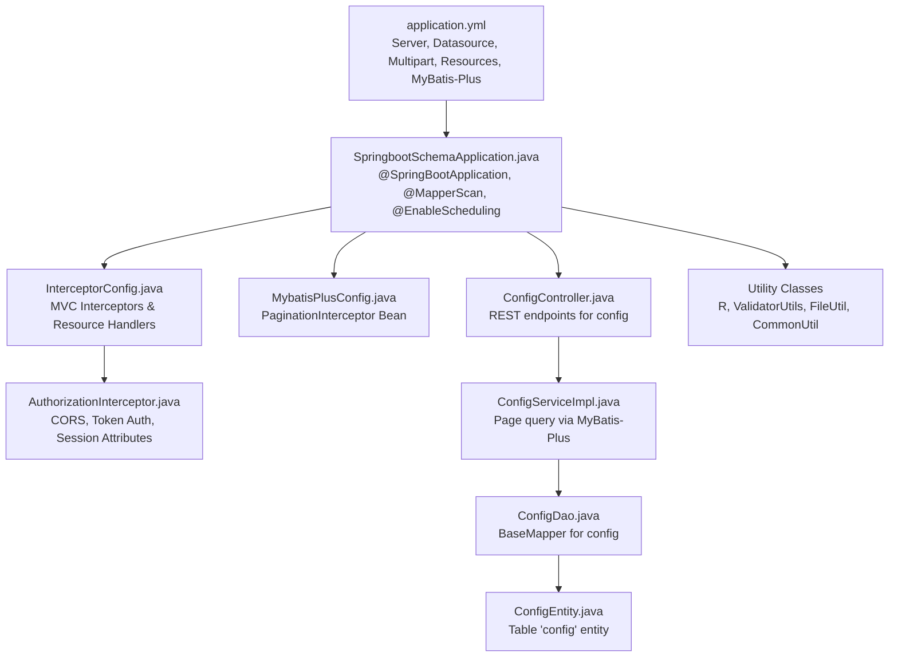
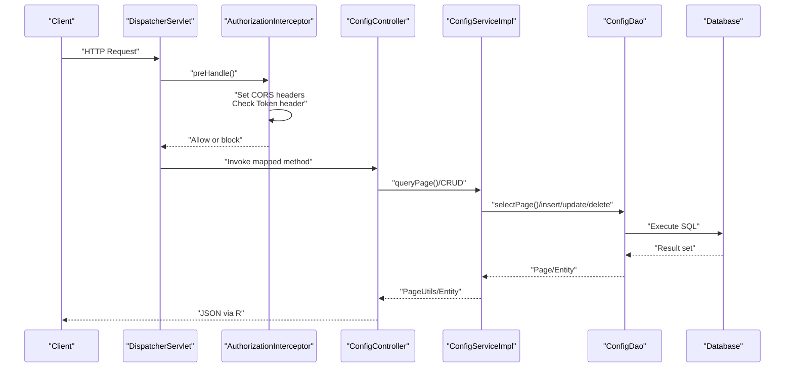
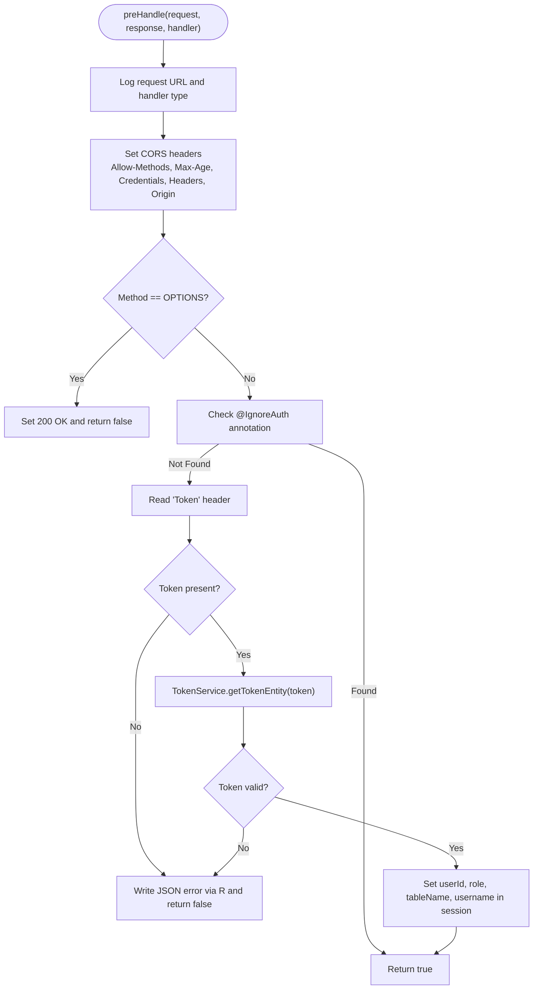
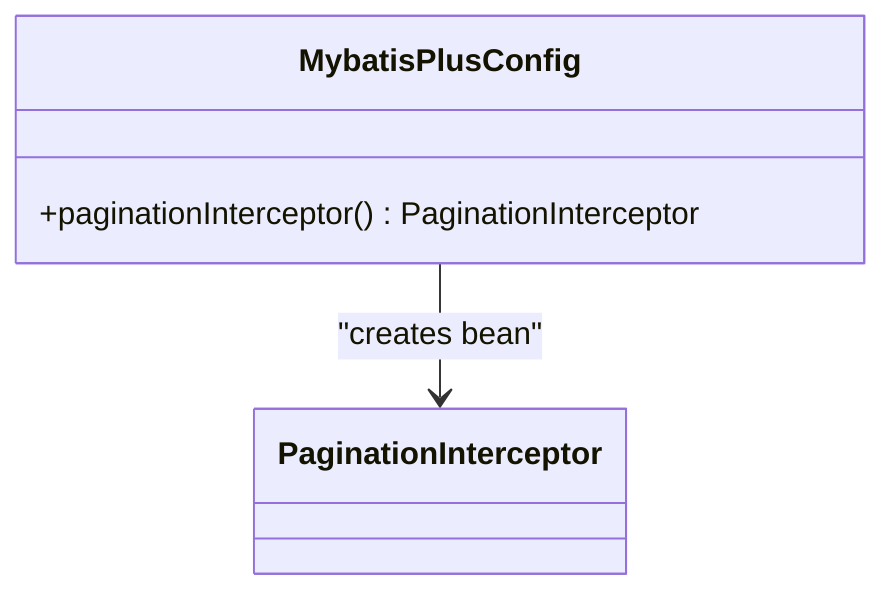
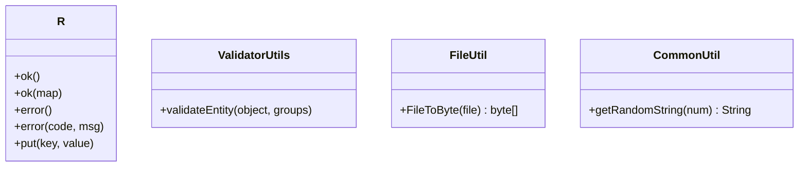
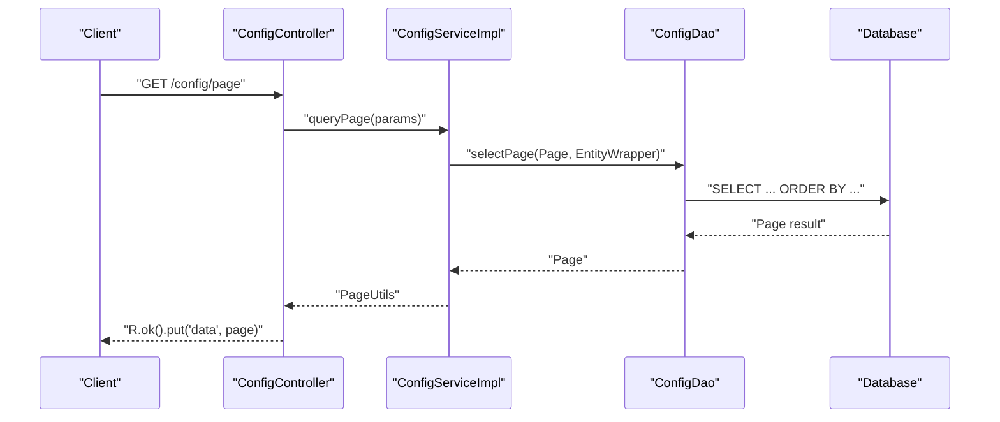
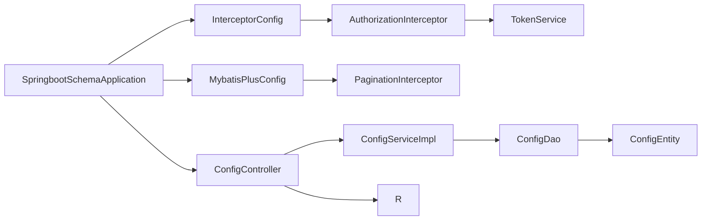

# Configuration Management

<cite>
**Referenced Files in This Document**
- [application.yml](file://src/main/resources/application.yml)
- [InterceptorConfig.java](file://src/main/java/com/config/InterceptorConfig.java)
- [MybatisPlusConfig.java](file://src/main/java/com/config/MybatisPlusConfig.java)
- [AuthorizationInterceptor.java](file://src/main/java/com/interceptor/AuthorizationInterceptor.java)
- [SpringbootSchemaApplication.java](file://src/main/java/com/SpringbootSchemaApplication.java)
- [ConfigController.java](file://src/main/java/com/controller/ConfigController.java)
- [ConfigDao.java](file://src/main/java/com/dao/ConfigDao.java)
- [ConfigEntity.java](file://src/main/java/com/entity/ConfigEntity.java)
- [ConfigServiceImpl.java](file://src/main/java/com/service/impl/ConfigServiceImpl.java)
- [FileUtil.java](file://src/main/java/com/utils/FileUtil.java)
- [CommonUtil.java](file://src/main/java/com/utils/CommonUtil.java)
- [R.java](file://src/main/java/com/utils/R.java)
- [ValidatorUtils.java](file://src/main/java/com/utils/ValidatorUtils.java)
</cite>

## Table of Contents
1. [Introduction](#introduction)
2. [Project Structure](#project-structure)
3. [Core Components](#core-components)
4. [Architecture Overview](#architecture-overview)
5. [Detailed Component Analysis](#detailed-component-analysis)
6. [Dependency Analysis](#dependency-analysis)
7. [Performance Considerations](#performance-considerations)
8. [Troubleshooting Guide](#troubleshooting-guide)
9. [Conclusion](#conclusion)
10. [Appendices](#appendices)

## Introduction
This document provides comprehensive configuration management guidance for the Student Club Activity Management System. It covers application.yml configuration (database connections, MyBatis Plus settings, static resource handling, multipart uploads, and server settings), Spring Boot configuration classes (InterceptorConfig and MybatisPlusConfig), utility configuration classes for common operations and validation, CORS and security filters, logging and caching behavior, and production deployment recommendations. It also includes troubleshooting steps for common configuration issues.

## Project Structure
The configuration system spans YAML-based application settings, Spring MVC configuration, MyBatis Plus integration, interceptors for security, and utility classes for validation and response formatting. The application entry point scans mappers and enables scheduling.

**Diagram sources**
- [application.yml:1-53](file://src/main/resources/application.yml#L1-L53)
- [SpringbootSchemaApplication.java:10-13](file://src/main/java/com/SpringbootSchemaApplication.java#L10-L13)
- [InterceptorConfig.java:11-41](file://src/main/java/com/config/InterceptorConfig.java#L11-L41)
- [AuthorizationInterceptor.java:28-105](file://src/main/java/com/interceptor/AuthorizationInterceptor.java#L28-L105)
- [MybatisPlusConfig.java:13-24](file://src/main/java/com/config/MybatisPlusConfig.java#L13-L24)
- [ConfigController.java:27-112](file://src/main/java/com/controller/ConfigController.java#L27-L112)
- [ConfigServiceImpl.java:23-33](file://src/main/java/com/service/impl/ConfigServiceImpl.java#L23-L33)
- [ConfigDao.java:10-12](file://src/main/java/com/dao/ConfigDao.java#L10-L12)
- [ConfigEntity.java:12-53](file://src/main/java/com/entity/ConfigEntity.java#L12-L53)
- [R.java:9-51](file://src/main/java/com/utils/R.java#L9-L51)
- [ValidatorUtils.java:16-39](file://src/main/java/com/utils/ValidatorUtils.java#L16-L39)
- [FileUtil.java:13-27](file://src/main/java/com/utils/FileUtil.java#L13-L27)
- [CommonUtil.java:5-22](file://src/main/java/com/utils/CommonUtil.java#L5-L22)

**Section sources**
- [application.yml:1-53](file://src/main/resources/application.yml#L1-L53)
- [SpringbootSchemaApplication.java:10-13](file://src/main/java/com/SpringbootSchemaApplication.java#L10-L13)

## Core Components
- Application YAML configuration defines server runtime, datasource credentials and URL, multipart upload limits, static resource locations, and MyBatis Plus settings including mapper locations, type aliases package, global configuration (id strategy, field strategy, underline conversion, refresh mapper, logical delete), and MyBatis configuration toggles.
- InterceptorConfig registers an AuthorizationInterceptor for selected API paths while excluding static resources and sets up resource handlers for admin, front, and upload paths.
- MybatisPlusConfig registers a PaginationInterceptor bean for paginated queries.
- AuthorizationInterceptor enforces CORS headers, handles preflight OPTIONS requests, reads a Token header, validates against TokenService, and populates session attributes upon successful authentication.
- Utility classes provide standardized response formatting (R), validation (ValidatorUtils), file conversion (FileUtil), and random string generation (CommonUtil).
- ConfigController exposes REST endpoints for managing configuration records stored in the config table via MyBatis Plus.

**Section sources**
- [application.yml:9-52](file://src/main/resources/application.yml#L9-L52)
- [InterceptorConfig.java:11-41](file://src/main/java/com/config/InterceptorConfig.java#L11-L41)
- [MybatisPlusConfig.java:13-24](file://src/main/java/com/config/MybatisPlusConfig.java#L13-L24)
- [AuthorizationInterceptor.java:28-105](file://src/main/java/com/interceptor/AuthorizationInterceptor.java#L28-L105)
- [R.java:9-51](file://src/main/java/com/utils/R.java#L9-L51)
- [ValidatorUtils.java:16-39](file://src/main/java/com/utils/ValidatorUtils.java#L16-L39)
- [FileUtil.java:13-27](file://src/main/java/com/utils/FileUtil.java#L13-L27)
- [CommonUtil.java:5-22](file://src/main/java/com/utils/CommonUtil.java#L5-L22)
- [ConfigController.java:27-112](file://src/main/java/com/controller/ConfigController.java#L27-L112)
- [ConfigDao.java:10-12](file://src/main/java/com/dao/ConfigDao.java#L10-L12)
- [ConfigEntity.java:12-53](file://src/main/java/com/entity/ConfigEntity.java#L12-L53)
- [ConfigServiceImpl.java:23-33](file://src/main/java/com/service/impl/ConfigServiceImpl.java#L23-L33)

## Architecture Overview
The configuration architecture integrates Spring Boot’s externalized configuration with MVC interceptors, MyBatis Plus, and utility services. The flow below illustrates how requests traverse the configuration stack.

**Diagram sources**
- [AuthorizationInterceptor.java:36-103](file://src/main/java/com/interceptor/AuthorizationInterceptor.java#L36-L103)
- [ConfigController.java:37-110](file://src/main/java/com/controller/ConfigController.java#L37-L110)
- [ConfigServiceImpl.java:25-32](file://src/main/java/com/service/impl/ConfigServiceImpl.java#L25-L32)
- [ConfigDao.java:10-12](file://src/main/java/com/dao/ConfigDao.java#L10-L12)
- [application.yml:9-52](file://src/main/resources/application.yml#L9-L52)

## Detailed Component Analysis

### Application YAML Configuration
Key areas covered:
- Server: port, URI encoding, context path.
- Datasource: driver class, JDBC URL, username, password.
- Servlet multipart: max file size and request size for uploads.
- Static resources: locations for admin, front, upload, and static assets.
- MyBatis Plus:
  - Mapper locations and type aliases package.
  - Global configuration: id-type, field-strategy, underline mapping, refresh-mapper, logical delete values, custom SQL injector.
  - MyBatis configuration: underscore-to-camel case, cache disabled, call setters on nulls, JDBC type for null.

Environment-specific notes:
- The datasource URL and credentials are embedded in application.yml. For environment separation, externalize these values using Spring profiles or environment variables and override them at runtime.

Property override and externalization:
- Use Spring Boot’s property precedence to override values via command-line arguments, environment variables, or separate profile files (application-dev.yml, application-prod.yml).
- Place sensitive values in environment variables or secrets management systems and reference them in application.yml using property placeholders.

Security and CORS:
- CORS is configured within AuthorizationInterceptor at runtime per request origin. Ensure the allowed origins align with frontend deployment domains.

Logging and cache:
- Logging is handled by Spring Boot defaults; no explicit logback configuration is present in the repository snapshot.
- MyBatis cache is disabled globally in MyBatis configuration.

**Section sources**
- [application.yml:1-53](file://src/main/resources/application.yml#L1-L53)

### InterceptorConfig and AuthorizationInterceptor
- InterceptorConfig registers AuthorizationInterceptor for API namespaces and excludes static resources.
- AuthorizationInterceptor:
  - Sets Access-Control-* headers dynamically based on the incoming Origin.
  - Handles preflight OPTIONS requests and returns 200 without further processing.
  - Reads the Token header, validates via TokenService, and stores user/session attributes in the HTTP session.
  - Returns JSON error responses using R for unauthorized access.

**Diagram sources**
- [AuthorizationInterceptor.java:36-103](file://src/main/java/com/interceptor/AuthorizationInterceptor.java#L36-L103)

**Section sources**
- [InterceptorConfig.java:11-41](file://src/main/java/com/config/InterceptorConfig.java#L11-L41)
- [AuthorizationInterceptor.java:28-105](file://src/main/java/com/interceptor/AuthorizationInterceptor.java#L28-L105)

### MyBatis Plus Configuration
- PaginationInterceptor bean is registered for supporting pagination in DAO queries.
- Global MyBatis Plus settings in application.yml include:
  - Mapper locations and type aliases package.
  - Global config: id-type, field-strategy, underline mapping, refresh-mapper, logical delete values, custom SQL injector.
  - MyBatis configuration: underscore-to-camel case, cache disabled, call setters on nulls, JDBC type for null.

**Diagram sources**
- [MybatisPlusConfig.java:13-24](file://src/main/java/com/config/MybatisPlusConfig.java#L13-L24)

**Section sources**
- [MybatisPlusConfig.java:13-24](file://src/main/java/com/config/MybatisPlusConfig.java#L13-L24)
- [application.yml:29-52](file://src/main/resources/application.yml#L29-L52)

### Utility Configuration Classes
- R: Standardized JSON response builder with convenience methods for success/error.
- ValidatorUtils: Hibernate validator wrapper that throws a domain exception on validation failure.
- FileUtil: Converts a File to a byte array for binary data handling.
- CommonUtil: Generates random strings for identifiers or tokens.

**Diagram sources**
- [R.java:9-51](file://src/main/java/com/utils/R.java#L9-L51)
- [ValidatorUtils.java:16-39](file://src/main/java/com/utils/ValidatorUtils.java#L16-L39)
- [FileUtil.java:13-27](file://src/main/java/com/utils/FileUtil.java#L13-L27)
- [CommonUtil.java:5-22](file://src/main/java/com/utils/CommonUtil.java#L5-L22)

**Section sources**
- [R.java:9-51](file://src/main/java/com/utils/R.java#L9-L51)
- [ValidatorUtils.java:16-39](file://src/main/java/com/utils/ValidatorUtils.java#L16-L39)
- [FileUtil.java:13-27](file://src/main/java/com/utils/FileUtil.java#L13-L27)
- [CommonUtil.java:5-22](file://src/main/java/com/utils/CommonUtil.java#L5-L22)

### Configuration Management via REST
- ConfigController exposes endpoints to list, page, retrieve, save, update, and delete configuration entries.
- ConfigServiceImpl uses MyBatis Plus pagination and EntityWrapper for querying.
- ConfigDao extends BaseMapper for the ConfigEntity mapped to the config table.

**Diagram sources**
- [ConfigController.java:37-42](file://src/main/java/com/controller/ConfigController.java#L37-L42)
- [ConfigServiceImpl.java:25-32](file://src/main/java/com/service/impl/ConfigServiceImpl.java#L25-L32)
- [ConfigDao.java:10-12](file://src/main/java/com/dao/ConfigDao.java#L10-L12)
- [ConfigEntity.java:12-53](file://src/main/java/com/entity/ConfigEntity.java#L12-L53)

**Section sources**
- [ConfigController.java:27-112](file://src/main/java/com/controller/ConfigController.java#L27-L112)
- [ConfigServiceImpl.java:23-33](file://src/main/java/com/service/impl/ConfigServiceImpl.java#L23-L33)
- [ConfigDao.java:10-12](file://src/main/java/com/dao/ConfigDao.java#L10-L12)
- [ConfigEntity.java:12-53](file://src/main/java/com/entity/ConfigEntity.java#L12-L53)

## Dependency Analysis
- SpringbootSchemaApplication enables scanning for DAO packages and scheduling, and serves as the bootstrapper.
- InterceptorConfig depends on AuthorizationInterceptor and registers it with path patterns and resource handlers.
- AuthorizationInterceptor depends on TokenService and uses R for response formatting.
- ConfigController depends on ConfigService; ConfigServiceImpl depends on ConfigDao; ConfigDao extends MyBatis Plus BaseMapper.
- MybatisPlusConfig depends on PaginationInterceptor.

**Diagram sources**
- [SpringbootSchemaApplication.java:10-13](file://src/main/java/com/SpringbootSchemaApplication.java#L10-L13)
- [InterceptorConfig.java:11-41](file://src/main/java/com/config/InterceptorConfig.java#L11-L41)
- [AuthorizationInterceptor.java:28-105](file://src/main/java/com/interceptor/AuthorizationInterceptor.java#L28-L105)
- [MybatisPlusConfig.java:13-24](file://src/main/java/com/config/MybatisPlusConfig.java#L13-L24)
- [ConfigController.java:27-112](file://src/main/java/com/controller/ConfigController.java#L27-L112)
- [ConfigServiceImpl.java:23-33](file://src/main/java/com/service/impl/ConfigServiceImpl.java#L23-L33)
- [ConfigDao.java:10-12](file://src/main/java/com/dao/ConfigDao.java#L10-L12)
- [ConfigEntity.java:12-53](file://src/main/java/com/entity/ConfigEntity.java#L12-L53)
- [R.java:9-51](file://src/main/java/com/utils/R.java#L9-L51)

**Section sources**
- [SpringbootSchemaApplication.java:10-13](file://src/main/java/com/SpringbootSchemaApplication.java#L10-L13)
- [InterceptorConfig.java:11-41](file://src/main/java/com/config/InterceptorConfig.java#L11-L41)
- [AuthorizationInterceptor.java:28-105](file://src/main/java/com/interceptor/AuthorizationInterceptor.java#L28-L105)
- [MybatisPlusConfig.java:13-24](file://src/main/java/com/config/MybatisPlusConfig.java#L13-L24)
- [ConfigController.java:27-112](file://src/main/java/com/controller/ConfigController.java#L27-L112)
- [ConfigServiceImpl.java:23-33](file://src/main/java/com/service/impl/ConfigServiceImpl.java#L23-L33)
- [ConfigDao.java:10-12](file://src/main/java/com/dao/ConfigDao.java#L10-L12)
- [ConfigEntity.java:12-53](file://src/main/java/com/entity/ConfigEntity.java#L12-L53)
- [R.java:9-51](file://src/main/java/com/utils/R.java#L9-L51)

## Performance Considerations
- MyBatis cache is disabled globally; keep this setting for write-heavy scenarios but monitor query performance.
- Pagination is supported via PaginationInterceptor; ensure queries are properly paged to avoid large result sets.
- Multipart upload limits are set to 10 MB; adjust according to file types and usage patterns.
- Static resource locations include classpath and file system roots; ensure appropriate caching headers and CDN configuration in production.
- CORS is applied per request; consider hardening allowed origins and headers in production environments.

[No sources needed since this section provides general guidance]

## Troubleshooting Guide
Common configuration issues and resolutions:
- Unauthorized access errors:
  - Verify the Token header presence and validity; ensure TokenService returns a non-null entity for the given token.
  - Confirm AuthorizationInterceptor path patterns match the endpoint routes.
- CORS failures:
  - Ensure the client origin matches the Access-Control-Allow-Origin header set by the interceptor.
  - Validate that preflight OPTIONS requests receive a 200 response.
- Static resource 404:
  - Confirm resource handler mappings for /admin/**, /front/**, and /upload/** are correct and that the physical paths exist.
- Upload size exceeded:
  - Increase multipart.max-file-size and multipart.max-request-size in application.yml if needed.
- Database connectivity:
  - Validate JDBC URL, driver class, username, and password in application.yml.
  - Check network access and firewall rules for the database host.
- MyBatis Plus mapping errors:
  - Verify mapper XML locations and type aliases package.
  - Ensure logical delete values and SQL injector configuration match the application’s requirements.

**Section sources**
- [AuthorizationInterceptor.java:36-103](file://src/main/java/com/interceptor/AuthorizationInterceptor.java#L36-L103)
- [InterceptorConfig.java:19-40](file://src/main/java/com/config/InterceptorConfig.java#L19-L40)
- [application.yml:9-52](file://src/main/resources/application.yml#L9-L52)
- [ConfigController.java:27-112](file://src/main/java/com/controller/ConfigController.java#L27-L112)

## Conclusion
The configuration management of the Student Club Activity Management System centers around a clean separation of concerns: YAML-driven application settings, MVC interceptors for security and CORS, MyBatis Plus for persistence, and utility classes for consistent responses and validations. By externalizing environment-specific properties, carefully managing CORS and authentication, and leveraging pagination and static resource handlers, the system supports scalable development and production deployments.

[No sources needed since this section summarizes without analyzing specific files]

## Appendices
- Production deployment recommendations:
  - Externalize sensitive properties (datasource credentials, server context path) via environment variables or Spring Cloud Config.
  - Harden CORS by restricting Access-Control-Allow-Origin to trusted domains.
  - Enable HTTPS/TLS termination at the load balancer and enforce secure cookies.
  - Configure logging levels and appenders appropriately; consider structured logging for observability.
  - Monitor database connection pool metrics and tune MyBatis Plus pagination thresholds.
  - Use a CDN for static resources and set long cache TTLs where appropriate.

[No sources needed since this section provides general guidance]