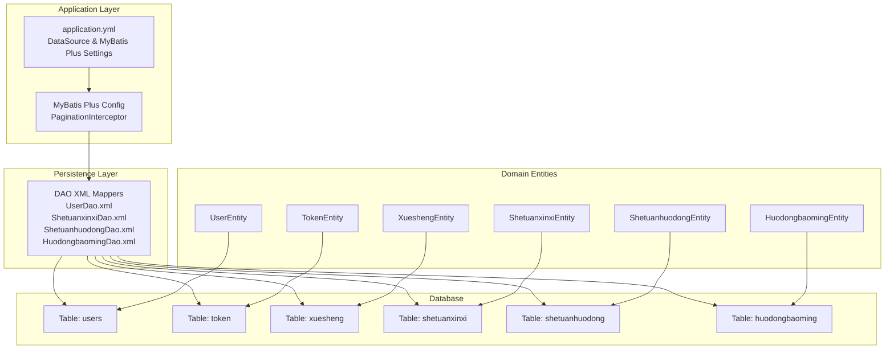
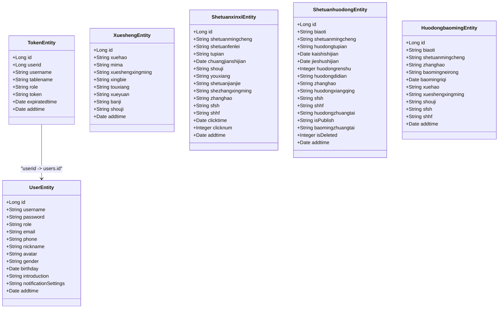
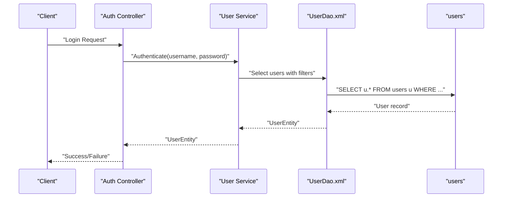
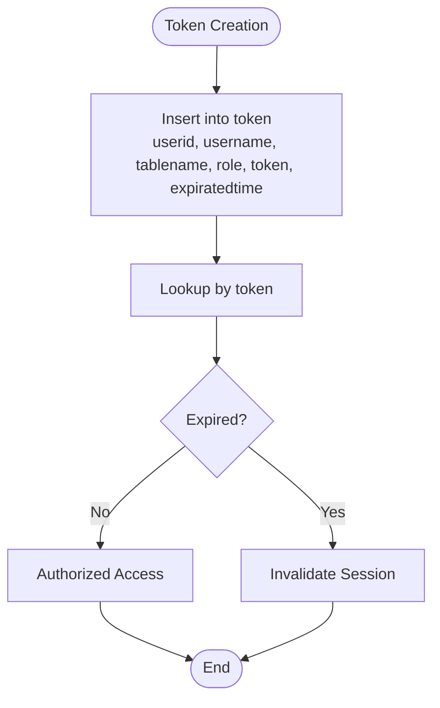
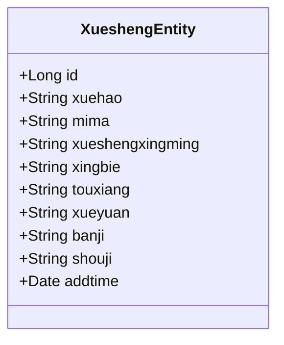
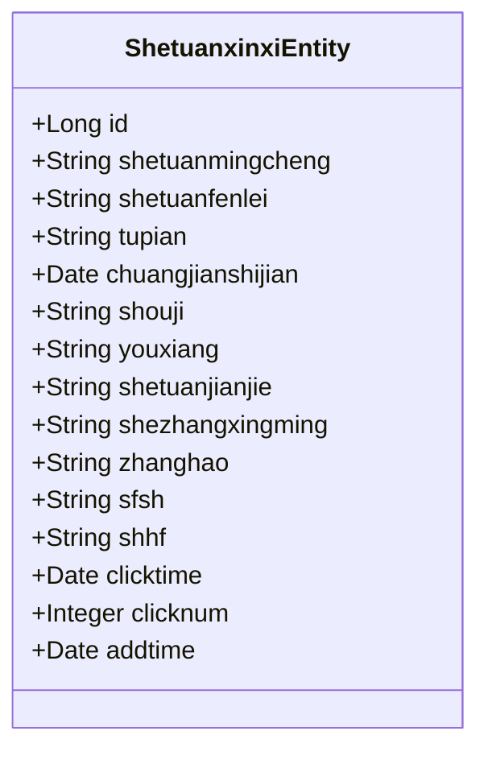
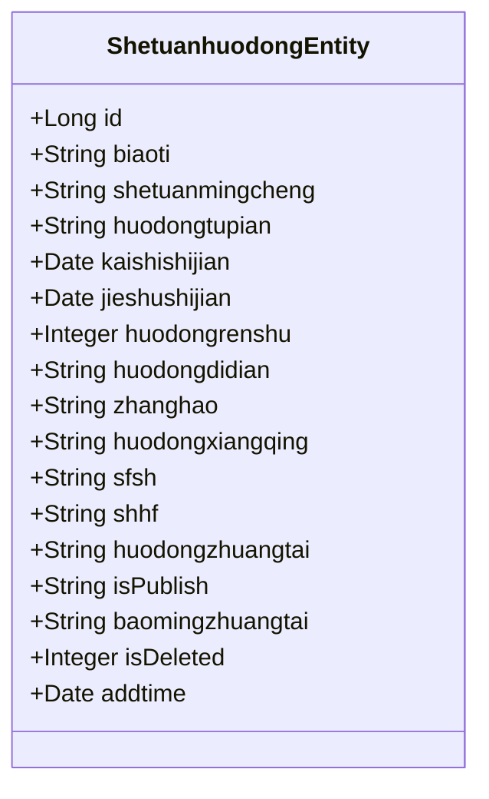
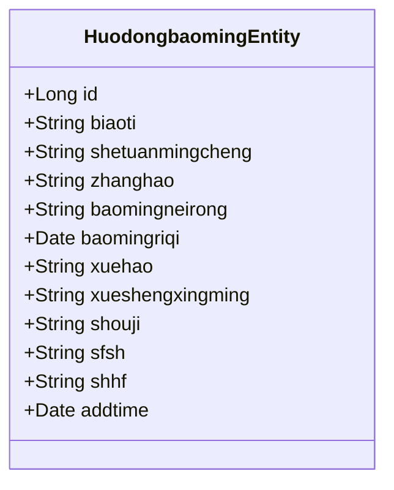
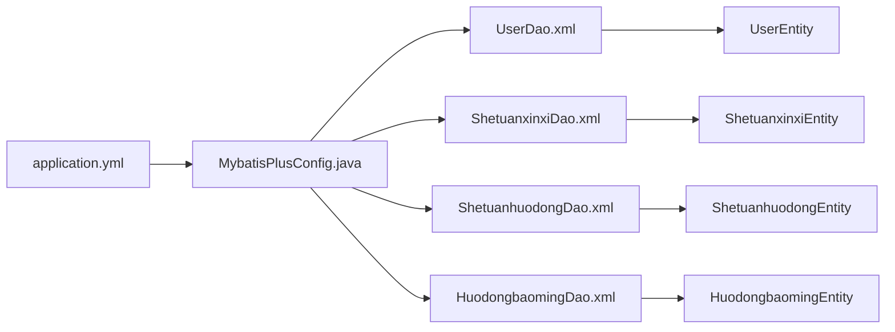

# Database Design

<cite>
**Referenced Files in This Document**
- [application.yml](file://src/main/resources/application.yml)
- [MybatisPlusConfig.java](file://src/main/java/com/config/MybatisPlusConfig.java)
- [UserEntity.java](file://src/main/java/com/entity/UserEntity.java)
- [TokenEntity.java](file://src/main/java/com/entity/TokenEntity.java)
- [XueshengEntity.java](file://src/main/java/com/entity/XueshengEntity.java)
- [ShetuanxinxiEntity.java](file://src/main/java/com/entity/ShetuanxinxiEntity.java)
- [ShetuanhuodongEntity.java](file://src/main/java/com/entity/ShetuanhuodongEntity.java)
- [HuodongbaomingEntity.java](file://src/main/java/com/entity/HuodongbaomingEntity.java)
- [UserDao.xml](file://src/main/resources/mapper/UserDao.xml)
- [ShetuanxinxiDao.xml](file://src/main/resources/mapper/ShetuanxinxiDao.xml)
- [ShetuanhuodongDao.xml](file://src/main/resources/mapper/ShetuanhuodongDao.xml)
- [HuodongbaomingDao.xml](file://src/main/resources/mapper/HuodongbaomingDao.xml)
</cite>

## Table of Contents
1. [Introduction](#introduction)
2. [Project Structure](#project-structure)
3. [Core Components](#core-components)
4. [Architecture Overview](#architecture-overview)
5. [Detailed Component Analysis](#detailed-component-analysis)
6. [Dependency Analysis](#dependency-analysis)
7. [Performance Considerations](#performance-considerations)
8. [Troubleshooting Guide](#troubleshooting-guide)
9. [Conclusion](#conclusion)
10. [Appendices](#appendices)

## Introduction
This document provides comprehensive database design documentation for the Student Club Activity Management System. It details the entity-relationship model, table structures, primary keys, foreign keys, and relationships among entities. It also documents the database schema for user management, student profiles, club information, event scheduling, and related communication records. Constraints, indexes, validation rules, and MyBatis Plus configuration are explained, along with entity mappings and XML mapper configurations for complex queries. Sample data structures and relationships are included to clarify business semantics.

## Project Structure
The database design is implemented using MyBatis Plus with Java entities mapped to database tables. Configuration is centralized in application.yml, and MyBatis Plus is enabled via a configuration class. DAO XML files define reusable SQL queries and result mappings.

**Diagram sources**
- [application.yml:9-52](file://src/main/resources/application.yml#L9-L52)
- [MybatisPlusConfig.java:14-22](file://src/main/java/com/config/MybatisPlusConfig.java#L14-L22)
- [UserDao.xml:4-11](file://src/main/resources/mapper/UserDao.xml#L4-L11)
- [ShetuanxinxiDao.xml:4-45](file://src/main/resources/mapper/ShetuanxinxiDao.xml#L4-L45)
- [ShetuanhuodongDao.xml:4-43](file://src/main/resources/mapper/ShetuanhuodongDao.xml#L4-L43)
- [HuodongbaomingDao.xml:4-42](file://src/main/resources/mapper/HuodongbaomingDao.xml#L4-L42)

**Section sources**
- [application.yml:9-52](file://src/main/resources/application.yml#L9-L52)
- [MybatisPlusConfig.java:14-22](file://src/main/java/com/config/MybatisPlusConfig.java#L14-L22)

## Core Components
This section outlines the core database entities and their attributes, focusing on primary keys, data types, and constraints inferred from annotations and XML mappings.

- Users (users)
  - Primary key: id (auto-increment)
  - Attributes include username, password, role, email, phone, nickname, avatar, gender, birthday, introduction, notification settings, and timestamps.
  - Validation: Not null constraints implied by annotations on related entities; explicit validation rules are enforced at the application layer.
  - Indexes: No explicit indexes defined in the provided XML; consider adding indexes on username and role for frequent lookups.

- Token (token)
  - Primary key: id (auto-increment)
  - Foreign key: userid references users.id
  - Attributes include username, tablename, role, token, expiratedtime, and addtime.
  - Business rule: token expiration is enforced by expiratedtime; role determines access scope.

- Students (xuesheng)
  - Primary key: id (auto-increment)
  - Attributes include xuehao (student ID), mima (password), xueshengxingming (name), xingbie (gender), touxiang (avatar), xueyuan (college), banji (class), shouji (phone), and timestamps.
  - Validation: Not blank/empty constraints applied to several fields via annotations.

- Clubs (shetuanxinxi)
  - Primary key: id (auto-increment)
  - Attributes include shetuanmingcheng (club name), shetuanfenlei (category), tupian (image), chuangjianshijian (creation date), shouji (contact phone), youxiang (email), shetuanjianjie (description), shezhangxingming (president name), zhanghao (account), sfsh (audit status), shhf (audit reply), clicktime (last click time), clicknum (click count), and timestamps.
  - Validation: Not blank/empty constraints on key fields; audit fields enforce governance rules.

- Events (shetuanhuodong)
  - Primary key: id (auto-increment)
  - Attributes include biaoti (title), shetuanmingcheng (club name), huodongtupian (event image), kaishishijian/jieshushijian (start/end dates), huodongrenshu (attendee capacity), huodongdidian (venue), zhanghao (account), huodongxiangqing (details), sfsh (audit status), shhf (audit reply), huodongzhuangtai (event status), isPublish (publish flag), baomingzhuangtai (registration status), isDeleted (logical delete), and timestamps.
  - Validation: Not blank/empty constraints; logical deletion via isDeleted aligns with MyBatis Plus global configuration.

- Event Registrations (huodongbaoming)
  - Primary key: id (auto-increment)
  - Attributes include biaoti (title), shetuanmingcheng (club name), zhanghao (account), baomingneirong (registration content), baomingriqi (registration date), xuehao (student ID), xueshengxingming (student name), shouji (phone), sfsh (audit status), shhf (audit reply), and timestamps.
  - Validation: Not blank/empty constraints; audit fields support administrative review.

**Section sources**
- [UserEntity.java:13-181](file://src/main/java/com/entity/UserEntity.java#L13-L181)
- [TokenEntity.java:13-132](file://src/main/java/com/entity/TokenEntity.java#L13-L132)
- [XueshengEntity.java:31-218](file://src/main/java/com/entity/XueshengEntity.java#L31-L218)
- [ShetuanxinxiEntity.java:31-311](file://src/main/java/com/entity/ShetuanxinxiEntity.java#L31-L311)
- [ShetuanhuodongEntity.java:24-217](file://src/main/java/com/entity/ShetuanhuodongEntity.java#L24-L217)
- [HuodongbaomingEntity.java:31-256](file://src/main/java/com/entity/HuodongbaomingEntity.java#L31-L256)

## Architecture Overview
The system follows a layered architecture:
- Application configuration defines data source and MyBatis Plus settings.
- DAO XML files encapsulate SQL queries and result mappings.
- Entities map to database tables with annotations specifying table names and primary keys.
- Pagination is enabled via a configuration bean.

**Diagram sources**
- [UserEntity.java:13-181](file://src/main/java/com/entity/UserEntity.java#L13-L181)
- [TokenEntity.java:13-132](file://src/main/java/com/entity/TokenEntity.java#L13-L132)
- [XueshengEntity.java:31-218](file://src/main/java/com/entity/XueshengEntity.java#L31-L218)
- [ShetuanxinxiEntity.java:31-311](file://src/main/java/com/entity/ShetuanxinxiEntity.java#L31-L311)
- [ShetuanhuodongEntity.java:24-217](file://src/main/java/com/entity/ShetuanhuodongEntity.java#L24-L217)
- [HuodongbaomingEntity.java:31-256](file://src/main/java/com/entity/HuodongbaomingEntity.java#L31-L256)

**Section sources**
- [application.yml:29-52](file://src/main/resources/application.yml#L29-L52)
- [MybatisPlusConfig.java:14-22](file://src/main/java/com/config/MybatisPlusConfig.java#L14-L22)

## Detailed Component Analysis

### Users and Authentication
- Purpose: Central identity and access control for administrators and system users.
- Primary key: id (auto-increment).
- Relationships: token table references users via userid.
- Constraints: Role and notification settings fields present; additional constraints can be enforced at the application level.

**Diagram sources**
- [UserDao.xml:6-11](file://src/main/resources/mapper/UserDao.xml#L6-L11)
- [UserEntity.java:13-181](file://src/main/java/com/entity/UserEntity.java#L13-L181)

**Section sources**
- [UserEntity.java:13-181](file://src/main/java/com/entity/UserEntity.java#L13-L181)
- [UserDao.xml:4-11](file://src/main/resources/mapper/UserDao.xml#L4-L11)

### Tokens and Session Management
- Purpose: Manage user sessions with roles and expiration.
- Primary key: id (auto-increment).
- Foreign key: userid references users.id.
- Business rule: expiratedtime enforces session expiry; role determines access scope.

**Diagram sources**
- [TokenEntity.java:13-132](file://src/main/java/com/entity/TokenEntity.java#L13-L132)

**Section sources**
- [TokenEntity.java:13-132](file://src/main/java/com/entity/TokenEntity.java#L13-L132)

### Students (Profiles)
- Purpose: Store student personal and academic information.
- Primary key: id (auto-increment).
- Validation: Not blank/empty constraints on key fields via annotations.

**Diagram sources**
- [XueshengEntity.java:31-218](file://src/main/java/com/entity/XueshengEntity.java#L31-L218)

**Section sources**
- [XueshengEntity.java:31-218](file://src/main/java/com/entity/XueshengEntity.java#L31-L218)

### Clubs (Information)
- Purpose: Maintain club metadata, contact info, and governance fields.
- Primary key: id (auto-increment).
- Validation: Not blank/empty constraints on key fields; audit fields enforce governance.

**Diagram sources**
- [ShetuanxinxiEntity.java:31-311](file://src/main/java/com/entity/ShetuanxinxiEntity.java#L31-L311)

**Section sources**
- [ShetuanxinxiEntity.java:31-311](file://src/main/java/com/entity/ShetuanxinxiEntity.java#L31-L311)

### Events (Scheduling)
- Purpose: Schedule and manage club events with registration and audit controls.
- Primary key: id (auto-increment).
- Validation: Not blank/empty constraints; logical deletion via isDeleted aligns with MyBatis Plus global configuration.

**Diagram sources**
- [ShetuanhuodongEntity.java:24-217](file://src/main/java/com/entity/ShetuanhuodongEntity.java#L24-L217)

**Section sources**
- [ShetuanhuodongEntity.java:24-217](file://src/main/java/com/entity/ShetuanhuodongEntity.java#L24-L217)

### Event Registrations
- Purpose: Track student registrations for events with audit and administrative review.
- Primary key: id (auto-increment).
- Validation: Not blank/empty constraints; audit fields support administrative review.

**Diagram sources**
- [HuodongbaomingEntity.java:31-256](file://src/main/java/com/entity/HuodongbaomingEntity.java#L31-L256)

**Section sources**
- [HuodongbaomingEntity.java:31-256](file://src/main/java/com/entity/HuodongbaomingEntity.java#L31-L256)

## Dependency Analysis
- DAO XML files depend on entity classes for result mapping and on database tables for SQL execution.
- Entities depend on MyBatis Plus annotations for table mapping and primary key generation.
- Pagination is enabled globally via a configuration bean, affecting all paginated queries.

**Diagram sources**
- [UserDao.xml:4-11](file://src/main/resources/mapper/UserDao.xml#L4-L11)
- [ShetuanxinxiDao.xml:4-45](file://src/main/resources/mapper/ShetuanxinxiDao.xml#L4-L45)
- [ShetuanhuodongDao.xml:4-43](file://src/main/resources/mapper/ShetuanhuodongDao.xml#L4-L43)
- [HuodongbaomingDao.xml:4-42](file://src/main/resources/mapper/HuodongbaomingDao.xml#L4-L42)
- [MybatisPlusConfig.java:14-22](file://src/main/java/com/config/MybatisPlusConfig.java#L14-L22)
- [application.yml:29-52](file://src/main/resources/application.yml#L29-L52)

**Section sources**
- [application.yml:29-52](file://src/main/resources/application.yml#L29-L52)
- [MybatisPlusConfig.java:14-22](file://src/main/java/com/config/MybatisPlusConfig.java#L14-L22)

## Performance Considerations
- Connection pooling: Configure pool size and timeouts in application.yml under the data source section to optimize throughput and reduce latency.
- Schema initialization: Enable schema creation or migration scripts as needed; ensure charset and collation settings match application requirements.
- MyBatis Plus settings: Keep map underscore to camel case enabled for consistent field mapping; disable caches if not required to reduce memory overhead.
- Pagination: Use pagination interceptor to limit result sets and improve response times for list views.
- Indexes: Add indexes on frequently queried columns such as users.username, users.role, token.token, xuesheng.xuehao, shetuanxinxi.shetuanmingcheng, shetuanhuodong.biaoti, and huodongbaoming.zhanghao.

[No sources needed since this section provides general guidance]

## Troubleshooting Guide
- Data source connectivity: Verify JDBC URL, driver class, username, and password in application.yml.
- MyBatis Plus configuration: Ensure mapper locations and type aliases packages are correctly set; confirm pagination interceptor bean is loaded.
- Entity mapping errors: Confirm table names and primary keys in entities match database schema; check for missing annotations or incorrect field names.
- Audit and governance fields: Ensure sfsh and shhf fields are properly handled during CRUD operations to maintain data integrity.
- Logical deletion: When using isDeleted for soft deletes, ensure queries filter out deleted records and that the global configuration aligns with entity fields.

**Section sources**
- [application.yml:9-52](file://src/main/resources/application.yml#L9-L52)
- [MybatisPlusConfig.java:14-22](file://src/main/java/com/config/MybatisPlusConfig.java#L14-L22)

## Conclusion
The Student Club Activity Management System employs a clean, layered persistence architecture with MyBatis Plus. The database schema supports user management, student profiles, club information, event scheduling, and registration workflows. Entities and DAO XML files provide robust mappings and reusable queries. By leveraging MyBatis Plus global settings, pagination, and logical deletion, the system maintains scalability and data integrity. Applying recommended indexes and connection pooling further enhances performance.

[No sources needed since this section summarizes without analyzing specific files]

## Appendices

### Database Configuration in application.yml
- Data source: MySQL driver, URL, credentials, and character encoding settings.
- MyBatis Plus: Mapper locations, type aliases package, global configuration (id-type, field-strategy, underline conversion, refresh-mapper, logic delete), and JDBC type for nulls.

**Section sources**
- [application.yml:9-52](file://src/main/resources/application.yml#L9-L52)

### MyBatis Plus Entity Mappings and XML Mappers
- Entity annotations specify table names and primary keys; DAO XML files define result maps and select statements for list, VO, view, and custom queries.
- Pagination interceptor is enabled via configuration class.

**Section sources**
- [UserEntity.java:13-181](file://src/main/java/com/entity/UserEntity.java#L13-L181)
- [ShetuanxinxiEntity.java:31-311](file://src/main/java/com/entity/ShetuanxinxiEntity.java#L31-L311)
- [ShetuanhuodongEntity.java:24-217](file://src/main/java/com/entity/ShetuanhuodongEntity.java#L24-L217)
- [HuodongbaomingEntity.java:31-256](file://src/main/java/com/entity/HuodongbaomingEntity.java#L31-L256)
- [UserDao.xml:4-11](file://src/main/resources/mapper/UserDao.xml#L4-L11)
- [ShetuanxinxiDao.xml:4-45](file://src/main/resources/mapper/ShetuanxinxiDao.xml#L4-L45)
- [ShetuanhuodongDao.xml:4-43](file://src/main/resources/mapper/ShetuanhuodongDao.xml#L4-L43)
- [HuodongbaomingDao.xml:4-42](file://src/main/resources/mapper/HuodongbaomingDao.xml#L4-L42)
- [MybatisPlusConfig.java:14-22](file://src/main/java/com/config/MybatisPlusConfig.java#L14-L22)