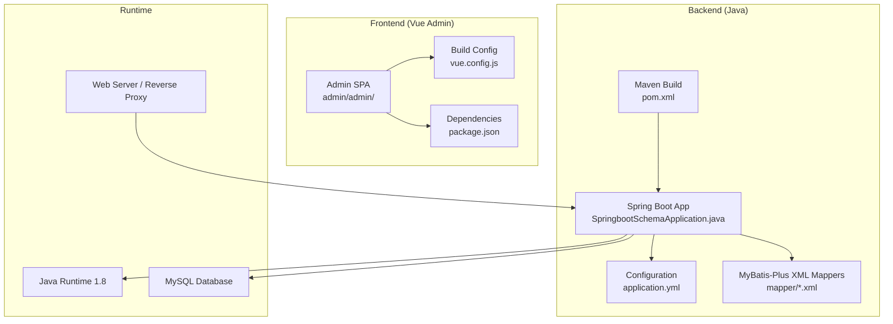
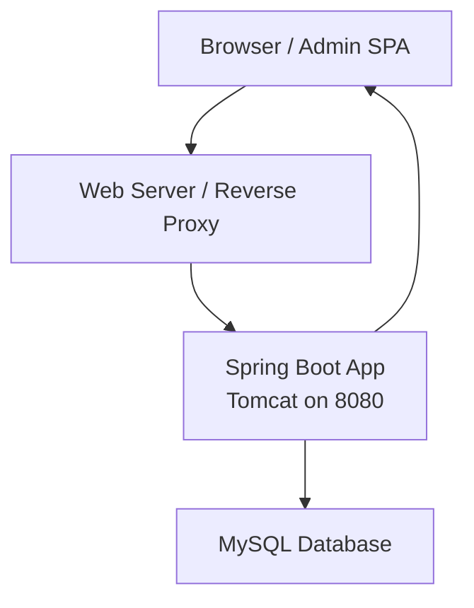
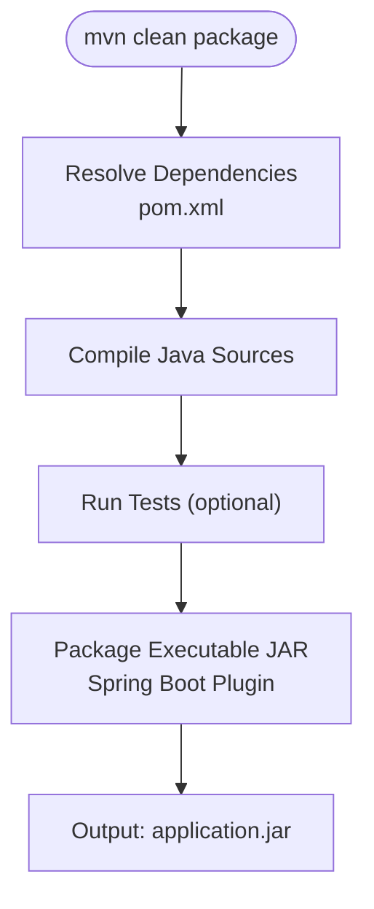
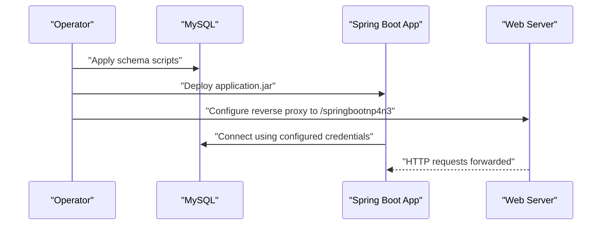
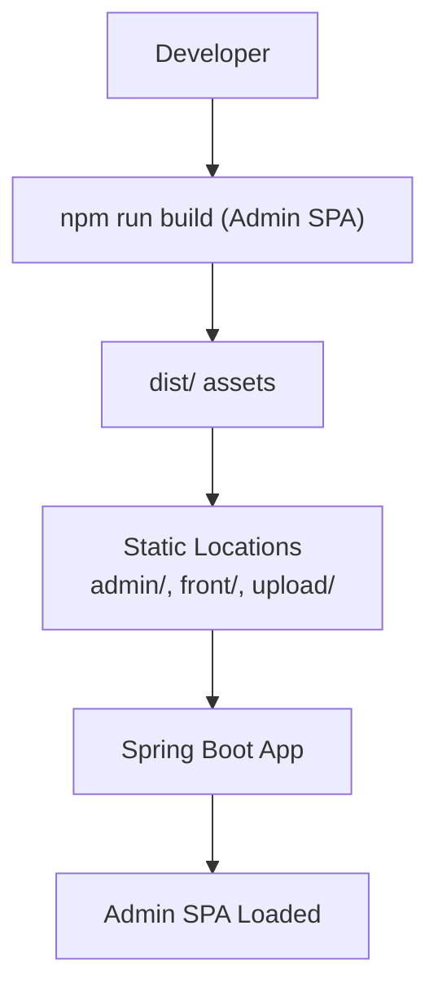
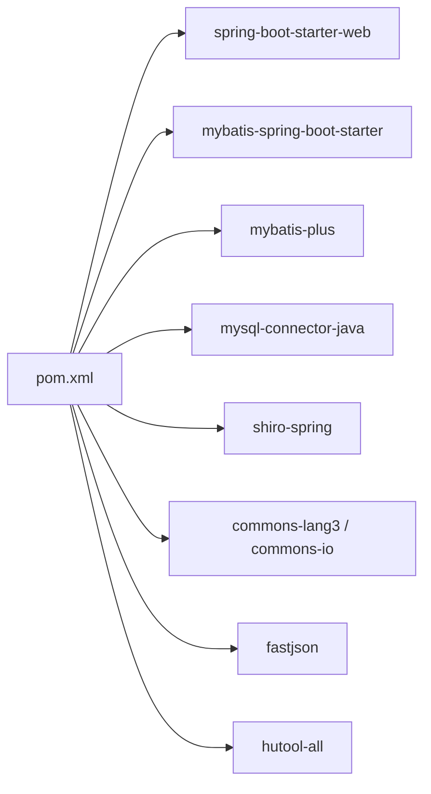

# Deployment Guide

<cite>
**Referenced Files in This Document**
- [pom.xml](file://pom.xml)
- [application.yml](file://src/main/resources/application.yml)
- [SpringbootSchemaApplication.java](file://src/main/java/com/SpringbootSchemaApplication.java)
- [database_changes.sql](file://docs1/database_changes.sql)
- [new_database_changes.sql](file://docs1/new_database_changes.sql)
- [vue.config.js](file://src/main/resources/admin/admin/vue.config.js)
- [package.json](file://src/main/resources/admin/admin/package.json)
- [XiaoxiTimerTask.java](file://src/main/java/com/timer/XiaoxiTimerTask.java)
</cite>

## Table of Contents
1. [Introduction](#introduction)
2. [Project Structure](#project-structure)
3. [Core Components](#core-components)
4. [Architecture Overview](#architecture-overview)
5. [Detailed Component Analysis](#detailed-component-analysis)
6. [Dependency Analysis](#dependency-analysis)
7. [Performance Considerations](#performance-considerations)
8. [Troubleshooting Guide](#troubleshooting-guide)
9. [Conclusion](#conclusion)
10. [Appendices](#appendices)

## Introduction
This guide provides end-to-end deployment instructions for the Student Club Activity Management System. It covers Maven build and packaging, production deployment steps (environment setup, database migration, application server configuration), infrastructure requirements, environment-specific configuration, secrets management, database migration and backup strategies, performance optimization, monitoring and logging, health checks, maintenance, troubleshooting, rollback, and disaster recovery.

## Project Structure
The project is a Spring Boot application with a backend built in Java and a Vue.js admin frontend. The backend uses Spring Web MVC, MyBatis-Plus, MySQL, and Apache Shiro for security. The frontend is packaged via Vue CLI and served by the Spring Boot static resource locations.

**Diagram sources**
- [SpringbootSchemaApplication.java:1-24](file://src/main/java/com/SpringbootSchemaApplication.java#L1-L24)
- [pom.xml:1-125](file://pom.xml#L1-L125)
- [application.yml:1-53](file://src/main/resources/application.yml#L1-L53)
- [vue.config.js:1-63](file://src/main/resources/admin/admin/vue.config.js#L1-L63)
- [package.json:1-63](file://src/main/resources/admin/admin/package.json#L1-L63)

**Section sources**
- [pom.xml:1-125](file://pom.xml#L1-L125)
- [application.yml:1-53](file://src/main/resources/application.yml#L1-L53)
- [SpringbootSchemaApplication.java:1-24](file://src/main/java/com/SpringbootSchemaApplication.java#L1-L24)
- [vue.config.js:1-63](file://src/main/resources/admin/admin/vue.config.js#L1-L63)
- [package.json:1-63](file://src/main/resources/admin/admin/package.json#L1-L63)

## Core Components
- Backend application entrypoint and scanning configuration
  - Application class enables scheduling and scans DAO packages for MyBatis-Plus.
  - Reference: [SpringbootSchemaApplication.java:10-12](file://src/main/java/com/SpringbootSchemaApplication.java#L10-L12)
- Database configuration and static resource serving
  - DataSource URL, credentials, and driver are configured.
  - Static locations include admin, front, and upload directories.
  - Reference: [application.yml:9-26](file://src/main/resources/application.yml#L9-L26)
- Maven build and packaging
  - Uses Spring Boot Maven Plugin for executable JAR packaging.
  - Dependencies include Spring Web, MyBatis-Plus, MySQL Connector, Apache Shiro, and others.
  - Reference: [pom.xml:22-113](file://pom.xml#L22-L113), [pom.xml:115-122](file://pom.xml#L115-L122)
- Frontend build pipeline
  - Vue CLI scripts for development and production builds.
  - Dev server proxy targets the backend context path.
  - Reference: [package.json:5-10](file://src/main/resources/admin/admin/package.json#L5-L10), [vue.config.js:34-44](file://src/main/resources/admin/admin/vue.config.js#L34-L44)

**Section sources**
- [SpringbootSchemaApplication.java:10-12](file://src/main/java/com/SpringbootSchemaApplication.java#L10-L12)
- [application.yml:9-26](file://src/main/resources/application.yml#L9-L26)
- [pom.xml:22-113](file://pom.xml#L22-L113)
- [pom.xml:115-122](file://pom.xml#L115-L122)
- [package.json:5-10](file://src/main/resources/admin/admin/package.json#L5-L10)
- [vue.config.js:34-44](file://src/main/resources/admin/admin/vue.config.js#L34-L44)

## Architecture Overview
The system comprises:
- Backend: Spring Boot app exposing REST endpoints and serving static assets.
- Database: MySQL with schema managed by SQL scripts.
- Frontend: Admin SPA built with Vue.js and served under the backend’s static resource locations.
- Infrastructure: Java 1.8 runtime, MySQL, and a web server or reverse proxy.

**Diagram sources**
- [application.yml:2-7](file://src/main/resources/application.yml#L2-L7)
- [application.yml:10-14](file://src/main/resources/application.yml#L10-L14)

**Section sources**
- [application.yml:2-7](file://src/main/resources/application.yml#L2-L7)
- [application.yml:10-14](file://src/main/resources/application.yml#L10-L14)

## Detailed Component Analysis

### Maven Build and Packaging
- Build lifecycle
  - Spring Boot Maven Plugin is configured for packaging an executable JAR.
  - Reference: [pom.xml:115-122](file://pom.xml#L115-L122)
- Dependency resolution and artifacts
  - Core dependencies include Spring Web, MyBatis-Plus, MySQL Connector, Apache Shiro, commons-lang3, protobuf, FastJSON, and Hutool.
  - Artifact type is a JAR; packaging is handled by the plugin.
  - Reference: [pom.xml:22-113](file://pom.xml#L22-L113)
- Packaging output
  - Executable JAR produced by the Spring Boot plugin; suitable for containerized or VM deployments.
  - Reference: [pom.xml:115-122](file://pom.xml#L115-L122)

**Diagram sources**
- [pom.xml:115-122](file://pom.xml#L115-L122)
- [pom.xml:22-113](file://pom.xml#L22-L113)

**Section sources**
- [pom.xml:22-113](file://pom.xml#L22-L113)
- [pom.xml:115-122](file://pom.xml#L115-L122)

### Production Deployment Procedures
- Environment setup
  - Install Java 1.8 runtime.
  - Provision MySQL server and create the target database.
  - Configure a web server or reverse proxy to forward requests to the backend context path.
  - Reference: [application.yml:2-7](file://src/main/resources/application.yml#L2-L7), [application.yml:10-14](file://src/main/resources/application.yml#L10-L14)
- Database migration
  - Apply schema updates from the provided SQL scripts.
  - Reference: [database_changes.sql:1-18](file://docs1/database_changes.sql#L1-L18), [new_database_changes.sql:1-29](file://docs1/new_database_changes.sql#L1-L29)
- Application server configuration
  - Set server.port and context-path as needed.
  - Configure static resource locations to serve admin and front assets.
  - Reference: [application.yml:2-7](file://src/main/resources/application.yml#L2-L7), [application.yml:25-26](file://src/main/resources/application.yml#L25-L26)
- Secrets management
  - Externalize sensitive values (database credentials, JWT secrets) via environment variables or externalized configuration.
  - Reference: [application.yml:10-14](file://src/main/resources/application.yml#L10-L14)

**Diagram sources**
- [application.yml:2-7](file://src/main/resources/application.yml#L2-L7)
- [application.yml:10-14](file://src/main/resources/application.yml#L10-L14)
- [database_changes.sql:1-18](file://docs1/database_changes.sql#L1-L18)
- [new_database_changes.sql:1-29](file://docs1/new_database_changes.sql#L1-L29)

**Section sources**
- [application.yml:2-7](file://src/main/resources/application.yml#L2-L7)
- [application.yml:10-14](file://src/main/resources/application.yml#L10-L14)
- [application.yml:25-26](file://src/main/resources/application.yml#L25-L26)
- [database_changes.sql:1-18](file://docs1/database_changes.sql#L1-L18)
- [new_database_changes.sql:1-29](file://docs1/new_database_changes.sql#L1-L29)

### Environment-Specific Configuration and Property Handling
- Active profiles and property precedence
  - Use Spring Boot profile-specific properties (e.g., application-prod.yml) to override defaults.
  - Externalize configuration via environment variables and command-line arguments.
- Property placeholders
  - Keep JDBC credentials and other secrets out of version-controlled files; load from environment.
- Static resources
  - Ensure static-locations include admin, front, and upload directories for asset serving.
  - Reference: [application.yml:25-26](file://src/main/resources/application.yml#L25-L26)

**Section sources**
- [application.yml:25-26](file://src/main/resources/application.yml#L25-L26)

### Database Migration Procedures and Schema Updates
- Initial schema creation
  - Apply the initial schema script to create required tables.
  - Reference: [database_changes.sql:5-17](file://docs1/database_changes.sql#L5-L17)
- Incremental changes
  - Apply incremental scripts for new features (e.g., comments, tags).
  - Reference: [new_database_changes.sql:6-28](file://docs1/new_database_changes.sql#L6-L28)
- Backup strategy
  - Take logical backups before applying migrations using mysqldump.
  - Maintain versioned backups and checksums for verification.
- Rollback procedure
  - Maintain reversible migration scripts or point-in-time recovery using backups.

**Section sources**
- [database_changes.sql:5-17](file://docs1/database_changes.sql#L5-L17)
- [new_database_changes.sql:6-28](file://docs1/new_database_changes.sql#L6-L28)

### Frontend Build and Delivery
- Admin SPA build
  - Use Vue CLI scripts to build the admin interface for production.
  - Reference: [package.json:5-10](file://src/main/resources/admin/admin/package.json#L5-L10)
- Static resource serving
  - Backend serves admin and front assets from configured static locations.
  - Reference: [application.yml:25-26](file://src/main/resources/application.yml#L25-L26)
- Development proxy
  - Dev server proxies API requests to the backend context path.
  - Reference: [vue.config.js:34-44](file://src/main/resources/admin/admin/vue.config.js#L34-L44)

**Diagram sources**
- [package.json:5-10](file://src/main/resources/admin/admin/package.json#L5-L10)
- [application.yml:25-26](file://src/main/resources/application.yml#L25-L26)

**Section sources**
- [package.json:5-10](file://src/main/resources/admin/admin/package.json#L5-L10)
- [application.yml:25-26](file://src/main/resources/application.yml#L25-L26)
- [vue.config.js:34-44](file://src/main/resources/admin/admin/vue.config.js#L34-L44)

### Monitoring, Logging, Health Checks, and Maintenance
- Logging
  - Configure logback/log4j2 via application.yml or external config; set levels for production.
- Health checks
  - Expose actuator endpoints (if enabled) for liveness/readiness probes.
- Maintenance
  - Schedule cleanup tasks and periodic maintenance jobs.
  - Reference: [SpringbootSchemaApplication.java:12](file://src/main/java/com/SpringbootSchemaApplication.java#L12)

**Section sources**
- [SpringbootSchemaApplication.java:12](file://src/main/java/com/SpringbootSchemaApplication.java#L12)

### Performance Optimization
- JVM tuning
  - Allocate appropriate heap sizes (-Xms/-Xmx) and tune GC based on workload.
- Database optimization
  - Use connection pooling, prepared statements, and appropriate indexes.
  - Enable slow query logs and analyze queries.
- Caching
  - Introduce Redis or Ehcache for frequently accessed data; avoid caching mutable entities without invalidation.
- Static assets
  - Serve admin/front assets via CDN or enable compression/gzip on the web server.

[No sources needed since this section provides general guidance]

### Troubleshooting Guide
- Common deployment issues
  - Port conflicts: Change server.port in application.yml.
  - Database connectivity: Verify JDBC URL, credentials, and network access.
  - Static assets missing: Confirm static-locations include admin/front/upload.
  - CORS errors: Configure allowed origins in the web server or Spring Security.
- Rollback procedures
  - Revert to last known-good database backup and redeploy previous application version.
- Disaster recovery
  - Maintain offsite backups, automate daily dumps, and test restore procedures monthly.

[No sources needed since this section provides general guidance]

## Dependency Analysis
The backend depends on Spring Boot, MyBatis-Plus, MySQL Connector, Apache Shiro, and utility libraries. The frontend depends on Vue ecosystem packages.

**Diagram sources**
- [pom.xml:22-113](file://pom.xml#L22-L113)

**Section sources**
- [pom.xml:22-113](file://pom.xml#L22-L113)

## Performance Considerations
- JVM tuning
  - Adjust heap size and GC settings according to traffic and memory usage.
- Database optimization
  - Use EXPLAIN plans, add indexes, and limit N+1 queries.
- Caching strategies
  - Cache read-heavy data with TTL and invalidate on write.
- Frontend delivery
  - Bundle and minify admin assets; enable gzip/HTTP2 on the web server.

[No sources needed since this section provides general guidance]

## Troubleshooting Guide
- Connectivity and configuration
  - Verify server.port, context-path, and datasource properties.
  - Reference: [application.yml:2-7](file://src/main/resources/application.yml#L2-L7), [application.yml:10-14](file://src/main/resources/application.yml#L10-L14)
- Static assets not loading
  - Ensure static-locations include admin, front, and upload.
  - Reference: [application.yml:25-26](file://src/main/resources/application.yml#L25-L26)
- Frontend proxy during development
  - Confirm devServer proxy target matches backend context path.
  - Reference: [vue.config.js:34-44](file://src/main/resources/admin/admin/vue.config.js#L34-L44)

**Section sources**
- [application.yml:2-7](file://src/main/resources/application.yml#L2-L7)
- [application.yml:10-14](file://src/main/resources/application.yml#L10-L14)
- [application.yml:25-26](file://src/main/resources/application.yml#L25-L26)
- [vue.config.js:34-44](file://src/main/resources/admin/admin/vue.config.js#L34-L44)

## Conclusion
This guide outlines a complete deployment workflow for the Student Club Activity Management System, covering Maven packaging, environment setup, database migrations, configuration management, performance tuning, monitoring, and operational procedures. Adhering to these practices ensures reliable, maintainable, and scalable operations.

## Appendices
- Additional runtime notes
  - Enable scheduled tasks for notification reminders.
  - Reference: [SpringbootSchemaApplication.java:12](file://src/main/java/com/SpringbootSchemaApplication.java#L12), [XiaoxiTimerTask.java](file://src/main/java/com/timer/XiaoxiTimerTask.java)

**Section sources**
- [SpringbootSchemaApplication.java:12](file://src/main/java/com/SpringbootSchemaApplication.java#L12)
- [XiaoxiTimerTask.java](file://src/main/java/com/timer/XiaoxiTimerTask.java)