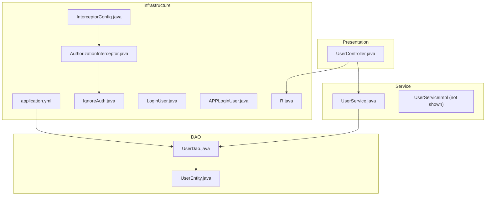
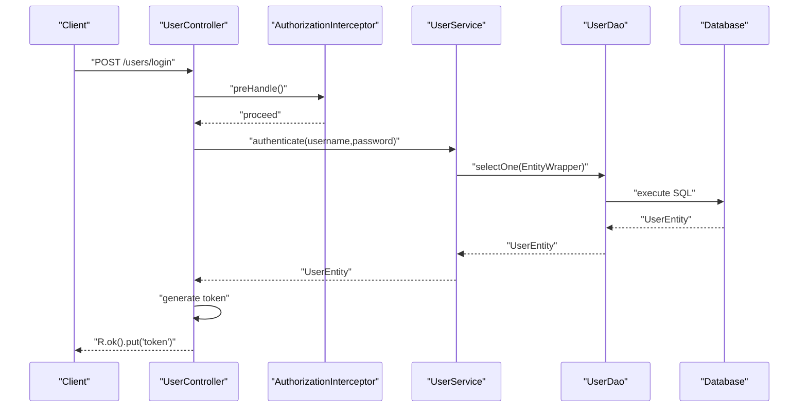
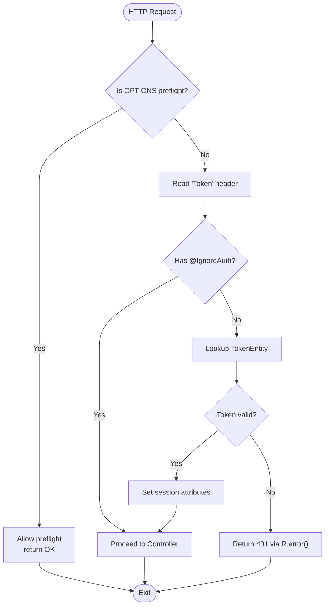
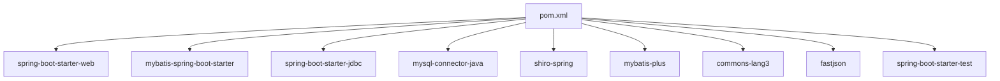

# Development Guidelines

<cite>
**Referenced Files in This Document**
- [SpringbootSchemaApplication.java](file://src/main/java/com/SpringbootSchemaApplication.java)
- [pom.xml](file://pom.xml)
- [application.yml](file://src/main/resources/application.yml)
- [InterceptorConfig.java](file://src/main/java/com/config/InterceptorConfig.java)
- [AuthorizationInterceptor.java](file://src/main/java/com/interceptor/AuthorizationInterceptor.java)
- [IgnoreAuth.java](file://src/main/java/com/annotation/IgnoreAuth.java)
- [LoginUser.java](file://src/main/java/com/annotation/LoginUser.java)
- [APPLoginUser.java](file://src/main/java/com/annotation/APPLoginUser.java)
- [UserEntity.java](file://src/main/java/com/entity/UserEntity.java)
- [UserDao.java](file://src/main/java/com/dao/UserDao.java)
- [UserService.java](file://src/main/java/com/service/UserService.java)
- [UserController.java](file://src/main/java/com/controller/UserController.java)
- [R.java](file://src/main/java/com/utils/R.java)
</cite>

## Table of Contents
1. [Introduction](#introduction)
2. [Project Structure](#project-structure)
3. [Core Components](#core-components)
4. [Architecture Overview](#architecture-overview)
5. [Detailed Component Analysis](#detailed-component-analysis)
6. [Dependency Analysis](#dependency-analysis)
7. [Performance Considerations](#performance-considerations)
8. [Troubleshooting Guide](#troubleshooting-guide)
9. [Conclusion](#conclusion)
10. [Appendices](#appendices)

## Introduction
This document provides comprehensive development guidelines for the Student Club Activity Management System. It establishes coding standards, project structure rules aligned with the MVC pattern, annotation usage, entity model patterns, service and DAO conventions, controller endpoint design, testing and quality practices, Maven configuration, and strategies for adding and extending features while maintaining consistency.

## Project Structure
The project follows a layered MVC architecture with clear separation of concerns:
- Presentation Layer: Controllers expose REST endpoints under a base package for each domain resource.
- Service Layer: Services encapsulate business logic and orchestrate data operations.
- Data Access Layer: DAOs define persistence contracts; MyBatis-Plus handles SQL mapping via XML files.
- Model Layer: Entities represent persistent state; Views and VOs support presentation-specific projections.
- Infrastructure: Annotations, interceptors, configurations, and utilities support cross-cutting concerns.

**Diagram sources**
- [application.yml:1-53](file://src/main/resources/application.yml#L1-L53)
- [AuthorizationInterceptor.java:1-105](file://src/main/java/com/interceptor/AuthorizationInterceptor.java#L1-L105)
- [InterceptorConfig.java:1-42](file://src/main/java/com/config/InterceptorConfig.java#L1-L42)
- [IgnoreAuth.java:1-14](file://src/main/java/com/annotation/IgnoreAuth.java#L1-L14)
- [LoginUser.java:1-16](file://src/main/java/com/annotation/LoginUser.java#L1-L16)
- [APPLoginUser.java:1-16](file://src/main/java/com/annotation/APPLoginUser.java#L1-L16)
- [R.java:1-52](file://src/main/java/com/utils/R.java#L1-L52)
- [UserController.java:1-253](file://src/main/java/com/controller/UserController.java#L1-L253)
- [UserService.java:1-26](file://src/main/java/com/service/UserService.java#L1-L26)
- [UserDao.java:1-23](file://src/main/java/com/dao/UserDao.java#L1-L23)
- [UserEntity.java:1-182](file://src/main/java/com/entity/UserEntity.java#L1-L182)

**Section sources**
- [SpringbootSchemaApplication.java:1-24](file://src/main/java/com/SpringbootSchemaApplication.java#L1-L24)
- [application.yml:1-53](file://src/main/resources/application.yml#L1-L53)
- [InterceptorConfig.java:1-42](file://src/main/java/com/config/InterceptorConfig.java#L1-L42)
- [AuthorizationInterceptor.java:1-105](file://src/main/java/com/interceptor/AuthorizationInterceptor.java#L1-L105)

## Core Components
- Application bootstrap and scanning: The main class enables scheduling and scans DAO packages for MyBatis mappers.
- Configuration: Database connection, multipart limits, static resource locations, and MyBatis-Plus settings.
- Interceptor chain: Global CORS handling, path-based interception, and token-based authorization.
- Annotation-driven authorization: Method-level ignore and parameter-level user injection markers.
- Standardized response: Utility class R centralizes response shape for consistent API contracts.

Key conventions derived from the codebase:
- Java naming conventions: PascalCase for classes, camelCase for fields and methods, UPPER_SNAKE_CASE for constants.
- Package organization: com.annotation, com.config, com.controller, com.dao, com.entity, com.interceptor, com.service, com.utils.
- Controller endpoints: Base path per domain resource; consistent HTTP verb usage; JSON payload via @RequestBody; query parameters via @RequestParam; path variables via @PathVariable.
- Service contracts: Extends MyBatis-Plus IService with pagination and list-view convenience methods.
- DAO contracts: Extend BaseMapper with list view overloads supporting wrappers and pagination.
- Entity models: POJOs with annotations for table mapping and ID strategy; getters/setters for all fields.

**Section sources**
- [SpringbootSchemaApplication.java:1-24](file://src/main/java/com/SpringbootSchemaApplication.java#L1-L24)
- [application.yml:1-53](file://src/main/resources/application.yml#L1-L53)
- [InterceptorConfig.java:1-42](file://src/main/java/com/config/InterceptorConfig.java#L1-L42)
- [AuthorizationInterceptor.java:1-105](file://src/main/java/com/interceptor/AuthorizationInterceptor.java#L1-L105)
- [IgnoreAuth.java:1-14](file://src/main/java/com/annotation/IgnoreAuth.java#L1-L14)
- [LoginUser.java:1-16](file://src/main/java/com/annotation/LoginUser.java#L1-L16)
- [APPLoginUser.java:1-16](file://src/main/java/com/annotation/APPLoginUser.java#L1-L16)
- [R.java:1-52](file://src/main/java/com/utils/R.java#L1-L52)
- [UserController.java:1-253](file://src/main/java/com/controller/UserController.java#L1-L253)
- [UserService.java:1-26](file://src/main/java/com/service/UserService.java#L1-L26)
- [UserDao.java:1-23](file://src/main/java/com/dao/UserDao.java#L1-L23)
- [UserEntity.java:1-182](file://src/main/java/com/entity/UserEntity.java#L1-L182)

## Architecture Overview
The system enforces a layered MVC architecture with centralized cross-cutting concerns:
- Controllers handle HTTP requests and delegate to services.
- Services encapsulate business logic and coordinate DAOs.
- DAOs abstract persistence using MyBatis-Plus.
- Interceptors enforce authentication and CORS.
- Utilities standardize responses.

**Diagram sources**
- [AuthorizationInterceptor.java:1-105](file://src/main/java/com/interceptor/AuthorizationInterceptor.java#L1-L105)
- [UserController.java:1-253](file://src/main/java/com/controller/UserController.java#L1-L253)
- [UserService.java:1-26](file://src/main/java/com/service/UserService.java#L1-L26)
- [UserDao.java:1-23](file://src/main/java/com/dao/UserDao.java#L1-L23)
- [application.yml:1-53](file://src/main/resources/application.yml#L1-L53)

## Detailed Component Analysis

### Authentication and Authorization
- IgnoreAuth: Applied at the method level to bypass token checks.
- LoginUser/APPLoginUser: Parameter-level annotations indicating user context injection.
- Interceptor: Extracts token from header, validates, sets session attributes, and returns standardized error for missing tokens.

**Diagram sources**
- [AuthorizationInterceptor.java:1-105](file://src/main/java/com/interceptor/AuthorizationInterceptor.java#L1-L105)
- [IgnoreAuth.java:1-14](file://src/main/java/com/annotation/IgnoreAuth.java#L1-L14)
- [R.java:1-52](file://src/main/java/com/utils/R.java#L1-L52)

**Section sources**
- [AuthorizationInterceptor.java:1-105](file://src/main/java/com/interceptor/AuthorizationInterceptor.java#L1-L105)
- [IgnoreAuth.java:1-14](file://src/main/java/com/annotation/IgnoreAuth.java#L1-L14)
- [LoginUser.java:1-16](file://src/main/java/com/annotation/LoginUser.java#L1-L16)
- [APPLoginUser.java:1-16](file://src/main/java/com/annotation/APPLoginUser.java#L1-L16)

### Controller Endpoint Design
- Base path per domain resource (e.g., users).
- Consistent HTTP verbs: POST for creation/login/register, GET for retrieval/logout/session, PUT/PATCH for updates, DELETE for removal.
- JSON payloads via @RequestBody; query parameters via @RequestParam; path variables via @PathVariable.
- Validation utilities available but commented out; enable as needed.
- Standardized responses via R utility.

Best practices:
- Keep endpoints idempotent where appropriate.
- Use plural nouns for collections and singular for individual resources.
- Group related endpoints under a single controller.
- Return R.ok() or R.error() consistently.

**Section sources**
- [UserController.java:1-253](file://src/main/java/com/controller/UserController.java#L1-L253)
- [R.java:1-52](file://src/main/java/com/utils/R.java#L1-L52)

### Service Layer Implementation
- Service interfaces extend MyBatis-Plus IService and define pagination and list-view methods.
- Implementations typically delegate to DAOs and coordinate business rules.
- Prefer immutable DTOs/VOS for external exposure; keep internal entities for persistence.

Guidelines:
- Encapsulate business logic in services; avoid heavy logic in controllers.
- Use wrappers and pagination utilities for filtering/sorting.
- Keep transactions explicit when needed.

**Section sources**
- [UserService.java:1-26](file://src/main/java/com/service/UserService.java#L1-L26)

### DAO Method Naming and Contracts
- Extend BaseMapper for CRUD and query convenience.
- Provide list view methods supporting wrappers and pagination.
- Use @Param for named parameters in custom queries.

Guidelines:
- Align method names with intent (e.g., selectListView).
- Keep DAOs thin; move complex logic to services.
- Leverage MyBatis-Plus utilities for common operations.

**Section sources**
- [UserDao.java:1-23](file://src/main/java/com/dao/UserDao.java#L1-L23)

### Entity Model Patterns
- Entity: Persistent POJO annotated for table mapping and ID strategy.
- VO/View/Model: Presentation-specific projections reside under com.entity.vo, com.entity.view, com.entity.model respectively. These are used to tailor data for specific UI/API needs.

Guidelines:
- Keep entities focused on persistence.
- Use VO for controller responses; View for read-only projections; Model for form-like data transfer.
- Avoid exposing sensitive fields in VOs/Views.

Note: The referenced paths for VO/View/Model are present in the project structure; ensure they are generated or implemented consistently across domains.

**Section sources**
- [UserEntity.java:1-182](file://src/main/java/com/entity/UserEntity.java#L1-L182)

### Interceptor and Global Configuration
- InterceptorConfig registers AuthorizationInterceptor for selected API paths and excludes static resources.
- AuthorizationInterceptor supports CORS preflight, reads token, applies @IgnoreAuth, and sets session attributes.

Guidelines:
- Add new API namespaces to InterceptorConfig as needed.
- Keep CORS headers aligned with deployment requirements.
- Centralize error responses via R for consistent client handling.

**Section sources**
- [InterceptorConfig.java:1-42](file://src/main/java/com/config/InterceptorConfig.java#L1-L42)
- [AuthorizationInterceptor.java:1-105](file://src/main/java/com/interceptor/AuthorizationInterceptor.java#L1-L105)

## Dependency Analysis
Maven dependencies include Spring Boot Starter Web, MyBatis-Plus, MySQL Connector, Apache Shiro, Commons Lang3, FastJSON, and testing starter. Build plugin includes spring-boot-maven-plugin.

**Diagram sources**
- [pom.xml:1-125](file://pom.xml#L1-L125)

**Section sources**
- [pom.xml:1-125](file://pom.xml#L1-L125)

## Performance Considerations
- Pagination: Use PageUtils and DAO list view overloads to limit result sets.
- Query optimization: Prefer indexed columns in wrappers; avoid N+1 selects.
- Caching: Introduce Redis or Ehcache for frequently accessed metadata.
- Logging: Avoid excessive logging in hot paths; use structured logs.
- Static resources: Serve via configured static locations to reduce server load.

## Troubleshooting Guide
Common issues and resolutions:
- 401 Unauthorized: Verify token presence in header and session population by interceptor.
- CORS failures: Confirm interceptor allows origin and headers; ensure preflight OPTIONS handled.
- Database connectivity: Validate datasource URL, credentials, and timezone settings in application.yml.
- Response shape mismatches: Ensure controllers return R.ok()/R.error() consistently.

**Section sources**
- [AuthorizationInterceptor.java:1-105](file://src/main/java/com/interceptor/AuthorizationInterceptor.java#L1-L105)
- [R.java:1-52](file://src/main/java/com/utils/R.java#L1-L52)
- [application.yml:1-53](file://src/main/resources/application.yml#L1-L53)

## Conclusion
These guidelines establish a consistent, maintainable development process for the Student Club Activity Management System. By adhering to the MVC structure, annotation-driven authorization, standardized responses, and DAO/service conventions, teams can scale features reliably while preserving code quality and developer productivity.

## Appendices

### Coding Standards Checklist
- Java naming: Classes PascalCase; fields/parameters camelCase; constants UPPER_SNAKE_CASE.
- Packages: com.annotation, com.config, com.controller, com.dao, com.entity, com.interceptor, com.service, com.utils.
- Controllers: Base path per domain; consistent HTTP verbs; JSON via @RequestBody; standardized responses via R.
- Services: Extend IService; provide pagination/list-view methods; encapsulate business logic.
- DAOs: Extend BaseMapper; use @Param; provide list view overloads.
- Entities: Annotated table mapping; getters/setters; avoid exposing sensitive fields.
- Annotations: Use @IgnoreAuth for public endpoints; consider @LoginUser for user context injection.
- Testing: Unit tests for services; integration tests for controllers; mock DAOs; validate R responses.
- Quality: Enforce code reviews; static analysis; consistent formatting; documented exceptions.

### Adding a New Feature
- Define entity under com.entity and corresponding DAO under com.dao.
- Create service interface under com.service and implementation under com.service.impl.
- Add controller endpoints under com.controller with consistent naming and HTTP verbs.
- Register interceptors for new API namespaces in InterceptorConfig if needed.
- Update MyBatis-Plus mapper XML under src/main/resources/mapper.
- Write unit/integration tests and validate with R.ok()/R.error().
- Document endpoints and response shapes.

### Continuous Integration and Build
- Maven build: spring-boot-maven-plugin included; ensure JDK 1.8 compatibility.
- Dependencies: Keep versions aligned with Spring Boot parent; audit for vulnerabilities.
- Static analysis: Integrate PMD/SpotBugs/Checkstyle; configure pre-commit hooks.
- Testing: Run unit tests; include integration tests; publish coverage reports.
- Deployment: Package as executable JAR; configure environment-specific application.yml.

**Section sources**
- [pom.xml:1-125](file://pom.xml#L1-L125)
- [application.yml:1-53](file://src/main/resources/application.yml#L1-L53)