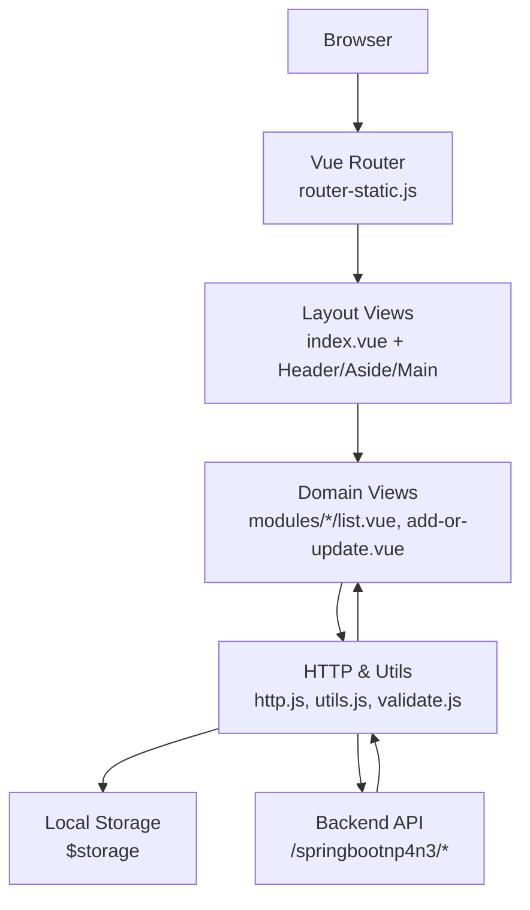
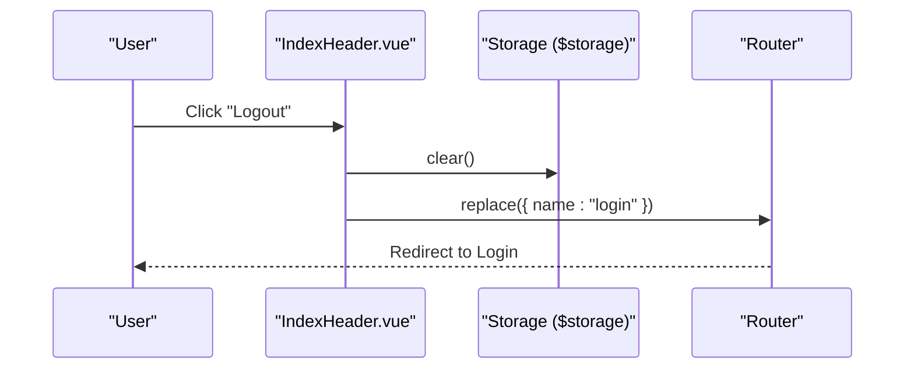
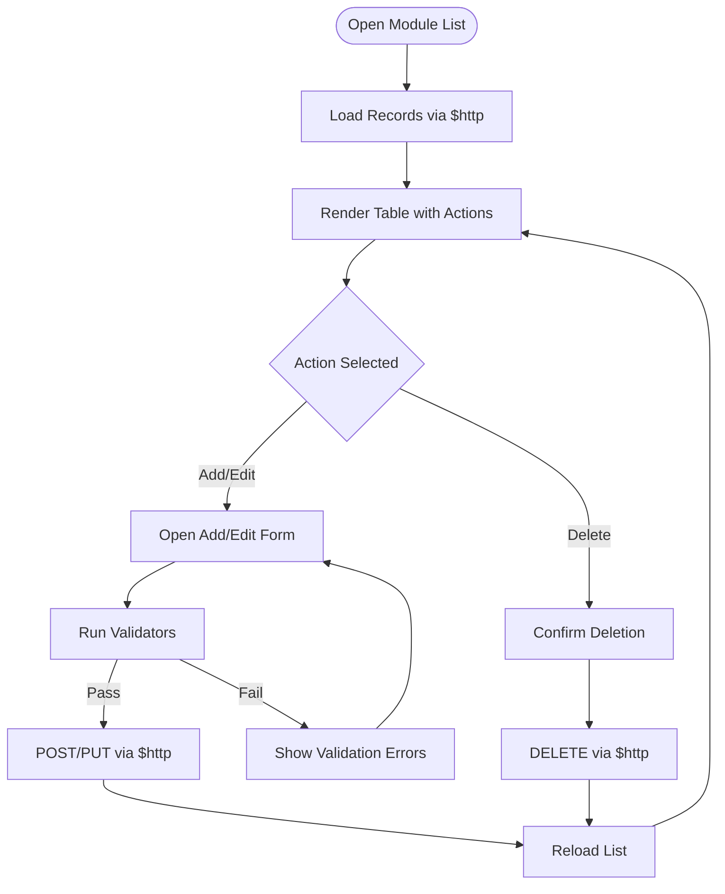
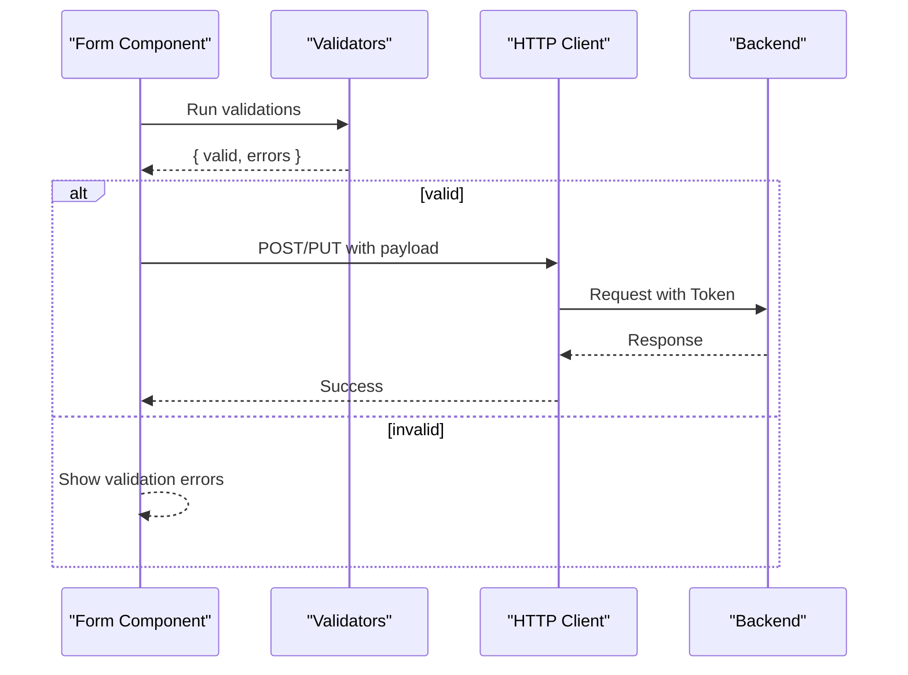
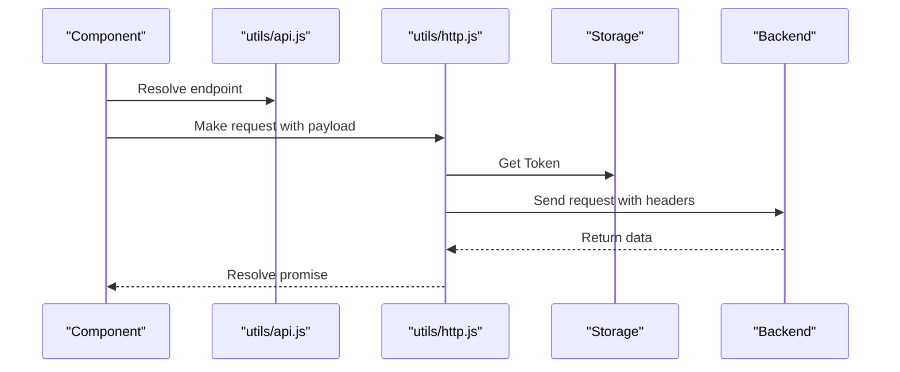
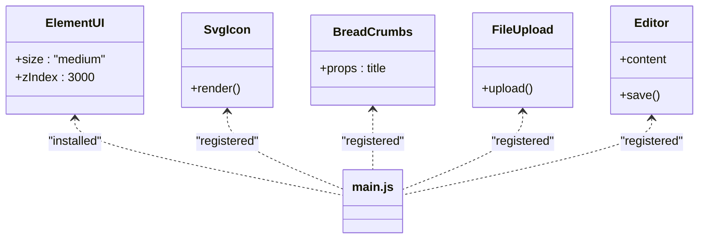
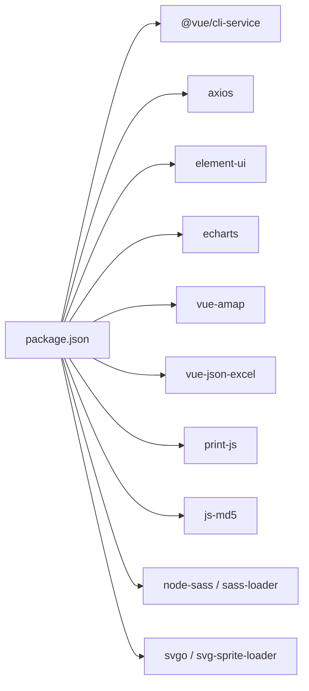

# Admin Panel Interface

<cite>
**Referenced Files in This Document**
- [App.vue](file://src/main/resources/admin/admin/src/App.vue)
- [main.js](file://src/main/resources/admin/admin/src/main.js)
- [package.json](file://src/main/resources/admin/admin/package.json)
- [vue.config.js](file://src/main/resources/admin/admin/vue.config.js)
- [babel.config.js](file://src/main/resources/admin/admin/babel.config.js)
- [router-static.js](file://src/main/resources/admin/admin/src/router/router-static.js)
- [IndexAside.vue](file://src/main/resources/admin/admin/src/components/index/IndexAside.vue)
- [IndexHeader.vue](file://src/main/resources/admin/admin/src/components/index/IndexHeader.vue)
- [IndexMain.vue](file://src/main/resources/admin/admin/src/components/index/IndexMain.vue)
- [index.vue](file://src/main/resources/admin/admin/src/views/index.vue)
- [api.js](file://src/main/resources/admin/admin/src/utils/api.js)
- [http.js](file://src/main/resources/admin/admin/src/utils/http.js)
- [base.js](file://src/main/resources/admin/admin/src/utils/base.js)
- [utils.js](file://src/main/resources/admin/admin/src/utils/utils.js)
- [validate.js](file://src/main/resources/admin/admin/src/utils/validate.js)
- [SvgIcon/index.vue](file://src/main/resources/admin/admin/src/components/SvgIcon/index.vue)
- [BreadCrumbs.vue](file://src/main/resources/admin/admin/src/components/common/BreadCrumbs.vue)
- [Editor.vue](file://src/main/resources/admin/admin/src/components/common/Editor.vue)
- [FileUpload.vue](file://src/main/resources/admin/admin/src/components/common/FileUpload.vue)
- [element-variables.scss](file://src/main/resources/admin/admin/src/assets/css/element-variables.scss)
- [style.scss](file://src/main/resources/admin/admin/src/assets/css/style.scss)
- [users/list.vue](file://src/main/resources/admin/admin/src/views/modules/users/list.vue)
- [users/add-or-update.vue](file://src/main/resources/admin/admin/src/views/modules/users/add-or-update.vue)
- [shetuanxinxi/list.vue](file://src/main/resources/admin/admin/src/views/modules/shetuanxinxi/list.vue)
- [shetuanxinxi/add-or-update.vue](file://src/main/resources/admin/admin/src/views/modules/shetuanxinxi/add-or-update.vue)
- [shetuanhuodong/list.vue](file://src/main/resources/admin/admin/src/views/modules/shetuanhuodong/list.vue)
- [shetuanhuodong/add-or-update.vue](file://src/main/resources/admin/admin/src/views/modules/shetuanhuodong/add-or-update.vue)
- [news/list.vue](file://src/main/resources/admin/admin/src/views/modules/news/list.vue)
- [news/add-or-update.vue](file://src/main/resources/admin/admin/src/views/modules/news/add-or-update.vue)
- [storeup/list.vue](file://src/main/resources/admin/admin/src/views/modules/storeup/list.vue)
- [storeup/add-or-update.vue](file://src/main/resources/admin/admin/src/views/modules/storeup/add-or-update.vue)
- [config/list.vue](file://src/main/resources/admin/admin/src/views/modules/config/list.vue)
- [config/add-or-update.vue](file://src/main/resources/admin/admin/src/views/modules/config/add-or-update.vue)
- [discussshetuanxinxi/list.vue](file://src/main/resources/admin/admin/src/views/modules/discussshetuanxinxi/list.vue)
- [discussshetuanxinxi/add-or-update.vue](file://src/main/resources/admin/admin/src/views/modules/discussshetuanxinxi/add-or-update.vue)
- [shetuanchengyuan/list.vue](file://src/main/resources/admin/admin/src/views/modules/shetuanchengyuan/list.vue)
- [shetuanchengyuan/add-or-update.vue](file://src/main/resources/admin/admin/src/views/modules/shetuanchengyuan/add-or-update.vue)
- [jiarushetuan/list.vue](file://src/main/resources/admin/admin/src/views/modules/jiarushetuan/list.vue)
- [jiarushetuan/add-or-update.vue](file://src/main/resources/admin/admin/src/views/modules/jiarushetuan/add-or-update.vue)
- [huodongbaoming/list.vue](file://src/main/resources/admin/admin/src/views/modules/huodongbaoming/list.vue)
- [huodongbaoming/add-or-update.vue](file://src/main/resources/admin/admin/src/views/modules/huodongbaoming/add-or-update.vue)
- [shezhang/list.vue](file://src/main/resources/admin/admin/src/views/modules/shezhang/list.vue)
- [shezhang/add-or-update.vue](file://src/main/resources/admin/admin/src/views/modules/shezhang/add-or-update.vue)
- [xuesheng/list.vue](file://src/main/resources/admin/admin/src/views/modules/xuesheng/list.vue)
- [xuesheng/add-or-update.vue](file://src/main/resources/admin/admin/src/views/modules/xuesheng/add-or-update.vue)
- [shetuanfenlei/list.vue](file://src/main/resources/admin/admin/src/views/modules/shetuanfenlei/list.vue)
- [shetuanfenlei/add-or-update.vue](file://src/main/resources/admin/admin/src/views/modules/shetuanfenlei/add-or-update.vue)
</cite>

## Table of Contents
1. [Introduction](#introduction)
2. [Project Structure](#project-structure)
3. [Core Components](#core-components)
4. [Architecture Overview](#architecture-overview)
5. [Detailed Component Analysis](#detailed-component-analysis)
6. [Dependency Analysis](#dependency-analysis)
7. [Performance Considerations](#performance-considerations)
8. [Troubleshooting Guide](#troubleshooting-guide)
9. [Conclusion](#conclusion)
10. [Appendices](#appendices)

## Introduction
This document describes the Vue.js admin panel built with Element UI for managing a campus association management system. It covers the application’s main structure, routing, component hierarchy, CRUD implementations across entities (users, associations, events, content moderation), form handling and validation, API integration, component library usage, custom components, state management via storage, build configuration with Vue CLI/Webpack, responsive design and theme customization, and accessibility features. Administrative workflows and common tasks are also illustrated.

## Project Structure
The admin panel resides under src/main/resources/admin/admin and follows a conventional Vue 2.x structure with Element UI, SCSS theming, and modular views organized by domain entities.

```mermaid
graph TB
subgraph "Entry"
A["main.js"]
B["App.vue"]
end
subgraph "Routing"
C["router/router-static.js"]
end
subgraph "Layout"
D["views/index.vue"]
E["components/index/IndexHeader.vue"]
F["components/index/IndexAside.vue"]
G["components/index/IndexMain.vue"]
end
subgraph "Utilities"
H["utils/http.js"]
I["utils/api.js"]
J["utils/base.js"]
K["utils/utils.js"]
L["utils/validate.js"]
end
subgraph "Assets & Theming"
M["assets/css/element-variables.scss"]
N["assets/css/style.scss"]
end
subgraph "Build & Config"
O["vue.config.js"]
P["package.json"]
Q["babel.config.js"]
end
subgraph "Views & Modules"
V1["views/modules/users/*"]
V2["views/modules/shetuanxinxi/*"]
V3["views/modules/shetuanhuodong/*"]
V4["views/modules/news/*"]
V5["views/modules/storeup/*"]
V6["views/modules/config/*"]
V7["views/modules/discussshetuanxinxi/*"]
V8["views/modules/shetuanchengyuan/*"]
V9["views/modules/jiarushetuan/*"]
V10["views/modules/huodongbaoming/*"]
V11["views/modules/shezhang/*"]
V12["views/modules/xuesheng/*"]
V13["views/modules/shetuanfenlei/*"]
end
A --> B
A --> C
A --> H
A --> I
A --> J
A --> K
A --> L
A --> M
A --> N
D --> E
D --> F
D --> G
C --> V1
C --> V2
C --> V3
C --> V4
C --> V5
C --> V6
C --> V7
C --> V8
C --> V9
C --> V10
C --> V11
C --> V12
C --> V13
```



**Diagram sources**
- [main.js:1-77](file://src/main/resources/admin/admin/src/main.js#L1-L77)
- [App.vue:1-31](file://src/main/resources/admin/admin/src/App.vue#L1-L31)
- [router-static.js:1-147](file://src/main/resources/admin/admin/src/router/router-static.js#L1-L147)
- [index.vue:1-33](file://src/main/resources/admin/admin/src/views/index.vue#L1-L33)
- [IndexHeader.vue:1-185](file://src/main/resources/admin/admin/src/components/index/IndexHeader.vue#L1-L185)
- [IndexAside.vue:1-57](file://src/main/resources/admin/admin/src/components/index/IndexAside.vue#L1-L57)
- [IndexMain.vue:1-125](file://src/main/resources/admin/admin/src/components/index/IndexMain.vue#L1-L125)
- [http.js:1-29](file://src/main/resources/admin/admin/src/utils/http.js#L1-L29)
- [api.js:1-18](file://src/main/resources/admin/admin/src/utils/api.js#L1-L18)
- [base.js:1-17](file://src/main/resources/admin/admin/src/utils/base.js#L1-L17)
- [utils.js:1-62](file://src/main/resources/admin/admin/src/utils/utils.js#L1-L62)
- [validate.js:1-58](file://src/main/resources/admin/admin/src/utils/validate.js#L1-L58)
- [element-variables.scss](file://src/main/resources/admin/admin/src/assets/css/element-variables.scss)
- [style.scss](file://src/main/resources/admin/admin/src/assets/css/style.scss)
- [vue.config.js:1-63](file://src/main/resources/admin/admin/vue.config.js#L1-L63)
- [package.json:1-63](file://src/main/resources/admin/admin/package.json#L1-L63)
- [babel.config.js:1-6](file://src/main/resources/admin/admin/babel.config.js#L1-L6)

**Section sources**
- [main.js:1-77](file://src/main/resources/admin/admin/src/main.js#L1-L77)
- [App.vue:1-31](file://src/main/resources/admin/admin/src/App.vue#L1-L31)
- [router-static.js:1-147](file://src/main/resources/admin/admin/src/router/router-static.js#L1-L147)
- [index.vue:1-33](file://src/main/resources/admin/admin/src/views/index.vue#L1-L33)
- [IndexHeader.vue:1-185](file://src/main/resources/admin/admin/src/components/index/IndexHeader.vue#L1-L185)
- [IndexAside.vue:1-57](file://src/main/resources/admin/admin/src/components/index/IndexAside.vue#L1-L57)
- [IndexMain.vue:1-125](file://src/main/resources/admin/admin/src/components/index/IndexMain.vue#L1-L125)
- [vue.config.js:1-63](file://src/main/resources/admin/admin/vue.config.js#L1-L63)
- [package.json:1-63](file://src/main/resources/admin/admin/package.json#L1-L63)
- [babel.config.js:1-6](file://src/main/resources/admin/admin/babel.config.js#L1-L6)

## Core Components
- Application entry initializes Element UI, global components, charting, map, printing, Excel export, and MD5 utilities, and mounts the app with router.
- Layout components provide header, sidebar navigation, and main content area with breadcrumbs.
- Utilities encapsulate HTTP client, API endpoint mapping, base URLs, permission checks, date helpers, and validation rules.
- Build configuration sets public path, dev server proxy, SVG icon loader, and ESLint behavior.

Key responsibilities:
- main.js: Global plugins, prototypes, and component registration.
- index.vue: Container layout wiring header, aside, and main.
- http.js: Axios instance with token injection and 401 handling.
- utils.js: Permission gating and date helpers.
- validate.js: Reusable validators for forms.

**Section sources**
- [main.js:1-77](file://src/main/resources/admin/admin/src/main.js#L1-L77)
- [index.vue:1-33](file://src/main/resources/admin/admin/src/views/index.vue#L1-L33)
- [http.js:1-29](file://src/main/resources/admin/admin/src/utils/http.js#L1-L29)
- [utils.js:1-62](file://src/main/resources/admin/admin/src/utils/utils.js#L1-L62)
- [validate.js:1-58](file://src/main/resources/admin/admin/src/utils/validate.js#L1-L58)

## Architecture Overview
The admin panel uses a hash-mode router, Element UI for UI primitives, and a modular view structure per domain entity. Requests are proxied to the backend API with token-based authentication.



**Diagram sources**
- [router-static.js:1-147](file://src/main/resources/admin/admin/src/router/router-static.js#L1-L147)
- [index.vue:1-33](file://src/main/resources/admin/admin/src/views/index.vue#L1-L33)
- [IndexHeader.vue:1-185](file://src/main/resources/admin/admin/src/components/index/IndexHeader.vue#L1-L185)
- [IndexAside.vue:1-57](file://src/main/resources/admin/admin/src/components/index/IndexAside.vue#L1-L57)
- [IndexMain.vue:1-125](file://src/main/resources/admin/admin/src/components/index/IndexMain.vue#L1-L125)
- [http.js:1-29](file://src/main/resources/admin/admin/src/utils/http.js#L1-L29)
- [utils.js:1-62](file://src/main/resources/admin/admin/src/utils/utils.js#L1-L62)
- [validate.js:1-58](file://src/main/resources/admin/admin/src/utils/validate.js#L1-L58)

## Detailed Component Analysis

### Routing and Navigation
- Hash-mode router defines top-level routes and nested children for dashboard, profile, payments, and entity modules.
- Sidebar reads dynamic menus from session storage and renders nested submenus.
- Header displays project branding, user info, and logout action.



**Diagram sources**
- [IndexHeader.vue:57-84](file://src/main/resources/admin/admin/src/components/index/IndexHeader.vue#L57-L84)
- [router-static.js:117-137](file://src/main/resources/admin/admin/src/router/router-static.js#L117-L137)

**Section sources**
- [router-static.js:1-147](file://src/main/resources/admin/admin/src/router/router-static.js#L1-L147)
- [IndexHeader.vue:1-185](file://src/main/resources/admin/admin/src/components/index/IndexHeader.vue#L1-L185)
- [IndexAside.vue:1-57](file://src/main/resources/admin/admin/src/components/index/IndexAside.vue#L1-L57)
- [IndexMain.vue:1-125](file://src/main/resources/admin/admin/src/components/index/IndexMain.vue#L1-L125)

### Layout Components
- IndexHeader: Themeable navbar with project branding, user info retrieval via session endpoint, and logout redirection.
- IndexAside: Static aside with dynamic menu items loaded from session storage.
- IndexMain: Main content container with breadcrumb and router outlet.

```mermaid
classDiagram
class IndexHeader {
+mounted()
+onLogout()
+onIndexTap()
+setHeaderStyle()
}
class IndexAside {
+mounted()
+menuHandler(path)
}
class IndexMain {
+mounted()
+menuHandler(menu)
+homeChange(index)
+centerChange(index)
}
IndexHeader --> "$storage"
IndexHeader --> "$http"
IndexHeader --> "$router"
IndexAside --> "SubMenu"
IndexMain --> "$router"
```

**Diagram sources**
- [IndexHeader.vue:1-185](file://src/main/resources/admin/admin/src/components/index/IndexHeader.vue#L1-L185)
- [IndexAside.vue:1-57](file://src/main/resources/admin/admin/src/components/index/IndexAside.vue#L1-L57)
- [IndexMain.vue:1-125](file://src/main/resources/admin/admin/src/components/index/IndexMain.vue#L1-L125)

**Section sources**
- [IndexHeader.vue:1-185](file://src/main/resources/admin/admin/src/components/index/IndexHeader.vue#L1-L185)
- [IndexAside.vue:1-57](file://src/main/resources/admin/admin/src/components/index/IndexAside.vue#L1-L57)
- [IndexMain.vue:1-125](file://src/main/resources/admin/admin/src/components/index/IndexMain.vue#L1-L125)

### CRUD Implementation Pattern
Each domain module follows a consistent pattern:
- List view: Displays paginated records, filters, and action buttons (Add New, View, Edit, Delete).
- Add/Edit view: Form with validation, file upload, rich editor, and submit handlers.
- Shared utilities: HTTP client injects token, validates permissions, and formats dates.



**Diagram sources**
- [http.js:1-29](file://src/main/resources/admin/admin/src/utils/http.js#L1-L29)
- [utils.js:7-36](file://src/main/resources/admin/admin/src/utils/utils.js#L7-L36)
- [validate.js:1-58](file://src/main/resources/admin/admin/src/utils/validate.js#L1-L58)

**Section sources**
- [users/list.vue](file://src/main/resources/admin/admin/src/views/modules/users/list.vue)
- [users/add-or-update.vue](file://src/main/resources/admin/admin/src/views/modules/users/add-or-update.vue)
- [shetuanxinxi/list.vue](file://src/main/resources/admin/admin/src/views/modules/shetuanxinxi/list.vue)
- [shetuanxinxi/add-or-update.vue](file://src/main/resources/admin/admin/src/views/modules/shetuanxinxi/add-or-update.vue)
- [shetuanhuodong/list.vue](file://src/main/resources/admin/admin/src/views/modules/shetuanhuodong/list.vue)
- [shetuanhuodong/add-or-update.vue](file://src/main/resources/admin/admin/src/views/modules/shetuanhuodong/add-or-update.vue)
- [news/list.vue](file://src/main/resources/admin/admin/src/views/modules/news/list.vue)
- [news/add-or-update.vue](file://src/main/resources/admin/admin/src/views/modules/news/add-or-update.vue)
- [storeup/list.vue](file://src/main/resources/admin/admin/src/views/modules/storeup/list.vue)
- [storeup/add-or-update.vue](file://src/main/resources/admin/admin/src/views/modules/storeup/add-or-update.vue)
- [config/list.vue](file://src/main/resources/admin/admin/src/views/modules/config/list.vue)
- [config/add-or-update.vue](file://src/main/resources/admin/admin/src/views/modules/config/add-or-update.vue)
- [discussshetuanxinxi/list.vue](file://src/main/resources/admin/admin/src/views/modules/discussshetuanxinxi/list.vue)
- [discussshetuanxinxi/add-or-update.vue](file://src/main/resources/admin/admin/src/views/modules/discussshetuanxinxi/add-or-update.vue)
- [shetuanchengyuan/list.vue](file://src/main/resources/admin/admin/src/views/modules/shetuanchengyuan/list.vue)
- [shetuanchengyuan/add-or-update.vue](file://src/main/resources/admin/admin/src/views/modules/shetuanchengyuan/add-or-update.vue)
- [jiarushetuan/list.vue](file://src/main/resources/admin/admin/src/views/modules/jiarushetuan/list.vue)
- [jiarushetuan/add-or-update.vue](file://src/main/resources/admin/admin/src/views/modules/jiarushetuan/add-or-update.vue)
- [huodongbaoming/list.vue](file://src/main/resources/admin/admin/src/views/modules/huodongbaoming/list.vue)
- [huodongbaoming/add-or-update.vue](file://src/main/resources/admin/admin/src/views/modules/huodongbaoming/add-or-update.vue)
- [shezhang/list.vue](file://src/main/resources/admin/admin/src/views/modules/shezhang/list.vue)
- [shezhang/add-or-update.vue](file://src/main/resources/admin/admin/src/views/modules/shezhang/add-or-update.vue)
- [xuesheng/list.vue](file://src/main/resources/admin/admin/src/views/modules/xuesheng/list.vue)
- [xuesheng/add-or-update.vue](file://src/main/resources/admin/admin/src/views/modules/xuesheng/add-or-update.vue)
- [shetuanfenlei/list.vue](file://src/main/resources/admin/admin/src/views/modules/shetuanfenlei/list.vue)
- [shetuanfenlei/add-or-update.vue](file://src/main/resources/admin/admin/src/views/modules/shetuanfenlei/add-or-update.vue)

### Form Handling and Validation
- Validation utilities provide email, phone, mobile, URL, numeric, integer, and ID card checks.
- Forms integrate FileUpload and Editor components for media and rich content.
- Permissions gate actions (Add, View, Edit, Delete) based on roles and menu definitions.



**Diagram sources**
- [validate.js:1-58](file://src/main/resources/admin/admin/src/utils/validate.js#L1-L58)
- [FileUpload.vue](file://src/main/resources/admin/admin/src/components/common/FileUpload.vue)
- [Editor.vue](file://src/main/resources/admin/admin/src/components/common/Editor.vue)
- [utils.js:7-36](file://src/main/resources/admin/admin/src/utils/utils.js#L7-L36)

**Section sources**
- [validate.js:1-58](file://src/main/resources/admin/admin/src/utils/validate.js#L1-L58)
- [FileUpload.vue](file://src/main/resources/admin/admin/src/components/common/FileUpload.vue)
- [Editor.vue](file://src/main/resources/admin/admin/src/components/common/Editor.vue)
- [utils.js:7-36](file://src/main/resources/admin/admin/src/utils/utils.js#L7-L36)

### API Integration and Endpoints
- HTTP client sets base URL and injects Token from storage.
- Endpoint mapping centralizes CRUD endpoints per domain.
- Base utility provides backend URL and index URL for redirection.



**Diagram sources**
- [api.js:1-18](file://src/main/resources/admin/admin/src/utils/api.js#L1-L18)
- [http.js:1-29](file://src/main/resources/admin/admin/src/utils/http.js#L1-L29)
- [base.js:1-17](file://src/main/resources/admin/admin/src/utils/base.js#L1-L17)

**Section sources**
- [api.js:1-18](file://src/main/resources/admin/admin/src/utils/api.js#L1-L18)
- [http.js:1-29](file://src/main/resources/admin/admin/src/utils/http.js#L1-L29)
- [base.js:1-17](file://src/main/resources/admin/admin/src/utils/base.js#L1-L17)

### Component Library Usage and Custom Components
- Element UI is imported globally with size and z-index defaults.
- Custom components include SvgIcon, BreadCrumbs, FileUpload, and Editor.
- Theming is controlled via SCSS variables and global styles.



**Diagram sources**
- [main.js:4-68](file://src/main/resources/admin/admin/src/main.js#L4-L68)
- [SvgIcon/index.vue](file://src/main/resources/admin/admin/src/components/SvgIcon/index.vue)
- [BreadCrumbs.vue](file://src/main/resources/admin/admin/src/components/common/BreadCrumbs.vue)
- [FileUpload.vue](file://src/main/resources/admin/admin/src/components/common/FileUpload.vue)
- [Editor.vue](file://src/main/resources/admin/admin/src/components/common/Editor.vue)

**Section sources**
- [main.js:4-68](file://src/main/resources/admin/admin/src/main.js#L4-L68)
- [element-variables.scss](file://src/main/resources/admin/admin/src/assets/css/element-variables.scss)
- [style.scss](file://src/main/resources/admin/admin/src/assets/css/style.scss)

### State Management Approach
- Session and token state are managed via a storage abstraction ($storage) attached to Vue prototype.
- Dynamic menus and roles are stored in session storage and consumed by layout components.
- No Vuex store is present; state is kept minimal and centralized through utilities.

**Section sources**
- [main.js:24-25](file://src/main/resources/admin/admin/src/main.js#L24-L25)
- [IndexAside.vue:33-36](file://src/main/resources/admin/admin/src/components/index/IndexAside.vue#L33-L36)
- [IndexHeader.vue:42-55](file://src/main/resources/admin/admin/src/components/index/IndexHeader.vue#L42-L55)

## Dependency Analysis
External libraries and build-time dependencies are declared in package.json. The build pipeline is configured via vue.config.js with proxying, SVG handling, and aliases.



**Diagram sources**
- [package.json:11-37](file://src/main/resources/admin/admin/package.json#L11-L37)

**Section sources**
- [package.json:1-63](file://src/main/resources/admin/admin/package.json#L1-L63)
- [vue.config.js:14-61](file://src/main/resources/admin/admin/vue.config.js#L14-L61)

## Performance Considerations
- Keep SVG icon set lean and reuse sprite loader configuration.
- Minimize heavy third-party widgets; lazy-load charts and editors when appropriate.
- Prefer pagination and virtualized lists for large datasets.
- Use browser caching and CDN-friendly asset paths in production builds.
- Disable lint-on-save in development to speed up rebuilds.

## Troubleshooting Guide
Common issues and resolutions:
- Authentication failures: 401 responses automatically redirect to login; ensure Token is present in storage.
- Proxy errors: Verify devServer proxy target matches backend URL and path rewrites.
- Menu not rendering: Confirm dynamic menu data exists in session storage.
- Validation errors: Ensure validators are imported and invoked before submission.
- Styling inconsistencies: Check SCSS variable overrides and global style imports.

**Section sources**
- [http.js:21-28](file://src/main/resources/admin/admin/src/utils/http.js#L21-L28)
- [vue.config.js:34-43](file://src/main/resources/admin/admin/vue.config.js#L34-L43)
- [IndexAside.vue:33-36](file://src/main/resources/admin/admin/src/components/index/IndexAside.vue#L33-L36)
- [validate.js:1-58](file://src/main/resources/admin/admin/src/utils/validate.js#L1-L58)
- [element-variables.scss](file://src/main/resources/admin/admin/src/assets/css/element-variables.scss)

## Conclusion
The admin panel leverages Element UI and a clean modular structure to deliver a robust, maintainable interface for managing campus association data. Its consistent CRUD pattern, strong validation, and centralized utilities streamline development and ensure reliable integrations with the backend API.

## Appendices

### Build Configuration Summary
- Vue CLI service scripts for serve/build/lint.
- Public path adapts to production vs development.
- Dev server proxy targets backend API.
- SVG icon loader configured for efficient icon usage.

**Section sources**
- [package.json:5-10](file://src/main/resources/admin/admin/package.json#L5-L10)
- [vue.config.js:6-12](file://src/main/resources/admin/admin/vue.config.js#L6-L12)
- [vue.config.js:29-44](file://src/main/resources/admin/admin/vue.config.js#L29-L44)
- [vue.config.js:45-61](file://src/main/resources/admin/admin/vue.config.js#L45-L61)

### Responsive Design and Accessibility
- Element UI components adapt to medium size by default.
- SCSS variables enable consistent theming across components.
- Ensure ARIA attributes and keyboard navigation are considered when extending forms and tables.

**Section sources**
- [main.js:63](file://src/main/resources/admin/admin/src/main.js#L63)
- [element-variables.scss](file://src/main/resources/admin/admin/src/assets/css/element-variables.scss)

### Common Administrative Tasks and Workflows
- User management: List users, add/edit profiles, manage roles, and delete accounts.
- Association administration: Manage association info, categories, and members.
- Event management: Create and track activities, handle registrations, and monitor attendance.
- Content moderation: Review comments and manage reported content.
- System configuration: Configure banners and site-wide settings.

These workflows follow the established CRUD pattern with consistent forms, validation, and API calls.