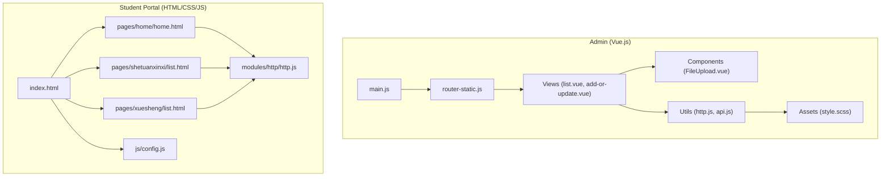
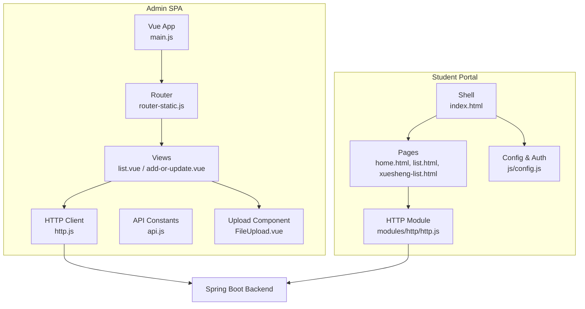
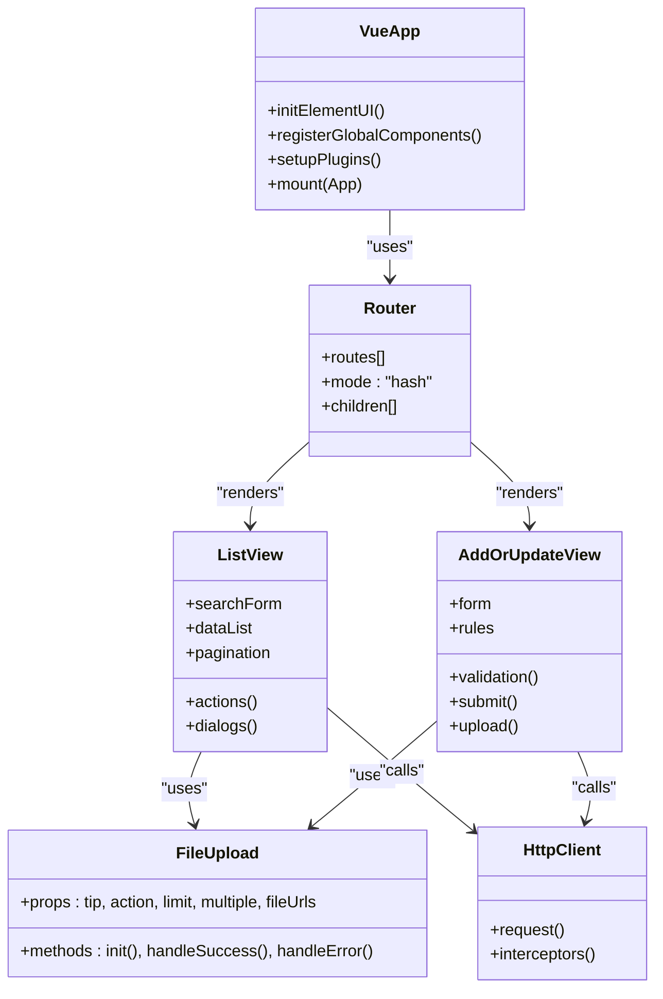
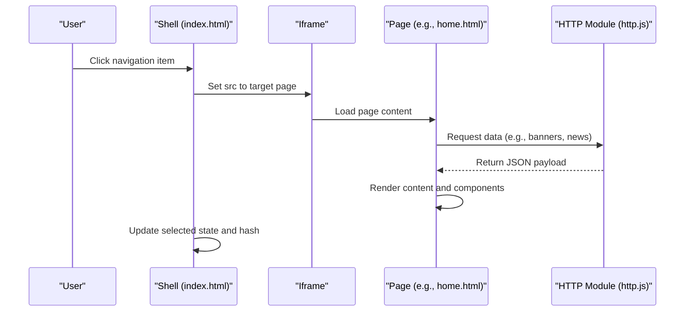
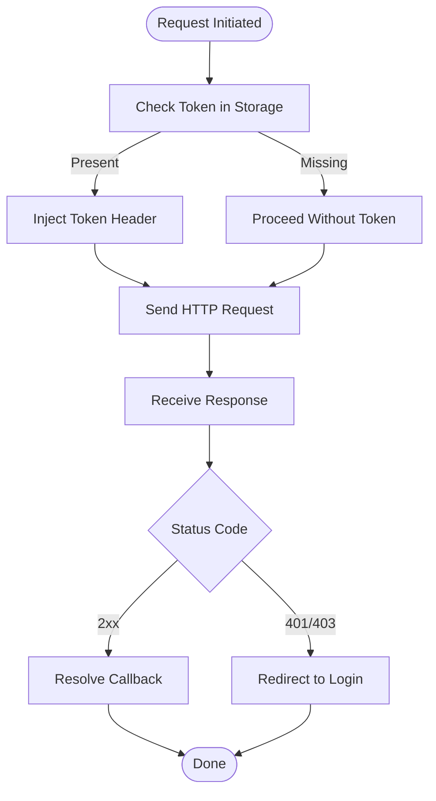
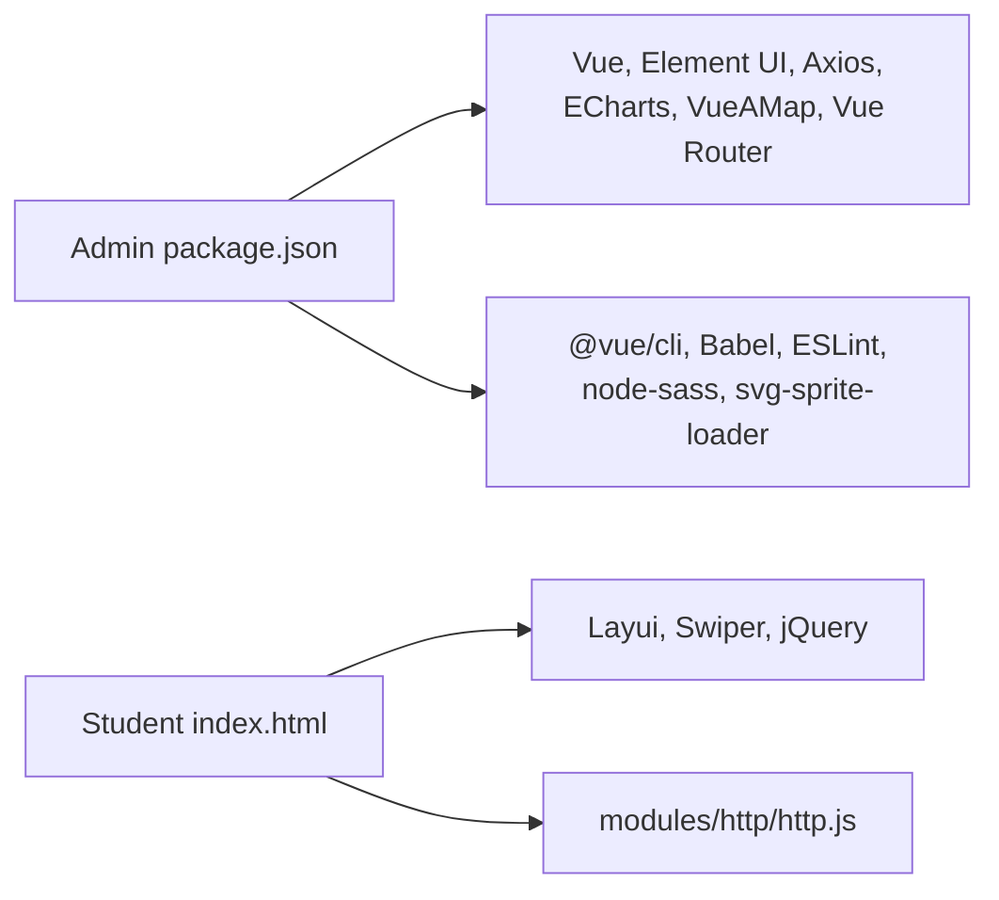

# Frontend Interface

<cite>
**Referenced Files in This Document**
- [package.json](file://src/main/resources/admin/admin/package.json)
- [vue.config.js](file://src/main/resources/admin/admin/vue.config.js)
- [main.js](file://src/main/resources/admin/admin/src/main.js)
- [App.vue](file://src/main/resources/admin/admin/src/App.vue)
- [router-static.js](file://src/main/resources/admin/admin/src/router/router-static.js)
- [style.scss](file://src/main/resources/admin/admin/src/assets/css/style.scss)
- [http.js](file://src/main/resources/admin/admin/src/utils/http.js)
- [api.js](file://src/main/resources/admin/admin/src/utils/api.js)
- [FileUpload.vue](file://src/main/resources/admin/admin/src/components/common/FileUpload.vue)
- [list.vue](file://src/main/resources/admin/admin/src/views/modules/shetuanxinxi/list.vue)
- [add-or-update.vue](file://src/main/resources/admin/admin/src/views/modules/shetuanxinxi/add-or-update.vue)
- [index.html](file://src/main/resources/front/front/index.html)
- [home.html](file://src/main/resources/front/front/pages/home/home.html)
- [list.html](file://src/main/resources/front/front/pages/shetuanxinxi/list.html)
- [xuesheng-list.html](file://src/main/resources/front/front/pages/xuesheng/list.html)
- [http.js](file://src/main/resources/front/front/modules/http/http.js)
- [config.js](file://src/main/resources/front/front/js/config.js)
</cite>

## Table of Contents
1. [Introduction](#introduction)
2. [Project Structure](#project-structure)
3. [Core Components](#core-components)
4. [Architecture Overview](#architecture-overview)
5. [Detailed Component Analysis](#detailed-component-analysis)
6. [Dependency Analysis](#dependency-analysis)
7. [Performance Considerations](#performance-considerations)
8. [Troubleshooting Guide](#troubleshooting-guide)
9. [Conclusion](#conclusion)
10. [Appendices](#appendices)

## Introduction
This document describes the frontend interface architecture of the Student Club Activity Management System. The system features a dual-interface design:
- Admin Panel built with Vue.js and Element UI for administrative tasks, including CRUD operations, form handling, data visualization, and reporting.
- Student Portal built with HTML, CSS, JavaScript, and third-party libraries (Layer, Layui, Swiper) for responsive, user-friendly navigation and interactive elements.

It covers component relationships, state management patterns, API integration, styling architecture, build processes, cross-browser compatibility, performance optimization, and accessibility considerations.

## Project Structure
The frontend is organized into two major parts:
- Admin (Vue.js + Element UI): located under src/main/resources/admin/admin.
- Student Portal (HTML/CSS/JS + Layui/Swiper): located under src/main/resources/front/front.

Key characteristics:
- Admin uses Vue CLI with a development server, proxy configuration, SVG icon loader, and SCSS support.
- Student Portal is a static site served via a simple web server, integrating Layui components and local HTTP utilities.

**Diagram sources**
- [main.js:1-77](file://src/main/resources/admin/admin/src/main.js#L1-L77)
- [router-static.js:1-147](file://src/main/resources/admin/admin/src/router/router-static.js#L1-L147)
- [list.vue:1-706](file://src/main/resources/admin/admin/src/views/modules/shetuanxinxi/list.vue#L1-L706)
- [add-or-update.vue:1-651](file://src/main/resources/admin/admin/src/views/modules/shetuanxinxi/add-or-update.vue#L1-L651)
- [FileUpload.vue:1-138](file://src/main/resources/admin/admin/src/components/common/FileUpload.vue#L1-L138)
- [http.js:1-29](file://src/main/resources/admin/admin/src/utils/http.js#L1-L29)
- [api.js:1-18](file://src/main/resources/admin/admin/src/utils/api.js#L1-L18)
- [style.scss:1-47](file://src/main/resources/admin/admin/src/assets/css/style.scss#L1-L47)
- [index.html:1-856](file://src/main/resources/front/front/index.html#L1-L856)
- [home.html:1-553](file://src/main/resources/front/front/pages/home/home.html#L1-L553)
- [list.html:1-480](file://src/main/resources/front/front/pages/shetuanxinxi/list.html#L1-L480)
- [xuesheng-list.html:1-443](file://src/main/resources/front/front/pages/xuesheng/list.html#L1-L443)
- [http.js:1-146](file://src/main/resources/front/front/modules/http/http.js#L1-L146)
- [config.js:1-167](file://src/main/resources/front/front/js/config.js#L1-L167)

**Section sources**
- [package.json:1-63](file://src/main/resources/admin/admin/package.json#L1-L63)
- [vue.config.js:1-63](file://src/main/resources/admin/admin/vue.config.js#L1-L63)
- [main.js:1-77](file://src/main/resources/admin/admin/src/main.js#L1-L77)
- [router-static.js:1-147](file://src/main/resources/admin/admin/src/router/router-static.js#L1-L147)
- [index.html:1-856](file://src/main/resources/front/front/index.html#L1-L856)

## Core Components
- Admin Vue.js stack:
  - Application bootstrap initializes Element UI, global components, plugins (ECharts, VueAMap), and global utilities.
  - Router defines nested routes for modules and pages.
  - Views encapsulate list and edit forms with Element UI components, pagination, and dialogs.
  - Utilities provide Axios-based HTTP client with interceptors and API constants.
  - Assets define SCSS-based styling for forms, tables, and pagination.

- Student Portal:
  - Single-page application shell with an iframe-based navigation to modular pages.
  - Pages implement list/search/filtering, pagination, and dynamic content loading via a local HTTP module.
  - Configuration script centralizes menu, permissions, and runtime flags.

Key implementation references:
- Admin app initialization and plugins: [main.js:1-77](file://src/main/resources/admin/admin/src/main.js#L1-L77)
- Admin routing: [router-static.js:1-147](file://src/main/resources/admin/admin/src/router/router-static.js#L1-L147)
- List view with Element UI: [list.vue:1-706](file://src/main/resources/admin/admin/src/views/modules/shetuanxinxi/list.vue#L1-L706)
- Edit/add form with validation: [add-or-update.vue:1-651](file://src/main/resources/admin/admin/src/views/modules/shetuanxinxi/add-or-update.vue#L1-L651)
- Upload component: [FileUpload.vue:1-138](file://src/main/resources/admin/admin/src/components/common/FileUpload.vue#L1-L138)
- HTTP client (Axios): [http.js:1-29](file://src/main/resources/admin/admin/src/utils/http.js#L1-L29)
- API constants: [api.js:1-18](file://src/main/resources/admin/admin/src/utils/api.js#L1-L18)
- Admin styles: [style.scss:1-47](file://src/main/resources/admin/admin/src/assets/css/style.scss#L1-L47)
- Student portal shell: [index.html:1-856](file://src/main/resources/front/front/index.html#L1-L856)
- Student HTTP module: [http.js:1-146](file://src/main/resources/front/front/modules/http/http.js#L1-L146)
- Student configuration: [config.js:1-167](file://src/main/resources/front/front/js/config.js#L1-L167)

**Section sources**
- [main.js:1-77](file://src/main/resources/admin/admin/src/main.js#L1-L77)
- [router-static.js:1-147](file://src/main/resources/admin/admin/src/router/router-static.js#L1-L147)
- [list.vue:1-706](file://src/main/resources/admin/admin/src/views/modules/shetuanxinxi/list.vue#L1-L706)
- [add-or-update.vue:1-651](file://src/main/resources/admin/admin/src/views/modules/shetuanxinxi/add-or-update.vue#L1-L651)
- [FileUpload.vue:1-138](file://src/main/resources/admin/admin/src/components/common/FileUpload.vue#L1-L138)
- [http.js:1-29](file://src/main/resources/admin/admin/src/utils/http.js#L1-L29)
- [api.js:1-18](file://src/main/resources/admin/admin/src/utils/api.js#L1-L18)
- [style.scss:1-47](file://src/main/resources/admin/admin/src/assets/css/style.scss#L1-L47)
- [index.html:1-856](file://src/main/resources/front/front/index.html#L1-L856)
- [http.js:1-146](file://src/main/resources/front/front/modules/http/http.js#L1-L146)
- [config.js:1-167](file://src/main/resources/front/front/js/config.js#L1-L167)

## Architecture Overview
The system employs a dual-frontend architecture:
- Admin: SPA built with Vue.js and Element UI. It communicates with backend APIs via Axios with token-based authentication and centralized interceptors. Routing is handled by Vue Router with nested modules.
- Student Portal: Static HTML pages with embedded JavaScript and Layui components. It uses a custom HTTP module to call backend endpoints and manages user sessions and permissions via localStorage.

**Diagram sources**
- [main.js:1-77](file://src/main/resources/admin/admin/src/main.js#L1-L77)
- [router-static.js:1-147](file://src/main/resources/admin/admin/src/router/router-static.js#L1-L147)
- [list.vue:1-706](file://src/main/resources/admin/admin/src/views/modules/shetuanxinxi/list.vue#L1-L706)
- [add-or-update.vue:1-651](file://src/main/resources/admin/admin/src/views/modules/shetuanxinxi/add-or-update.vue#L1-L651)
- [FileUpload.vue:1-138](file://src/main/resources/admin/admin/src/components/common/FileUpload.vue#L1-L138)
- [http.js:1-29](file://src/main/resources/admin/admin/src/utils/http.js#L1-L29)
- [api.js:1-18](file://src/main/resources/admin/admin/src/utils/api.js#L1-L18)
- [index.html:1-856](file://src/main/resources/front/front/index.html#L1-L856)
- [home.html:1-553](file://src/main/resources/front/front/pages/home/home.html#L1-L553)
- [list.html:1-480](file://src/main/resources/front/front/pages/shetuanxinxi/list.html#L1-L480)
- [xuesheng-list.html:1-443](file://src/main/resources/front/front/pages/xuesheng/list.html#L1-L443)
- [http.js:1-146](file://src/main/resources/front/front/modules/http/http.js#L1-L146)
- [config.js:1-167](file://src/main/resources/front/front/js/config.js#L1-L167)

## Detailed Component Analysis

### Admin Vue.js Component Structure
- Application bootstrap:
  - Initializes Element UI globally, registers global components (Breadcrumbs, FileUpload, Editor), sets global utilities ($http, $echarts, $storage, $api, $validate), and configures VueAMap with a configured API key.
  - Mounts the root App component and injects router.

- Router:
  - Hash-mode routing with nested children for module pages (e.g., news, shetuanchengyuan, xuesheng, jiarushetuan, shetuanhuodong, huodongbaoming, discussshetuanxinxi, shetuanxinxi, shezhang, storeup, config, shetuanfenlei).
  - Includes dedicated pages such as login, register, update-password, pay, center, and a 404 fallback.

- List View (Example: shetuanxinxi):
  - Search form with configurable icons, positions, and labels.
  - Toolbar with add, delete, and optional cross-module actions.
  - Data table with sortable columns, index numbering, selection, and action buttons per row.
  - Pagination with customizable layout and page sizes.
  - Dialog for review actions (e.g., approve/reject).
  - Dynamic styling via content configuration (colors, borders, fonts, alignment).
  - Cross-table operations (e.g., adding membership from another table).
  - Uses Element UI components: Form, Input, Button, Table, TableColumn, Pagination, Dialog, Select, and Upload.

- Add/Edit Form:
  - Responsive grid layout with input/select/date/textarea/upload controls.
  - Validation rules for phone/email/number/integers/URL and ID card checks.
  - Read-only fields for info mode and pre-filled values from session.
  - Rich text editor integration for content editing.
  - Upload component for images with preview and token-aware URLs.
  - Dynamic styling for inputs, selects, dates, uploads, textarea, and buttons.

- Global Components:
  - FileUpload: wraps Element Upload with token headers, limit handling, success/error callbacks, and preview dialog.

- Utilities:
  - HTTP client: Axios instance with baseURL, timeout, credentials, and interceptors for token injection and 401 redirection.
  - API constants: centralized endpoint definitions for common operations.

**Diagram sources**
- [main.js:1-77](file://src/main/resources/admin/admin/src/main.js#L1-L77)
- [router-static.js:1-147](file://src/main/resources/admin/admin/src/router/router-static.js#L1-L147)
- [list.vue:1-706](file://src/main/resources/admin/admin/src/views/modules/shetuanxinxi/list.vue#L1-L706)
- [add-or-update.vue:1-651](file://src/main/resources/admin/admin/src/views/modules/shetuanxinxi/add-or-update.vue#L1-L651)
- [FileUpload.vue:1-138](file://src/main/resources/admin/admin/src/components/common/FileUpload.vue#L1-L138)
- [http.js:1-29](file://src/main/resources/admin/admin/src/utils/http.js#L1-L29)

**Section sources**
- [main.js:1-77](file://src/main/resources/admin/admin/src/main.js#L1-L77)
- [router-static.js:1-147](file://src/main/resources/admin/admin/src/router/router-static.js#L1-L147)
- [list.vue:1-706](file://src/main/resources/admin/admin/src/views/modules/shetuanxinxi/list.vue#L1-L706)
- [add-or-update.vue:1-651](file://src/main/resources/admin/admin/src/views/modules/shetuanxinxi/add-or-update.vue#L1-L651)
- [FileUpload.vue:1-138](file://src/main/resources/admin/admin/src/components/common/FileUpload.vue#L1-L138)
- [http.js:1-29](file://src/main/resources/admin/admin/src/utils/http.js#L1-L29)
- [api.js:1-18](file://src/main/resources/admin/admin/src/utils/api.js#L1-L18)

### Student Portal Interface Design
- Shell and Navigation:
  - Top navigation bar with links to home, module pages, personal center, admin link (when applicable), cart, and customer service.
  - User area with notification panel and dropdown menu for profile actions.
  - Central iframe loads module pages dynamically; navigation updates iframe src and URL hash.

- Home Page:
  - Banner carousel powered by Layui carousel and Swiper for dynamic content.
  - Recent activities and recommended items with click-to-detail behavior.
  - Uses HTTP module to fetch configuration images, news, and activity lists.

- List Pages:
  - Category filtering, search inputs, pagination, and item cards with images and metadata.
  - Uses Layui components for forms, pagination, and notifications.
  - Dynamic styling via inline styles and configuration-driven menus.

- Authentication and Permissions:
  - Local storage keys for user identity, roles, and tokens.
  - Permission checks for UI visibility and button availability.
  - Session retrieval to populate user avatar and name.

**Diagram sources**
- [index.html:1-856](file://src/main/resources/front/front/index.html#L1-L856)
- [home.html:1-553](file://src/main/resources/front/front/pages/home/home.html#L1-L553)
- [http.js:1-146](file://src/main/resources/front/front/modules/http/http.js#L1-L146)

**Section sources**
- [index.html:1-856](file://src/main/resources/front/front/index.html#L1-L856)
- [home.html:1-553](file://src/main/resources/front/front/pages/home/home.html#L1-L553)
- [list.html:1-480](file://src/main/resources/front/front/pages/shetuanxinxi/list.html#L1-L480)
- [xuesheng-list.html:1-443](file://src/main/resources/front/front/pages/xuesheng/list.html#L1-L443)
- [http.js:1-146](file://src/main/resources/front/front/modules/http/http.js#L1-L146)
- [config.js:1-167](file://src/main/resources/front/front/js/config.js#L1-L167)

### API Integration Approaches
- Admin:
  - Axios client configured with baseURL pointing to the backend context path and token injection via request headers.
  - Interceptors handle 401 redirects to login.
  - Views call $http with GET/POST methods and route-specific endpoints.

- Student Portal:
  - Custom HTTP module wraps jQuery AJAX with token header injection.
  - Supports form-encoded and JSON payloads.
  - Handles 401/403 redirects to login page.

**Diagram sources**
- [http.js:1-29](file://src/main/resources/admin/admin/src/utils/http.js#L1-L29)
- [http.js:1-146](file://src/main/resources/front/front/modules/http/http.js#L1-L146)

**Section sources**
- [http.js:1-29](file://src/main/resources/admin/admin/src/utils/http.js#L1-L29)
- [http.js:1-146](file://src/main/resources/front/front/modules/http/http.js#L1-L146)

### State Management Patterns
- Admin:
  - Local component state for forms, lists, selections, dialogs, and content configurations.
  - Vuex store not used; state maintained within components and shared via props and refs.

- Student Portal:
  - Minimal reactive state via Vue instances on specific pages (e.g., home).
  - Extensive use of localStorage for user session, role, and navigation persistence.

**Section sources**
- [list.vue:1-706](file://src/main/resources/admin/admin/src/views/modules/shetuanxinxi/list.vue#L1-L706)
- [add-or-update.vue:1-651](file://src/main/resources/admin/admin/src/views/modules/shetuanxinxi/add-or-update.vue#L1-L651)
- [index.html:1-856](file://src/main/resources/front/front/index.html#L1-L856)

### Styling Architecture
- Admin:
  - SCSS-based styles for forms, tables, pagination, and component spacing.
  - Global Element UI theme customization via element-variables.scss and style.scss.
  - Scoped styles in components for upload and editor areas.

- Student Portal:
  - CSS files under front/front/css and xznstatic/css for common, style, and theme.
  - Inline styles on pages for dynamic theming and Swiper/carousel integration.
  - Layui CSS for UI components.

**Section sources**
- [style.scss:1-47](file://src/main/resources/admin/admin/src/assets/css/style.scss#L1-L47)
- [add-or-update.vue:626-651](file://src/main/resources/admin/admin/src/views/modules/shetuanxinxi/add-or-update.vue#L626-L651)
- [home.html:1-553](file://src/main/resources/front/front/pages/home/home.html#L1-L553)
- [list.html:1-480](file://src/main/resources/front/front/pages/shetuanxinxi/list.html#L1-L480)

### Build Processes
- Admin:
  - Vue CLI scripts for serve/build/lint.
  - Proxy configuration to forward API requests to backend.
  - SVG icon loader and SCSS compilation.
  - Public path adjusted for production deployment.

- Student Portal:
  - Static HTML/CSS/JS served directly; no bundler involved.
  - Third-party libraries included via CDN or local assets.

**Section sources**
- [package.json:1-63](file://src/main/resources/admin/admin/package.json#L1-L63)
- [vue.config.js:1-63](file://src/main/resources/admin/admin/vue.config.js#L1-L63)
- [index.html:1-856](file://src/main/resources/front/front/index.html#L1-L856)

## Dependency Analysis
- Admin dependencies include Vue, Element UI, Axios, ECharts, VueAMap, Vue Router, and optional Excel export/printing utilities.
- Dev dependencies include Vue CLI, Babel, ESLint, Sass, and SVG loader.
- Student Portal relies on Layui, Swiper, jQuery, and a custom HTTP module.

**Diagram sources**
- [package.json:1-63](file://src/main/resources/admin/admin/package.json#L1-L63)
- [index.html:1-856](file://src/main/resources/front/front/index.html#L1-L856)

**Section sources**
- [package.json:1-63](file://src/main/resources/admin/admin/package.json#L1-L63)
- [index.html:1-856](file://src/main/resources/front/front/index.html#L1-L856)

## Performance Considerations
- Admin:
  - Lazy-load heavy components where appropriate.
  - Minimize re-renders by optimizing watchers and computed properties.
  - Use virtual scrolling for large tables if needed.
  - Enable production builds and code splitting.

- Student Portal:
  - Defer non-critical JavaScript and lazy-load images.
  - Use CDN-hosted libraries where possible.
  - Optimize carousel and Swiper initialization.

[No sources needed since this section provides general guidance]

## Troubleshooting Guide
- Admin:
  - 401 errors: Verify token presence and interceptor injection; ensure login route is correct.
  - Proxy issues: Confirm vue.config.js proxy target and path rewrite rules.
  - Upload failures: Check FileUpload component headers and backend upload endpoint.

- Student Portal:
  - 401/403: Redirects to login indicate missing or invalid token; check localStorage and HTTP module headers.
  - Navigation not updating: Inspect iframe src updates and hash synchronization logic.

**Section sources**
- [http.js:1-29](file://src/main/resources/admin/admin/src/utils/http.js#L1-L29)
- [vue.config.js:1-63](file://src/main/resources/admin/admin/vue.config.js#L1-L63)
- [FileUpload.vue:1-138](file://src/main/resources/admin/admin/src/components/common/FileUpload.vue#L1-L138)
- [http.js:1-146](file://src/main/resources/front/front/modules/http/http.js#L1-L146)
- [index.html:1-856](file://src/main/resources/front/front/index.html#L1-L856)

## Conclusion
The Student Club Activity Management System’s frontend combines a modern Vue.js admin panel with a robust, static student portal. The admin interface leverages Element UI for consistent UX, structured CRUD operations, and reusable components, while the student portal emphasizes responsiveness and simplicity with Layui and vanilla JS. Both interfaces integrate with a shared backend through token-authenticated HTTP clients, ensuring secure and maintainable interactions.

[No sources needed since this section summarizes without analyzing specific files]

## Appendices
- Cross-browser compatibility:
  - Admin: Vue CLI targets modern browsers; ensure polyfills if targeting older environments.
  - Student Portal: Layui and jQuery are widely compatible; validate carousel and Swiper behavior across browsers.

- Accessibility:
  - Admin: Use semantic Element UI components and ARIA attributes where needed.
  - Student Portal: Ensure proper contrast, keyboard navigation, and screen reader-friendly labels.

[No sources needed since this section provides general guidance]