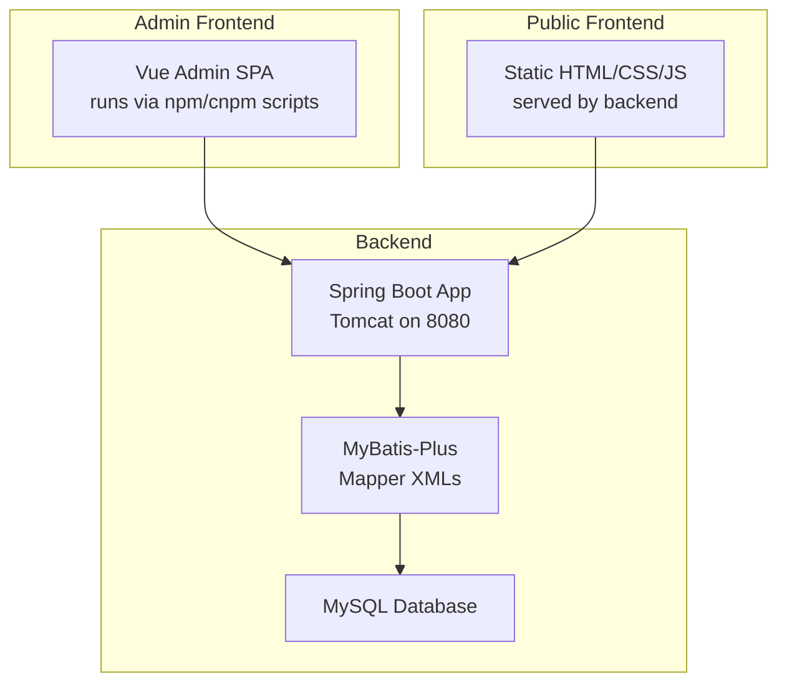
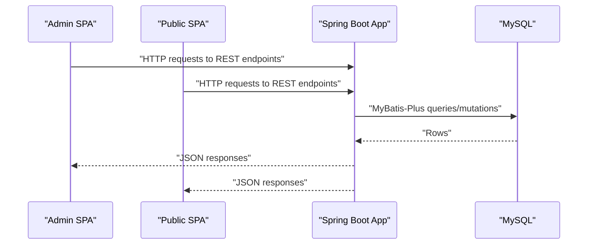
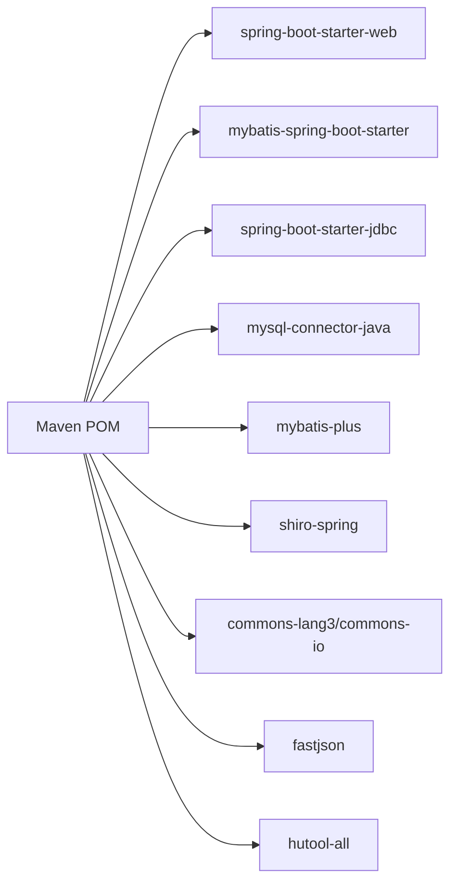

# Getting Started

<cite>
**Referenced Files in This Document**
- [pom.xml](file://pom.xml)
- [application.yml](file://src/main/resources/application.yml)
- [SpringbootSchemaApplication.java](file://src/main/java/com/SpringbootSchemaApplication.java)
- [package.json](file://src/main/resources/admin/admin/package.json)
- [1-install.bat](file://src/main/resources/admin/admin/1-install.bat)
- [2-run.bat](file://src/main/resources/admin/admin/2-run.bat)
- [3-build.bat](file://src/main/resources/admin/admin/3-build.bat)
- [config.js](file://src/main/resources/front/front/js/config.js)
- [database_changes.sql](file://docs1/database_changes.sql)
- [new_database_changes.sql](file://docs1/new_database_changes.sql)
</cite>

## Table of Contents
1. [Introduction](#introduction)
2. [Project Structure](#project-structure)
3. [Core Components](#core-components)
4. [Architecture Overview](#architecture-overview)
5. [Detailed Component Analysis](#detailed-component-analysis)
6. [Dependency Analysis](#dependency-analysis)
7. [Performance Considerations](#performance-considerations)
8. [Troubleshooting Guide](#troubleshooting-guide)
9. [Conclusion](#conclusion)
10. [Appendices](#appendices)

## Introduction
This guide helps you set up and run the Student Club Activity Management System locally. It covers prerequisites, environment setup, database configuration, application properties, dependency management, building and launching the backend and frontend, first-run tasks, and troubleshooting.

## Project Structure
The project is a Spring Boot application with a Java backend and two web frontends:
- Backend: Spring Boot application with MyBatis-Plus, MySQL, and Tomcat embedded server.
- Admin Frontend: Vue 2 admin panel under the admin directory.
- Public Frontend: Static HTML/CSS/JS site under the front directory.

Key runtime characteristics:
- Backend runs on port 8080 with a context path.
- Datasource configured for MySQL with a default username and password.
- Static resources served from classpath and file system locations.
- MyBatis-Plus mapper XMLs and entity scanning configured.

**Diagram sources**
- [application.yml:1-53](file://src/main/resources/application.yml#L1-L53)
- [SpringbootSchemaApplication.java:1-24](file://src/main/java/com/SpringbootSchemaApplication.java#L1-L24)
- [package.json:1-63](file://src/main/resources/admin/admin/package.json#L1-L63)

**Section sources**
- [application.yml:1-53](file://src/main/resources/application.yml#L1-L53)
- [SpringbootSchemaApplication.java:1-24](file://src/main/java/com/SpringbootSchemaApplication.java#L1-L24)

## Core Components
- Backend build and dependencies managed by Maven.
- Application properties define server port, context path, datasource, multipart limits, resource locations, and MyBatis-Plus settings.
- Admin and public frontends use npm-compatible scripts; the project includes Windows batch helpers for cnpm.

Prerequisites summary:
- Java JDK: Java 8 is specified in the Maven properties.
- MySQL: Required for the application’s relational data.
- Node.js: Required to build and run the admin frontend; cnpm is used by included batch scripts.
- Maven: Used to build the Spring Boot backend.

**Section sources**
- [pom.xml:16-20](file://pom.xml#L16-L20)
- [application.yml:1-53](file://src/main/resources/application.yml#L1-L53)
- [package.json:1-63](file://src/main/resources/admin/admin/package.json#L1-L63)
- [1-install.bat:1-1](file://src/main/resources/admin/admin/1-install.bat#L1-L1)
- [2-run.bat:1-1](file://src/main/resources/admin/admin/2-run.bat#L1-L1)
- [3-build.bat:1-2](file://src/main/resources/admin/admin/3-build.bat#L1-L2)

## Architecture Overview
High-level flow:
- Admin users access the admin SPA, which communicates with the backend REST endpoints.
- Public users access the public SPA, also backed by the same backend.
- The backend persists data in MySQL via MyBatis-Plus.

**Diagram sources**
- [application.yml:1-53](file://src/main/resources/application.yml#L1-L53)
- [SpringbootSchemaApplication.java:1-24](file://src/main/java/com/SpringbootSchemaApplication.java#L1-L24)

## Detailed Component Analysis

### Backend Setup (Maven, Java, MySQL)
- Java requirement: Java 8 is specified in Maven properties.
- Build tool: Maven builds the Spring Boot application.
- Database: MySQL is configured in application properties with a default URL, username, and password.
- Resource serving: Static locations include classpath and file roots for admin, front, and uploads.

Steps:
1. Install Java JDK 8.
2. Install Maven.
3. Install MySQL and create a database named according to the configured URL.
4. Configure application properties with your MySQL host, port, database name, username, and password.
5. Build the backend with Maven.
6. Launch the Spring Boot app.

Verification:
- Confirm the server starts on port 8080 with the configured context path.
- Verify static resources are accessible.

**Section sources**
- [pom.xml:16-20](file://pom.xml#L16-L20)
- [application.yml:1-53](file://src/main/resources/application.yml#L1-L53)
- [SpringbootSchemaApplication.java:1-24](file://src/main/java/com/SpringbootSchemaApplication.java#L1-L24)

### Admin Frontend Setup (Node.js, cnpm, Scripts)
- The admin frontend is a Vue 2 application with npm scripts.
- The project includes Windows batch scripts that use cnpm to install dependencies, run the dev server, and build the app.
- Dependencies and devDependencies are declared in the admin package.json.

Steps:
1. Install Node.js.
2. Install cnpm globally or use your preferred package manager compatible with the scripts.
3. Run the install script to fetch dependencies.
4. Run the serve script to start the admin dev server.
5. Optionally run the build script to produce a production bundle.

Notes:
- The scripts reference Vue CLI service commands; ensure Vue CLI is available if you run the scripts directly.
- The admin SPA is intended to be built and served by the backend in production.

**Section sources**
- [package.json:1-63](file://src/main/resources/admin/admin/package.json#L1-L63)
- [1-install.bat:1-1](file://src/main/resources/admin/admin/1-install.bat#L1-L1)
- [2-run.bat:1-1](file://src/main/resources/admin/admin/2-run.bat#L1-L1)
- [3-build.bat:1-2](file://src/main/resources/admin/admin/3-build.bat#L1-L2)

### Public Frontend Configuration
- The public frontend is a static site served by the backend.
- A configuration module defines runtime paths and menu behavior for the public SPA.

Verification:
- Ensure the public SPA routes resolve under the backend context path.

**Section sources**
- [config.js:1-167](file://src/main/resources/front/front/js/config.js#L1-L167)

### Database Initialization
- The project includes SQL scripts for creating additional tables used by the system.
- Apply the scripts to your MySQL database after creating the database.

Recommended order:
1. Create the database.
2. Apply the new database changes script.
3. Apply the additional messages table script.

**Section sources**
- [new_database_changes.sql:1-29](file://docs1/new_database_changes.sql#L1-L29)
- [database_changes.sql:1-18](file://docs1/database_changes.sql#L1-L18)

## Dependency Analysis
Runtime dependencies include Spring Boot Web, MyBatis-Plus, MySQL Connector, Apache Shiro, commons-lang3, commons-io, FastJSON, Hutool, and others.

**Diagram sources**
- [pom.xml:22-113](file://pom.xml#L22-L113)

**Section sources**
- [pom.xml:22-113](file://pom.xml#L22-L113)

## Performance Considerations
- Keep multipart sizes aligned with your deployment needs.
- Tune MyBatis-Plus settings for your workload.
- Ensure MySQL and network latency are acceptable for your environment.

[No sources needed since this section provides general guidance]

## Troubleshooting Guide

Common issues and resolutions:
- Port conflicts (8080): Change the server port in application properties.
- Database connection failures: Verify MySQL is running, credentials match application properties, and the database exists.
- Dependency resolution errors: Ensure Maven and Node/cnpm are installed and accessible; retry dependency installation.
- Admin SPA build/run failures: Confirm cnpm is available and Vue CLI is present; review script outputs for missing packages.

First-run checklist:
- Confirm database creation and script application.
- Set correct datasource credentials.
- Build and run backend with Maven.
- Build admin SPA and confirm it serves under the backend context path.

Verification steps:
- Access the backend health endpoint via the configured context path.
- Load the admin SPA and public SPA under the context path.
- Confirm static resources are served without 404.

**Section sources**
- [application.yml:1-53](file://src/main/resources/application.yml#L1-L53)
- [pom.xml:16-20](file://pom.xml#L16-L20)
- [package.json:1-63](file://src/main/resources/admin/admin/package.json#L1-L63)
- [1-install.bat:1-1](file://src/main/resources/admin/admin/1-install.bat#L1-L1)
- [2-run.bat:1-1](file://src/main/resources/admin/admin/2-run.bat#L1-L1)
- [3-build.bat:1-2](file://src/main/resources/admin/admin/3-build.bat#L1-L2)

## Conclusion
You now have the essentials to install, configure, and run the Student Club Activity Management System. Proceed with database setup, backend build and launch, admin frontend installation and build, and verify both SPAs under the configured context path.

[No sources needed since this section summarizes without analyzing specific files]

## Appendices

### Step-by-step Installation Checklist
- Install Java JDK 8 and Maven.
- Install Node.js and cnpm.
- Install and start MySQL.
- Create the database and apply the SQL scripts.
- Update application properties with your MySQL credentials.
- Build backend with Maven.
- Build admin SPA with cnpm scripts.
- Launch backend and verify endpoints and static resources.

**Section sources**
- [pom.xml:16-20](file://pom.xml#L16-L20)
- [application.yml:1-53](file://src/main/resources/application.yml#L1-L53)
- [package.json:1-63](file://src/main/resources/admin/admin/package.json#L1-L63)
- [new_database_changes.sql:1-29](file://docs1/new_database_changes.sql#L1-L29)
- [database_changes.sql:1-18](file://docs1/database_changes.sql#L1-L18)