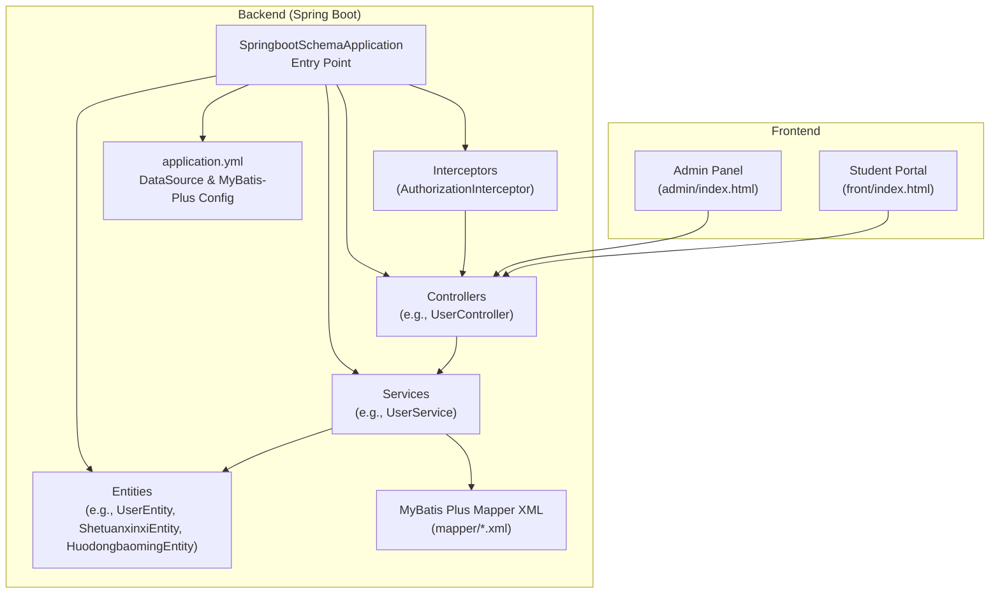
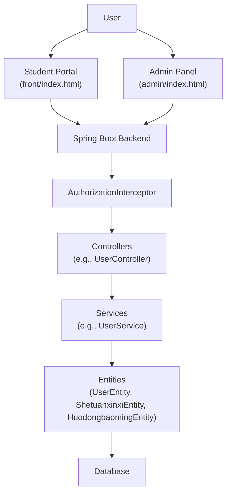
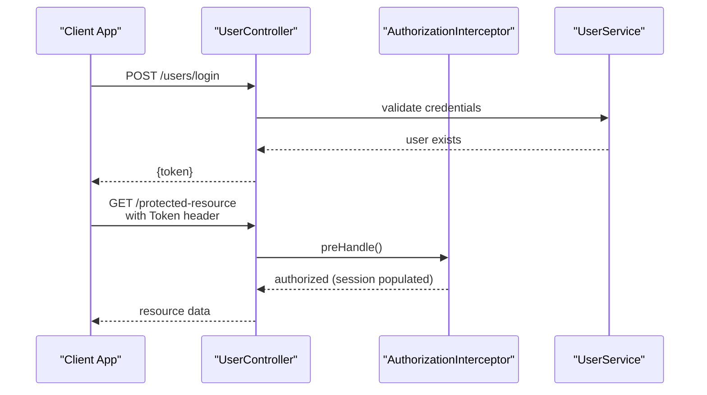
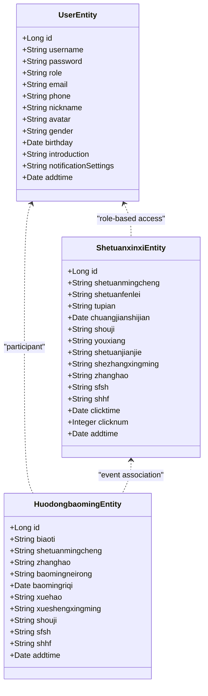
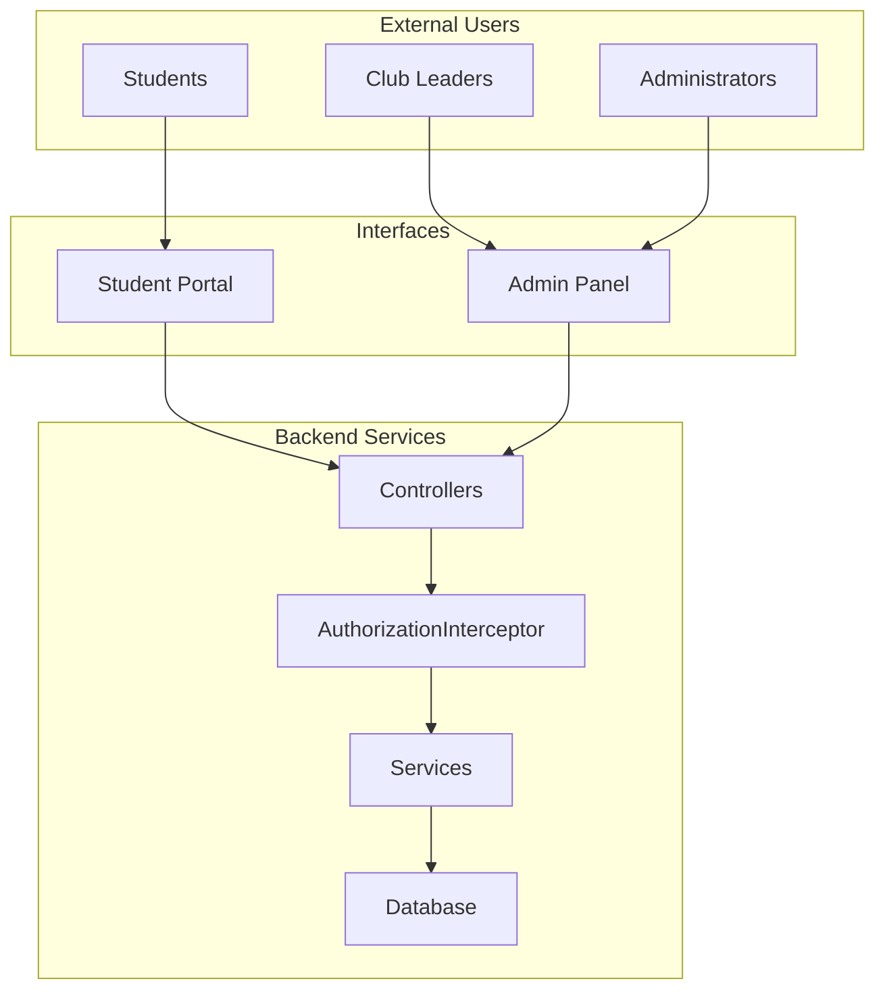
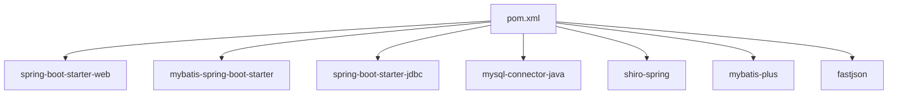

# Project Overview

<cite>
**Referenced Files in This Document**
- [SpringbootSchemaApplication.java](file://src/main/java/com/SpringbootSchemaApplication.java)
- [pom.xml](file://pom.xml)
- [application.yml](file://src/main/resources/application.yml)
- [AuthorizationInterceptor.java](file://src/main/java/com/interceptor/AuthorizationInterceptor.java)
- [UserController.java](file://src/main/java/com/controller/UserController.java)
- [UserEntity.java](file://src/main/java/com/entity/UserEntity.java)
- [ShetuanxinxiEntity.java](file://src/main/java/com/entity/ShetuanxinxiEntity.java)
- [HuodongbaomingEntity.java](file://src/main/java/com/entity/HuodongbaomingEntity.java)
- [UserService.java](file://src/main/java/com/service/UserService.java)
- [IgnoreAuth.java](file://src/main/java/com/annotation/IgnoreAuth.java)
- [LoginUser.java](file://src/main/java/com/annotation/LoginUser.java)
- [APPLoginUser.java](file://src/main/java/com/annotation/APPLoginUser.java)
- [index.html (Admin)](file://src/main/resources/admin/index.html)
- [index.html (Front)](file://src/main/resources/front/index.html)
</cite>

## Table of Contents
1. [Introduction](#introduction)
2. [Project Structure](#project-structure)
3. [Core Components](#core-components)
4. [Architecture Overview](#architecture-overview)
5. [Detailed Component Analysis](#detailed-component-analysis)
6. [Dependency Analysis](#dependency-analysis)
7. [Performance Considerations](#performance-considerations)
8. [Troubleshooting Guide](#troubleshooting-guide)
9. [Conclusion](#conclusion)
10. [Appendices](#appendices)

## Introduction
The Student Club Activity Management System is a centralized platform designed to streamline the management of student organizations and their activities within an educational institution. It supports three primary roles—students, club leaders (shezhang), and administrators—offering distinct capabilities through two frontend interfaces: the student portal and the admin panel. The system enables features such as club browsing, event registration, membership requests, activity tracking, and administrative oversight.

Key objectives:
- Provide a unified student portal for discovering clubs, events, and registering for activities.
- Enable club leaders to manage memberships, publish and review events, and monitor registrations.
- Offer administrators a comprehensive admin panel for content moderation, user management, and system configuration.

Technology foundation:
- Backend built with Spring Boot and MyBatis Plus for robust data persistence and service layer abstraction.
- Frontend split into a student-facing portal and an admin dashboard, implemented with modern web frameworks and libraries.
- Authentication and session management integrated via interceptors and token-based mechanisms.

## Project Structure
The project follows a layered architecture with clear separation between backend services, frontend interfaces, and database configuration. The backend exposes REST endpoints, while the frontend serves static assets and routes for both the student portal and admin panel.

**Diagram sources**
- [SpringbootSchemaApplication.java:10-22](file://src/main/java/com/SpringbootSchemaApplication.java#L10-L22)
- [application.yml:1-53](file://src/main/resources/application.yml#L1-L53)
- [AuthorizationInterceptor.java:28-104](file://src/main/java/com/interceptor/AuthorizationInterceptor.java#L28-L104)
- [UserController.java:38-40](file://src/main/java/com/controller/UserController.java#L38-L40)
- [UserService.java:18-25](file://src/main/java/com/service/UserService.java#L18-L25)
- [UserEntity.java:13-182](file://src/main/java/com/entity/UserEntity.java#L13-L182)
- [ShetuanxinxiEntity.java:31-312](file://src/main/java/com/entity/ShetuanxinxiEntity.java#L31-L312)
- [HuodongbaomingEntity.java:31-257](file://src/main/java/com/entity/HuodongbaomingEntity.java#L31-L257)
- [index.html (Admin)](file://src/main/resources/admin/index.html)
- [index.html (Front)](file://src/main/resources/front/index.html)

**Section sources**
- [SpringbootSchemaApplication.java:10-22](file://src/main/java/com/SpringbootSchemaApplication.java#L10-L22)
- [application.yml:1-53](file://src/main/resources/application.yml#L1-L53)
- [index.html (Admin)](file://src/main/resources/admin/index.html)
- [index.html (Front)](file://src/main/resources/front/index.html)

## Core Components
- Multi-role authentication and session management:
  - Token generation and validation are handled centrally, with interceptors enforcing access control and populating session attributes for role-aware endpoints.
  - Annotations support selective bypass of authentication for public endpoints.
- Student portal:
  - Provides discovery of clubs and events, user registration, and activity participation workflows.
- Admin panel:
  - Offers CRUD operations for entities such as clubs, events, members, and configurations, along with moderation tools.
- Data model:
  - Entities represent core domain objects including users, club information, and event registrations, enabling structured data operations.

Practical examples:
- Multi-role authentication:
  - Login endpoint generates a token for successful authentication; subsequent requests pass the token via headers to access protected endpoints.
- Real-time communication:
  - While the current backend does not expose explicit WebSocket endpoints, the admin panel’s real-time charts and dashboards indicate dynamic UI updates driven by backend data retrieval.
- Activity tracking:
  - Event registration records capture participant details and timestamps, enabling tracking of participation trends and statistics.

**Section sources**
- [AuthorizationInterceptor.java:36-103](file://src/main/java/com/interceptor/AuthorizationInterceptor.java#L36-L103)
- [IgnoreAuth.java](file://src/main/java/com/annotation/IgnoreAuth.java)
- [UserController.java:51-60](file://src/main/java/com/controller/UserController.java#L51-L60)
- [UserEntity.java:13-182](file://src/main/java/com/entity/UserEntity.java#L13-L182)
- [ShetuanxinxiEntity.java:31-312](file://src/main/java/com/entity/ShetuanxinxiEntity.java#L31-L312)
- [HuodongbaomingEntity.java:31-257](file://src/main/java/com/entity/HuodongbaomingEntity.java#L31-L257)

## Architecture Overview
The system employs a client-server architecture with a Spring Boot backend serving REST endpoints and two frontend clients: the student portal and the admin panel. Requests traverse an authorization interceptor for token validation, after which controllers delegate to services backed by MyBatis Plus mappers and database entities.

**Diagram sources**
- [AuthorizationInterceptor.java:36-103](file://src/main/java/com/interceptor/AuthorizationInterceptor.java#L36-L103)
- [UserController.java:38-40](file://src/main/java/com/controller/UserController.java#L38-L40)
- [UserService.java:18-25](file://src/main/java/com/service/UserService.java#L18-L25)
- [UserEntity.java:13-182](file://src/main/java/com/entity/UserEntity.java#L13-L182)
- [ShetuanxinxiEntity.java:31-312](file://src/main/java/com/entity/ShetuanxinxiEntity.java#L31-L312)
- [HuodongbaomingEntity.java:31-257](file://src/main/java/com/entity/HuodongbaomingEntity.java#L31-L257)
- [index.html (Admin)](file://src/main/resources/admin/index.html)
- [index.html (Front)](file://src/main/resources/front/index.html)

## Detailed Component Analysis

### Authentication and Authorization Flow
This sequence illustrates how a user authenticates and accesses protected resources through the backend.

**Diagram sources**
- [UserController.java:51-60](file://src/main/java/com/controller/UserController.java#L51-L60)
- [AuthorizationInterceptor.java:36-103](file://src/main/java/com/interceptor/AuthorizationInterceptor.java#L36-L103)
- [UserService.java:18-25](file://src/main/java/com/service/UserService.java#L18-L25)

**Section sources**
- [AuthorizationInterceptor.java:36-103](file://src/main/java/com/interceptor/AuthorizationInterceptor.java#L36-L103)
- [UserController.java:51-60](file://src/main/java/com/controller/UserController.java#L51-L60)
- [IgnoreAuth.java](file://src/main/java/com/annotation/IgnoreAuth.java)

### Data Model Overview
The following class diagram highlights key entities and their relationships, focusing on users, club information, and event registrations.

**Diagram sources**
- [UserEntity.java:13-182](file://src/main/java/com/entity/UserEntity.java#L13-L182)
- [ShetuanxinxiEntity.java:31-312](file://src/main/java/com/entity/ShetuanxinxiEntity.java#L31-L312)
- [HuodongbaomingEntity.java:31-257](file://src/main/java/com/entity/HuodongbaomingEntity.java#L31-L257)

**Section sources**
- [UserEntity.java:13-182](file://src/main/java/com/entity/UserEntity.java#L13-L182)
- [ShetuanxinxiEntity.java:31-312](file://src/main/java/com/entity/ShetuanxinxiEntity.java#L31-L312)
- [HuodongbaomingEntity.java:31-257](file://src/main/java/com/entity/HuodongbaomingEntity.java#L31-L257)

### System Context Diagram
This diagram shows how the student portal and admin panel interact with backend services and the database.

**Diagram sources**
- [AuthorizationInterceptor.java:36-103](file://src/main/java/com/interceptor/AuthorizationInterceptor.java#L36-L103)
- [UserController.java:38-40](file://src/main/java/com/controller/UserController.java#L38-L40)
- [index.html (Admin)](file://src/main/resources/admin/index.html)
- [index.html (Front)](file://src/main/resources/front/index.html)

## Dependency Analysis
The backend leverages Spring Boot and MyBatis Plus for rapid development and efficient data access. Maven coordinates define dependencies for web, JDBC, MySQL connector, Shiro for security, and JSON processing.

**Diagram sources**
- [pom.xml:22-113](file://pom.xml#L22-L113)

**Section sources**
- [pom.xml:22-113](file://pom.xml#L22-L113)

## Performance Considerations
- Token-based authentication reduces repeated credential checks and centralizes authorization logic.
- MyBatis Plus configuration emphasizes camelCase mapping and logical deletion, improving query clarity and data lifecycle management.
- Static resource serving is configured to serve frontend assets efficiently from classpath and file locations.

[No sources needed since this section provides general guidance]

## Troubleshooting Guide
Common issues and resolutions:
- Authentication failures:
  - Verify token presence in headers and ensure the interceptor is configured to allow public endpoints marked with the ignore-auth annotation.
- Session attributes not populated:
  - Confirm token validation succeeds and session attributes are set by the interceptor before controller execution.
- CORS errors:
  - Review interceptor headers for Access-Control-Allow-Origin and related CORS headers to permit cross-origin requests from frontend origins.

**Section sources**
- [AuthorizationInterceptor.java:36-103](file://src/main/java/com/interceptor/AuthorizationInterceptor.java#L36-L103)
- [IgnoreAuth.java](file://src/main/java/com/annotation/IgnoreAuth.java)

## Conclusion
The Student Club Activity Management System integrates a Spring Boot backend with Vue.js-based frontend interfaces to deliver a cohesive platform for students, club leaders, and administrators. Its modular design, token-based authentication, and structured data model enable scalable management of club activities and memberships. The system’s architecture supports future enhancements such as real-time communication channels and advanced analytics.

[No sources needed since this section summarizes without analyzing specific files]

## Appendices
- Target audience:
  - Students: Discover clubs, browse events, and participate via the student portal.
  - Club leaders: Manage memberships, publish events, and review registrations via the admin panel.
  - Administrators: Oversee content, moderate activities, and maintain system configuration.

[No sources needed since this section provides general guidance]