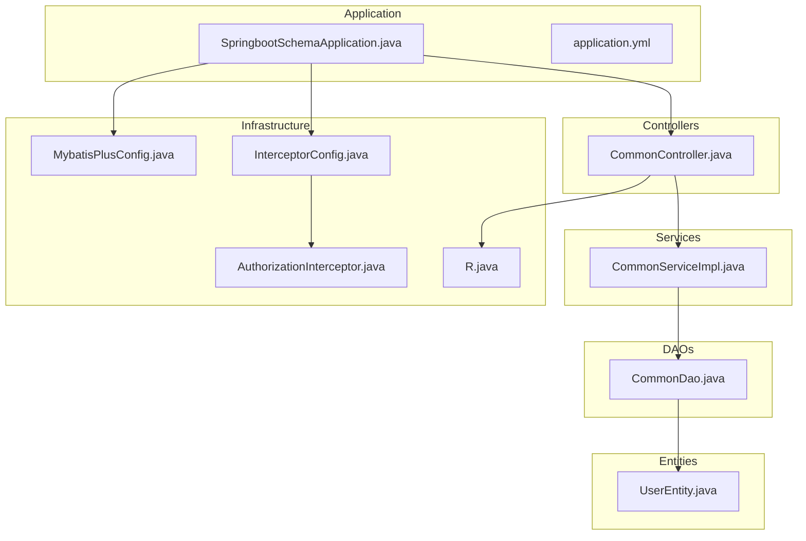
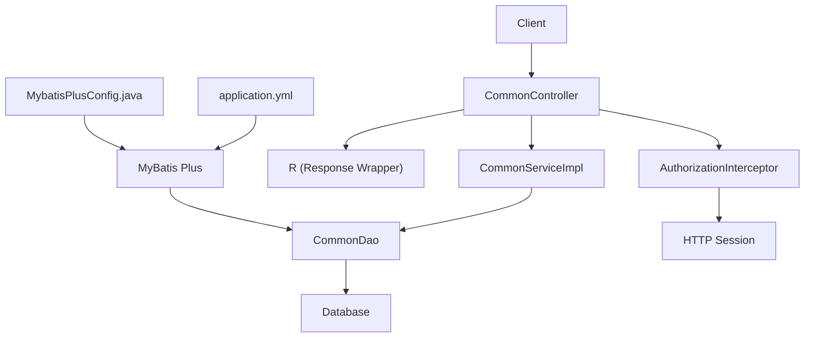
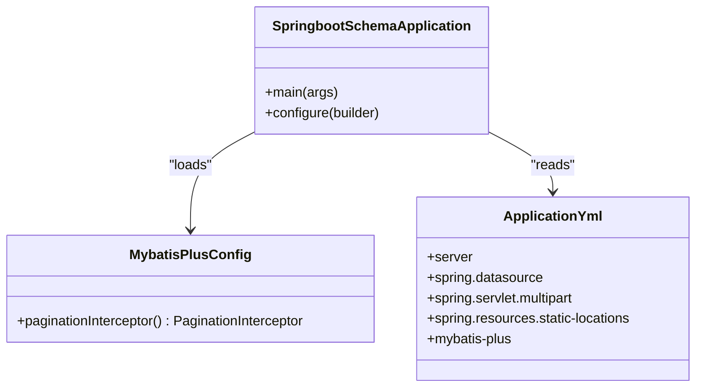
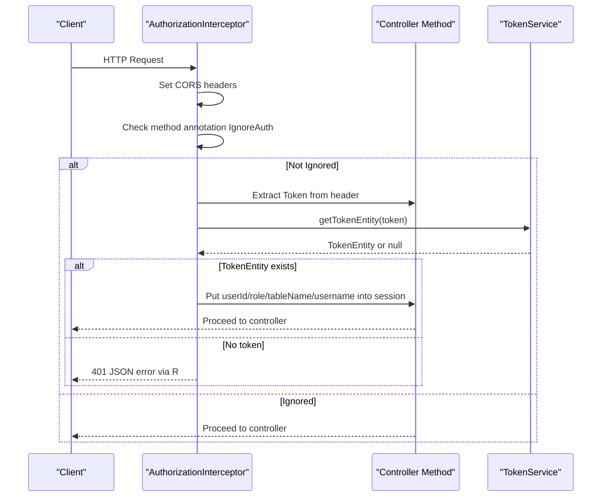
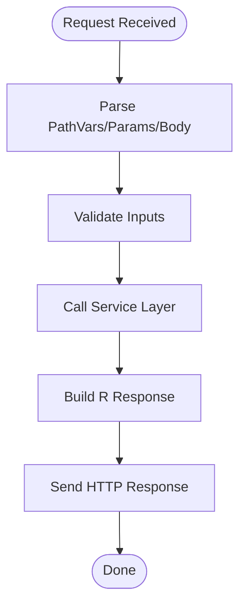
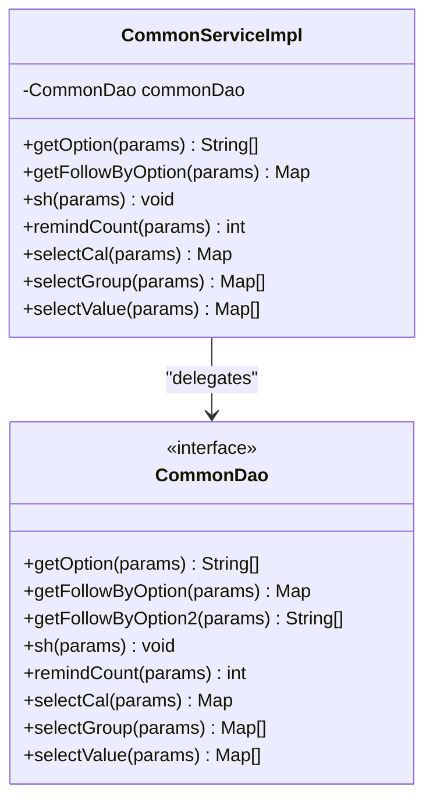
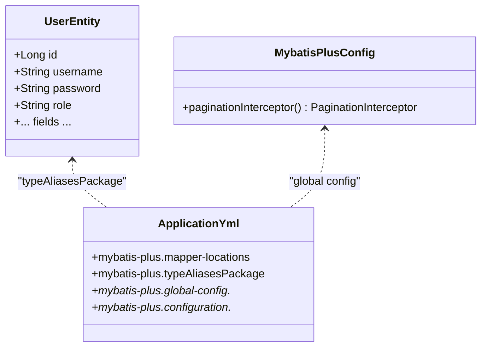
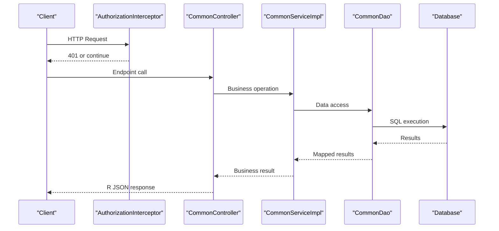
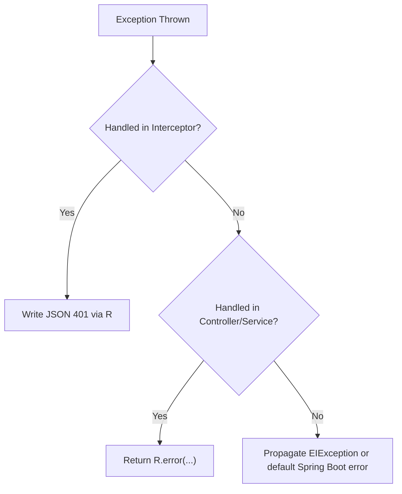
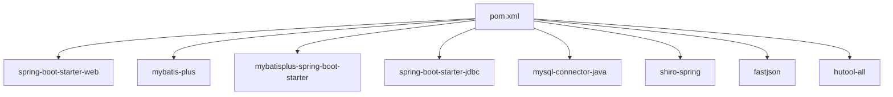

# Backend Architecture

<cite>
**Referenced Files in This Document**
- [SpringbootSchemaApplication.java](file://src/main/java/com/SpringbootSchemaApplication.java)
- [application.yml](file://src/main/resources/application.yml)
- [MybatisPlusConfig.java](file://src/main/java/com/config/MybatisPlusConfig.java)
- [InterceptorConfig.java](file://src/main/java/com/config/InterceptorConfig.java)
- [AuthorizationInterceptor.java](file://src/main/java/com/interceptor/AuthorizationInterceptor.java)
- [CommonController.java](file://src/main/java/com/controller/CommonController.java)
- [CommonServiceImpl.java](file://src/main/java/com/service/impl/CommonServiceImpl.java)
- [CommonDao.java](file://src/main/java/com/dao/CommonDao.java)
- [R.java](file://src/main/java/com/utils/R.java)
- [UserEntity.java](file://src/main/java/com/entity/UserEntity.java)
- [EIException.java](file://src/main/java/com/entity/EIException.java)
- [IgnoreAuth.java](file://src/main/java/com/annotation/IgnoreAuth.java)
- [LoginUser.java](file://src/main/java/com/annotation/LoginUser.java)
- [pom.xml](file://pom.xml)
</cite>

## Table of Contents
1. [Introduction](#introduction)
2. [Project Structure](#project-structure)
3. [Core Components](#core-components)
4. [Architecture Overview](#architecture-overview)
5. [Detailed Component Analysis](#detailed-component-analysis)
6. [Dependency Analysis](#dependency-analysis)
7. [Performance Considerations](#performance-considerations)
8. [Troubleshooting Guide](#troubleshooting-guide)
9. [Conclusion](#conclusion)

## Introduction
This document describes the backend architecture of a Spring Boot application implementing a layered architecture with clear separation between controllers, services, and DAO layers. It explains the Spring Boot application structure, component scanning configuration, and MVC pattern usage. It also documents MyBatis Plus integration for data access, including entity mapping and query optimization, and details the service layer design with business logic encapsulation and dependency injection. The controller layer RESTful API design is documented with proper HTTP methods and response handling. Configuration management for interceptors, CORS, and static resources is addressed, along with component relationships, data flow patterns, and error handling strategies.

## Project Structure
The backend follows a conventional Maven layout with Java source under src/main/java and resources under src/main/resources. The application is organized by layers:
- Application entrypoint and configuration
- Controllers exposing REST endpoints
- Services encapsulating business logic
- DAOs for data access
- Entities for MyBatis Plus mapping
- Utilities and annotations for cross-cutting concerns
- MyBatis Plus XML mapper files

**Diagram sources**
- [SpringbootSchemaApplication.java:10-22](file://src/main/java/com/SpringbootSchemaApplication.java#L10-L22)
- [application.yml:1-53](file://src/main/resources/application.yml#L1-L53)
- [CommonController.java:40-47](file://src/main/java/com/controller/CommonController.java#L40-L47)
- [CommonServiceImpl.java:18-22](file://src/main/java/com/service/impl/CommonServiceImpl.java#L18-L22)
- [CommonDao.java:10-26](file://src/main/java/com/dao/CommonDao.java#L10-L26)
- [UserEntity.java:13-182](file://src/main/java/com/entity/UserEntity.java#L13-L182)
- [MybatisPlusConfig.java:13-24](file://src/main/java/com/config/MybatisPlusConfig.java#L13-L24)
- [InterceptorConfig.java:11-41](file://src/main/java/com/config/InterceptorConfig.java#L11-L41)
- [AuthorizationInterceptor.java:28-104](file://src/main/java/com/interceptor/AuthorizationInterceptor.java#L28-L104)
- [R.java:9-51](file://src/main/java/com/utils/R.java#L9-L51)

**Section sources**
- [SpringbootSchemaApplication.java:10-22](file://src/main/java/com/SpringbootSchemaApplication.java#L10-L22)
- [application.yml:1-53](file://src/main/resources/application.yml#L1-L53)

## Core Components
- Application entrypoint: Declares component scanning for MyBatis mapper packages and enables scheduling.
- Configuration: Database, multipart uploads, static resource locations, and MyBatis Plus settings.
- MVC configuration: Global interceptor registration and static resource handlers.
- Interceptor: Token-based authorization with CORS support and optional method bypass via annotations.
- Controllers: REST endpoints exposing business capabilities with standardized JSON responses.
- Services: Business logic encapsulation delegating to DAOs.
- DAOs: Data access contracts for MyBatis Plus.
- Entities: POJOs mapped to database tables with MyBatis Plus annotations.
- Utilities: Standardized response wrapper and custom exceptions.

**Section sources**
- [SpringbootSchemaApplication.java:10-22](file://src/main/java/com/SpringbootSchemaApplication.java#L10-L22)
- [application.yml:9-53](file://src/main/resources/application.yml#L9-L53)
- [InterceptorConfig.java:11-41](file://src/main/java/com/config/InterceptorConfig.java#L11-L41)
- [AuthorizationInterceptor.java:28-104](file://src/main/java/com/interceptor/AuthorizationInterceptor.java#L28-L104)
- [CommonController.java:40-257](file://src/main/java/com/controller/CommonController.java#L40-L257)
- [CommonServiceImpl.java:18-59](file://src/main/java/com/service/impl/CommonServiceImpl.java#L18-L59)
- [CommonDao.java:10-26](file://src/main/java/com/dao/CommonDao.java#L10-L26)
- [UserEntity.java:13-182](file://src/main/java/com/entity/UserEntity.java#L13-L182)
- [R.java:9-51](file://src/main/java/com/utils/R.java#L9-L51)

## Architecture Overview
The system follows a classic layered architecture:
- Presentation Layer: Controllers expose REST endpoints.
- Application Layer: Services orchestrate business operations.
- Persistence Layer: DAOs abstract data access via MyBatis Plus.
- Infrastructure: Configuration for MyBatis Plus, interceptors, and static resources.
- Data Model: Entities define table mappings and identifiers.

**Diagram sources**
- [CommonController.java:40-257](file://src/main/java/com/controller/CommonController.java#L40-L257)
- [CommonServiceImpl.java:18-59](file://src/main/java/com/service/impl/CommonServiceImpl.java#L18-L59)
- [CommonDao.java:10-26](file://src/main/java/com/dao/CommonDao.java#L10-L26)
- [R.java:9-51](file://src/main/java/com/utils/R.java#L9-L51)
- [AuthorizationInterceptor.java:28-104](file://src/main/java/com/interceptor/AuthorizationInterceptor.java#L28-L104)
- [application.yml:29-53](file://src/main/resources/application.yml#L29-L53)
- [MybatisPlusConfig.java:13-24](file://src/main/java/com/config/MybatisPlusConfig.java#L13-L24)

## Detailed Component Analysis

### Application Entry and Configuration
- Application class enables MyBatis mapper scanning and scheduling.
- application.yml defines server, datasource, multipart, static locations, and MyBatis Plus global settings including ID strategy, field strategy, underscore-to-camel case, cache, JDBC type for null, and logical delete values.
- MyBatis Plus configuration registers pagination interceptor.

**Diagram sources**
- [SpringbootSchemaApplication.java:10-22](file://src/main/java/com/SpringbootSchemaApplication.java#L10-L22)
- [MybatisPlusConfig.java:13-24](file://src/main/java/com/config/MybatisPlusConfig.java#L13-L24)
- [application.yml:1-53](file://src/main/resources/application.yml#L1-L53)

**Section sources**
- [SpringbootSchemaApplication.java:10-22](file://src/main/java/com/SpringbootSchemaApplication.java#L10-L22)
- [application.yml:1-53](file://src/main/resources/application.yml#L1-L53)
- [MybatisPlusConfig.java:13-24](file://src/main/java/com/config/MybatisPlusConfig.java#L13-L24)

### MVC and Interceptors
- Interceptor configuration registers a global authorization interceptor that:
  - Supports CORS headers and preflight handling.
  - Skips token checks for methods annotated with IgnoreAuth.
  - Validates tokens via TokenService and populates session attributes.
- Static resource handlers serve admin, front, and upload resources.

**Diagram sources**
- [AuthorizationInterceptor.java:36-103](file://src/main/java/com/interceptor/AuthorizationInterceptor.java#L36-L103)
- [IgnoreAuth.java:8-13](file://src/main/java/com/annotation/IgnoreAuth.java#L8-L13)

**Section sources**
- [InterceptorConfig.java:11-41](file://src/main/java/com/config/InterceptorConfig.java#L11-L41)
- [AuthorizationInterceptor.java:28-104](file://src/main/java/com/interceptor/AuthorizationInterceptor.java#L28-L104)
- [IgnoreAuth.java:8-13](file://src/main/java/com/annotation/IgnoreAuth.java#L8-L13)

### Controller Layer: RESTful API Design
- Controllers use @RestController and standard HTTP methods to expose endpoints.
- Responses are wrapped using R to ensure consistent JSON structure with code/msg/data fields.
- Example endpoints include location lookup, face matching, option/follow queries, status change, reminders, aggregation (sum/group/value).

**Diagram sources**
- [CommonController.java:52-254](file://src/main/java/com/controller/CommonController.java#L52-L254)
- [R.java:9-51](file://src/main/java/com/utils/R.java#L9-L51)

**Section sources**
- [CommonController.java:40-257](file://src/main/java/com/controller/CommonController.java#L40-L257)
- [R.java:9-51](file://src/main/java/com/utils/R.java#L9-L51)

### Service Layer: Business Logic Encapsulation
- Services implement business operations and delegate to DAOs.
- Dependency injection is used to wire DAOs into services.
- Common service demonstrates generic operations like option lists, follow-up records, reminders, and aggregations.

**Diagram sources**
- [CommonServiceImpl.java:18-59](file://src/main/java/com/service/impl/CommonServiceImpl.java#L18-L59)
- [CommonDao.java:10-26](file://src/main/java/com/dao/CommonDao.java#L10-L26)

**Section sources**
- [CommonServiceImpl.java:18-59](file://src/main/java/com/service/impl/CommonServiceImpl.java#L18-L59)
- [CommonDao.java:10-26](file://src/main/java/com/dao/CommonDao.java#L10-L26)

### DAO Layer and MyBatis Plus Integration
- DAOs define method contracts for data access.
- MyBatis Plus configuration:
  - Pagination interceptor for paged queries.
  - Mapper locations and type aliases package.
  - Global settings for ID strategy, field strategy, underscore-to-camel case, cache, JDBC type for null, and logical delete.
- Entities use annotations to map to tables and define primary keys.

**Diagram sources**
- [UserEntity.java:13-182](file://src/main/java/com/entity/UserEntity.java#L13-L182)
- [MybatisPlusConfig.java:13-24](file://src/main/java/com/config/MybatisPlusConfig.java#L13-L24)
- [application.yml:29-53](file://src/main/resources/application.yml#L29-L53)

**Section sources**
- [CommonDao.java:10-26](file://src/main/java/com/dao/CommonDao.java#L10-L26)
- [MybatisPlusConfig.java:13-24](file://src/main/java/com/config/MybatisPlusConfig.java#L13-L24)
- [application.yml:29-53](file://src/main/resources/application.yml#L29-L53)
- [UserEntity.java:13-182](file://src/main/java/com/entity/UserEntity.java#L13-L182)

### Data Flow Patterns
- Request flow: Client -> Interceptor (CORS + Auth) -> Controller -> Service -> DAO -> Database.
- Response flow: DAO -> Service -> Controller -> R wrapper -> Client.
- Aggregation endpoints demonstrate reusable patterns for sum, group, and value queries.

**Diagram sources**
- [AuthorizationInterceptor.java:36-103](file://src/main/java/com/interceptor/AuthorizationInterceptor.java#L36-L103)
- [CommonController.java:52-254](file://src/main/java/com/controller/CommonController.java#L52-L254)
- [CommonServiceImpl.java:24-57](file://src/main/java/com/service/impl/CommonServiceImpl.java#L24-L57)
- [CommonDao.java:11-25](file://src/main/java/com/dao/CommonDao.java#L11-L25)
- [R.java:9-51](file://src/main/java/com/utils/R.java#L9-L51)

### Error Handling Strategies
- Centralized response wrapper R provides consistent error and success payloads.
- Interceptor writes JSON error response and returns false for unauthorized requests.
- Custom exception EIException supports custom messages and codes for broader error propagation scenarios.

**Diagram sources**
- [AuthorizationInterceptor.java:89-102](file://src/main/java/com/interceptor/AuthorizationInterceptor.java#L89-L102)
- [R.java:16-29](file://src/main/java/com/utils/R.java#L16-L29)
- [EIException.java:7-52](file://src/main/java/com/entity/EIException.java#L7-L52)

**Section sources**
- [R.java:9-51](file://src/main/java/com/utils/R.java#L9-L51)
- [AuthorizationInterceptor.java:89-102](file://src/main/java/com/interceptor/AuthorizationInterceptor.java#L89-L102)
- [EIException.java:7-52](file://src/main/java/com/entity/EIException.java#L7-L52)

## Dependency Analysis
External dependencies include Spring Boot Web, MyBatis Plus, MySQL connector, Apache Shiro, FastJSON, and Hutool. These provide web MVC, persistence, authentication, JSON processing, and utility functions.

**Diagram sources**
- [pom.xml:22-113](file://pom.xml#L22-L113)

**Section sources**
- [pom.xml:22-113](file://pom.xml#L22-L113)

## Performance Considerations
- Pagination: The pagination interceptor improves query performance for large datasets.
- Field strategy: Non-null field strategy reduces unnecessary updates.
- Underscore-to-camel case: Improves readability and reduces mapping overhead.
- Cache disabled globally: Prevents stale data in distributed environments; enable cautiously with cache invalidation.
- Logical delete: Reduces full-table scans for deleted rows and maintains audit trails.

[No sources needed since this section provides general guidance]

## Troubleshooting Guide
- Unauthorized access: Verify token presence and validity; check interceptor logs and CORS headers.
- Static resources not served: Confirm resource handler mappings for admin, front, and upload paths.
- MyBatis Plus errors: Ensure mapper locations and type aliases package match entity packages; verify logical delete configuration.
- Response format issues: Confirm all endpoints return R instances for consistent JSON structure.

**Section sources**
- [AuthorizationInterceptor.java:36-103](file://src/main/java/com/interceptor/AuthorizationInterceptor.java#L36-L103)
- [InterceptorConfig.java:29-40](file://src/main/java/com/config/InterceptorConfig.java#L29-L40)
- [application.yml:29-53](file://src/main/resources/application.yml#L29-L53)
- [R.java:9-51](file://src/main/java/com/utils/R.java#L9-L51)

## Conclusion
The backend employs a clean layered architecture with Spring Boot and MyBatis Plus. Controllers expose REST endpoints with consistent response formatting, services encapsulate business logic, and DAOs abstract data access. Global interceptors enforce authorization and CORS, while configuration files define datasource, static resources, and MyBatis Plus behavior. This structure promotes maintainability, scalability, and clear separation of concerns.