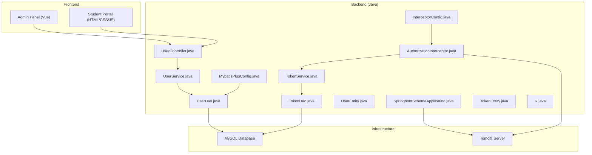
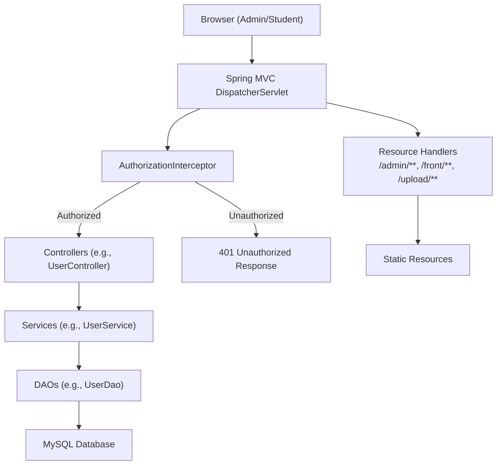
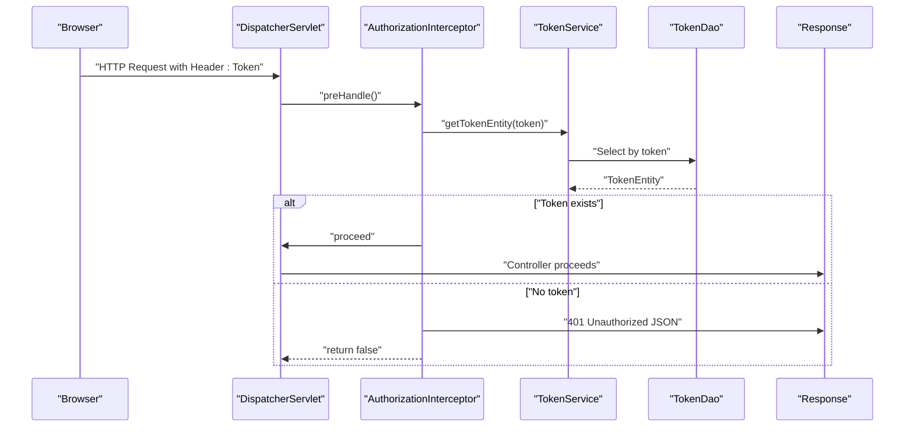
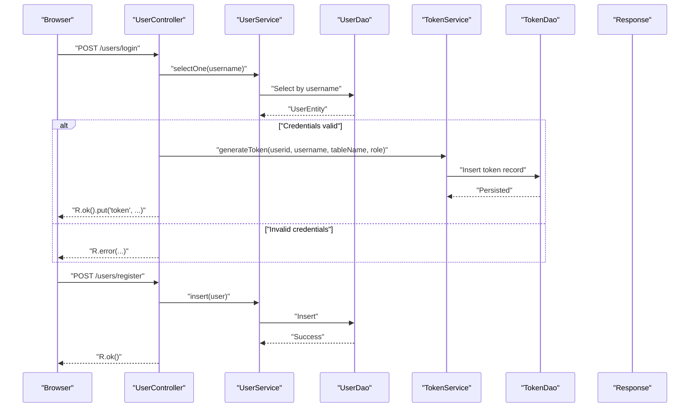
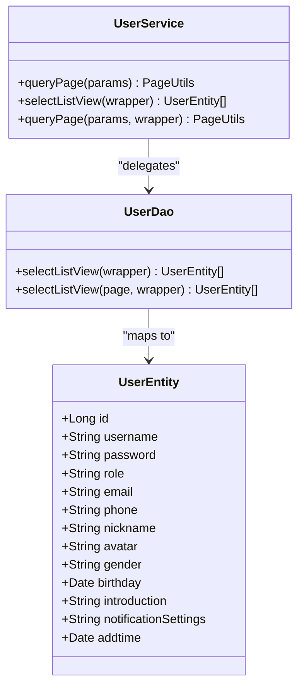
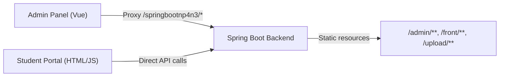
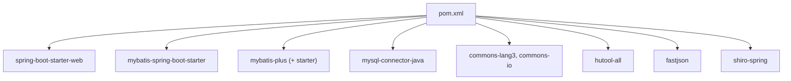

# System Architecture

<cite>
**Referenced Files in This Document**
- [SpringbootSchemaApplication.java](file://src/main/java/com/SpringbootSchemaApplication.java)
- [pom.xml](file://pom.xml)
- [application.yml](file://src/main/resources/application.yml)
- [MybatisPlusConfig.java](file://src/main/java/com/config/MybatisPlusConfig.java)
- [InterceptorConfig.java](file://src/main/java/com/config/InterceptorConfig.java)
- [AuthorizationInterceptor.java](file://src/main/java/com/interceptor/AuthorizationInterceptor.java)
- [UserController.java](file://src/main/java/com/controller/UserController.java)
- [UserService.java](file://src/main/java/com/service/UserService.java)
- [UserDao.java](file://src/main/java/com/dao/UserDao.java)
- [UserEntity.java](file://src/main/java/com/entity/UserEntity.java)
- [TokenService.java](file://src/main/java/com/service/TokenService.java)
- [TokenDao.java](file://src/main/java/com/dao/TokenDao.java)
- [TokenEntity.java](file://src/main/java/com/entity/TokenEntity.java)
- [R.java](file://src/main/java/com/utils/R.java)
- [vue.config.js](file://src/main/resources/admin/admin/vue.config.js)
- [config.js](file://src/main/resources/front/front/js/config.js)
</cite>

## Table of Contents
1. [Introduction](#introduction)
2. [Project Structure](#project-structure)
3. [Core Components](#core-components)
4. [Architecture Overview](#architecture-overview)
5. [Detailed Component Analysis](#detailed-component-analysis)
6. [Dependency Analysis](#dependency-analysis)
7. [Performance Considerations](#performance-considerations)
8. [Troubleshooting Guide](#troubleshooting-guide)
9. [Conclusion](#conclusion)
10. [Appendices](#appendices)

## Introduction
This document describes the architecture of the Student Club Activity Management System built with Spring Boot MVC and a layered architecture pattern. The system supports three primary user roles: administrators, club leaders (shezhang), and students (xuesheng). It exposes RESTful APIs consumed by two frontend applications: an admin panel built with Vue.js and an interactive student portal. Authentication is handled via a custom interceptor that validates a Token header against a token store, enabling role-based access control. Data persistence leverages MyBatis Plus with MySQL, while static resources and file uploads are served from the backend. Cross-origin and CORS handling are configured centrally, and the system includes scheduling capabilities.

## Project Structure
The project follows a classic Maven layout with Java source under src/main/java and resources under src/main/resources. The backend is organized by layers:
- com.controller: REST endpoints grouped by domain (e.g., UserController, Shetuan* controllers)
- com.service: service interfaces and implementations
- com.dao: MyBatis mapper interfaces
- com.entity: MyBatis entity POJOs
- com.config: Spring configuration (interceptors, MyBatis Plus)
- com.interceptor: Spring MVC interceptors
- com.utils: shared utilities (response wrapper R, validators, etc.)
- Frontend assets:
  - Admin panel: src/main/resources/admin/admin
  - Student portal: src/main/resources/front/front

**Diagram sources**
- [SpringbootSchemaApplication.java:10-22](file://src/main/java/com/SpringbootSchemaApplication.java#L10-L22)
- [MybatisPlusConfig.java:14-22](file://src/main/java/com/config/MybatisPlusConfig.java#L14-L22)
- [InterceptorConfig.java:12-41](file://src/main/java/com/config/InterceptorConfig.java#L12-L41)
- [AuthorizationInterceptor.java:29-103](file://src/main/java/com/interceptor/AuthorizationInterceptor.java#L29-L103)
- [UserController.java:38-60](file://src/main/java/com/controller/UserController.java#L38-L60)
- [UserService.java:18-25](file://src/main/java/com/service/UserService.java#L18-L25)
- [UserDao.java:16-22](file://src/main/java/com/dao/UserDao.java#L16-L22)
- [UserEntity.java:13-182](file://src/main/java/com/entity/UserEntity.java#L13-L182)
- [TokenService.java:16-26](file://src/main/java/com/service/TokenService.java#L16-L26)
- [TokenDao.java:16-22](file://src/main/java/com/dao/TokenDao.java#L16-L22)
- [TokenEntity.java:13-133](file://src/main/java/com/entity/TokenEntity.java#L13-L133)
- [R.java:9-51](file://src/main/java/com/utils/R.java#L9-L51)

**Section sources**
- [SpringbootSchemaApplication.java:10-22](file://src/main/java/com/SpringbootSchemaApplication.java#L10-L22)
- [application.yml:1-53](file://src/main/resources/application.yml#L1-L53)
- [pom.xml:22-113](file://pom.xml#L22-L113)

## Core Components
- Application bootstrap and scanning:
  - SpringBootApplication with MapperScan targeting com.dao and scheduling enabled.
- Layered architecture:
  - Controllers expose REST endpoints and delegate to Services.
  - Services encapsulate business logic and coordinate DAOs.
  - DAOs define MyBatis mappers for data access.
  - Entities represent database tables.
- Interceptors and authentication:
  - AuthorizationInterceptor validates a Token header and populates session attributes for authorized requests.
  - TokenService/TokenDao manage token records for users.
- Response abstraction:
  - R centralizes JSON response shape across controllers.

**Section sources**
- [SpringbootSchemaApplication.java:10-22](file://src/main/java/com/SpringbootSchemaApplication.java#L10-L22)
- [AuthorizationInterceptor.java:29-103](file://src/main/java/com/interceptor/AuthorizationInterceptor.java#L29-L103)
- [TokenService.java:16-26](file://src/main/java/com/service/TokenService.java#L16-L26)
- [TokenDao.java:16-22](file://src/main/java/com/dao/TokenDao.java#L16-L22)
- [R.java:9-51](file://src/main/java/com/utils/R.java#L9-L51)

## Architecture Overview
The system employs a multi-tiered RESTful API architecture:
- Presentation tier: Admin panel (Vue) and student portal (HTML/JS) consume REST endpoints.
- API gateway/entry: Spring MVC controllers handle HTTP requests.
- Business logic: Services orchestrate operations and enforce validations.
- Persistence: MyBatis Plus mappers mapped via XML files and entities.
- Security: Custom interceptor enforces token-based authentication and CORS handling.
- Static resources: Admin, front-end, and uploaded files served via resource handlers.

**Diagram sources**
- [AuthorizationInterceptor.java:36-103](file://src/main/java/com/interceptor/AuthorizationInterceptor.java#L36-L103)
- [InterceptorConfig.java:19-40](file://src/main/java/com/config/InterceptorConfig.java#L19-L40)
- [UserController.java:38-60](file://src/main/java/com/controller/UserController.java#L38-L60)
- [UserService.java:18-25](file://src/main/java/com/service/UserService.java#L18-L25)
- [UserDao.java:16-22](file://src/main/java/com/dao/UserDao.java#L16-L22)
- [application.yml:25-26](file://src/main/resources/application.yml#L25-L26)

## Detailed Component Analysis

### Authentication and Authorization Flow
The system uses a custom interceptor to validate a Token header and populate session attributes. Requests to protected endpoints are validated; otherwise, a JSON error response is returned with HTTP 401.

**Diagram sources**
- [AuthorizationInterceptor.java:36-103](file://src/main/java/com/interceptor/AuthorizationInterceptor.java#L36-L103)
- [TokenService.java:23-25](file://src/main/java/com/service/TokenService.java#L23-L25)
- [TokenDao.java:16-22](file://src/main/java/com/dao/TokenDao.java#L16-L22)
- [R.java:24-29](file://src/main/java/com/utils/R.java#L24-L29)

**Section sources**
- [AuthorizationInterceptor.java:36-103](file://src/main/java/com/interceptor/AuthorizationInterceptor.java#L36-L103)
- [InterceptorConfig.java:19-26](file://src/main/java/com/config/InterceptorConfig.java#L19-L26)
- [TokenService.java:23-25](file://src/main/java/com/service/TokenService.java#L23-L25)
- [TokenDao.java:16-22](file://src/main/java/com/dao/TokenDao.java#L16-L22)

### User Registration and Login Flow
The UserController provides endpoints for login, registration, profile updates, and session retrieval. Tokens are generated upon successful login and returned in the response.

**Diagram sources**
- [UserController.java:51-86](file://src/main/java/com/controller/UserController.java#L51-L86)
- [UserService.java:18-25](file://src/main/java/com/service/UserService.java#L18-L25)
- [UserDao.java:16-22](file://src/main/java/com/dao/UserDao.java#L16-L22)
- [TokenService.java:23-25](file://src/main/java/com/service/TokenService.java#L23-L25)
- [TokenDao.java:16-22](file://src/main/java/com/dao/TokenDao.java#L16-L22)
- [R.java:31-45](file://src/main/java/com/utils/R.java#L31-L45)

**Section sources**
- [UserController.java:51-86](file://src/main/java/com/controller/UserController.java#L51-L86)
- [UserController.java:144-149](file://src/main/java/com/controller/UserController.java#L144-L149)
- [UserController.java:179-202](file://src/main/java/com/controller/UserController.java#L179-L202)
- [UserEntity.java:13-182](file://src/main/java/com/entity/UserEntity.java#L13-L182)

### Data Access Layer with MyBatis Plus
MyBatis Plus is configured for pagination, naming strategies, and logical deletion. DAOs extend BaseMapper to inherit common CRUD operations, while XML mappers define custom queries.

**Diagram sources**
- [UserService.java:18-25](file://src/main/java/com/service/UserService.java#L18-L25)
- [UserDao.java:16-22](file://src/main/java/com/dao/UserDao.java#L16-L22)
- [UserEntity.java:13-182](file://src/main/java/com/entity/UserEntity.java#L13-L182)

**Section sources**
- [MybatisPlusConfig.java:14-22](file://src/main/java/com/config/MybatisPlusConfig.java#L14-L22)
- [application.yml:29-52](file://src/main/resources/application.yml#L29-L52)
- [UserDao.java:16-22](file://src/main/java/com/dao/UserDao.java#L16-L22)
- [UserEntity.java:13-182](file://src/main/java/com/entity/UserEntity.java#L13-L182)

### Frontend Integration and Routing
- Admin panel (Vue):
  - Uses vue.config.js to proxy API requests to the backend server during development and sets publicPath for production builds.
- Student portal:
  - Static HTML/JS pages consume backend endpoints and use local storage for role-based navigation and permissions.

**Diagram sources**
- [vue.config.js:34-43](file://src/main/resources/admin/admin/vue.config.js#L34-L43)
- [InterceptorConfig.java:31-40](file://src/main/java/com/config/InterceptorConfig.java#L31-L40)

**Section sources**
- [vue.config.js:14-62](file://src/main/resources/admin/admin/vue.config.js#L14-L62)
- [InterceptorConfig.java:31-40](file://src/main/java/com/config/InterceptorConfig.java#L31-L40)
- [config.js:129-167](file://src/main/resources/front/front/js/config.js#L129-L167)

## Dependency Analysis
External libraries and frameworks:
- Spring Boot Starter Web for MVC and HTTP stack
- MyBatis Spring Boot Starter and MyBatis Plus for ORM and pagination
- MySQL Connector for database connectivity
- Apache Commons Lang3, Commons IO, Hutool for utilities
- FastJSON for JSON processing
- Shiro for potential security integrations (present in dependencies)

**Diagram sources**
- [pom.xml:22-113](file://pom.xml#L22-L113)

**Section sources**
- [pom.xml:22-113](file://pom.xml#L22-L113)

## Performance Considerations
- Pagination: MyBatis Plus PaginationInterceptor is registered to support efficient list queries.
- Resource serving: Static locations include admin, front, and upload directories to minimize latency and simplify asset delivery.
- Upload limits: Multipart file size limits configured to prevent oversized uploads.
- Scheduling: EnableScheduling annotation indicates scheduled tasks may run; ensure task efficiency and thread safety.

[No sources needed since this section provides general guidance]

## Troubleshooting Guide
Common issues and resolutions:
- 401 Unauthorized on protected endpoints:
  - Ensure the Token header is present and valid; verify TokenService/TokenDao persistence and expiration logic.
- CORS errors in browser console:
  - Verify Access-Control headers are set by the interceptor and that origins match expectations.
- Static resources not loading:
  - Confirm resource handlers for /admin/**, /front/**, and /upload/** are registered and paths are correct.
- Upload failures:
  - Check multipart limits and upload directory accessibility; ensure file extensions and sizes comply with configuration.

**Section sources**
- [AuthorizationInterceptor.java:43-53](file://src/main/java/com/interceptor/AuthorizationInterceptor.java#L43-L53)
- [InterceptorConfig.java:31-40](file://src/main/java/com/config/InterceptorConfig.java#L31-L40)
- [application.yml:21-26](file://src/main/resources/application.yml#L21-L26)

## Conclusion
The Student Club Activity Management System is structured around a clean layered architecture with Spring Boot MVC, MyBatis Plus, and a custom interceptor-based authentication mechanism. The admin panel and student portal consume RESTful endpoints, while static resources and uploads are served efficiently. The design supports scalability through pagination, resource handler configuration, and modular controllers/services. Security is enforced via token validation and CORS policies, with room for further enhancements such as centralized logging and global exception handling.

[No sources needed since this section summarizes without analyzing specific files]

## Appendices

### System Boundaries and Roles
- Admin Panel: Managed by administrators; routes and permissions defined in frontend configuration.
- Student Portal: Accessed by students and club leaders; role-specific menus and actions.
- Backend Services: Unified REST API for both portals with role-aware endpoints.

**Section sources**
- [config.js:129-167](file://src/main/resources/front/front/js/config.js#L129-L167)

### Infrastructure Requirements and Deployment Topology
- Runtime: Java 8, Tomcat server, MySQL database.
- Build: Maven project with Spring Boot packaging.
- Deployment: Package as executable JAR/WAR and deploy to Tomcat; serve static assets from classpath locations.

**Section sources**
- [SpringbootSchemaApplication.java:10-22](file://src/main/java/com/SpringbootSchemaApplication.java#L10-L22)
- [application.yml:1-53](file://src/main/resources/application.yml#L1-L53)
- [pom.xml:115-122](file://pom.xml#L115-L122)