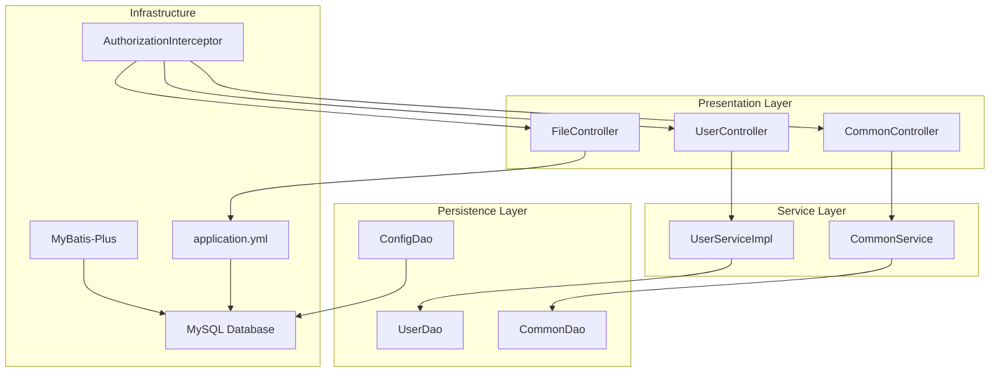
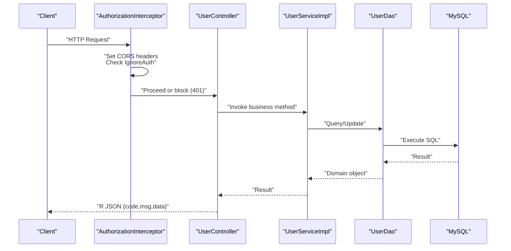
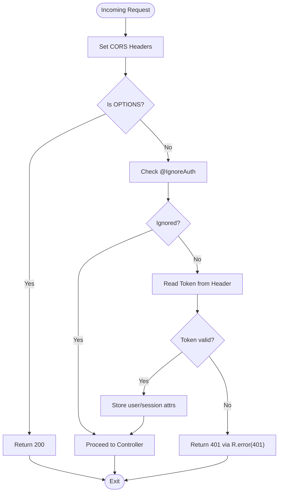
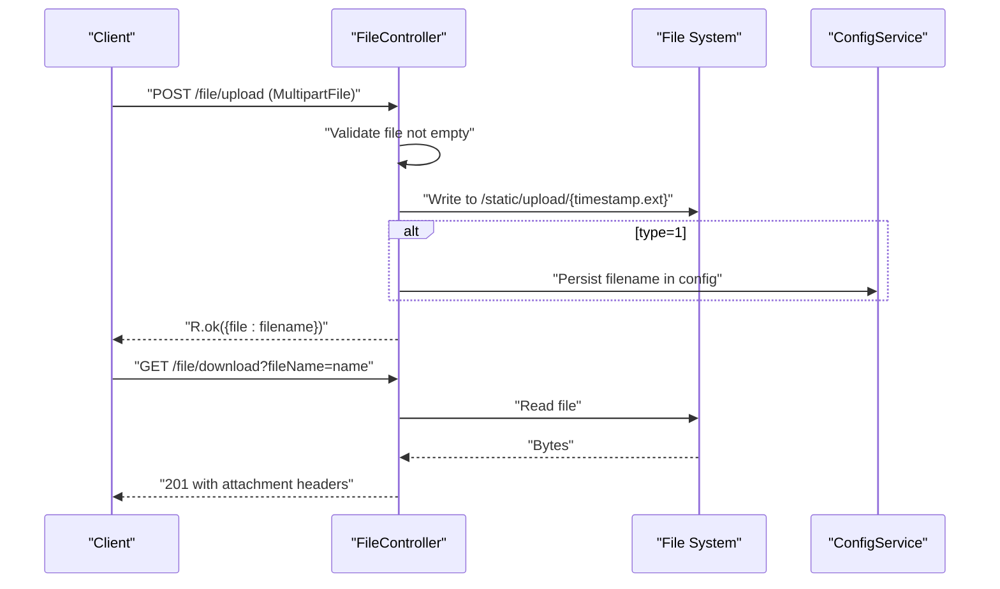
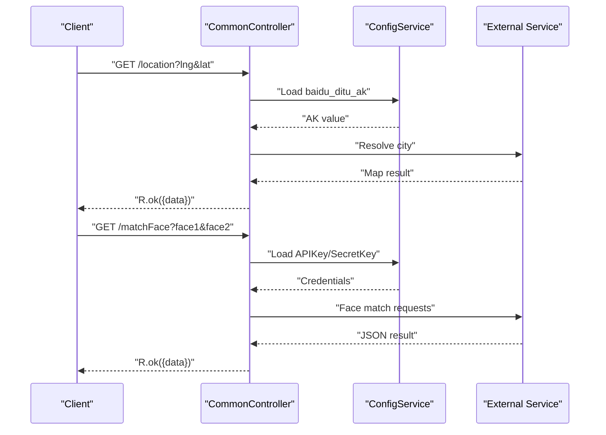
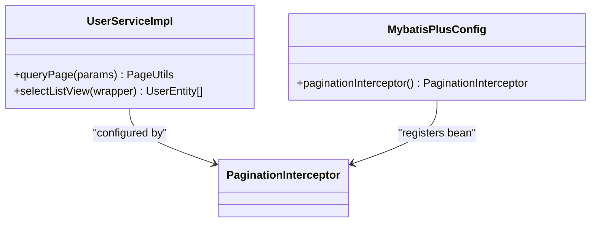
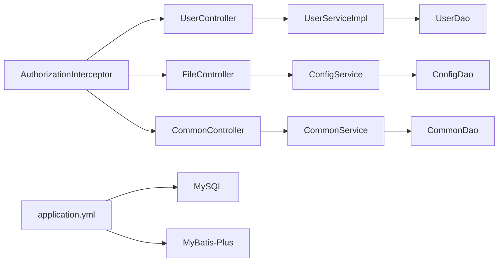

# Troubleshooting & FAQ

<cite>
**Referenced Files in This Document**
- [EIException.java](file://src/main/java/com/entity/EIException.java)
- [R.java](file://src/main/java/com/utils/R.java)
- [CommonController.java](file://src/main/java/com/controller/CommonController.java)
- [FileController.java](file://src/main/java/com/controller/FileController.java)
- [UserController.java](file://src/main/java/com/controller/UserController.java)
- [AuthorizationInterceptor.java](file://src/main/java/com/interceptor/AuthorizationInterceptor.java)
- [InterceptorConfig.java](file://src/main/java/com/config/InterceptorConfig.java)
- [application.yml](file://src/main/resources/application.yml)
- [MybatisPlusConfig.java](file://src/main/java/com/config/MybatisPlusConfig.java)
- [CommonDao.java](file://src/main/java/com/dao/CommonDao.java)
- [CommonService.java](file://src/main/java/com/service/CommonService.java)
- [FileUtil.java](file://src/main/java/com/utils/FileUtil.java)
- [ConfigEntity.java](file://src/main/java/com/entity/ConfigEntity.java)
- [ConfigDao.java](file://src/main/java/com/dao/ConfigDao.java)
- [UserServiceImpl.java](file://src/main/java/com/service/impl/UserServiceImpl.java)
- [front/index.html](file://src/main/resources/front/front/index.html)
</cite>

## Table of Contents
1. [Introduction](#introduction)
2. [Project Structure](#project-structure)
3. [Core Components](#core-components)
4. [Architecture Overview](#architecture-overview)
5. [Detailed Component Analysis](#detailed-component-analysis)
6. [Dependency Analysis](#dependency-analysis)
7. [Performance Considerations](#performance-considerations)
8. [Troubleshooting Guide](#troubleshooting-guide)
9. [Conclusion](#conclusion)
10. [Appendices](#appendices)

## Introduction
This document provides comprehensive troubleshooting and FAQ guidance for the Student Club Activity Management System. It focuses on diagnosing and resolving common issues such as database connectivity, authentication failures, file upload errors, and API endpoint failures. It also explains standardized error handling via the EIException class and the R utility’s response format, outlines systematic debugging approaches, and covers performance optimization, browser compatibility, CORS, security, and deployment/configuration topics.

## Project Structure
The system follows a layered Spring Boot architecture:
- Controllers expose REST endpoints for business features (authentication, uploads, common utilities).
- Services encapsulate business logic and coordinate DAOs.
- DAOs and MyBatis-Plus XML mappers handle persistence.
- Interceptors enforce cross-origin and authentication policies.
- Configuration files define datasource, multipart limits, static resources, and MyBatis-Plus settings.

**Diagram sources**
- [UserController.java:38-253](file://src/main/java/com/controller/UserController.java#L38-L253)
- [FileController.java:31-108](file://src/main/java/com/controller/FileController.java#L31-L108)
- [CommonController.java:37-257](file://src/main/java/com/controller/CommonController.java#L37-L257)
- [UserServiceImpl.java:24-50](file://src/main/java/com/service/impl/UserServiceImpl.java#L24-L50)
- [CommonService.java:6-21](file://src/main/java/com/service/CommonService.java#L6-L21)
- [CommonDao.java:10-27](file://src/main/java/com/dao/CommonDao.java#L10-L27)
- [ConfigDao.java:10-12](file://src/main/java/com/dao/ConfigDao.java#L10-L12)
- [AuthorizationInterceptor.java:28-105](file://src/main/java/com/interceptor/AuthorizationInterceptor.java#L28-L105)
- [application.yml:1-53](file://src/main/resources/application.yml#L1-L53)
- [MybatisPlusConfig.java:13-25](file://src/main/java/com/config/MybatisPlusConfig.java#L13-L25)

**Section sources**
- [application.yml:1-53](file://src/main/resources/application.yml#L1-L53)
- [InterceptorConfig.java:11-41](file://src/main/java/com/config/InterceptorConfig.java#L11-L41)

## Core Components
- Standardized response format: R utility returns a consistent JSON envelope with code and msg fields, and optional payload data.
- Custom exception: EIException carries an error message and numeric code for controlled error propagation.
- Authentication and CORS: AuthorizationInterceptor validates tokens and sets permissive CORS headers; InterceptorConfig registers interceptors for API paths while excluding static resources.
- File handling: FileController supports uploads and downloads with configurable limits and storage locations.
- Common utilities: CommonController exposes location resolution, face matching, option/group/value statistics, and reminders.

**Section sources**
- [R.java:9-52](file://src/main/java/com/utils/R.java#L9-L52)
- [EIException.java:7-52](file://src/main/java/com/entity/EIException.java#L7-L52)
- [AuthorizationInterceptor.java:28-105](file://src/main/java/com/interceptor/AuthorizationInterceptor.java#L28-L105)
- [InterceptorConfig.java:11-41](file://src/main/java/com/config/InterceptorConfig.java#L11-L41)
- [FileController.java:31-108](file://src/main/java/com/controller/FileController.java#L31-L108)
- [CommonController.java:37-257](file://src/main/java/com/controller/CommonController.java#L37-L257)

## Architecture Overview
The runtime flow for typical requests involves interceptors, controllers, services, and persistence. CORS is handled centrally in the interceptor, and authentication relies on a Token header propagated into session attributes.

**Diagram sources**
- [AuthorizationInterceptor.java:36-103](file://src/main/java/com/interceptor/AuthorizationInterceptor.java#L36-L103)
- [UserController.java:38-253](file://src/main/java/com/controller/UserController.java#L38-L253)
- [UserServiceImpl.java:24-50](file://src/main/java/com/service/impl/UserServiceImpl.java#L24-L50)
- [application.yml:9-27](file://src/main/resources/application.yml#L9-L27)

## Detailed Component Analysis

### Authentication and Token Validation
- Token retrieval: The interceptor reads the Token header and validates against TokenService, storing user/session attributes upon success.
- CORS handling: The interceptor sets Access-Control-* headers and short-circuits preflight OPTIONS requests.
- Path registration: InterceptorConfig registers the interceptor for API routes while excluding static/admin/front/upload.

**Diagram sources**
- [AuthorizationInterceptor.java:36-103](file://src/main/java/com/interceptor/AuthorizationInterceptor.java#L36-L103)
- [InterceptorConfig.java:19-26](file://src/main/java/com/config/InterceptorConfig.java#L19-L26)

**Section sources**
- [AuthorizationInterceptor.java:31-103](file://src/main/java/com/interceptor/AuthorizationInterceptor.java#L31-L103)
- [InterceptorConfig.java:19-41](file://src/main/java/com/config/InterceptorConfig.java#L19-L41)

### File Upload and Download
- Upload endpoint: Validates non-empty file, determines extension, writes under configured static/upload path, and optionally updates a configuration key for face files.
- Download endpoint: Serves files from static/upload with appropriate headers; returns 500 on IO errors.
- Storage and limits: application.yml defines multipart limits and static locations.

**Diagram sources**
- [FileController.java:44-105](file://src/main/java/com/controller/FileController.java#L44-L105)
- [application.yml:21-27](file://src/main/resources/application.yml#L21-L27)

**Section sources**
- [FileController.java:44-105](file://src/main/java/com/controller/FileController.java#L44-L105)
- [application.yml:21-27](file://src/main/resources/application.yml#L21-L27)
- [FileUtil.java:13-28](file://src/main/java/com/utils/FileUtil.java#L13-L28)

### Common Utilities and Statistics
- Location resolution: Uses a configured API key to resolve city from coordinates.
- Face matching: Loads credentials from configuration, encodes images, and calls external service.
- Option/Group/Value stats: Provides cascading dropdown options and aggregation queries via CommonService.

**Diagram sources**
- [CommonController.java:52-105](file://src/main/java/com/controller/CommonController.java#L52-L105)
- [ConfigDao.java:10-12](file://src/main/java/com/dao/ConfigDao.java#L10-L12)
- [ConfigEntity.java:12-53](file://src/main/java/com/entity/ConfigEntity.java#L12-L53)

**Section sources**
- [CommonController.java:52-105](file://src/main/java/com/controller/CommonController.java#L52-L105)
- [ConfigEntity.java:12-53](file://src/main/java/com/entity/ConfigEntity.java#L12-L53)

### Data Access and Paging
- MyBatis-Plus configuration enables pagination and disables caches for deterministic behavior.
- UserServiceImpl delegates paging and list queries to the base mapper.

**Diagram sources**
- [UserServiceImpl.java:24-50](file://src/main/java/com/service/impl/UserServiceImpl.java#L24-L50)
- [MybatisPlusConfig.java:13-25](file://src/main/java/com/config/MybatisPlusConfig.java#L13-L25)

**Section sources**
- [application.yml:28-53](file://src/main/resources/application.yml#L28-L53)
- [UserServiceImpl.java:27-48](file://src/main/java/com/service/impl/UserServiceImpl.java#L27-L48)

## Dependency Analysis
- Controllers depend on services and utilities; services depend on DAOs and configuration services.
- Interceptors depend on TokenService and write standardized responses.
- application.yml centralizes datasource, multipart, static locations, and MyBatis-Plus settings.

**Diagram sources**
- [UserController.java:40-47](file://src/main/java/com/controller/UserController.java#L40-L47)
- [FileController.java:35-39](file://src/main/java/com/controller/FileController.java#L35-L39)
- [CommonController.java:41-46](file://src/main/java/com/controller/CommonController.java#L41-L46)
- [application.yml:9-53](file://src/main/resources/application.yml#L9-L53)

**Section sources**
- [application.yml:9-53](file://src/main/resources/application.yml#L9-L53)

## Performance Considerations
- Database queries
  - Enable pagination for large datasets to avoid memory pressure.
  - Avoid N+1 selects by fetching related data in batch or using joins where appropriate.
  - Keep caches disabled during development for predictable results; enable only if needed.
- Memory usage
  - File uploads are buffered; keep max-file-size reasonable to prevent OOM.
  - For face matching, ensure temporary files are managed and avoid loading excessively large images.
- Response times
  - Centralize CORS handling in the interceptor to reduce per-controller overhead.
  - Minimize synchronous blocking in controllers; offload heavy tasks to async workers if needed.
- Static resources
  - Serve static assets from classpath or file system locations configured in application.yml to reduce latency.

[No sources needed since this section provides general guidance]

## Troubleshooting Guide

### Database Connection Problems
Symptoms
- Application fails to start or throws connection exceptions.
- Queries timeout or fail intermittently.

Diagnostic steps
- Verify datasource URL, username, and password in application.yml.
- Confirm MySQL server is reachable on the specified host/port.
- Check timezone and character encoding parameters in the JDBC URL.
- Ensure the database exists and the user has privileges.

Resolution
- Correct credentials and URL in application.yml.
- Adjust serverTimezone and characterEncoding if mismatched with DB server.
- Restart the application after changes.

**Section sources**
- [application.yml:10-19](file://src/main/resources/application.yml#L10-L19)

### Authentication Failures
Symptoms
- Requests return 401 “please login”.
- CORS preflight OPTIONS returns 200 but subsequent requests still fail.

Diagnostic steps
- Confirm the Token header is present and valid.
- Check that the interceptor is registered for the requested path.
- Verify IgnoreAuth annotations are not mistakenly applied to protected endpoints.
- Inspect session attributes set by the interceptor.

Resolution
- Provide a valid token in the Token header for protected endpoints.
- Ensure the interceptor path patterns match your API routes.
- Remove @IgnoreAuth from endpoints requiring authentication.

**Section sources**
- [AuthorizationInterceptor.java:36-103](file://src/main/java/com/interceptor/AuthorizationInterceptor.java#L36-L103)
- [InterceptorConfig.java:19-26](file://src/main/java/com/config/InterceptorConfig.java#L19-L26)

### File Upload Errors
Symptoms
- Upload endpoint throws “file cannot be empty”.
- Download returns internal server error.

Diagnostic steps
- Check multipart limits in application.yml.
- Verify upload directory exists and is writable.
- Confirm the fileName parameter for downloads matches stored files.

Resolution
- Ensure a file is selected and not empty.
- Increase max-file-size if needed.
- Confirm static/upload path exists and permissions are correct.

**Section sources**
- [FileController.java:44-74](file://src/main/java/com/controller/FileController.java#L44-L74)
- [FileController.java:79-105](file://src/main/java/com/controller/FileController.java#L79-L105)
- [application.yml:21-27](file://src/main/resources/application.yml#L21-L27)

### API Endpoint Failures
Symptoms
- Unexpected 500 errors with generic messages.
- Business logic returns inconsistent error codes.

Diagnostic steps
- Review controller methods for throwing EIException or returning R.error().
- Check centralized error handling patterns and response codes.
- Validate input parameters and constraints.

Resolution
- Use R.error(code, msg) for explicit error responses.
- Throw EIException with appropriate code for controlled handling.
- Log request URLs and handler types for correlation.

**Section sources**
- [R.java:16-30](file://src/main/java/com/utils/R.java#L16-L30)
- [EIException.java:7-52](file://src/main/java/com/entity/EIException.java#L7-L52)
- [AuthorizationInterceptor.java:90-102](file://src/main/java/com/interceptor/AuthorizationInterceptor.java#L90-L102)

### CORS Problems
Symptoms
- Cross-origin requests blocked by browser.
- Preflight OPTIONS succeeds but actual request fails.

Diagnostic steps
- Confirm Access-Control-* headers are set in the interceptor.
- Verify Access-Control-Allow-Origin matches the requesting origin.
- Ensure interceptor handles OPTIONS preflight.

Resolution
- Keep CORS headers in the interceptor; do not remove Allow-Origin wildcard.
- Align interceptor path patterns with your frontend origin.

**Section sources**
- [AuthorizationInterceptor.java:43-53](file://src/main/java/com/interceptor/AuthorizationInterceptor.java#L43-L53)

### Browser Compatibility and Frontend Integration
Symptoms
- Styles not applied inside iframes.
- Mixed content or CSP warnings.

Diagnostic steps
- Inspect injected styles and cross-origin restrictions in the frontend index.
- Check static resource serving for admin/front/upload.

Resolution
- Inject styles only when same-origin; expect cross-origin restrictions.
- Serve static resources from configured locations to avoid mixed content.

**Section sources**
- [front/index.html:644-855](file://src/main/resources/front/front/index.html#L644-L855)
- [application.yml:25-27](file://src/main/resources/application.yml#L25-L27)

### Security Concerns
Symptoms
- Unauthorized access to protected endpoints.
- Weak credential checks or missing input validation.

Diagnostic steps
- Ensure @IgnoreAuth is not applied to sensitive endpoints.
- Verify token validation and session attribute population.
- Check for proper input validation and sanitization.

Resolution
- Apply @IgnoreAuth only to public endpoints.
- Enforce token presence and validity in interceptors.
- Add input validation and sanitize user-provided data.

**Section sources**
- [AuthorizationInterceptor.java:55-87](file://src/main/java/com/interceptor/AuthorizationInterceptor.java#L55-L87)
- [UserController.java:51-60](file://src/main/java/com/controller/UserController.java#L51-L60)

### Deployment and Environment Issues
Symptoms
- Application starts on unexpected port or context path.
- Static resources not served.

Diagnostic steps
- Review server.port and server.servlet.context-path in application.yml.
- Confirm static-locations include upload and admin/front paths.
- Validate environment-specific overrides if applicable.

Resolution
- Set correct port and context path for production.
- Ensure static-locations serve admin, front, and upload directories.

**Section sources**
- [application.yml:2-8](file://src/main/resources/application.yml#L2-L8)
- [application.yml:25-27](file://src/main/resources/application.yml#L25-L27)

### Frequently Asked Questions
- What is the standardized response format?
  - Responses use R with fields code, msg, and optional data payload.
- How are errors represented?
  - Use R.error(code, msg) or throw EIException with code/message.
- Which endpoints are protected by token validation?
  - API routes registered in InterceptorConfig are intercepted; static/admin/front/upload are excluded.
- How are uploads configured?
  - Max file/request sizes and upload directory are defined in application.yml.
- How does CORS work?
  - Interceptor sets Access-Control-* headers and handles preflight OPTIONS.
- Are there built-in statistics endpoints?
  - CommonController provides option/group/value/statistics endpoints.
- How is paging handled?
  - MyBatis-Plus pagination interceptor is enabled via configuration.

**Section sources**
- [R.java:9-52](file://src/main/java/com/utils/R.java#L9-L52)
- [EIException.java:7-52](file://src/main/java/com/entity/EIException.java#L7-L52)
- [InterceptorConfig.java:19-26](file://src/main/java/com/config/InterceptorConfig.java#L19-L26)
- [application.yml:21-27](file://src/main/resources/application.yml#L21-L27)
- [CommonController.java:113-254](file://src/main/java/com/controller/CommonController.java#L113-L254)
- [MybatisPlusConfig.java:19-22](file://src/main/java/com/config/MybatisPlusConfig.java#L19-L22)

## Conclusion
This guide consolidates practical troubleshooting steps, standardized error handling patterns, and operational best practices for the Student Club Activity Management System. By leveraging the interceptor-based authentication/CORS setup, the R utility’s response format, and the EIException class, teams can diagnose and resolve most issues quickly. Adhering to the performance and security recommendations ensures reliable operation across environments.

## Appendices

### Error Code Interpretation
- 401 Unauthorized: Authentication required or invalid token.
- 500 Unknown error: Generic failure; check logs and stack traces.
- Custom codes: Use EIException with explicit code for domain-specific errors.

**Section sources**
- [AuthorizationInterceptor.java:95-102](file://src/main/java/com/interceptor/AuthorizationInterceptor.java#L95-L102)
- [R.java:16-30](file://src/main/java/com/utils/R.java#L16-L30)
- [EIException.java:23-33](file://src/main/java/com/entity/EIException.java#L23-L33)