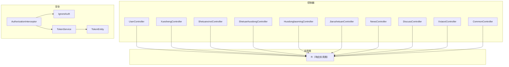
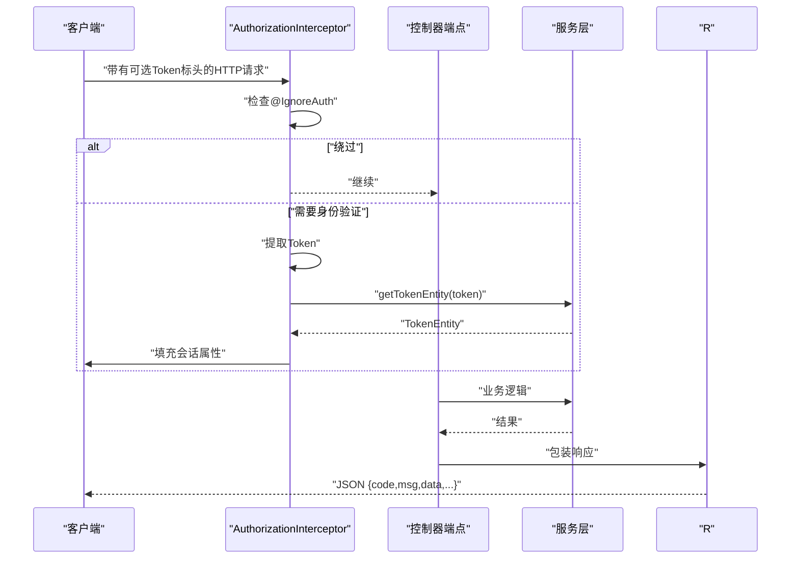
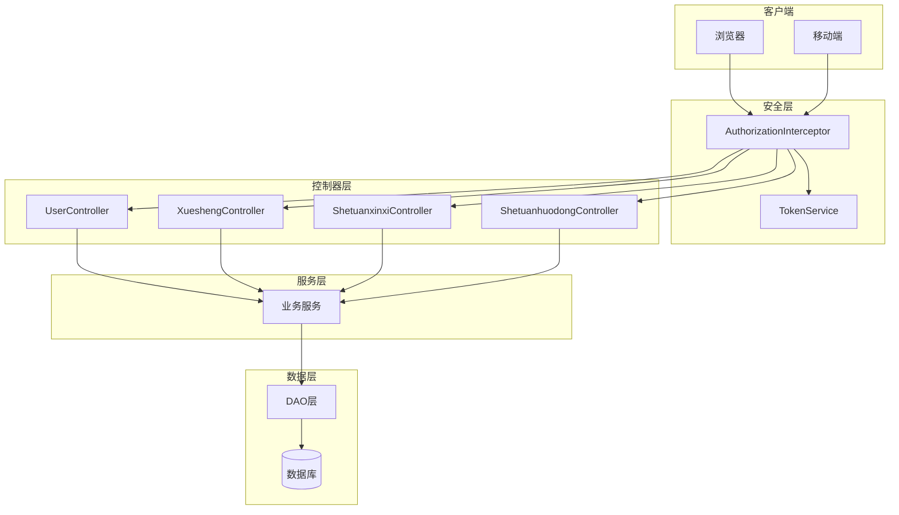

# API参考

<cite>
**本文档引用的文件**
- [UserController.java](file://src/main/java/com/controller/UserController.java)
- [XueshengController.java](file://src/main/java/com/controller/XueshengController.java)
- [ShetuanxinxiController.java](file://src/main/java/com/controller/ShetuanxinxiController.java)
- [ShetuanhuodongController.java](file://src/main/java/com/controller/ShetuanhuodongController.java)
- [HuodongbaomingController.java](file://src/main/java/com/controller/HuodongbaomingController.java)
- [JiarushetuanController.java](file://src/main/java/com/controller/JiarushetuanController.java)
- [NewsController.java](file://src/main/java/com/controller/NewsController.java)
- [XxiaoxiController.java](file://src/main/java/com/controller/XxiaoxiController.java)
- [CommonController.java](file://src/main/java/com/controller/CommonController.java)
- [DiscussController.java](file://src/main/java/com/controller/DiscussController.java)
- [AuthorizationInterceptor.java](file://src/main/java/com/interceptor/AuthorizationInterceptor.java)
- [IgnoreAuth.java](file://src/main/java/com/annotation/IgnoreAuth.java)
- [R.java](file://src/main/java/com/utils/R.java)
- [TokenService.java](file://src/main/java/com/service/TokenService.java)
- [TokenEntity.java](file://src/main/java/com/entity/TokenEntity.java)
</cite>

## 目录
1. [简介](#简介)
2. [项目结构](#项目结构)
3. [核心组件](#核心组件)
4. [架构概述](#架构概述)
5. [详细组件分析](#详细组件分析)
6. [依赖分析](#依赖分析)
7. [性能考虑](#性能考虑)
8. [故障排除指南](#故障排除指南)
9. [结论](#结论)
10. [附录](#附录)

## 简介
本文档为学生社团活动管理系统提供全面的API文档。它涵盖所有RESTful端点、HTTP方法、URL模式、请求/响应模式、身份验证、分页、过滤、搜索和错误处理。它还包括常见操作的示例，如用户注册、社团管理、活动参与和消息传递。

## 项目结构
后端按组织在com.controller包下的控制器分组。每个控制器暴露CRUD操作、分页查询、提醒和专门工作流（例如，活动发布、成员请求、评论、通知）的REST端点。身份验证通过全局拦截器强制执行，该拦截器读取Token标头并验证会话。



**图表来源**
- [AuthorizationInterceptor.java:1-105](file://src/main/java/com/interceptor/AuthorizationInterceptor.java#L1-L105)
- [IgnoreAuth.java:1-14](file://src/main/java/com/annotation/IgnoreAuth.java#L1-L14)
- [TokenService.java:1-27](file://src/main/java/com/service/TokenService.java#L1-L27)
- [TokenEntity.java:1-133](file://src/main/java/com/entity/TokenEntity.java#L1-L133)
- [R.java:1-52](file://src/main/java/com/utils/R.java#L1-L52)

**本节来源**
- [AuthorizationInterceptor.java:1-105](file://src/main/java/com/interceptor/AuthorizationInterceptor.java#L1-L105)
- [IgnoreAuth.java:1-14](file://src/main/java/com/annotation/IgnoreAuth.java#L1-L14)
- [R.java:1-52](file://src/main/java/com/utils/R.java#L1-L52)

## 核心组件
- 身份验证和授权
  - Token标头："Token"
  - 成功的令牌验证后填充会话属性：userId、role、tableName、username
  - 使用@IgnoreAuth注释的端点绕过令牌检查
- 响应实用类
  - R提供带有code、msg和data有效负载的标准化响应信封
- 分页和过滤
  - 端点通常接受Map<String,Object> params用于分页和过滤器
  - 排序和范围过滤器通过实用类助手应用

**本节来源**
- [AuthorizationInterceptor.java:31-102](file://src/main/java/com/interceptor/AuthorizationInterceptor.java#L31-L102)
- [R.java:9-51](file://src/main/java/com/utils/R.java#L9-L51)
- [CommonController.java:113-198](file://src/main/java/com/controller/CommonController.java#L113-L198)

## 架构概述
系统通过拦截器全局强制执行身份验证。控制器暴露按域分组的端点（用户、学生、社团、活动、新闻、讨论、消息）。实用类封装响应格式化和常见操作。



**图表来源**
- [AuthorizationInterceptor.java:36-102](file://src/main/java/com/interceptor/AuthorizationInterceptor.java#L36-L102)
- [TokenService.java:23-25](file://src/main/java/com/service/TokenService.java#L23-L25)
- [R.java:9-51](file://src/main/java/com/utils/R.java#L9-L51)

## 详细组件分析

### 身份验证和用户
- 基础路径：/users
- 端点
  - POST /login
    - 描述：验证用户并返回类似JWT的令牌
    - 标头：不需要（无Token标头）
    - 主体：username、password、captcha
    - 响应：{code, msg, data: {token}}
    - 错误：凭据无效
  - POST /register
    - 描述：注册新用户
    - 标头：不需要（无Token标头）
    - 主体：用户详细信息
    - 响应：{code, msg}
    - 错误：用户名已存在
  - GET /page
    - 描述：分页查询用户
    - 标头：Token（需要身份验证）
    - 参数：page、limit、排序、过滤器
    - 响应：{code, data: {list, total, pageSize, totalPage, currPage}}
  - GET /info/{id}
    - 描述：按ID获取用户
    - 标头：Token
    - 响应：{code, data: 用户对象}
  - POST /update
    - 描述：更新用户
    - 标头：Token
    - 主体：用户对象
    - 响应：{code, msg}
  - POST /delete
    - 描述：删除用户
    - 标头：Token
    - 主体：id数组
    - 响应：{code, msg}

**认证流程:**
```javascript
// 登录请求
POST /users/login
{
  "username": "admin",
  "password": "123456",
  "role": "管理员"
}

// 响应
{
  "code": 0,
  "msg": "成功",
  "data": {
    "token": "abc123..."
  }
}

// 后续请求
GET /users/page?page=1&limit=10
Headers: { "Token": "abc123..." }
```

**本节来源**
- [UserController.java](file://src/main/java/com/controller/UserController.java)

### 学生管理
- 基础路径：/xuesheng
- 端点
  - POST /login - 学生登录
  - POST /register - 学生注册
  - GET /page - 分页查询
  - GET /list - 列表查询
  - GET /info/{id} - 获取详情
  - POST /save - 创建学生
  - POST /update - 更新学生
  - POST /delete - 删除学生

**请求示例:**
```javascript
POST /xuesheng/save
{
  "xuehao": "2024001",
  "mima": "password123",
  "xueshengxingming": "张三",
  "xingbie": "男",
  "xueyuan": "计算机学院",
  "banji": "2024级1班",
  "shouji": "13800138000"
}
```

**本节来源**
- [XueshengController.java](file://src/main/java/com/controller/XueshengController.java)

### 社团信息管理
- 基础路径：/shetuanxinxi
- 端点
  - GET /page - 分页查询社团
  - GET /list - 列表查询
  - GET /info/{id} - 获取社团详情
  - POST /save - 创建社团
  - POST /update - 更新社团
  - POST /delete - 删除社团
  - GET /detail/{id} - 查看社团详情（增加点击量）

**社团数据结构:**
```javascript
{
  "shetuanmingcheng": "计算机社团",
  "shetuanfenlei": "学术类",
  "tupian": "upload/image.jpg",
  "chuangjianshijian": "2024-01-01",
  "shouji": "13800138000",
  "youxiang": "club@example.com",
  "shetuanjianjie": "社团简介...",
  "shezhangxingming": "李四",
  "zhanghao": "club001",
  "sfsh": "待审核",
  "shhf": ""
}
```

**审核工作流:**
- sfsh字段：是否审核（是/否/待审核）
- shhf字段：审核回复
- 管理员可以审核社团

**本节来源**
- [ShetuanxinxiController.java](file://src/main/java/com/controller/ShetuanxinxiController.java)

### 社团活动管理
- 基础路径：/shetuanhuodong
- 端点
  - GET /page - 分页查询活动
  - GET /list - 列表查询
  - GET /info/{id} - 获取活动详情
  - POST /save - 创建活动
  - POST /update - 更新活动
  - POST /delete - 删除活动
  - GET /detail/{id} - 查看活动详情

**活动数据结构:**
```javascript
{
  "biaoti": "编程比赛",
  "shetuanmingcheng": "计算机社团",
  "tupian": "upload/event.jpg",
  "huodongshijian": "2024-03-15",
  "huodongdidian": "教学楼A101",
  "lianxiren": "王五",
  "lianxidianhua": "13900139000",
  "huodongjianjie": "活动简介...",
  "zhanghao": "club001",
  "sfsh": "是"
}
```

**本节来源**
- [ShetuanhuodongController.java](file://src/main/java/com/controller/ShetuanhuodongController.java)

### 活动报名管理
- 基础路径：/huodongbaoming
- 端点
  - GET /page - 分页查询报名
  - GET /list - 列表查询
  - GET /info/{id} - 获取报名详情
  - POST /save - 提交报名
  - POST /update - 更新报名
  - POST /delete - 删除报名

**报名数据结构:**
```javascript
{
  "biaoti": "编程比赛",
  "shetuanmingcheng": "计算机社团",
  "zhanghao": "club001",
  "baomingneirong": "报名内容...",
  "baomingriqi": "2024-03-10",
  "xuehao": "2024001",
  "xueshengxingming": "张三",
  "shouji": "13800138000",
  "sfsh": "待审核"
}
```

**本节来源**
- [HuodongbaomingController.java](file://src/main/java/com/controller/HuodongbaomingController.java)

### 加入社团管理
- 基础路径：/jiarushetuan
- 端点
  - GET /page - 分页查询申请
  - GET /list - 列表查询
  - GET /info/{id} - 获取申请详情
  - POST /save - 提交加入申请
  - POST /update - 更新申请
  - POST /delete - 删除申请

**申请数据结构:**
```javascript
{
  "shetuanmingcheng": "计算机社团",
  "zhanghao": "club001",
  "xuehao": "2024001",
  "xueshengxingming": "张三",
  "shenqingneirong": "申请理由...",
  "shenqingriqi": "2024-03-01",
  "sfsh": "待审核"
}
```

**本节来源**
- [JiarushetuanController.java](file://src/main/java/com/controller/JiarushetuanController.java)

### 新闻资讯管理
- 基础路径：/news
- 端点
  - GET /page - 分页查询新闻
  - GET /list - 列表查询
  - GET /info/{id} - 获取新闻详情
  - POST /save - 创建新闻
  - POST /update - 更新新闻
  - POST /delete - 删除新闻
  - GET /detail/{id} - 查看新闻详情

**新闻数据结构:**
```javascript
{
  "title": "社团招新通知",
  "introduction": "简介...",
  "picture": "upload/news.jpg",
  "content": "新闻内容..."
}
```

**本节来源**
- [NewsController.java](file://src/main/java/com/controller/NewsController.java)

### 评论管理
- 基础路径：/discussshetuanxinxi
- 端点
  - GET /page - 分页查询评论
  - GET /list - 列表查询
  - GET /info/{id} - 获取评论详情
  - POST /save - 提交评论
  - POST /update - 更新评论
  - POST /delete - 删除评论

**评论数据结构:**
```javascript
{
  "refid": 社团ID,
  "userid": 用户ID,
  "nickname": "用户名",
  "content": "评论内容...",
  "reply": "回复内容..."
}
```

**本节来源**
- [DiscussController.java](file://src/main/java/com/controller/DiscussController.java)

### 消息通知管理
- 基础路径：/xxiaoxi
- 端点
  - GET /page - 分页查询消息
  - GET /list - 列表查询
  - GET /info/{id} - 获取消息详情
  - POST /save - 创建消息
  - POST /update - 更新消息
  - POST /delete - 删除消息

**消息数据结构:**
```javascript
{
  "userid": 接收用户ID,
  "title": "消息标题",
  "content": "消息内容",
  "isread": "否",
  "addtime": "2024-03-01"
}
```

**本节来源**
- [XxiaoxiController.java](file://src/main/java/com/controller/XxiaoxiController.java)

### 通用操作
- 基础路径：/common
- 端点
  - GET /option/{tableName}/{columnName} - 获取选项列表
  - GET /follow/{tableName}/{columnName} - 跟随查询
  - POST /sh - 状态变更（审核）
  - GET /remind/{tableName}/{columnName} - 提醒计数
  - GET /cal/{tableName}/{columnName} - 统计计算
  - GET /group/{tableName}/{columnName} - 分组统计
  - GET /value/{tableName}/{columnName} - 值统计

**审核操作示例:**
```javascript
POST /common/sh
{
  "tablename": "shetuanxinxi",
  "ids": [1, 2, 3],
  "sfsh": "是",
  "shhf": "审核通过"
}
```

**本节来源**
- [CommonController.java](file://src/main/java/com/controller/CommonController.java)

## 依赖分析
API端点表现出清晰的依赖模式：



**安全流程:**
1. 所有请求通过AuthorizationInterceptor
2. 检查@IgnoreAuth注释
3. 如需要，验证Token标头
4. 填充会话属性
5. 继续到控制器

**本节来源**
- [AuthorizationInterceptor.java:31-102](file://src/main/java/com/interceptor/AuthorizationInterceptor.java#L31-L102)

## 性能考虑

### 分页
- 所有列表端点支持分页
- 使用page和limit参数
- 返回total、pageSize、totalPage、currPage

```javascript
GET /shetuanxinxi/page?page=1&limit=10

响应:
{
  "code": 0,
  "data": {
    "list": [...],
    "total": 100,
    "pageSize": 10,
    "totalPage": 10,
    "currPage": 1
  }
}
```

### 过滤和搜索
- 使用查询参数进行过滤
- 支持范围查询
- 支持模糊搜索

```javascript
GET /shetuanxinxi/page?shetuanmingcheng=计算机&sfsh=是

// 范围查询
GET /shetuanxinxi/page?clicknumStart=100&clicknumEnd=1000
```

### 排序
- 使用sort参数
- 支持升序和降序

```javascript
GET /shetuanxinxi/page?sort=clicknum&order=desc
```

### 批量操作
- 支持批量删除
- 支持批量审核

```javascript
POST /delete
{
  "ids": [1, 2, 3, 4, 5]
}
```

[本节提供一般性指导，无需来源]

## 故障排除指南

### 常见错误代码

| 代码 | 描述 | 解决方案 |
|------|------|----------|
| 0 | 成功 | - |
| 401 | 未授权 | 检查Token标头 |
| 403 | 禁止访问 | 检查权限 |
| 404 | 未找到 | 检查URL |
| 500 | 服务器错误 | 检查服务器日志 |

### 身份验证问题

**问题:** 401未授权
**原因:** 
- Token标头缺失
- Token无效或过期
- 会话已过期

**解决方案:**
```javascript
// 确保在请求中包含Token
headers: {
  "Token": localStorage.getItem("token")
}
```

### 参数验证问题

**问题:** 请求失败，验证错误
**原因:**
- 缺少必填字段
- 数据格式不正确
- 违反业务规则

**解决方案:**
- 检查请求主体
- 验证数据格式
- 查看错误消息

### CORS问题

**问题:** 跨域请求被阻止
**解决方案:**
- 检查InterceptorConfig中的CORS配置
- 确保预检请求正确处理
- 验证允许的源

**本节来源**
- [AuthorizationInterceptor.java:31-102](file://src/main/java/com/interceptor/AuthorizationInterceptor.java#L31-L102)
- [R.java:9-51](file://src/main/java/com/utils/R.java#L9-L51)

## 结论
API参考文档为学生社团活动管理系统提供了全面的端点文档：

- **RESTful设计**: 标准HTTP方法和URL模式
- **身份验证**: 基于令牌的认证与@IgnoreAuth例外
- **CRUD操作**: 所有实体的完整实现
- **分页**: 所有列表端点支持
- **过滤和搜索**: 灵活的查询参数
- **批量操作**: 批量删除和审核
- **标准化响应**: R实用类提供一致的响应格式
- **错误处理**: 清晰的错误代码和消息
- **审核工作流**: sfsh和shhf字段支持审核
- **通用操作**: 跨实体的共享功能

该API支持系统的所有前端应用，同时为未来集成提供灵活性。

## 附录

### 响应格式

**成功响应:**
```javascript
{
  "code": 0,
  "msg": "成功",
  "data": {...}
}
```

**错误响应:**
```javascript
{
  "code": 1,
  "msg": "错误消息"
}
```

**分页响应:**
```javascript
{
  "code": 0,
  "data": {
    "list": [...],
    "total": 100,
    "pageSize": 10,
    "totalPage": 10,
    "currPage": 1
  }
}
```

### HTTP方法约定

| 方法 | 用途 | 示例 |
|------|------|------|
| GET | 查询数据 | GET /page, GET /list, GET /info/{id} |
| POST | 创建/更新/删除 | POST /save, POST /update, POST /delete |
| PUT | 更新（如使用） | PUT /update |
| DELETE | 删除（如使用） | DELETE /delete |

### 通用查询参数

| 参数 | 类型 | 描述 | 示例 |
|------|------|------|------|
| page | Integer | 页码 | page=1 |
| limit | Integer | 每页数量 | limit=10 |
| sort | String | 排序字段 | sort=clicknum |
| order | String | 排序方向 | order=desc/asc |
| {fieldName} | String | 过滤字段 | sfsh=是 |
| {fieldName}Start | String | 范围开始 | clicknumStart=100 |
| {fieldName}End | String | 范围结束 | clicknumEnd=1000 |

### 身份验证标头

**请求标头:**
```
Token: abc123xyz...
Content-Type: application/json
```

**获取Token:**
```javascript
POST /users/login
{
  "username": "admin",
  "password": "123456"
}

// 响应
{
  "code": 0,
  "data": {
    "token": "abc123xyz..."
  }
}
```

### 端点列表摘要

| 模块 | 基础路径 | 主要功能 |
|------|----------|----------|
| 用户 | /users | 用户管理、认证 |
| 学生 | /xuesheng | 学生管理、注册 |
| 社团信息 | /shetuanxinxi | 社团CRUD、审核 |
| 社团活动 | /shetuanhuodong | 活动管理 |
| 活动报名 | /huodongbaoming | 报名管理 |
| 加入社团 | /jiarushetuan | 加入申请 |
| 新闻资讯 | /news | 新闻管理 |
| 评论 | /discussshetuanxinxi | 评论管理 |
| 消息 | /xxiaoxi | 消息通知 |
| 通用 | /common | 共享操作、审核 |

**本节来源**
- [R.java:9-51](file://src/main/java/com/utils/R.java#L9-L51)
- [AuthorizationInterceptor.java:31-102](file://src/main/java/com/interceptor/AuthorizationInterceptor.java#L31-L102)
