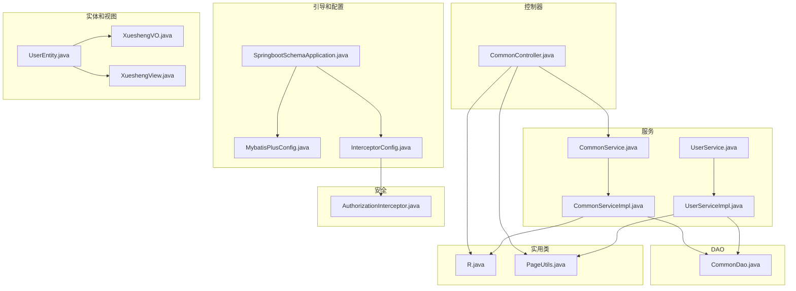
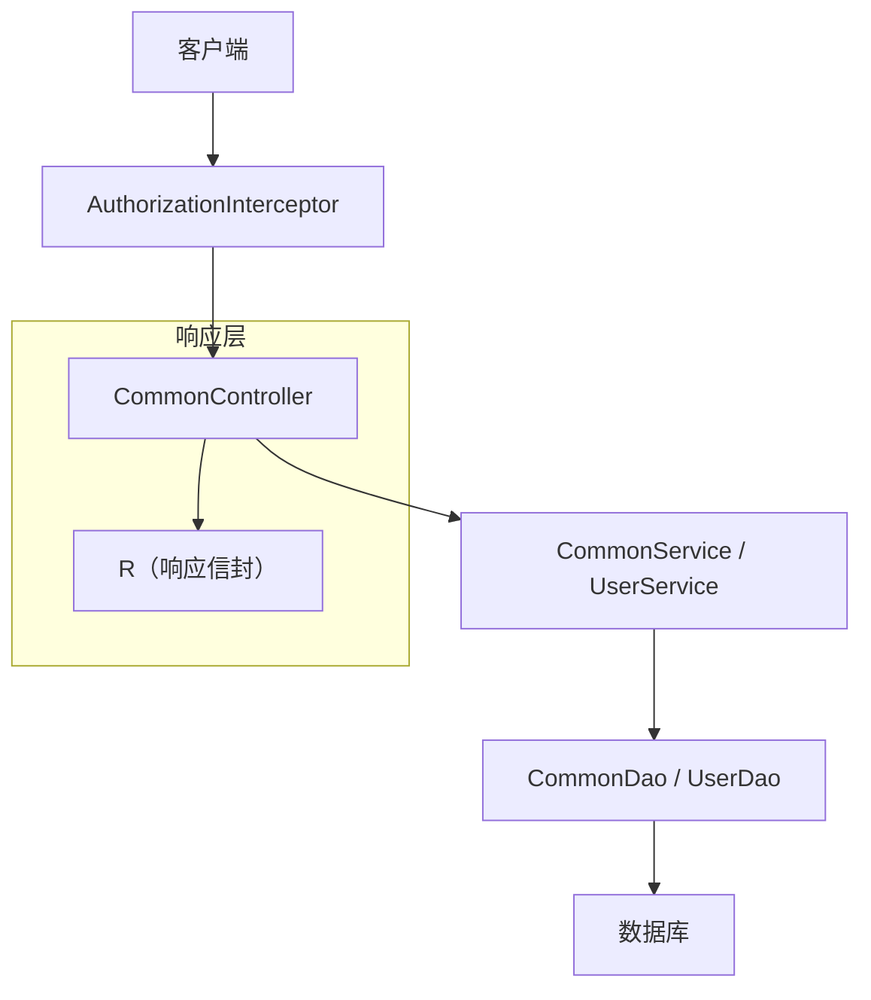
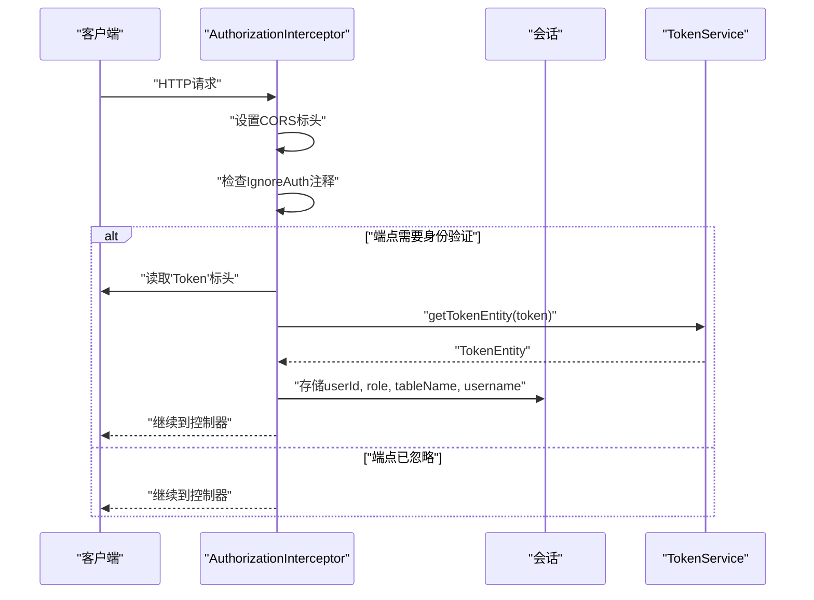
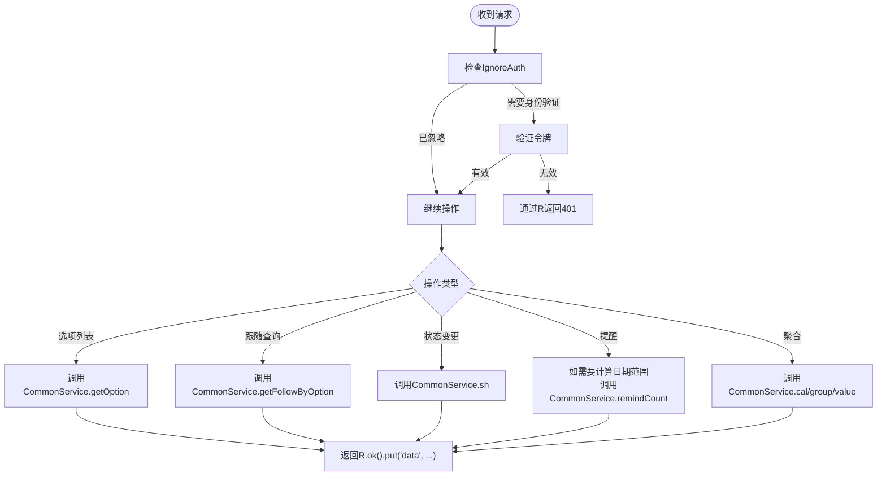
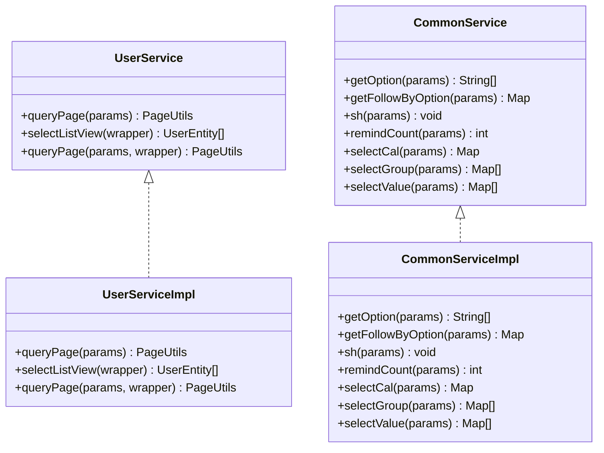
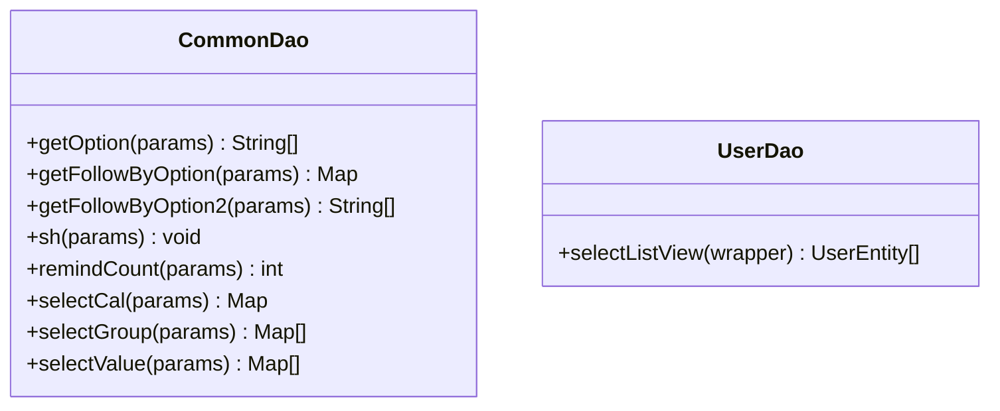
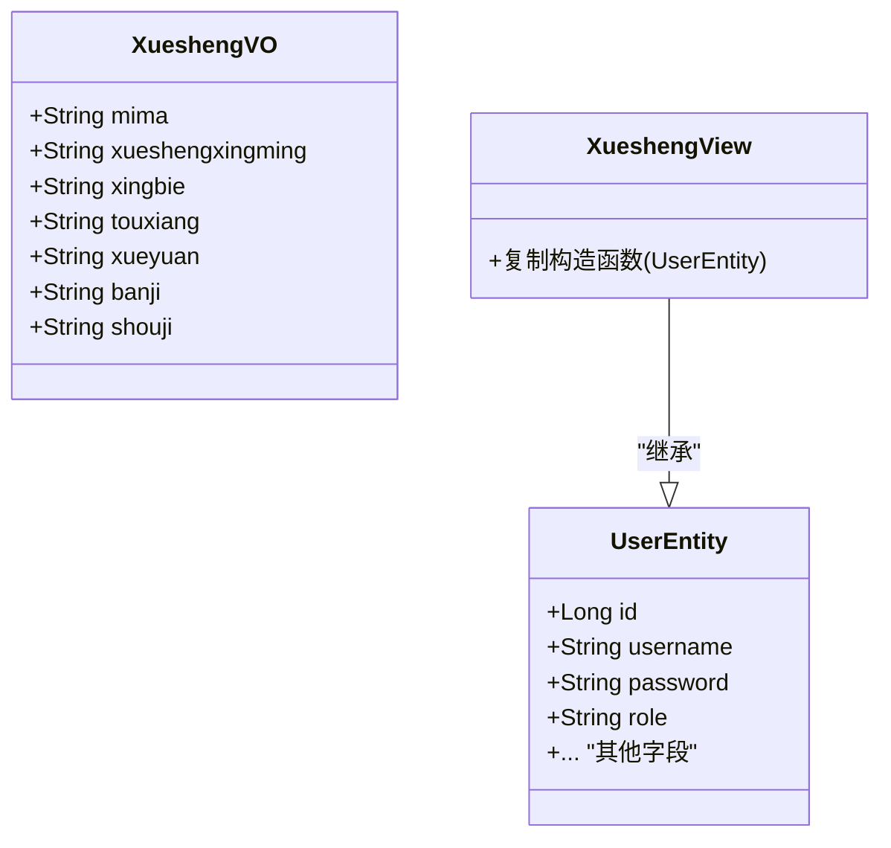
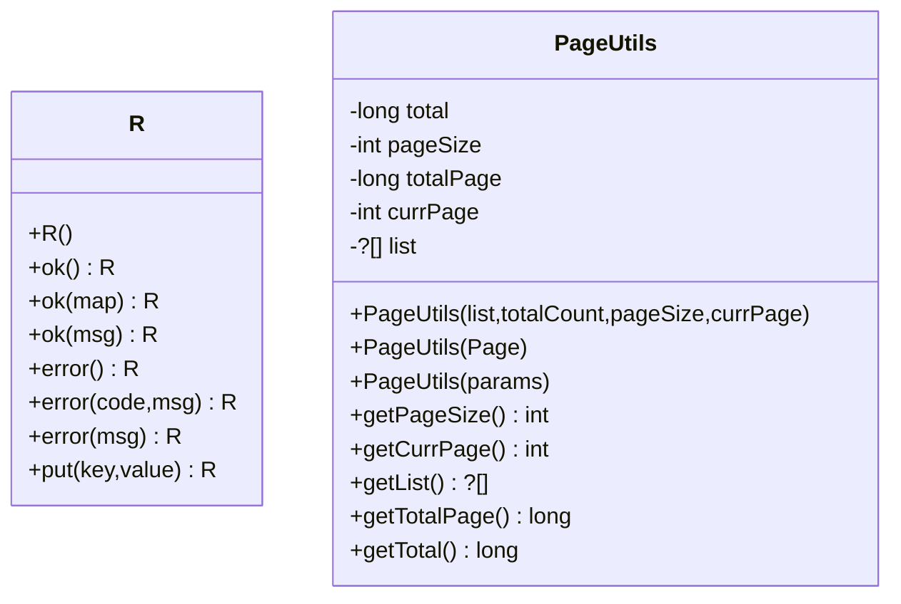
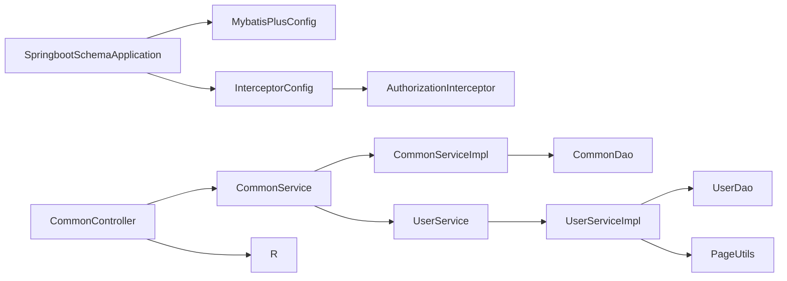

# 后端模块

<cite>
**本文档引用的文件**
- [SpringbootSchemaApplication.java](file://src/main/java/com/SpringbootSchemaApplication.java)
- [MybatisPlusConfig.java](file://src/main/java/com/config/MybatisPlusConfig.java)
- [InterceptorConfig.java](file://src/main/java/com/config/InterceptorConfig.java)
- [AuthorizationInterceptor.java](file://src/main/java/com/interceptor/AuthorizationInterceptor.java)
- [CommonController.java](file://src/main/java/com/controller/CommonController.java)
- [CommonService.java](file://src/main/java/com/service/CommonService.java)
- [CommonServiceImpl.java](file://src/main/java/com/service/impl/CommonServiceImpl.java)
- [CommonDao.java](file://src/main/java/com/dao/CommonDao.java)
- [UserEntity.java](file://src/main/java/com/entity/UserEntity.java)
- [UserService.java](file://src/main/java/com/service/UserService.java)
- [UserServiceImpl.java](file://src/main/java/com/service/impl/UserServiceImpl.java)
- [R.java](file://src/main/java/com/utils/R.java)
- [PageUtils.java](file://src/main/java/com/utils/PageUtils.java)
- [XueshengVO.java](file://src/main/java/com/entity/vo/XueshengVO.java)
- [XueshengView.java](file://src/main/java/com/entity/view/XueshengView.java)
</cite>

## 目录
1. [简介](#简介)
2. [项目结构](#项目结构)
3. [核心组件](#核心组件)
4. [架构概述](#架构概述)
5. [详细组件分析](#详细组件分析)
6. [依赖分析](#依赖分析)
7. [性能考虑](#性能考虑)
8. [故障排除指南](#故障排除指南)
9. [结论](#结论)

## 简介
本文档描述了学生社团活动管理系统的后端模块，重点关注MVC架构、服务层模式、DAO模式、实体模型变体（Entity、VO、View）、基于拦截器的身份验证和授权、实用类以及通用控制器功能。它解释了控制器如何委托给服务，服务如何封装业务逻辑并通过MyBatis-Plus抽象与DAO集成，以及拦截器如何在选定的API端点上强制执行身份验证。

## 项目结构
后端遵循分层结构：
- 应用引导和配置
- 控制器（REST端点）
- 服务（业务逻辑和事务）
- DAO（通过MyBatis-Plus进行数据访问）
- 实体和表示模型（Entity、VO、View）
- 实用类和拦截器
- MyBatis-Plus映射器XML

**图表来源**
- [SpringbootSchemaApplication.java:10-12](file://src/main/java/com/SpringbootSchemaApplication.java#L10-L12)
- [MybatisPlusConfig.java:19-22](file://src/main/java/com/config/MybatisPlusConfig.java#L19-L22)
- [InterceptorConfig.java:19-26](file://src/main/java/com/config/InterceptorConfig.java#L19-L26)
- [AuthorizationInterceptor.java:36-103](file://src/main/java/com/interceptor/AuthorizationInterceptor.java#L36-L103)
- [CommonController.java:40-257](file://src/main/java/com/controller/CommonController.java#L40-L257)
- [CommonService.java:6-20](file://src/main/java/com/service/CommonService.java#L6-L20)
- [CommonServiceImpl.java:18-59](file://src/main/java/com/service/impl/CommonServiceImpl.java#L18-L59)
- [CommonDao.java:10-26](file://src/main/java/com/dao/CommonDao.java#L10-L26)
- [UserService.java:18-25](file://src/main/java/com/service/UserService.java#L18-L25)
- [UserServiceImpl.java:24-49](file://src/main/java/com/service/impl/UserServiceImpl.java#L24-L49)
- [UserEntity.java:13-182](file://src/main/java/com/entity/UserEntity.java#L13-L182)
- [XueshengVO.java:21-179](file://src/main/java/com/entity/vo/XueshengVO.java#L21-L179)
- [XueshengView.java:20-36](file://src/main/java/com/entity/view/XueshengView.java#L20-L36)
- [R.java:9-51](file://src/main/java/com/utils/R.java#L9-L51)
- [PageUtils.java:13-101](file://src/main/java/com/utils/PageUtils.java#L13-L101)

**本节来源**
- [SpringbootSchemaApplication.java:10-12](file://src/main/java/com/SpringbootSchemaApplication.java#L10-L12)
- [MybatisPlusConfig.java:19-22](file://src/main/java/com/config/MybatisPlusConfig.java#L19-L22)
- [InterceptorConfig.java:19-26](file://src/main/java/com/config/InterceptorConfig.java#L19-L26)

## 核心组件
- 应用引导和MyBatis-Plus扫描在应用类中配置。
- 拦截器配置注册授权拦截器并定义路径模式和资源处理器。
- 通用控制器暴露共享操作：选项列表、跟随查询、状态变更、提醒、聚合（求和、分组、值）。
- 服务层接口扩展MyBatis-Plus IService，而实现利用ServiceImpl并委托给DAO。
- DAO层定义用于数据访问的MyBatis-Plus映射器接口。
- 实体模型变体：
  - Entity：为MyBatis-Plus注释的持久化域模型。
  - VO：用于移动/外部客户端的视图对象，限制返回字段。
  - View：从Entity继承的扩展视图实体，用于连接或计算数据。
- 实用类：
  - R：标准化响应信封。
  - PageUtils：围绕MyBatis-Plus Page的分页包装器。

**本节来源**
- [CommonController.java:40-257](file://src/main/java/com/controller/CommonController.java#L40-L257)
- [CommonService.java:6-20](file://src/main/java/com/service/CommonService.java#L6-L20)
- [CommonServiceImpl.java:18-59](file://src/main/java/com/service/impl/CommonServiceImpl.java#L18-L59)
- [CommonDao.java:10-26](file://src/main/java/com/dao/CommonDao.java#L10-L26)
- [UserService.java:18-25](file://src/main/java/com/service/UserService.java#L18-L25)
- [UserServiceImpl.java:24-49](file://src/main/java/com/service/impl/UserServiceImpl.java#L24-L49)
- [UserEntity.java:13-182](file://src/main/java/com/entity/UserEntity.java#L13-L182)
- [XueshengVO.java:21-179](file://src/main/java/com/entity/vo/XueshengVO.java#L21-L179)
- [XueshengView.java:20-36](file://src/main/java/com/entity/view/XueshengView.java#L20-L36)
- [R.java:9-51](file://src/main/java/com/utils/R.java#L9-L51)
- [PageUtils.java:13-101](file://src/main/java/com/utils/PageUtils.java#L13-L101)

## 架构概述
系统强制执行清晰的关注点分离：
- 控制器处理HTTP请求和响应，将业务逻辑委托给服务。
- 服务封装业务规则，协调事务，并编排DAO。
- DAO使用MyBatis-Plus接口抽象持久化。
- 拦截器在控制器执行之前强制执行身份验证和授权。
- 实用类标准化响应和分页。

**图表来源**
- [AuthorizationInterceptor.java:36-103](file://src/main/java/com/interceptor/AuthorizationInterceptor.java#L36-L103)
- [CommonController.java:40-257](file://src/main/java/com/controller/CommonController.java#L40-L257)
- [CommonService.java:6-20](file://src/main/java/com/service/CommonService.java#L6-L20)
- [CommonServiceImpl.java:18-59](file://src/main/java/com/service/impl/CommonServiceImpl.java#L18-L59)
- [CommonDao.java:10-26](file://src/main/java/com/dao/CommonDao.java#L10-L26)
- [UserService.java:18-25](file://src/main/java/com/service/UserService.java#L18-L25)
- [UserServiceImpl.java:24-49](file://src/main/java/com/service/impl/UserServiceImpl.java#L24-L49)
- [R.java:9-51](file://src/main/java/com/utils/R.java#L9-L51)

## 详细组件分析

### 身份验证和授权拦截器
拦截器对选定的API路径强制执行身份验证，支持CORS预检，并在成功的令牌验证后将用户身份存储在会话中。它还尊重IgnoreAuth注释以绕过特定端点的检查。

**图表来源**
- [AuthorizationInterceptor.java:36-103](file://src/main/java/com/interceptor/AuthorizationInterceptor.java#L36-L103)
- [InterceptorConfig.java:19-26](file://src/main/java/com/config/InterceptorConfig.java#L19-L26)

**本节来源**
- [AuthorizationInterceptor.java:31-103](file://src/main/java/com/interceptor/AuthorizationInterceptor.java#L31-L103)
- [InterceptorConfig.java:19-41](file://src/main/java/com/config/InterceptorConfig.java#L19-L41)

### 通用控制器和共享操作
CommonController集中化跨切面操作：
- 通过配置支持的API密钥进行位置解析
- 使用外部服务进行人脸匹配
- 用于动态下拉的选项列表和后续查询
- 状态变更工作流（批准/拒绝）
- 带有日期范围计算的提醒计数
- 聚合端点：求和、分组和值统计

**图表来源**
- [CommonController.java:52-254](file://src/main/java/com/controller/CommonController.java#L52-L254)
- [CommonService.java:6-20](file://src/main/java/com/service/CommonService.java#L6-L20)
- [CommonServiceImpl.java:18-59](file://src/main/java/com/service/impl/CommonServiceImpl.java#L18-L59)
- [CommonDao.java:10-26](file://src/main/java/com/dao/CommonDao.java#L10-L26)
- [R.java:9-51](file://src/main/java/com/utils/R.java#L9-L51)

**本节来源**
- [CommonController.java:52-254](file://src/main/java/com/controller/CommonController.java#L52-L254)

### 服务层模式和事务管理
服务定义业务契约并由MyBatis-Plus实现支持：
- UserService扩展IService并通过baseMapper委托给UserDao。
- CommonService委托给CommonDao进行通用操作。
- ServiceImpl处理分页和列表视图查询，返回PageUtils。

**图表来源**
- [UserService.java:18-25](file://src/main/java/com/service/UserService.java#L18-L25)
- [UserServiceImpl.java:24-49](file://src/main/java/com/service/impl/UserServiceImpl.java#L24-L49)
- [CommonService.java:6-20](file://src/main/java/com/service/CommonService.java#L6-L20)
- [CommonServiceImpl.java:18-59](file://src/main/java/com/service/impl/CommonServiceImpl.java#L18-L59)

**本节来源**
- [UserService.java:18-25](file://src/main/java/com/service/UserService.java#L18-L25)
- [UserServiceImpl.java:24-49](file://src/main/java/com/service/impl/UserServiceImpl.java#L24-L49)
- [CommonService.java:6-20](file://src/main/java/com/service/CommonService.java#L6-L20)
- [CommonServiceImpl.java:18-59](file://src/main/java/com/service/impl/CommonServiceImpl.java#L18-L59)

### 使用MyBatis-Plus的DAO模式
DAO接口声明数据访问的方法契约。实现依赖于MyBatis-Plus baseMapper和resources/mapper下的XML映射。通过Query和Page支持分页和列表视图查询。

**图表来源**
- [CommonDao.java:10-26](file://src/main/java/com/dao/CommonDao.java#L10-L26)

**本节来源**
- [CommonDao.java:10-26](file://src/main/java/com/dao/CommonDao.java#L10-L26)

### 实体模型架构（Entity、VO、View）
- Entity：为MyBatis-Plus映射注释的持久化模型。
- VO：为客户端消费定制的轻量级视图对象，排除敏感字段。
- View：用于连接或计算数据的扩展实体，支持更丰富的后端响应。

**图表来源**
- [UserEntity.java:13-182](file://src/main/java/com/entity/UserEntity.java#L13-L182)
- [XueshengVO.java:21-179](file://src/main/java/com/entity/vo/XueshengVO.java#L21-L179)
- [XueshengView.java:20-36](file://src/main/java/com/entity/view/XueshengView.java#L20-L36)

**本节来源**
- [UserEntity.java:13-182](file://src/main/java/com/entity/UserEntity.java#L13-L182)
- [XueshengVO.java:21-179](file://src/main/java/com/entity/vo/XueshengVO.java#L21-L179)
- [XueshengView.java:20-36](file://src/main/java/com/entity/view/XueshengView.java#L20-L36)

### 实用类和辅助函数
- R：带有用于成功/错误的便捷构造函数的标准化响应信封。
- PageUtils：将MyBatis-Plus Page包装成适合API响应的分页DTO。

**图表来源**
- [R.java:9-51](file://src/main/java/com/utils/R.java#L9-L51)
- [PageUtils.java:13-101](file://src/main/java/com/utils/PageUtils.java#L13-L101)

**本节来源**
- [R.java:9-51](file://src/main/java/com/utils/R.java#L9-L51)
- [PageUtils.java:13-101](file://src/main/java/com/utils/PageUtils.java#L13-L101)

## 依赖分析
- 应用引导扫描DAO包并启用调度。
- MyBatis-Plus配置添加分页支持。
- 拦截器注册应用于API路由并排除静态资源。
- 控制器依赖于服务和实用类。
- 服务依赖于DAO和MyBatis-Plus抽象。
- 实体和视图与控制器/服务解耦，促进重用。

**图表来源**
- [SpringbootSchemaApplication.java:10-12](file://src/main/java/com/SpringbootSchemaApplication.java#L10-L12)
- [MybatisPlusConfig.java:19-22](file://src/main/java/com/config/MybatisPlusConfig.java#L19-L22)
- [InterceptorConfig.java:19-26](file://src/main/java/com/config/InterceptorConfig.java#L19-L26)
- [AuthorizationInterceptor.java:36-103](file://src/main/java/com/interceptor/AuthorizationInterceptor.java#L36-L103)
- [CommonController.java:40-257](file://src/main/java/com/controller/CommonController.java#L40-L257)
- [CommonService.java:6-20](file://src/main/java/com/service/CommonService.java#L6-L20)
- [CommonServiceImpl.java:18-59](file://src/main/java/com/service/impl/CommonServiceImpl.java#L18-L59)
- [CommonDao.java:10-26](file://src/main/java/com/dao/CommonDao.java#L10-L26)
- [UserService.java:18-25](file://src/main/java/com/service/UserService.java#L18-L25)
- [UserServiceImpl.java:24-49](file://src/main/java/com/service/impl/UserServiceImpl.java#L24-L49)
- [R.java:9-51](file://src/main/java/com/utils/R.java#L9-L51)
- [PageUtils.java:13-101](file://src/main/java/com/utils/PageUtils.java#L13-L101)

**本节来源**
- [SpringbootSchemaApplication.java:10-12](file://src/main/java/com/SpringbootSchemaApplication.java#L10-L12)
- [MybatisPlusConfig.java:19-22](file://src/main/java/com/config/MybatisPlusConfig.java#L19-L22)
- [InterceptorConfig.java:19-26](file://src/main/java/com/config/InterceptorConfig.java#L19-L26)

## 性能考虑
- 分页：使用PageUtils和MyBatis-Plus Page避免加载大型数据集。
- 拦截器开销：保持令牌验证轻量级；缓存令牌元数据可以减少重复查找。
- 聚合端点：确保聚合列上有适当的索引以优化求和/分组/值查询。
- 静态资源：正确映射的资源处理器防止不必要的控制器处理。

[本节提供一般性指导，无需来源]

## 故障排除指南
- 身份验证失败：
  - 验证Token标头存在和有效性。
  - 确认公共端点的IgnoreAuth注释使用。
  - 检查拦截器执行后的会话属性。
- 响应信封：
  - 一致地使用R.error()和R.ok()以实现统一的客户端处理。
- 分页：
  - 确保PageUtils从MyBatis-Plus Page构造以反映准确的总数和游标。

**本节来源**
- [AuthorizationInterceptor.java:36-103](file://src/main/java/com/interceptor/AuthorizationInterceptor.java#L36-L103)
- [R.java:9-51](file://src/main/java/com/utils/R.java#L9-L51)
- [PageUtils.java:13-101](file://src/main/java/com/utils/PageUtils.java#L13-L101)

## 结论
后端采用清晰的MVC架构，具有定义良好的层：
- 控制器暴露REST端点并编排响应。
- 服务封装业务逻辑并协调DAO。
- DAO通过MyBatis-Plus抽象持久化。
- 拦截器提供集中式身份验证和授权。
- 实用类标准化响应和分页。
- 实体变体（Entity、VO、View）分离持久化、客户端和视图关注点。
这种模块化设计在学生社团活动管理系统中促进了可维护性、可测试性和可扩展性。
