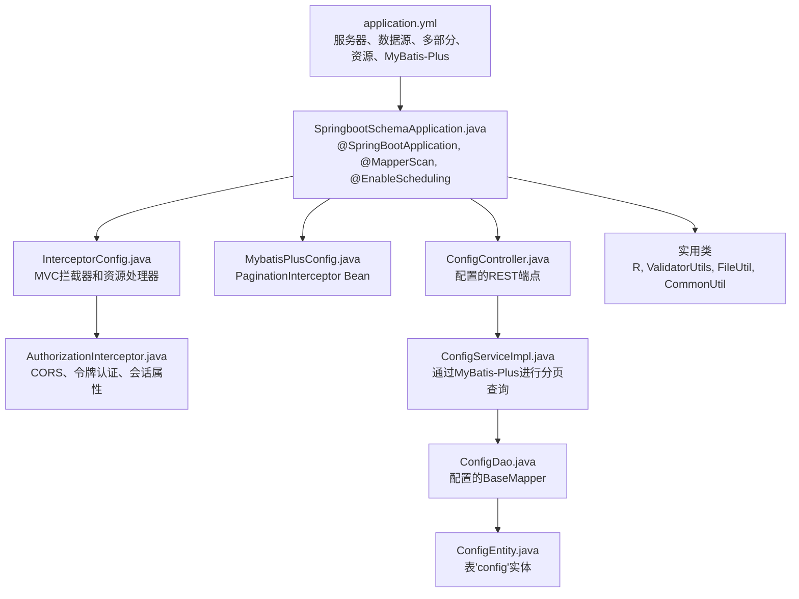
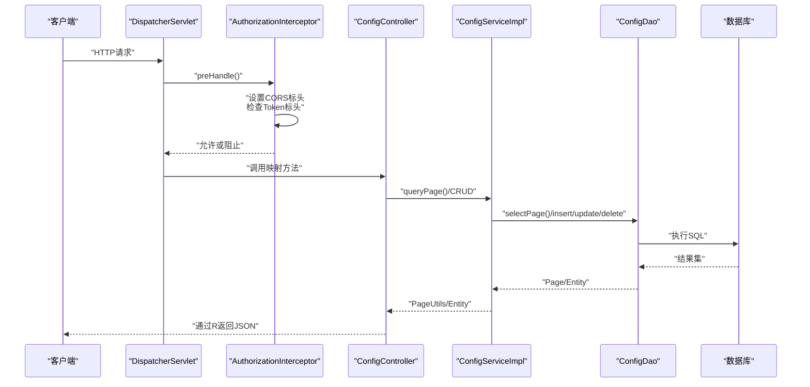
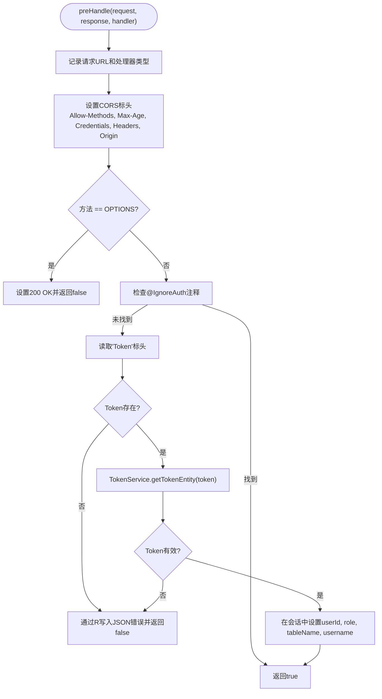
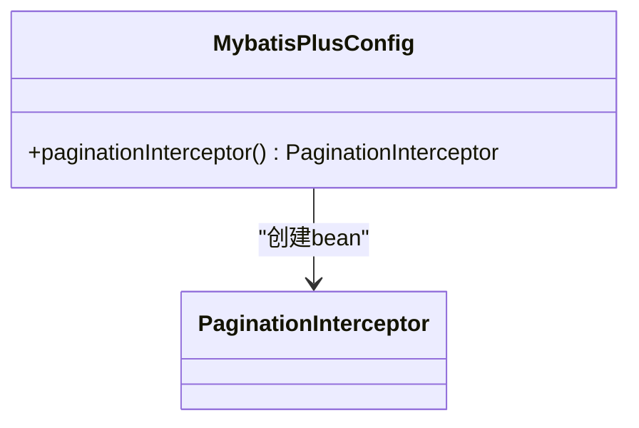
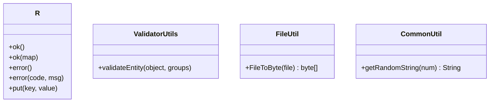
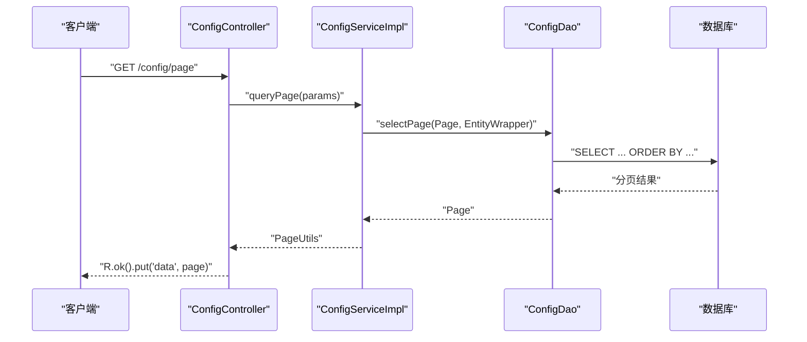
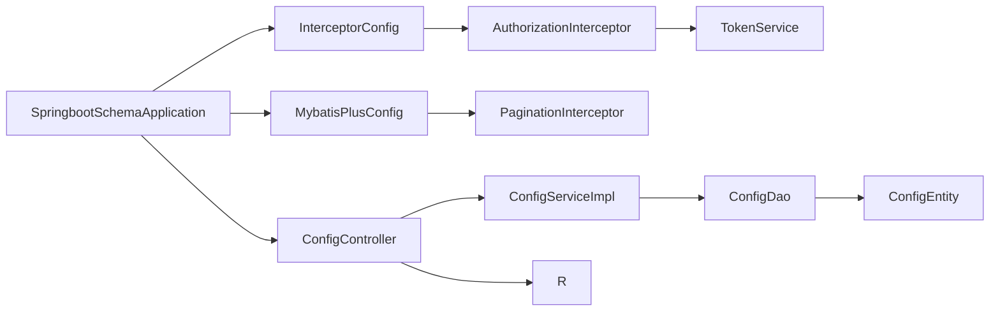

# 配置管理

<cite>
**本文档引用的文件**
- [application.yml](file://src/main/resources/application.yml)
- [InterceptorConfig.java](file://src/main/java/com/config/InterceptorConfig.java)
- [MybatisPlusConfig.java](file://src/main/java/com/config/MybatisPlusConfig.java)
- [AuthorizationInterceptor.java](file://src/main/java/com/interceptor/AuthorizationInterceptor.java)
- [SpringbootSchemaApplication.java](file://src/main/java/com/SpringbootSchemaApplication.java)
- [ConfigController.java](file://src/main/java/com/controller/ConfigController.java)
- [ConfigDao.java](file://src/main/java/com/dao/ConfigDao.java)
- [ConfigEntity.java](file://src/main/java/com/entity/ConfigEntity.java)
- [ConfigServiceImpl.java](file://src/main/java/com/service/impl/ConfigServiceImpl.java)
- [FileUtil.java](file://src/main/java/com/utils/FileUtil.java)
- [CommonUtil.java](file://src/main/java/com/utils/CommonUtil.java)
- [R.java](file://src/main/java/com/utils/R.java)
- [ValidatorUtils.java](file://src/main/java/com/utils/ValidatorUtils.java)
</cite>

## 目录
1. [简介](#简介)
2. [项目结构](#项目结构)
3. [核心组件](#核心组件)
4. [架构概述](#架构概述)
5. [详细组件分析](#详细组件分析)
6. [依赖分析](#依赖分析)
7. [性能考虑](#性能考虑)
8. [故障排除指南](#故障排除指南)
9. [结论](#结论)
10. [附录](#附录)

## 简介
本文档为学生社团活动管理系统提供全面的配置管理指导。它涵盖了application.yml配置（数据库连接、MyBatis Plus设置、静态资源处理、多部分上传和服务器设置）、Spring Boot配置类（InterceptorConfig和MybatisPlusConfig）、用于常见操作和验证的实用配置类、CORS和安全过滤器、日志记录和缓存行为，以及生产部署建议。它还包括常见配置问题的故障排除步骤。

## 项目结构
配置系统涵盖基于YAML的应用设置、Spring MVC配置、MyBatis Plus集成、安全拦截器以及用于验证和响应格式的实用类。应用程序入口点扫描映射器并启用调度。

**图表来源**
- [application.yml:1-53](file://src/main/resources/application.yml#L1-L53)
- [SpringbootSchemaApplication.java:10-13](file://src/main/java/com/SpringbootSchemaApplication.java#L10-L13)
- [InterceptorConfig.java:11-41](file://src/main/java/com/config/InterceptorConfig.java#L11-L41)
- [AuthorizationInterceptor.java:28-105](file://src/main/java/com/interceptor/AuthorizationInterceptor.java#L28-L105)
- [MybatisPlusConfig.java:13-24](file://src/main/java/com/config/MybatisPlusConfig.java#L13-L24)
- [ConfigController.java:27-112](file://src/main/java/com/controller/ConfigController.java#L27-L112)
- [ConfigServiceImpl.java:23-33](file://src/main/java/com/service/impl/ConfigServiceImpl.java#L23-L33)
- [ConfigDao.java:10-12](file://src/main/java/com/dao/ConfigDao.java#L10-L12)
- [ConfigEntity.java:12-53](file://src/main/java/com/entity/ConfigEntity.java#L12-L53)
- [R.java:9-51](file://src/main/java/com/utils/R.java#L9-L51)
- [ValidatorUtils.java:16-39](file://src/main/java/com/utils/ValidatorUtils.java#L16-L39)
- [FileUtil.java:13-27](file://src/main/java/com/utils/FileUtil.java#L13-L27)
- [CommonUtil.java:5-22](file://src/main/java/com/utils/CommonUtil.java#L5-L22)

**本节来源**
- [application.yml:1-53](file://src/main/resources/application.yml#L1-L53)
- [SpringbootSchemaApplication.java:10-13](file://src/main/java/com/SpringbootSchemaApplication.java#L10-L13)

## 核心组件
- 应用YAML配置定义服务器运行时、数据源凭据和URL、多部分上传限制、静态资源位置，以及MyBatis Plus设置，包括映射器位置、类型别名包、全局配置（ID策略、字段策略、下划线转换、刷新映射器、逻辑删除）和MyBatis配置开关。
- InterceptorConfig为选定的API路径注册AuthorizationInterceptor，同时排除静态资源，并为admin、front和upload路径设置资源处理器。
- MybatisPlusConfig注册PaginationInterceptor bean用于分页查询。
- AuthorizationInterceptor强制执行CORS标头，处理预检OPTIONS请求，读取Token标头，针对TokenService进行验证，并在成功认证后填充会话属性。
- 实用类提供标准化响应格式（R）、验证（ValidatorUtils）、文件转换（FileUtil）和随机字符串生成（CommonUtil）。
- ConfigController通过MyBatis Plus暴露REST端点，用于管理存储在config表中的配置记录。

**本节来源**
- [application.yml:9-52](file://src/main/resources/application.yml#L9-L52)
- [InterceptorConfig.java:11-41](file://src/main/java/com/config/InterceptorConfig.java#L11-L41)
- [MybatisPlusConfig.java:13-24](file://src/main/java/com/config/MybatisPlusConfig.java#L13-L24)
- [AuthorizationInterceptor.java:28-105](file://src/main/java/com/interceptor/AuthorizationInterceptor.java#L28-L105)
- [R.java:9-51](file://src/main/java/com/utils/R.java#L9-L51)
- [ValidatorUtils.java:16-39](file://src/main/java/com/utils/ValidatorUtils.java#L16-L39)
- [FileUtil.java:13-27](file://src/main/java/com/utils/FileUtil.java#L13-L27)
- [CommonUtil.java:5-22](file://src/main/java/com/utils/CommonUtil.java#L5-L22)
- [ConfigController.java:27-112](file://src/main/java/com/controller/ConfigController.java#L27-L112)
- [ConfigDao.java:10-12](file://src/main/java/com/dao/ConfigDao.java#L10-L12)
- [ConfigEntity.java:12-53](file://src/main/java/com/entity/ConfigEntity.java#L12-L53)
- [ConfigServiceImpl.java:23-33](file://src/main/java/com/service/impl/ConfigServiceImpl.java#L23-L33)

## 架构概述
配置架构将Spring Boot的外部化配置与MVC拦截器、MyBatis Plus和实用服务集成。下面的流程说明了请求如何遍历配置栈。

**图表来源**
- [AuthorizationInterceptor.java:36-103](file://src/main/java/com/interceptor/AuthorizationInterceptor.java#L36-L103)
- [ConfigController.java:37-110](file://src/main/java/com/controller/ConfigController.java#L37-L110)
- [ConfigServiceImpl.java:25-32](file://src/main/java/com/service/impl/ConfigServiceImpl.java#L25-L32)
- [ConfigDao.java:10-12](file://src/main/java/com/dao/ConfigDao.java#L10-L12)
- [application.yml:9-52](file://src/main/resources/application.yml#L9-L52)

## 详细组件分析

### 应用YAML配置
涵盖的关键领域：
- 服务器：端口、URI编码、上下文路径。
- 数据源：驱动类、JDBC URL、用户名、密码。
- Servlet多部分：上传的最大文件大小和请求大小。
- 静态资源：admin、front、upload和静态资产的位置。
- MyBatis Plus：
  - 映射器位置和类型别名包。
  - 全局配置：id-type、field-strategy、下划线映射、refresh-mapper、逻辑删除值、自定义SQL注入器。
  - MyBatis配置：下划线转驼峰、禁用缓存、在null值上调用setter、null的JDBC类型。

环境特定说明：
- 数据源URL和凭据嵌入在application.yml中。为了环境分离，使用Spring配置文件或环境变量外部化这些值，并在运行时覆盖它们。

属性覆盖和外部化：
- 使用Spring Boot的属性优先级通过命令行参数、环境变量或单独的配置文件（application-dev.yml、application-prod.yml）覆盖值。
- 将敏感值放在环境变量或秘密管理系统中，并使用属性占位符在application.yml中引用它们。

安全性和CORS：
- CORS在AuthorizationInterceptor中根据请求源在运行时配置。确保允许的源与前端部署域对齐。

日志记录和缓存：
- 日志记录由Spring Boot默认处理；仓库快照中没有显式的logback配置。
- MyBatis缓存在MyBatis配置中全局禁用。

**本节来源**
- [application.yml:1-53](file://src/main/resources/application.yml#L1-L53)

### InterceptorConfig和AuthorizationInterceptor
- InterceptorConfig为API命名空间注册AuthorizationInterceptor并排除静态资源。
- AuthorizationInterceptor：
  - 根据传入的Origin动态设置Access-Control-*标头。
  - 处理预检OPTIONS请求并返回200，无需进一步处理。
  - 读取Token标头，通过TokenService验证，并将用户/会话属性存储在HTTP会话中。
  - 使用R返回未授权访问的JSON错误响应。

**图表来源**
- [AuthorizationInterceptor.java:36-103](file://src/main/java/com/interceptor/AuthorizationInterceptor.java#L36-L103)

**本节来源**
- [InterceptorConfig.java:11-41](file://src/main/java/com/config/InterceptorConfig.java#L11-L41)
- [AuthorizationInterceptor.java:28-105](file://src/main/java/com/interceptor/AuthorizationInterceptor.java#L28-L105)

### MyBatis Plus配置
- 注册PaginationInterceptor bean以支持DAO查询中的分页。
- application.yml中的全局MyBatis Plus设置包括：
  - 映射器位置和类型别名包。
  - 全局配置：id-type、field-strategy、下划线映射、refresh-mapper、逻辑删除值、自定义SQL注入器。
  - MyBatis配置：下划线转驼峰、禁用缓存、在null值上调用setter、null的JDBC类型。

**图表来源**
- [MybatisPlusConfig.java:13-24](file://src/main/java/com/config/MybatisPlusConfig.java#L13-L24)

**本节来源**
- [MybatisPlusConfig.java:13-24](file://src/main/java/com/config/MybatisPlusConfig.java#L13-L24)
- [application.yml:29-52](file://src/main/resources/application.yml#L29-L52)

### 实用配置类
- R：标准化JSON响应构建器，具有用于成功/错误的便捷方法。
- ValidatorUtils：Hibernate验证器包装器，在验证失败时抛出域异常。
- FileUtil：将File转换为字节数组以处理二进制数据。
- CommonUtil：为标识符或令牌生成随机字符串。

**图表来源**
- [R.java:9-51](file://src/main/java/com/utils/R.java#L9-L51)
- [ValidatorUtils.java:16-39](file://src/main/java/com/utils/ValidatorUtils.java#L16-L39)
- [FileUtil.java:13-27](file://src/main/java/com/utils/FileUtil.java#L13-L27)
- [CommonUtil.java:5-22](file://src/main/java/com/utils/CommonUtil.java#L5-L22)

**本节来源**
- [R.java:9-51](file://src/main/java/com/utils/R.java#L9-L51)
- [ValidatorUtils.java:16-39](file://src/main/java/com/utils/ValidatorUtils.java#L16-L39)
- [FileUtil.java:13-27](file://src/main/java/com/utils/FileUtil.java#L13-L27)
- [CommonUtil.java:5-22](file://src/main/java/com/utils/CommonUtil.java#L5-L22)

### 通过REST进行配置管理
- ConfigController暴露端点以列出、分页、检索、保存、更新和删除配置条目。
- ConfigServiceImpl使用MyBatis Plus分页和EntityWrapper进行查询。
- ConfigDao扩展BaseMapper用于映射到config表的ConfigEntity。

**图表来源**
- [ConfigController.java:37-42](file://src/main/java/com/controller/ConfigController.java#L37-L42)
- [ConfigServiceImpl.java:25-32](file://src/main/java/com/service/impl/ConfigServiceImpl.java#L25-L32)
- [ConfigDao.java:10-12](file://src/main/java/com/dao/ConfigDao.java#L10-L12)
- [ConfigEntity.java:12-53](file://src/main/java/com/entity/ConfigEntity.java#L12-L53)

**本节来源**
- [ConfigController.java:27-112](file://src/main/java/com/controller/ConfigController.java#L27-L112)
- [ConfigServiceImpl.java:23-33](file://src/main/java/com/service/impl/ConfigServiceImpl.java#L23-L33)
- [ConfigDao.java:10-12](file://src/main/java/com/dao/ConfigDao.java#L10-L12)
- [ConfigEntity.java:12-53](file://src/main/java/com/entity/ConfigEntity.java#L12-L53)

## 依赖分析
- SpringbootSchemaApplication启用对DAO包和调用的扫描，并作为引导程序。
- InterceptorConfig依赖于AuthorizationInterceptor，并使用路径模式和资源处理器注册它。
- AuthorizationInterceptor依赖于TokenService，并使用R进行响应格式设置。
- ConfigController依赖于ConfigService；ConfigServiceImpl依赖于ConfigDao；ConfigDao扩展MyBatis Plus BaseMapper。
- MybatisPlusConfig依赖于PaginationInterceptor。

**图表来源**
- [SpringbootSchemaApplication.java:10-13](file://src/main/java/com/SpringbootSchemaApplication.java#L10-L13)
- [InterceptorConfig.java:11-41](file://src/main/java/com/config/InterceptorConfig.java#L11-L41)
- [AuthorizationInterceptor.java:28-105](file://src/main/java/com/interceptor/AuthorizationInterceptor.java#L28-L105)
- [MybatisPlusConfig.java:13-24](file://src/main/java/com/config/MybatisPlusConfig.java#L13-L24)
- [ConfigController.java:27-112](file://src/main/java/com/controller/ConfigController.java#L27-L112)
- [ConfigServiceImpl.java:23-33](file://src/main/java/com/service/impl/ConfigServiceImpl.java#L23-L33)
- [ConfigDao.java:10-12](file://src/main/java/com/dao/ConfigDao.java#L10-L12)
- [ConfigEntity.java:12-53](file://src/main/java/com/entity/ConfigEntity.java#L12-L53)
- [R.java:9-51](file://src/main/java/com/utils/R.java#L9-L51)

**本节来源**
- [SpringbootSchemaApplication.java:10-13](file://src/main/java/com/SpringbootSchemaApplication.java#L10-L13)
- [InterceptorConfig.java:11-41](file://src/main/java/com/config/InterceptorConfig.java#L11-L41)
- [AuthorizationInterceptor.java:28-105](file://src/main/java/com/interceptor/AuthorizationInterceptor.java#L28-L105)
- [MybatisPlusConfig.java:13-24](file://src/main/java/com/config/MybatisPlusConfig.java#L13-L24)
- [ConfigController.java:27-112](file://src/main/java/com/controller/ConfigController.java#L27-L112)
- [ConfigServiceImpl.java:23-33](file://src/main/java/com/service/impl/ConfigServiceImpl.java#L23-L33)
- [ConfigDao.java:10-12](file://src/main/java/com/dao/ConfigDao.java#L10-L12)
- [ConfigEntity.java:12-53](file://src/main/java/com/entity/ConfigEntity.java#L12-L53)
- [R.java:9-51](file://src/main/java/com/utils/R.java#L9-L51)

## 性能考虑
- MyBatis缓存全局禁用；在写入密集场景下保持此设置，但监控查询性能。
- 通过PaginationInterceptor支持分页；确保查询正确分页以避免大型结果集。
- 多部分上传限制设置为10 MB；根据文件类型和使用模式进行调整。
- 静态资源位置包括类路径和文件系统根目录；在生产环境中确保适当的缓存标头和CDN配置。
- CORS按请求应用；考虑在生产环境中强化允许的源和标头。

[本节提供一般性指导，无需来源]

## 故障排除指南
常见配置问题和解决方案：
- 未授权访问错误：
  - 验证Token标头的存在和有效性；确保TokenService为给定令牌返回非空实体。
  - 确认AuthorizationInterceptor路径模式与端点路由匹配。
- CORS失败：
  - 确保客户端源与拦截器设置的Access-Control-Allow-Origin标头匹配。
  - 验证预检OPTIONS请求收到200响应。
- 静态资源404：
  - 确认/admin/**、/front/**和/upload/**的资源处理器映射正确，并且物理路径存在。
- 上传大小超出：
  - 如有需要，在application.yml中增加multipart.max-file-size和multipart.max-request-size。
- 数据库连接：
  - 验证application.yml中的JDBC URL、驱动类、用户名和密码。
  - 检查数据库主机的网络访问和防火墙规则。
- MyBatis Plus映射错误：
  - 验证映射器XML位置和类型别名包。
  - 确保逻辑删除值和SQL注入器配置符合应用要求。

**本节来源**
- [AuthorizationInterceptor.java:36-103](file://src/main/java/com/interceptor/AuthorizationInterceptor.java#L36-L103)
- [InterceptorConfig.java:19-40](file://src/main/java/com/config/InterceptorConfig.java#L19-L40)
- [application.yml:9-52](file://src/main/resources/application.yml#L9-L52)
- [ConfigController.java:27-112](file://src/main/java/com/controller/ConfigController.java#L27-L112)

## 结论
学生社团活动管理系统的配置管理围绕清晰的关注点分离展开：YAML驱动的应用设置、用于安全性和CORS的MVC拦截器、用于持久化的MyBatis Plus，以及用于一致响应和验证的实用类。通过外部化环境特定属性、仔细管理CORS和身份验证，以及利用分页和静态资源处理器，该系统支持可扩展的开发和生产部署。

[本节进行总结而不分析特定文件，无需来源]

## 附录
- 生产部署建议：
  - 通过环境变量或Spring Cloud Config外部化敏感属性（数据源凭据、服务器上下文路径）。
  - 通过将Access-Control-Allow-Origin限制为受信域来强化CORS。
  - 在负载均衡器上启用HTTPS/TLS终止并强制执行安全cookie。
  - 适当配置日志级别和追加器；考虑结构化日志以进行可观察性。
  - 监控数据库连接池指标并调整MyBatis Plus分页阈值。
  - 对静态资源使用CDN，并在适当位置设置长缓存TTL。

[本节提供一般性指导，无需来源]
