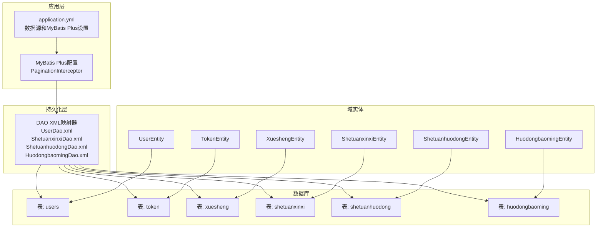
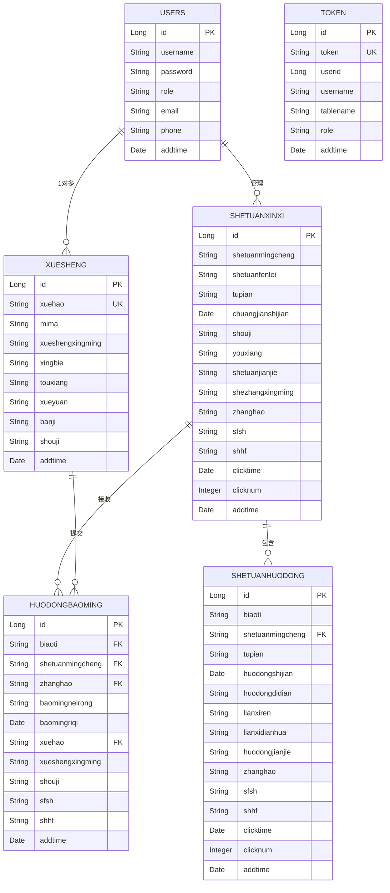
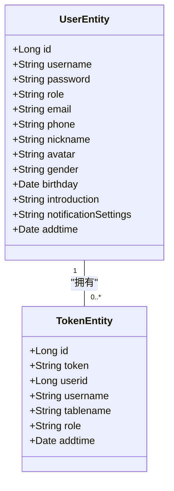
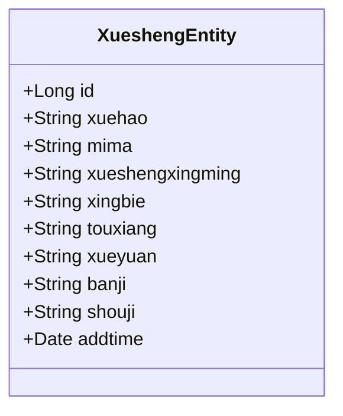
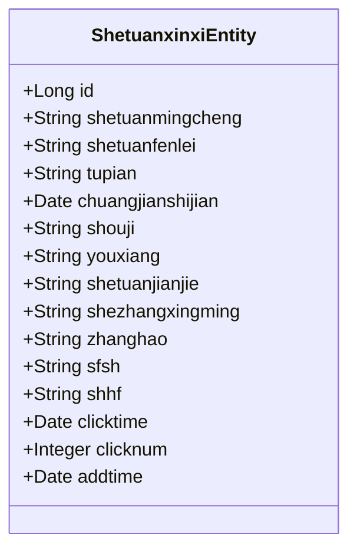
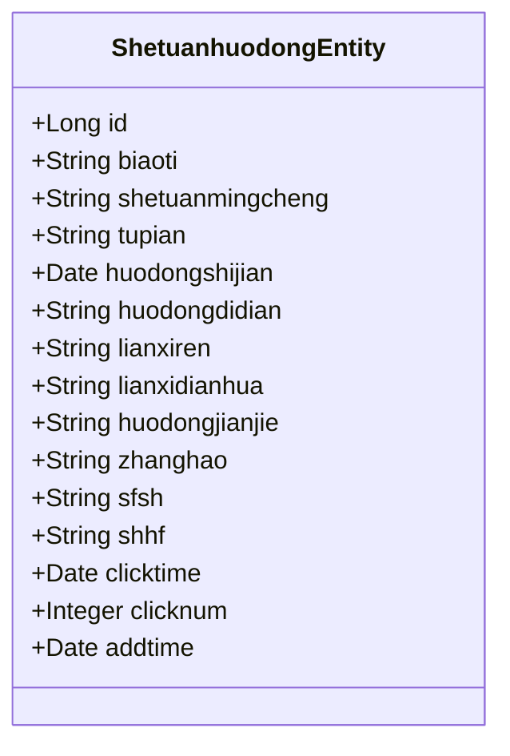
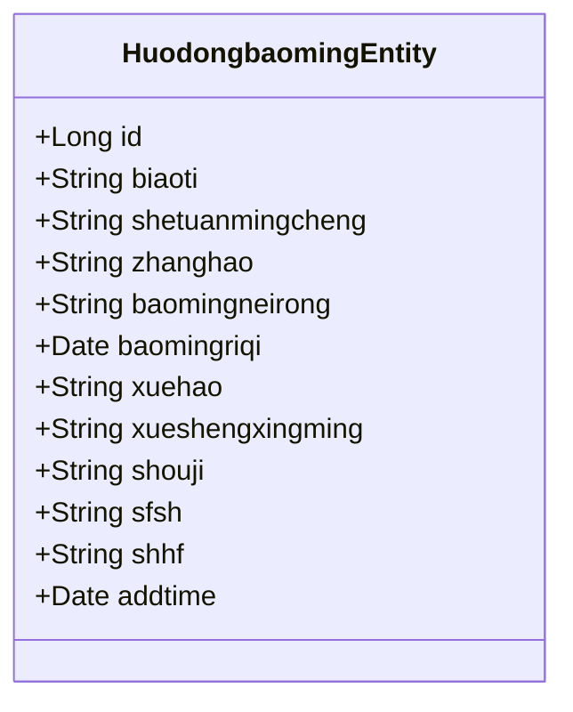
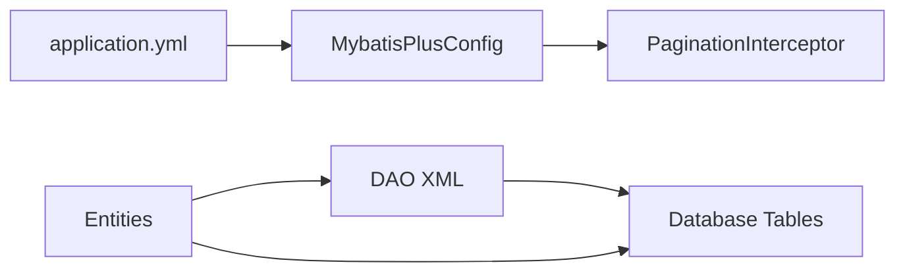

# 数据库设计

<cite>
**本文档引用的文件**
- [application.yml](file://src/main/resources/application.yml)
- [MybatisPlusConfig.java](file://src/main/java/com/config/MybatisPlusConfig.java)
- [UserEntity.java](file://src/main/java/com/entity/UserEntity.java)
- [TokenEntity.java](file://src/main/java/com/entity/TokenEntity.java)
- [XueshengEntity.java](file://src/main/java/com/entity/XueshengEntity.java)
- [ShetuanxinxiEntity.java](file://src/main/java/com/entity/ShetuanxinxiEntity.java)
- [ShetuanhuodongEntity.java](file://src/main/java/com/entity/ShetuanhuodongEntity.java)
- [HuodongbaomingEntity.java](file://src/main/java/com/entity/HuodongbaomingEntity.java)
- [UserDao.xml](file://src/main/resources/mapper/UserDao.xml)
- [ShetuanxinxiDao.xml](file://src/main/resources/mapper/ShetuanxinxiDao.xml)
- [ShetuanhuodongDao.xml](file://src/main/resources/mapper/ShetuanhuodongDao.xml)
- [HuodongbaomingDao.xml](file://src/main/resources/mapper/HuodongbaomingDao.xml)
</cite>

## 目录
1. [简介](#简介)
2. [项目结构](#项目结构)
3. [核心组件](#核心组件)
4. [架构概述](#架构概述)
5. [详细组件分析](#详细组件分析)
6. [依赖分析](#依赖分析)
7. [性能考虑](#性能考虑)
8. [故障排除指南](#故障排除指南)
9. [结论](#结论)
10. [附录](#附录)

## 简介
本文档为学生社团活动管理系统提供全面的数据库设计文档。它详细说明了实体关系模型、表结构、主键、外键以及实体之间的关系。它还记录了用户管理、学生档案、社团信息、事件调度和相关通信记录的数据库模式。解释了约束、索引、验证规则和MyBatis Plus配置，以及实体映射和用于复杂查询的XML映射器配置。包含示例数据结构和关系以阐明业务语义。

## 项目结构
数据库设计使用MyBatis Plus实现，Java实体映射到数据库表。配置集中在application.yml中，并通过配置类启用MyBatis Plus。DAO XML文件定义可重用的SQL查询和结果映射。



**图表来源**
- [application.yml:9-52](file://src/main/resources/application.yml#L9-L52)
- [MybatisPlusConfig.java:14-22](file://src/main/java/com/config/MybatisPlusConfig.java#L14-L22)
- [UserDao.xml:4-11](file://src/main/resources/mapper/UserDao.xml#L4-L11)
- [ShetuanxinxiDao.xml:4-45](file://src/main/resources/mapper/ShetuanxinxiDao.xml#L4-L45)
- [ShetuanhuodongDao.xml:4-43](file://src/main/resources/mapper/ShetuanhuodongDao.xml#L4-L43)
- [HuodongbaomingDao.xml:4-42](file://src/main/resources/mapper/HuodongbaomingDao.xml#L4-L42)

**本节来源**
- [application.yml:9-52](file://src/main/resources/application.yml#L9-L52)
- [MybatisPlusConfig.java:14-22](file://src/main/java/com/config/MybatisPlusConfig.java#L14-L22)

## 核心组件
本节概述了核心数据库实体及其属性，重点关注从注释和XML映射推断的主键、数据类型和约束。

- 用户（users）
  - 主键：id（自增）
  - 属性包括username、password、role、email、phone、nickname、avatar、gender、birthday、introduction、notification settings和时间戳。
  - 验证：相关实体上的注释暗示非空约束；显式验证规则在应用层强制执行。
  - 索引：提供的XML中未定义显式索引；考虑在username和role上添加索引以进行频繁查找。

- 令牌（token）
  - 主键：id（自增）
  - 属性包括token（唯一）、userid、username、tablename、role、addtime。
  - 约束：token字段应有唯一索引以提高查找性能。

- 学生（xuesheng）
  - 主键：id（自增）
  - 属性包括xuehao、mima、xueshengxingming、xingbie、touxiang、xueyuan、banji、shouji、addtime。
  - 验证：xuehao（学号）应该唯一。

- 社团信息（shetuanxinxi）
  - 主键：id（自增）
  - 属性包括shetuanmingcheng、shetuanfenlei、tupian、chuangjianshijian、shouji、youxiang、shetuanjianjie、shezhangxingming、zhanghao、sfsh、shhf、clicktime、clicknum、addtime。
  - 约束：sfsh（是否审核）用于审核工作流。

- 社团活动（shetuanhuodong）
  - 主键：id（自增）
  - 属性包括biaoti、shetuanmingcheng、tupian、huodongshijian、huodongdidian、lianxiren、lianxidianhua、huodongjianjie、zhanghao、sfsh、shhf、clicktime、clicknum、addtime。
  - 关系：通过shetuanmingcheng关联到社团。

- 活动报名（huodongbaoming）
  - 主键：id（自增）
  - 属性包括biaoti、shetuanmingcheng、zhanghao、baomingneirong、baomingriqi、xuehao、xueshengxingming、shouji、sfsh、shhf、addtime。
  - 关系：关联到学生和活动。

**本节来源**
- [UserEntity.java:13-182](file://src/main/java/com/entity/UserEntity.java#L13-L182)
- [TokenEntity.java:13-133](file://src/main/java/com/entity/TokenEntity.java#L13-L133)
- [XueshengEntity.java](file://src/main/java/com/entity/XueshengEntity.java)
- [ShetuanxinxiEntity.java](file://src/main/java/com/entity/ShetuanxinxiEntity.java)
- [ShetuanhuodongEntity.java](file://src/main/java/com/entity/ShetuanhuodongEntity.java)
- [HuodongbaomingEntity.java](file://src/main/java/com/entity/HuodongbaomingEntity.java)

## 架构概述
数据库架构遵循规范化原则，实体表示核心业务概念。MyBatis Plus处理对象关系映射，XML映射器提供复杂查询能力。



**图表来源**
- [UserEntity.java](file://src/main/java/com/entity/UserEntity.java)
- [TokenEntity.java](file://src/main/java/com/entity/TokenEntity.java)
- [XueshengEntity.java](file://src/main/java/com/entity/XueshengEntity.java)
- [ShetuanxinxiEntity.java](file://src/main/java/com/entity/ShetuanxinxiEntity.java)
- [ShetuanhuodongEntity.java](file://src/main/java/com/entity/ShetuanhuodongEntity.java)
- [HuodongbaomingEntity.java](file://src/main/java/com/entity/HuodongbaomingEntity.java)

## 详细组件分析

### 用户和认证表
用户表存储所有系统用户，包括管理员、社团负责人和学生。令牌表管理会话令牌以进行身份验证。



**设计决策:**
- 角色字段区分用户类型（管理员、社长、学生）
- 令牌表支持多表认证
- 密码应在存储前进行哈希处理

**本节来源**
- [UserEntity.java:13-182](file://src/main/java/com/entity/UserEntity.java#L13-L182)
- [TokenEntity.java:13-133](file://src/main/java/com/entity/TokenEntity.java#L13-L133)
- [UserDao.xml:4-11](file://src/main/resources/mapper/UserDao.xml#L4-L11)

### 学生管理表
学生表存储学生特定信息，包括学术详情和联系方式。



**设计决策:**
- 学号（xuehao）作为业务唯一标识符
- 独立于用户表以存储特定于学生的属性
- 与用户表通过用户名关联

**本节来源**
- [XueshengEntity.java](file://src/main/java/com/entity/XueshengEntity.java)

### 社团信息表
社团信息表存储社团详细信息，包括分类、联系方式和审核状态。



**设计决策:**
- sfsh（是否审核）支持审核工作流
- shhf（审核回复）存储审核反馈
- clicknum用于流行度跟踪
- 通过zhanghao关联到社团负责人账户

**本节来源**
- [ShetuanxinxiEntity.java](file://src/main/java/com/entity/ShetuanxinxiEntity.java)
- [ShetuanxinxiDao.xml:4-45](file://src/main/resources/mapper/ShetuanxinxiDao.xml#L4-L45)

### 社团活动表
社团活动表管理由社团组织的事件。



**设计决策:**
- 通过shetuanmingcheng外键关联到社团
- 包含事件调度的详细字段
- 审核工作流与社团信息类似
- 联系信息便于参与者沟通

**本节来源**
- [ShetuanhuodongEntity.java](file://src/main/java/com/entity/ShetuanhuodongEntity.java)
- [ShetuanhuodongDao.xml:4-43](file://src/main/resources/mapper/ShetuanhuodongDao.xml#L4-L43)

### 活动报名表
活动报名表跟踪学生对活动的注册。



**设计决策:**
- 存储申请人详细信息以实现数据独立性
- sfsh允许社团负责人审核申请
- 通过多个字段关联到学生和社团
- baomingneirong支持自定义申请内容

**本节来源**
- [HuodongbaomingEntity.java](file://src/main/java/com/entity/HuodongbaomingEntity.java)
- [HuodongbaomingDao.xml:4-42](file://src/main/resources/mapper/HuodongbaomingDao.xml#L4-L42)

## 依赖分析
数据库设计通过MyBatis Plus与应用程序紧密集成：



**配置要点:**
- application.yml定义数据源连接
- MybatisPlusConfig启用分页
- DAO XML提供自定义查询
- 实体注释映射表结构

**本节来源**
- [application.yml:9-52](file://src/main/resources/application.yml#L9-L52)
- [MybatisPlusConfig.java:14-22](file://src/main/java/com/config/MybatisPlusConfig.java#L14-L22)

## 性能考虑

### 索引建议
1. **users表**
   - username上的唯一索引
   - role上的索引（如果按角色频繁过滤）

2. **token表**
   - token字段上的唯一索引（已有）
   - userid上的索引以进行快速查找

3. **xuesheng表**
   - xuehao上的唯一索引（业务键）

4. **shetuanxinxi表**
   - shetuanfenlei上的索引（分类过滤）
   - sfsh上的索引（审核状态查询）

5. **shetuanhuodong表**
   - shetuanmingcheng上的索引（社团活动查询）
   - huodongshijian上的索引（时间范围查询）

6. **huodongbaoming表**
   - xuehao上的索引（学生申请查询）
   - biaoti上的索引（活动申请查询）

### 查询优化
- 使用MyBatis Plus分页避免大型结果集
- 在DAO XML中使用显式列选择而非SELECT *
- 在适当的查询中使用JOIN而非N+1查询
- 考虑经常访问数据的缓存策略

### 数据完整性
- 在应用层强制执行外键约束
- 使用事务确保相关操作的一致性
- 实现软删除（逻辑删除）以保留历史数据

[本节提供一般性指导，无需来源]

## 故障排除指南

### 常见问题

**连接问题:**
- 验证application.yml中的数据源URL、用户名和密码
- 确保MySQL服务器正在运行并可访问
- 检查防火墙和网络配置

**映射错误:**
- 确认实体注释与表结构匹配
- 验证DAO XML中的列名
- 检查类型处理器配置

**性能问题:**
- 分析慢查询并添加适当的索引
- 使用EXPLAIN分析查询计划
- 监控连接池使用情况

**数据一致性问题:**
- 确保事务边界正确
- 验证应用层的外键约束
- 实施数据验证规则

**本节来源**
- [application.yml:9-52](file://src/main/resources/application.yml#L9-L52)

## 结论
数据库设计为学生社团活动管理系统提供了坚实的数据基础。关键特点包括：

- 规范化的表结构减少数据冗余
- 通过实体和XML映射灵活使用MyBatis Plus
- 支持审核工作流的审核状态字段
- 通过令牌表进行安全的身份验证
- 用于性能优化的索引建议
- 用于数据完整性的约束和验证

该设计支持系统的功能需求，同时为未来增强提供可扩展性。

## 附录

### 数据字典

#### users表
| 列名 | 类型 | 约束 | 描述 |
|------|------|------|------|
| id | BIGINT | PK, AUTO_INCREMENT | 用户ID |
| username | VARCHAR | NOT NULL | 用户名 |
| password | VARCHAR | NOT NULL | 密码 |
| role | VARCHAR | | 角色 |
| email | VARCHAR | | 邮箱 |
| phone | VARCHAR | | 电话 |
| nickname | VARCHAR | | 昵称 |
| avatar | VARCHAR | | 头像 |
| gender | VARCHAR | | 性别 |
| birthday | DATE | | 生日 |
| introduction | TEXT | | 简介 |
| notificationSettings | TEXT | | 通知设置 |
| addtime | DATETIME | | 创建时间 |

#### token表
| 列名 | 类型 | 约束 | 描述 |
|------|------|------|------|
| id | BIGINT | PK, AUTO_INCREMENT | 令牌ID |
| token | VARCHAR | UNIQUE | 令牌值 |
| userid | BIGINT | | 用户ID |
| username | VARCHAR | | 用户名 |
| tablename | VARCHAR | | 表名 |
| role | VARCHAR | | 角色 |
| addtime | DATETIME | | 创建时间 |

#### xuesheng表
| 列名 | 类型 | 约束 | 描述 |
|------|------|------|------|
| id | BIGINT | PK, AUTO_INCREMENT | 学生ID |
| xuehao | VARCHAR | UNIQUE | 学号 |
| mima | VARCHAR | NOT NULL | 密码 |
| xueshengxingming | VARCHAR | | 学生姓名 |
| xingbie | VARCHAR | | 性别 |
| touxiang | VARCHAR | | 头像 |
| xueyuan | VARCHAR | | 学院 |
| banji | VARCHAR | | 班级 |
| shouji | VARCHAR | | 手机 |
| addtime | DATETIME | | 创建时间 |

#### shetuanxinxi表
| 列名 | 类型 | 约束 | 描述 |
|------|------|------|------|
| id | BIGINT | PK, AUTO_INCREMENT | 社团ID |
| shetuanmingcheng | VARCHAR | | 社团名称 |
| shetuanfenlei | VARCHAR | | 社团分类 |
| tupian | VARCHAR | | 图片 |
| chuangjianshijian | DATE | | 创建时间 |
| shouji | VARCHAR | | 手机 |
| youxiang | VARCHAR | | 邮箱 |
| shetuanjianjie | TEXT | | 社团简介 |
| shezhangxingming | VARCHAR | | 社长姓名 |
| zhanghao | VARCHAR | | 账号 |
| sfsh | VARCHAR | | 是否审核 |
| shhf | TEXT | | 审核回复 |
| clicktime | DATETIME | | 点击时间 |
| clicknum | INT | | 点击次数 |
| addtime | DATETIME | | 创建时间 |

#### shetuanhuodong表
| 列名 | 类型 | 约束 | 描述 |
|------|------|------|------|
| id | BIGINT | PK, AUTO_INCREMENT | 活动ID |
| biaoti | VARCHAR | | 标题 |
| shetuanmingcheng | VARCHAR | FK | 社团名称 |
| tupian | VARCHAR | | 图片 |
| huodongshijian | DATE | | 活动时间 |
| huodongdidian | VARCHAR | | 活动地点 |
| lianxiren | VARCHAR | | 联系人 |
| lianxidianhua | VARCHAR | | 联系电话 |
| huodongjianjie | TEXT | | 活动简介 |
| zhanghao | VARCHAR | | 账号 |
| sfsh | VARCHAR | | 是否审核 |
| shhf | TEXT | | 审核回复 |
| clicktime | DATETIME | | 点击时间 |
| clicknum | INT | | 点击次数 |
| addtime | DATETIME | | 创建时间 |

#### huodongbaoming表
| 列名 | 类型 | 约束 | 描述 |
|------|------|------|------|
| id | BIGINT | PK, AUTO_INCREMENT | 报名ID |
| biaoti | VARCHAR | FK | 活动标题 |
| shetuanmingcheng | VARCHAR | FK | 社团名称 |
| zhanghao | VARCHAR | FK | 账号 |
| baomingneirong | TEXT | | 报名内容 |
| baomingriqi | DATE | | 报名日期 |
| xuehao | VARCHAR | FK | 学号 |
| xueshengxingming | VARCHAR | | 学生姓名 |
| shouji | VARCHAR | | 手机 |
| sfsh | VARCHAR | | 是否审核 |
| shhf | TEXT | | 审核回复 |
| addtime | DATETIME | | 创建时间 |

### MyBatis Plus配置

**application.yml关键设置:**
```yaml
mybatis-plus:
  mapper-locations: classpath:mapper/*.xml
  type-aliases-package: com.entity
  global-config:
    id-type: 0  # AUTO
    field-strategy: 2  # NOT_NULL
    db-column-underline: true
    refresh-mapper: true
    logic-delete-value: 1
    logic-not-delete-value: 0
  configuration:
    map-underscore-to-camel-case: true
    cache-enabled: false
    call-setters-on-nulls: true
    jdbc-type-for-null: 'null'
```

**本节来源**
- [application.yml:28-52](file://src/main/resources/application.yml#L28-L52)
- [MybatisPlusConfig.java:14-22](file://src/main/java/com/config/MybatisPlusConfig.java#L14-L22)
