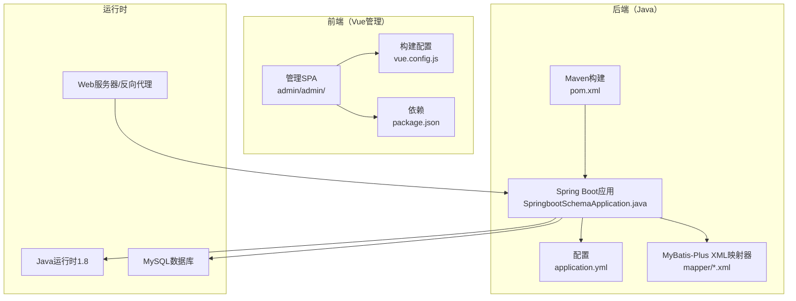
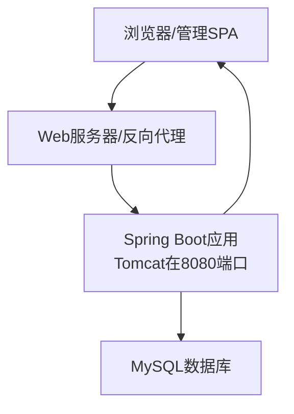
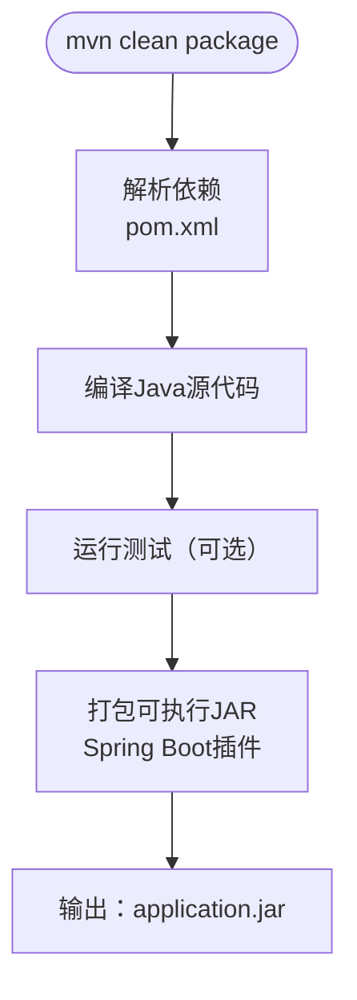
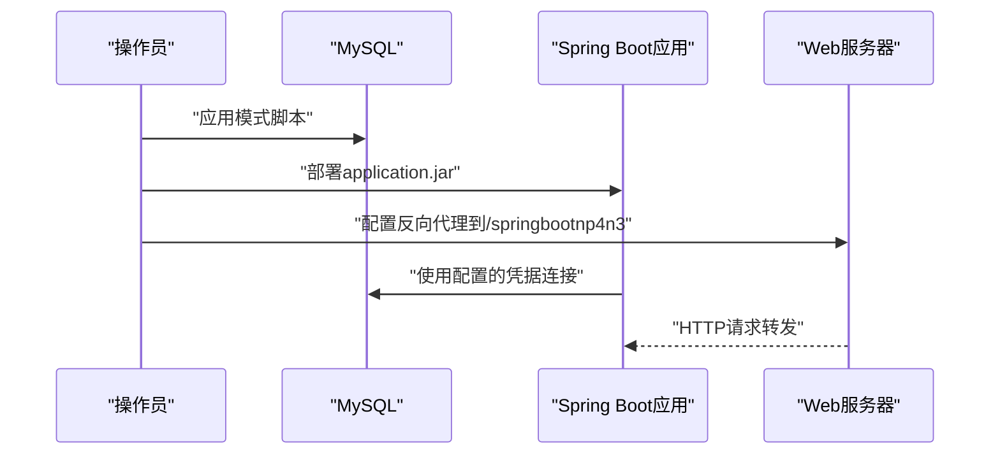
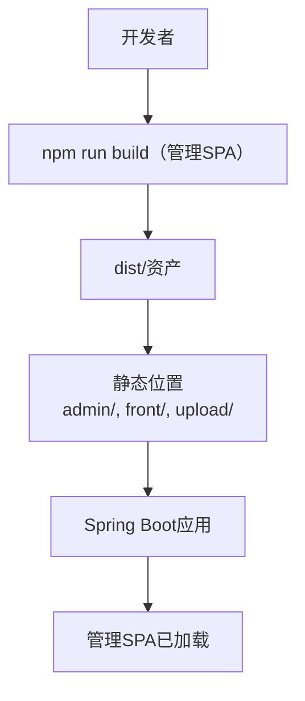
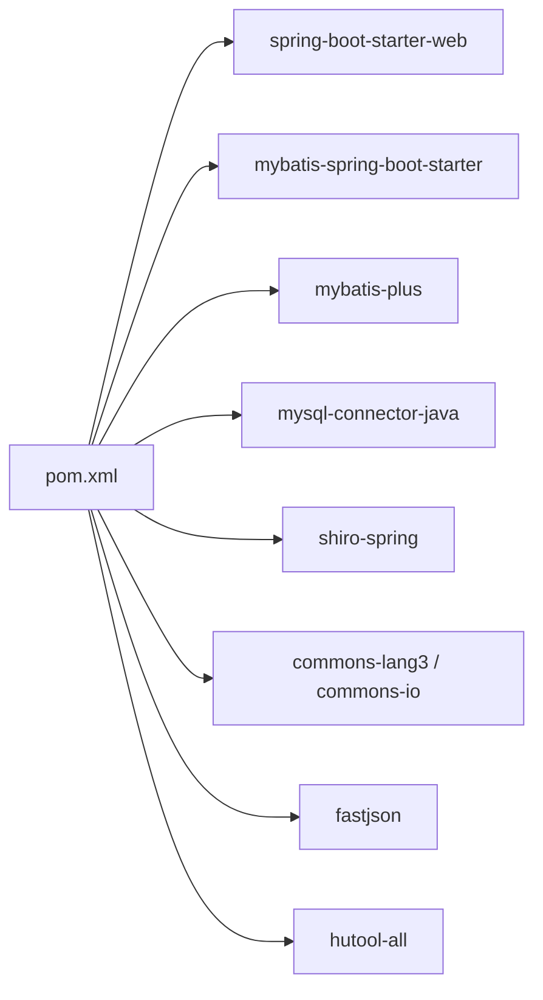

# 部署指南

<cite>
**本文档引用的文件**
- [pom.xml](file://pom.xml)
- [application.yml](file://src/main/resources/application.yml)
- [SpringbootSchemaApplication.java](file://src/main/java/com/SpringbootSchemaApplication.java)
- [database_changes.sql](file://docs1/database_changes.sql)
- [new_database_changes.sql](file://docs1/new_database_changes.sql)
- [vue.config.js](file://src/main/resources/admin/admin/vue.config.js)
- [package.json](file://src/main/resources/admin/admin/package.json)
- [XiaoxiTimerTask.java](file://src/main/java/com/timer/XiaoxiTimerTask.java)
</cite>

## 目录
1. [简介](#简介)
2. [项目结构](#项目结构)
3. [核心组件](#核心组件)
4. [架构概述](#架构概述)
5. [详细组件分析](#详细组件分析)
6. [依赖分析](#依赖分析)
7. [性能考虑](#性能考虑)
8. [故障排除指南](#故障排除指南)
9. [结论](#结论)
10. [附录](#附录)

## 简介
本指南为学生社团活动管理系统提供端到端的部署说明。它涵盖Maven构建和打包、生产部署步骤（环境设置、数据库迁移、应用服务器配置）、基础设施要求、环境特定配置、秘密管理、数据库迁移和备份策略、性能优化、监控和日志记录、健康检查、维护、故障排除、回滚和灾难恢复。

## 项目结构
该项目是一个Spring Boot应用程序，后端使用Java构建，前端使用Vue.js管理界面。后端使用Spring Web MVC、MyBatis-Plus、MySQL和Apache Shiro进行安全保护。前端通过Vue CLI打包，由Spring Boot静态资源位置提供服务。

**图表来源**
- [SpringbootSchemaApplication.java:1-24](file://src/main/java/com/SpringbootSchemaApplication.java#L1-L24)
- [pom.xml:1-125](file://pom.xml#L1-L125)
- [application.yml:1-53](file://src/main/resources/application.yml#L1-L53)
- [vue.config.js:1-63](file://src/main/resources/admin/admin/vue.config.js#L1-L63)
- [package.json:1-63](file://src/main/resources/admin/admin/package.json#L1-L63)

**本节来源**
- [pom.xml:1-125](file://pom.xml#L1-L125)
- [application.yml:1-53](file://src/main/resources/application.yml#L1-L53)
- [SpringbootSchemaApplication.java:1-24](file://src/main/java/com/SpringbootSchemaApplication.java#L1-L24)
- [vue.config.js:1-63](file://src/main/resources/admin/admin/vue.config.js#L1-L63)
- [package.json:1-63](file://src/main/resources/admin/admin/package.json#L1-L63)

## 核心组件
- 后端应用入口点和扫描配置
  - 应用类启用调度并扫描MyBatis-Plus的DAO包。
  - 参考：[SpringbootSchemaApplication.java:10-12](file://src/main/java/com/SpringbootSchemaApplication.java#L10-L12)
- 数据库配置和静态资源服务
  - 配置数据源URL、凭据和驱动程序。
  - 静态位置包括admin、front和upload目录。
  - 参考：[application.yml:9-26](file://src/main/resources/application.yml#L9-L26)
- Maven构建和打包
  - 使用Spring Boot Maven Plugin进行可执行JAR打包。
  - 依赖包括Spring Web、MyBatis-Plus、MySQL Connector、Apache Shiro等。
  - 参考：[pom.xml:22-113](file://pom.xml#L22-L113)，[pom.xml:115-122](file://pom.xml#L115-L122)
- 前端构建流水线
  - Vue CLI脚本用于开发和生产构建。
  - 开发服务器代理目标为后端上下文路径。
  - 参考：[package.json:5-10](file://src/main/resources/admin/admin/package.json#L5-L10)，[vue.config.js:34-44](file://src/main/resources/admin/admin/vue.config.js#L34-L44)

**本节来源**
- [SpringbootSchemaApplication.java:10-12](file://src/main/java/com/SpringbootSchemaApplication.java#L10-L12)
- [application.yml:9-26](file://src/main/resources/application.yml#L9-L26)
- [pom.xml:22-113](file://pom.xml#L22-L113)
- [pom.xml:115-122](file://pom.xml#L115-L122)
- [package.json:5-10](file://src/main/resources/admin/admin/package.json#L5-L10)
- [vue.config.js:34-44](file://src/main/resources/admin/admin/vue.config.js#L34-L44)

## 架构概述
系统包括：
- 后端：Spring Boot应用暴露REST端点并提供静态资产服务。
- 数据库：MySQL，模式由SQL脚本管理。
- 前端：使用Vue.js构建的管理SPA，在后端的静态资源位置下提供服务。
- 基础设施：Java 1.8运行时、MySQL和Web服务器或反向代理。

**图表来源**
- [application.yml:2-7](file://src/main/resources/application.yml#L2-L7)
- [application.yml:10-14](file://src/main/resources/application.yml#L10-L14)

**本节来源**
- [application.yml:2-7](file://src/main/resources/application.yml#L2-L7)
- [application.yml:10-14](file://src/main/resources/application.yml#L10-L14)

## 详细组件分析

### Maven构建和打包
- 构建生命周期
  - Spring Boot Maven Plugin配置用于打包可执行JAR。
  - 参考：[pom.xml:115-122](file://pom.xml#L115-L122)
- 依赖解析和产物
  - 核心依赖包括Spring Web、MyBatis-Plus、MySQL Connector、Apache Shiro、commons-lang3、protobuf、FastJSON和Hutool。
  - 产物类型为JAR；打包由插件处理。
  - 参考：[pom.xml:22-113](file://pom.xml#L22-L113)
- 打包输出
  - 由Spring Boot插件生成的可执行JAR；适用于容器化或VM部署。
  - 参考：[pom.xml:115-122](file://pom.xml#L115-L122)

**图表来源**
- [pom.xml:115-122](file://pom.xml#L115-L122)
- [pom.xml:22-113](file://pom.xml#L22-L113)

**本节来源**
- [pom.xml:22-113](file://pom.xml#L22-L113)
- [pom.xml:115-122](file://pom.xml#L115-L122)

### 生产部署程序
- 环境设置
  - 安装Java 1.8运行时。
  - 配置MySQL服务器并创建目标数据库。
  - 配置Web服务器或反向代理以将请求转发到后端上下文路径。
  - 参考：[application.yml:2-7](file://src/main/resources/application.yml#L2-L7)，[application.yml:10-14](file://src/main/resources/application.yml#L10-L14)
- 数据库迁移
  - 应用提供的SQL脚本中的模式更新。
  - 参考：[database_changes.sql:1-18](file://docs1/database_changes.sql#L1-L18)，[new_database_changes.sql:1-29](file://docs1/new_database_changes.sql#L1-L29)
- 应用服务器配置
  - 根据需要设置server.port和context-path。
  - 配置静态资源位置以服务admin和front资产。
  - 参考：[application.yml:2-7](file://src/main/resources/application.yml#L2-L7)，[application.yml:25-26](file://src/main/resources/application.yml#L25-L26)
- 秘密管理
  - 通过环境变量或外部化配置外部化敏感值（数据库凭据、JWT秘密）。
  - 参考：[application.yml:10-14](file://src/main/resources/application.yml#L10-L14)

**图表来源**
- [application.yml:2-7](file://src/main/resources/application.yml#L2-L7)
- [application.yml:10-14](file://src/main/resources/application.yml#L10-L14)
- [database_changes.sql:1-18](file://docs1/database_changes.sql#L1-L18)
- [new_database_changes.sql:1-29](file://docs1/new_database_changes.sql#L1-L29)

**本节来源**
- [application.yml:2-7](file://src/main/resources/application.yml#L2-L7)
- [application.yml:10-14](file://src/main/resources/application.yml#L10-L14)
- [application.yml:25-26](file://src/main/resources/application.yml#L25-L26)
- [database_changes.sql:1-18](file://docs1/database_changes.sql#L1-L18)
- [new_database_changes.sql:1-29](file://docs1/new_database_changes.sql#L1-L29)

### 环境特定配置和属性处理
- 活动配置文件和属性优先级
  - 使用Spring Boot特定于配置文件的属性（例如，application-prod.yml）覆盖默认值。
  - 通过环境变量和命令行参数外部化配置。
- 属性占位符
  - 将JDBC凭据和其他秘密保留在版本控制文件之外；从环境加载。
- 静态资源
  - 确保static-locations包括admin、front和upload目录以提供资产服务。
  - 参考：[application.yml:25-26](file://src/main/resources/application.yml#L25-L26)

**本节来源**
- [application.yml:25-26](file://src/main/resources/application.yml#L25-L26)

### 数据库迁移程序和模式更新
- 初始模式创建
  - 应用初始模式脚本以创建所需表。
  - 参考：[database_changes.sql:5-17](file://docs1/database_changes.sql#L5-L17)
- 增量变更
  - 应用新功能的增量脚本（例如，评论、标签）。
  - 参考：[new_database_changes.sql:6-28](file://docs1/new_database_changes.sql#L6-L28)
- 备份策略
  - 在应用迁移之前使用mysqldump进行逻辑备份。
  - 维护版本化备份和校验和以进行验证。
- 回滚程序
  - 维护可逆迁移脚本或使用备份进行时间点恢复。

**本节来源**
- [database_changes.sql:5-17](file://docs1/database_changes.sql#L5-L17)
- [new_database_changes.sql:6-28](file://docs1/new_database_changes.sql#L6-L28)

### 前端构建和交付
- 管理SPA构建
  - 使用Vue CLI脚本为生产环境构建管理界面。
  - 参考：[package.json:5-10](file://src/main/resources/admin/admin/package.json#L5-L10)
- 静态资源服务
  - 后端从配置的静态位置提供admin和front资产。
  - 参考：[application.yml:25-26](file://src/main/resources/application.yml#L25-L26)
- 开发代理
  - 开发服务器将API请求代理到后端上下文路径。
  - 参考：[vue.config.js:34-44](file://src/main/resources/admin/admin/vue.config.js#L34-L44)

**图表来源**
- [package.json:5-10](file://src/main/resources/admin/admin/package.json#L5-L10)
- [application.yml:25-26](file://src/main/resources/application.yml#L25-L26)

**本节来源**
- [package.json:5-10](file://src/main/resources/admin/admin/package.json#L5-L10)
- [application.yml:25-26](file://src/main/resources/application.yml#L25-L26)
- [vue.config.js:34-44](file://src/main/resources/admin/admin/vue.config.js#L34-L44)

### 监控、日志记录、健康检查和维护
- 日志记录
  - 通过application.yml或外部配置配置logback/log4j2；为生产环境设置级别。
- 健康检查
  - 暴露actuator端点（如果启用）用于活性/就绪性探测。
- 维护
  - 调度清理任务和定期维护作业。
  - 参考：[SpringbootSchemaApplication.java:12](file://src/main/java/com/SpringbootSchemaApplication.java#L12)

**本节来源**
- [SpringbootSchemaApplication.java:12](file://src/main/java/com/SpringbootSchemaApplication.java#L12)

### 性能优化
- JVM调优
  - 分配适当的堆大小（-Xms/-Xmx）并根据工作负载调优GC。
- 数据库优化
  - 使用连接池、预编译语句和适当的索引。
  - 启用慢查询日志并分析查询。
- 缓存
  - 为频繁访问的数据引入Redis或Ehcache；避免在没有无效化的情况下缓存可变实体。
- 静态资产
  - 通过CDN提供admin/front资产，或在Web服务器上启用压缩/gzip。

[本节提供一般性指导，无需来源]

### 故障排除指南
- 常见部署问题
  - 端口冲突：在application.yml中更改server.port。
  - 数据库连接：验证JDBC URL、凭据和网络访问。
  - 静态资产缺失：确认static-locations包括admin/front/upload。
  - CORS错误：在Web服务器或Spring Security中配置允许的源。
- 回滚程序
  - 恢复到上次已知的良好数据库备份并重新部署以前的应用版本。
- 灾难恢复
  - 维护异地备份，自动化每日转储，并每月测试恢复程序。

[本节提供一般性指导，无需来源]

## 依赖分析
后端依赖于Spring Boot、MyBatis-Plus、MySQL Connector、Apache Shiro和实用库。前端依赖于Vue生态系统包。

**图表来源**
- [pom.xml:22-113](file://pom.xml#L22-L113)

**本节来源**
- [pom.xml:22-113](file://pom.xml#L22-L113)

## 性能考虑
- JVM调优
  - 根据流量和内存使用情况调整堆大小和GC设置。
- 数据库优化
  - 使用EXPLAIN计划，添加索引，并限制N+1查询。
- 缓存策略
  - 使用TTL缓存读取频繁的数据，并在写入时失效。
- 前端交付
  - 捆绑和压缩管理资产；在Web服务器上启用gzip/HTTP2。

[本节提供一般性指导，无需来源]

## 故障排除指南
- 连接和配置
  - 验证server.port、context-path和数据源属性。
  - 参考：[application.yml:2-7](file://src/main/resources/application.yml#L2-L7)，[application.yml:10-14](file://src/main/resources/application.yml#L10-L14)
- 静态资产未加载
  - 确保static-locations包括admin、front和upload。
  - 参考：[application.yml:25-26](file://src/main/resources/application.yml#L25-L26)
- 开发期间的前端代理
  - 确认devServer代理目标与后端上下文路径匹配。
  - 参考：[vue.config.js:34-44](file://src/main/resources/admin/admin/vue.config.js#L34-L44)

**本节来源**
- [application.yml:2-7](file://src/main/resources/application.yml#L2-L7)
- [application.yml:10-14](file://src/main/resources/application.yml#L10-L14)
- [application.yml:25-26](file://src/main/resources/application.yml#L25-L26)
- [vue.config.js:34-44](file://src/main/resources/admin/admin/vue.config.js#L34-L44)

## 结论
本指南概述了学生社团活动管理系统的完整部署工作流，涵盖Maven打包、环境设置、数据库迁移、配置管理、性能调优、监控和操作程序。遵守这些实践可确保可靠、可维护和可扩展的操作。

## 附录
- 额外运行时说明
  - 启用通知提醒的调度任务。
  - 参考：[SpringbootSchemaApplication.java:12](file://src/main/java/com/SpringbootSchemaApplication.java#L12)，[XiaoxiTimerTask.java](file://src/main/java/com/timer/XiaoxiTimerTask.java)

**本节来源**
- [SpringbootSchemaApplication.java:12](file://src/main/java/com/SpringbootSchemaApplication.java#L12)
- [XiaoxiTimerTask.java](file://src/main/java/com/timer/XiaoxiTimerTask.java)
