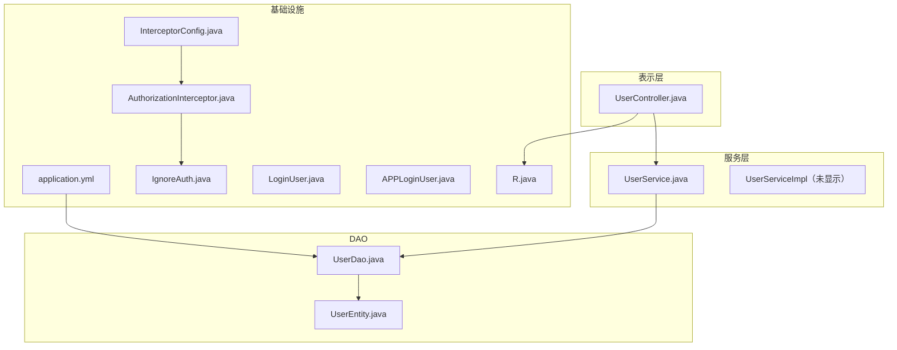
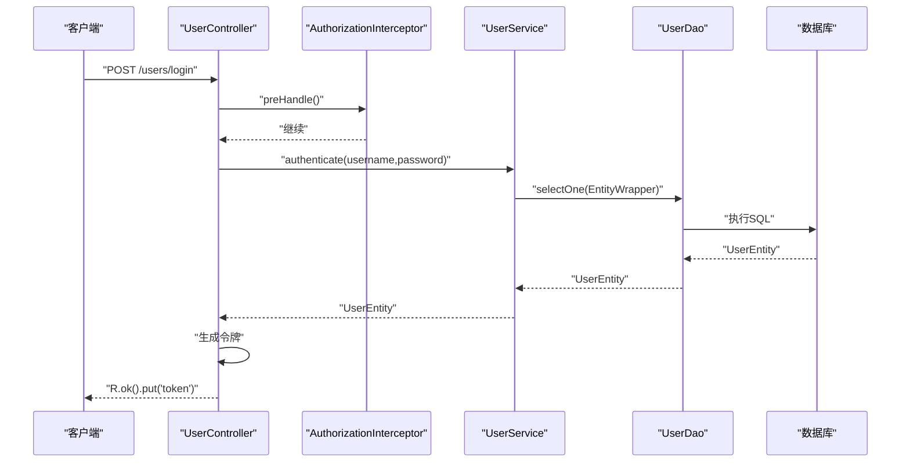
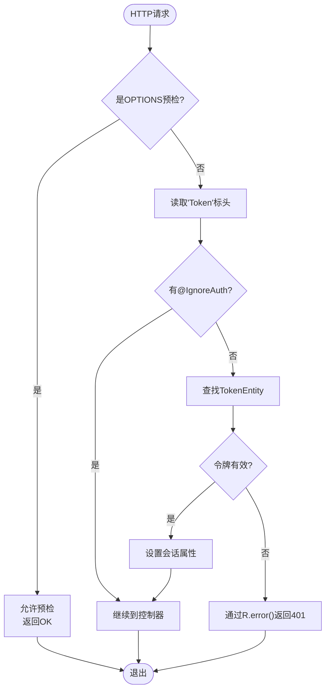
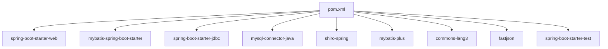

# 开发指南

<cite>
**本文档引用的文件**
- [SpringbootSchemaApplication.java](file://src/main/java/com/SpringbootSchemaApplication.java)
- [pom.xml](file://pom.xml)
- [application.yml](file://src/main/resources/application.yml)
- [InterceptorConfig.java](file://src/main/java/com/config/InterceptorConfig.java)
- [AuthorizationInterceptor.java](file://src/main/java/com/interceptor/AuthorizationInterceptor.java)
- [IgnoreAuth.java](file://src/main/java/com/annotation/IgnoreAuth.java)
- [LoginUser.java](file://src/main/java/com/annotation/LoginUser.java)
- [APPLoginUser.java](file://src/main/java/com/annotation/APPLoginUser.java)
- [UserEntity.java](file://src/main/java/com/entity/UserEntity.java)
- [UserDao.java](file://src/main/java/com/dao/UserDao.java)
- [UserService.java](file://src/main/java/com/service/UserService.java)
- [UserController.java](file://src/main/java/com/controller/UserController.java)
- [R.java](file://src/main/java/com/utils/R.java)
</cite>

## 目录
1. [简介](#简介)
2. [项目结构](#项目结构)
3. [核心组件](#核心组件)
4. [架构概述](#架构概述)
5. [详细组件分析](#详细组件分析)
6. [依赖分析](#依赖分析)
7. [性能考虑](#性能考虑)
8. [故障排除指南](#故障排除指南)
9. [结论](#结论)
10. [附录](#附录)

## 简介
本文档为学生社团活动管理系统提供全面的开发指南。它建立了编码标准、符合MVC模式的项目结构规则、注释使用、实体模型模式、服务和DAO约定、控制器端点设计、测试和质量实践、Maven配置，以及在保持一致性的同时添加和扩展功能的策略。

## 项目结构
项目遵循分层的MVC架构，关注点清晰分离：
- 表示层：控制器为每个域资源暴露REST端点。
- 服务层：服务封装业务逻辑并协调数据操作。
- 数据访问层：DAO定义持久化契约；MyBatis-Plus通过XML文件处理SQL映射。
- 模型层：实体表示持久化状态；视图和VO支持特定于表示的投影。
- 基础设施：注释、拦截器、配置和实用类支持横切关注点。

**图表来源**
- [application.yml:1-53](file://src/main/resources/application.yml#L1-L53)
- [AuthorizationInterceptor.java:1-105](file://src/main/java/com/interceptor/AuthorizationInterceptor.java#L1-L105)
- [InterceptorConfig.java:1-42](file://src/main/java/com/config/InterceptorConfig.java#L1-L42)
- [IgnoreAuth.java:1-14](file://src/main/java/com/annotation/IgnoreAuth.java#L1-L14)
- [LoginUser.java:1-16](file://src/main/java/com/annotation/LoginUser.java#L1-L16)
- [APPLoginUser.java:1-16](file://src/main/java/com/annotation/APPLoginUser.java#L1-L16)
- [R.java:1-52](file://src/main/java/com/utils/R.java#L1-L52)
- [UserController.java:1-253](file://src/main/java/com/controller/UserController.java#L1-L253)
- [UserService.java:1-26](file://src/main/java/com/service/UserService.java#L1-L26)
- [UserDao.java:1-23](file://src/main/java/com/dao/UserDao.java#L1-L23)
- [UserEntity.java:1-182](file://src/main/java/com/entity/UserEntity.java#L1-L182)

**本节来源**
- [SpringbootSchemaApplication.java:1-24](file://src/main/java/com/SpringbootSchemaApplication.java#L1-L24)
- [application.yml:1-53](file://src/main/resources/application.yml#L1-L53)
- [InterceptorConfig.java:1-42](file://src/main/java/com/config/InterceptorConfig.java#L1-L42)
- [AuthorizationInterceptor.java:1-105](file://src/main/java/com/interceptor/AuthorizationInterceptor.java#L1-L105)

## 核心组件
- 应用引导和扫描：主类启用调度并扫描MyBatis映射器的DAO包。
- 配置：数据库连接、多部分限制、静态资源位置和MyBatis-Plus设置。
- 拦截器链：全局CORS处理、基于路径的拦截和基于令牌的身份验证。
- 注释驱动的授权：方法级忽略和参数级用户注入标记。
- 标准化响应：实用类R集中响应形状以保持一致的API契约。

从代码库得出的关键约定：
- Java命名约定：类使用PascalCase，字段和方法使用camelCase，常量使用UPPER_SNAKE_CASE。
- 包组织：com.annotation、com.config、com.controller、com.dao、com.entity、com.interceptor、com.service、com.utils。
- 控制器端点：每个域资源的基础路径；一致的HTTP动词使用；通过@RequestBody的JSON负载；通过@RequestParam的查询参数；通过@PathVariable的路径变量。
- 服务契约：扩展MyBatis-Plus IService，具有分页和列表视图便捷方法。
- DAO契约：扩展BaseMapper，支持包装器和分页的列表视图重载。
- 实体模型：带有表映射和ID策略注释的POJO；所有字段的getter/setter。

**本节来源**
- [SpringbootSchemaApplication.java:1-24](file://src/main/java/com/SpringbootSchemaApplication.java#L1-L24)
- [application.yml:1-53](file://src/main/resources/application.yml#L1-L53)
- [InterceptorConfig.java:1-42](file://src/main/java/com/config/InterceptorConfig.java#L1-L42)
- [AuthorizationInterceptor.java:1-105](file://src/main/java/com/interceptor/AuthorizationInterceptor.java#L1-L105)
- [IgnoreAuth.java:1-14](file://src/main/java/com/annotation/IgnoreAuth.java#L1-L14)
- [LoginUser.java:1-16](file://src/main/java/com/annotation/LoginUser.java#L1-L16)
- [APPLoginUser.java:1-16](file://src/main/java/com/annotation/APPLoginUser.java#L1-L16)
- [R.java:1-52](file://src/main/java/com/utils/R.java#L1-L52)
- [UserController.java:1-253](file://src/main/java/com/controller/UserController.java#L1-L253)
- [UserService.java:1-26](file://src/main/java/com/service/UserService.java#L1-L26)
- [UserDao.java:1-23](file://src/main/java/com/dao/UserDao.java#L1-L23)
- [UserEntity.java:1-182](file://src/main/java/com/entity/UserEntity.java#L1-L182)

## 架构概述
系统强制执行分层的MVC架构，集中管理横切关注点：
- 控制器处理HTTP请求并委托给服务。
- 服务封装业务逻辑并协调DAO。
- DAO使用MyBatis-Plus抽象持久化。
- 拦截器强制执行身份验证和CORS。
- 实用类标准化响应。

**图表来源**
- [AuthorizationInterceptor.java:1-105](file://src/main/java/com/interceptor/AuthorizationInterceptor.java#L1-L105)
- [UserController.java:1-253](file://src/main/java/com/controller/UserController.java#L1-L253)
- [UserService.java:1-26](file://src/main/java/com/service/UserService.java#L1-L26)
- [UserDao.java:1-23](file://src/main/java/com/dao/UserDao.java#L1-L23)
- [application.yml:1-53](file://src/main/resources/application.yml#L1-L53)

## 详细组件分析

### 身份验证和授权
- IgnoreAuth：在方法级别应用以绕过令牌检查。
- LoginUser/APPLoginUser：参数级注释指示用户上下文注入。
- 拦截器：从标头提取令牌，验证，设置会话属性，并为缺失令牌返回标准化错误。

**图表来源**
- [AuthorizationInterceptor.java:1-105](file://src/main/java/com/interceptor/AuthorizationInterceptor.java#L1-L105)
- [IgnoreAuth.java:1-14](file://src/main/java/com/annotation/IgnoreAuth.java#L1-L14)
- [R.java:1-52](file://src/main/java/com/utils/R.java#L1-L52)

**本节来源**
- [AuthorizationInterceptor.java:1-105](file://src/main/java/com/interceptor/AuthorizationInterceptor.java#L1-L105)
- [IgnoreAuth.java:1-14](file://src/main/java/com/annotation/IgnoreAuth.java#L1-L14)
- [LoginUser.java:1-16](file://src/main/java/com/annotation/LoginUser.java#L1-L16)
- [APPLoginUser.java:1-16](file://src/main/java/com/annotation/APPLoginUser.java#L1-L16)

### 控制器端点设计
- 每个域资源的基础路径（例如，users）。
- 一致的HTTP动词：POST用于创建/登录/注册，GET用于检索/注销/会话，PUT/PATCH用于更新，DELETE用于删除。
- 通过@RequestBody的JSON负载；通过@RequestParam的查询参数；通过@PathVariable的路径变量。
- 验证实用类可用但已注释；根据需要启用。
- 通过R实用类标准化响应。

最佳实践：
- 在适当的地方保持端点幂等。
- 对集合使用复数名词，对单个资源使用单数。
- 将相关端点分组到单个控制器下。
- 一致地返回R.ok()或R.error()。

**本节来源**
- [UserController.java:1-253](file://src/main/java/com/controller/UserController.java#L1-L253)
- [R.java:1-52](file://src/main/java/com/utils/R.java#L1-L52)

### 服务层实现
- 服务接口扩展MyBatis-Plus IService并定义分页和列表视图方法。
- 实现通常委托给DAO并协调业务规则。
- 优先使用不可变DTO/VO进行外部暴露；保持内部实体用于持久化。

指南：
- 在服务中封装业务逻辑；避免在控制器中使用重度逻辑。
- 使用包装器和分页实用类进行过滤/排序。
- 在需要时保持事务显式。

**本节来源**
- [UserService.java:1-26](file://src/main/java/com/service/UserService.java#L1-L26)

### DAO方法命名和契约
- 扩展BaseMapper以获得CRUD和查询便利。
- 提供支持包装器和分页的列表视图方法。
- 在自定义查询中对命名参数使用@Param。

指南：
- 使方法名称与意图对齐（例如，selectListView）。
- 保持DAO精简；将复杂逻辑移至服务。
- 利用MyBatis-Plus实用类进行常见操作。

**本节来源**
- [UserDao.java:1-23](file://src/main/java/com/dao/UserDao.java#L1-L23)

### 实体模型模式
- 实体：持久化POJO，注释用于表映射和ID策略。
- VO/视图/模型：特定于表示的投影分别位于com.entity.vo、com.entity.view、com.entity.model下。这些用于为特定UI/API需求定制数据。

指南：
- 保持实体专注于持久化。
- 对控制器响应使用VO；对只读投影使用视图；对类似表单的数据传输使用模型。
- 避免在VO/视图中暴露敏感字段。

注意：引用的VO/视图/模型路径存在于项目结构中；确保它们在各域中一致地生成或实现。

**本节来源**
- [UserEntity.java:1-182](file://src/main/java/com/entity/UserEntity.java#L1-L182)

### 拦截器和全局配置
- InterceptorConfig为选定的API路径注册AuthorizationInterceptor，并排除静态资源。
- AuthorizationInterceptor支持CORS预检，读取令牌，应用@IgnoreAuth，并设置会话属性。

指南：
- 根据需要向InterceptorConfig添加新的API命名空间。
- 使CORS标头与部署要求保持一致。
- 通过R集中错误响应以实现一致的客户端处理。

**本节来源**
- [InterceptorConfig.java:1-42](file://src/main/java/com/config/InterceptorConfig.java#L1-L42)
- [AuthorizationInterceptor.java:1-105](file://src/main/java/com/interceptor/AuthorizationInterceptor.java#L1-L105)

## 依赖分析
Maven依赖包括Spring Boot Starter Web、MyBatis-Plus、MySQL Connector、Apache Shiro、Commons Lang3、FastJSON和测试启动器。构建插件包括spring-boot-maven-plugin。

**图表来源**
- [pom.xml:1-125](file://pom.xml#L1-L125)

**本节来源**
- [pom.xml:1-125](file://pom.xml#L1-L125)

## 性能考虑
- 分页：使用PageUtils和DAO列表视图重载来限制结果集。
- 查询优化：在包装器中优先使用索引列；避免N+1选择。
- 缓存：为频繁访问的元数据引入Redis或Ehcache。
- 日志记录：避免在热路径中过度日志记录；使用结构化日志。
- 静态资源：通过配置的静态位置提供服务以减少服务器负载。

## 故障排除指南
常见问题和解决方案：
- 401未授权：验证标头中的令牌存在和拦截器的会话填充。
- CORS失败：确认拦截器允许源和标头；确保预检OPTIONS已处理。
- 数据库连接：验证application.yml中的数据源URL、凭据和时区设置。
- 响应形状不匹配：确保控制器一致地返回R.ok()/R.error()。

**本节来源**
- [AuthorizationInterceptor.java:1-105](file://src/main/java/com/interceptor/AuthorizationInterceptor.java#L1-L105)
- [R.java:1-52](file://src/main/java/com/utils/R.java#L1-L52)
- [application.yml:1-53](file://src/main/resources/application.yml#L1-L53)

## 结论
这些指南为学生社团活动管理系统建立了一致、可维护的开发流程。通过遵守MVC结构、注释驱动的授权、标准化响应和DAO/服务约定，团队可以可靠地扩展功能，同时保持代码质量和开发人员生产力。

## 附录

### 编码标准检查清单
- Java命名：类PascalCase；字段/参数camelCase；常量UPPER_SNAKE_CASE。
- 包：com.annotation、com.config、com.controller、com.dao、com.entity、com.interceptor、com.service、com.utils。
- 控制器：每个域的基础路径；一致的HTTP动词；通过@RequestBody的JSON；通过R的标准化响应。
- 服务：扩展IService；提供分页/列表视图方法；封装业务逻辑。
- DAO：扩展BaseMapper；使用@Param；提供列表视图重载。
- 实体：注释表映射；getter/setter；避免暴露敏感字段。
- 注释：对公共端点使用@IgnoreAuth；考虑对用户上下文注入使用@LoginUser。
- 测试：服务的单元测试；控制器的集成测试；模拟DAO；验证R响应。
- 质量：强制执行代码审查；静态分析；一致的格式；记录的异常。

### 添加新功能
- 在com.entity下定义实体，在com.dao下定义相应的DAO。
- 在com.service下创建服务接口，在com.service.impl下创建实现。
- 在com.controller下添加控制器端点，保持一致的命名和HTTP动词。
- 如有需要，在InterceptorConfig中为新API命名空间注册拦截器。
- 在src/main/resources/mapper下更新MyBatis-Plus映射器XML。
- 编写单元/集成测试，并使用R.ok()/R.error()验证。
- 记录端点和响应形状。

### 持续集成和构建
- Maven构建：包含spring-boot-maven-plugin；确保JDK 1.8兼容性。
- 依赖：保持版本与Spring Boot父级对齐；审计漏洞。
- 静态分析：集成PMD/SpotBugs/Checkstyle；配置预提交钩子。
- 测试：运行单元测试；包括集成测试；发布覆盖率报告。
- 部署：打包为可执行JAR；配置特定于环境的application.yml。

**本节来源**
- [pom.xml:1-125](file://pom.xml#L1-L125)
- [application.yml:1-53](file://src/main/resources/application.yml#L1-L53)
