# 管理面板界面

<cite>
**本文档引用的文件**
- [App.vue](file://src/main/resources/admin/admin/src/App.vue)
- [main.js](file://src/main/resources/admin/admin/src/main.js)
- [package.json](file://src/main/resources/admin/admin/package.json)
- [vue.config.js](file://src/main/resources/admin/admin/vue.config.js)
- [babel.config.js](file://src/main/resources/admin/admin/babel.config.js)
- [router-static.js](file://src/main/resources/admin/admin/src/router/router-static.js)
- [IndexAside.vue](file://src/main/resources/admin/admin/src/components/index/IndexAside.vue)
- [IndexHeader.vue](file://src/main/resources/admin/admin/src/components/index/IndexHeader.vue)
- [IndexMain.vue](file://src/main/resources/admin/admin/src/components/index/IndexMain.vue)
- [index.vue](file://src/main/resources/admin/admin/src/views/index.vue)
- [api.js](file://src/main/resources/admin/admin/src/utils/api.js)
- [http.js](file://src/main/resources/admin/admin/src/utils/http.js)
- [base.js](file://src/main/resources/admin/admin/src/utils/base.js)
- [utils.js](file://src/main/resources/admin/admin/src/utils/utils.js)
- [validate.js](file://src/main/resources/admin/admin/src/utils/validate.js)
- [SvgIcon/index.vue](file://src/main/resources/admin/admin/src/components/SvgIcon/index.vue)
- [BreadCrumbs.vue](file://src/main/resources/admin/admin/src/components/common/BreadCrumbs.vue)
- [Editor.vue](file://src/main/resources/admin/admin/src/components/common/Editor.vue)
- [FileUpload.vue](file://src/main/resources/admin/admin/src/components/common/FileUpload.vue)
- [element-variables.scss](file://src/main/resources/admin/admin/src/assets/css/element-variables.scss)
- [style.scss](file://src/main/resources/admin/admin/src/assets/css/style.scss)
- [users/list.vue](file://src/main/resources/admin/admin/src/views/modules/users/list.vue)
- [users/add-or-update.vue](file://src/main/resources/admin/admin/src/views/modules/users/add-or-update.vue)
- [shetuanxinxi/list.vue](file://src/main/resources/admin/admin/src/views/modules/shetuanxinxi/list.vue)
- [shetuanxinxi/add-or-update.vue](file://src/main/resources/admin/admin/src/views/modules/shetuanxinxi/add-or-update.vue)
- [shetuanhuodong/list.vue](file://src/main/resources/admin/admin/src/views/modules/shetuanhuodong/list.vue)
- [shetuanhuodong/add-or-update.vue](file://src/main/resources/admin/admin/src/views/modules/shetuanhuodong/add-or-update.vue)
- [news/list.vue](file://src/main/resources/admin/admin/src/views/modules/news/list.vue)
- [news/add-or-update.vue](file://src/main/resources/admin/admin/src/views/modules/news/add-or-update.vue)
- [storeup/list.vue](file://src/main/resources/admin/admin/src/views/modules/storeup/list.vue)
- [storeup/add-or-update.vue](file://src/main/resources/admin/admin/src/views/modules/storeup/add-or-update.vue)
- [config/list.vue](file://src/main/resources/admin/admin/src/views/modules/config/list.vue)
- [config/add-or-update.vue](file://src/main/resources/admin/admin/src/views/modules/config/add-or-update.vue)
- [discussshetuanxinxi/list.vue](file://src/main/resources/admin/admin/src/views/modules/discussshetuanxinxi/list.vue)
- [discussshetuanxinxi/add-or-update.vue](file://src/main/resources/admin/admin/src/views/modules/discussshetuanxinxi/add-or-update.vue)
- [shetuanchengyuan/list.vue](file://src/main/resources/admin/admin/src/views/modules/shetuanchengyuan/list.vue)
- [shetuanchengyuan/add-or-update.vue](file://src/main/resources/admin/admin/src/views/modules/shetuanchengyuan/add-or-update.vue)
- [jiarushetuan/list.vue](file://src/main/resources/admin/admin/src/views/modules/jiarushetuan/list.vue)
- [jiarushetuan/add-or-update.vue](file://src/main/resources/admin/admin/src/views/modules/jiarushetuan/add-or-update.vue)
- [huodongbaoming/list.vue](file://src/main/resources/admin/admin/src/views/modules/huodongbaoming/list.vue)
- [huodongbaoming/add-or-update.vue](file://src/main/resources/admin/admin/src/views/modules/huodongbaoming/add-or-update.vue)
- [shezhang/list.vue](file://src/main/resources/admin/admin/src/views/modules/shezhang/list.vue)
- [shezhang/add-or-update.vue](file://src/main/resources/admin/admin/src/views/modules/shezhang/add-or-update.vue)
- [xuesheng/list.vue](file://src/main/resources/admin/admin/src/views/modules/xuesheng/list.vue)
- [xuesheng/add-or-update.vue](file://src/main/resources/admin/admin/src/views/modules/xuesheng/add-or-update.vue)
- [shetuanfenlei/list.vue](file://src/main/resources/admin/admin/src/views/modules/shetuanfenlei/list.vue)
- [shetuanfenlei/add-or-update.vue](file://src/main/resources/admin/admin/src/views/modules/shetuanfenlei/add-or-update.vue)
</cite>

## 目录
1. [简介](#简介)
2. [项目结构](#项目结构)
3. [核心组件](#核心组件)
4. [架构概述](#架构概述)
5. [详细组件分析](#详细组件分析)
6. [依赖分析](#依赖分析)
7. [性能考虑](#性能考虑)
8. [故障排除指南](#故障排除指南)
9. [结论](#结论)
10. [附录](#附录)

## 简介
本文档描述了使用Element UI构建的Vue.js管理面板，用于管理校园社团管理系统。它涵盖应用程序的主要结构、路由、组件层次结构、跨实体的CRUD实现（用户、社团、活动、内容审核）、表单处理和验证、API集成、组件库使用、自定义组件、通过存储的状态管理、使用Vue CLI/Webpack的构建配置、响应式设计和主题定制，以及无障碍功能。还说明了管理工作流程和常见任务。

## 项目结构
管理面板位于src/main/resources/admin/admin，遵循传统的Vue 2.x结构，带有Element UI、SCSS主题和按域实体组织的模块化视图。

```mermaid
graph TB
subgraph "入口"
A["main.js"]
B["App.vue"]
end
subgraph "路由"
C["router/router-static.js"]
end
subgraph "布局"
D["views/index.vue"]
E["components/index/IndexHeader.vue"]
F["components/index/IndexAside.vue"]
G["components/index/IndexMain.vue"]
end
subgraph "实用类"
H["utils/http.js"]
I["utils/api.js"]
J["utils/base.js"]
K["utils/utils.js"]
L["utils/validate.js"]
end
subgraph "资源和主题"
M["assets/css/element-variables.scss"]
N["assets/css/style.scss"]
end
subgraph "构建和配置"
O["vue.config.js"]
P["package.json"]
Q["babel.config.js"]
end
subgraph "视图和模块"
V1["views/modules/users/*"]
V2["views/modules/shetuanxinxi/*"]
V3["views/modules/shetuanhuodong/*"]
V4["views/modules/news/*"]
V5["views/modules/storeup/*"]
V6["views/modules/config/*"]
V7["views/modules/discussshetuanxinxi/*"]
V8["views/modules/shetuanchengyuan/*"]
V9["views/modules/jiarushetuan/*"]
V10["views/modules/huodongbaoming/*"]
V11["views/modules/shezhang/*"]
V12["views/modules/xuesheng/*"]
V13["views/modules/shetuanfenlei/*"]
end
A --> B
A --> C
A --> H
A --> I
A --> J
A --> K
A --> L
A --> M
A --> N
D --> E
D --> F
D --> G
C --> V1
C --> V2
C --> V3
C --> V4
C --> V5
C --> V6
C --> V7
C --> V8
C --> V9
C --> V10
C --> V11
C --> V12
C --> V13
```

**图表来源**
- [main.js:1-77](file://src/main/resources/admin/admin/src/main.js#L1-L77)
- [App.vue:1-31](file://src/main/resources/admin/admin/src/App.vue#L1-L31)
- [router-static.js:1-147](file://src/main/resources/admin/admin/src/router/router-static.js#L1-L147)
- [index.vue:1-33](file://src/main/resources/admin/admin/src/views/index.vue#L1-L33)
- [IndexHeader.vue:1-185](file://src/main/resources/admin/admin/src/components/index/IndexHeader.vue#L1-L185)

**本节来源**
- [main.js:1-77](file://src/main/resources/admin/admin/src/main.js#L1-L77)
- [package.json:1-63](file://src/main/resources/admin/admin/package.json#L1-L63)
- [vue.config.js:1-63](file://src/main/resources/admin/admin/vue.config.js#L1-L63)

## 核心组件
- **应用入口**: main.js初始化Vue实例并注册插件
- **根组件**: App.vue作为根组件带有router-view
- **路由**: router-static.js定义所有路由和导航守卫
- **布局组件**: 
  - IndexHeader: 顶部导航栏
  - IndexAside: 侧边菜单
  - IndexMain: 主内容区域
- **实用类**: 
  - http.js: Axios HTTP客户端
  - api.js: API端点常量
  - base.js: 基础工具函数
  - utils.js: 通用工具
  - validate.js: 表单验证
- **自定义组件**:
  - SvgIcon: SVG图标组件
  - BreadCrumbs: 面包屑导航
  - Editor: 富文本编辑器
  - FileUpload: 文件上传组件
- **视图模块**: 按实体组织的CRUD视图

**本节来源**
- [main.js:1-77](file://src/main/resources/admin/admin/src/main.js#L1-L77)
- [App.vue:1-31](file://src/main/resources/admin/admin/src/App.vue#L1-L31)
- [router-static.js:1-147](file://src/main/resources/admin/admin/src/router/router-static.js#L1-L147)
- [index.vue:1-33](file://src/main/resources/admin/admin/src/views/index.vue#L1-L33)

## 架构概述
管理面板使用Vue 2.x和Element UI构建，采用SPA架构：

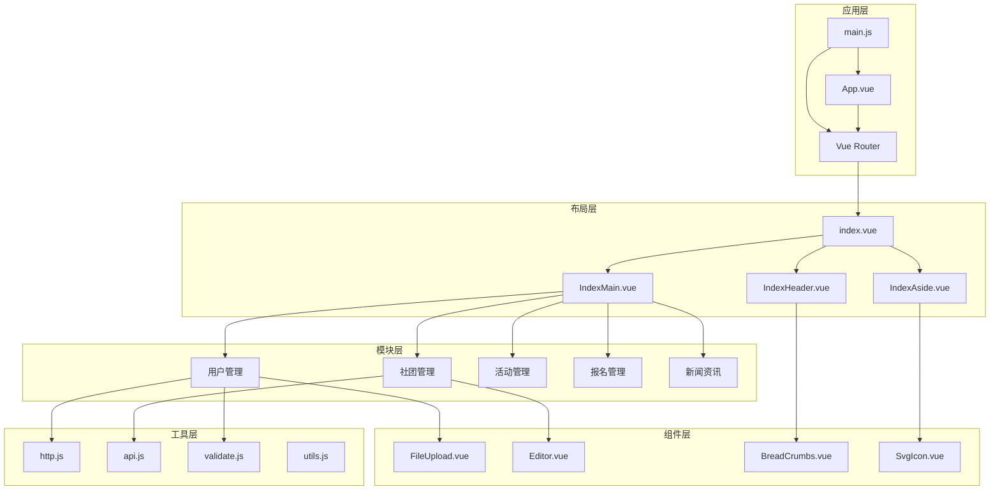

**架构特性:**
- 组件化架构促进代码重用
- 路由守卫用于身份验证和权限
- 集中式HTTP客户端带有拦截器
- 模块化视图组织
- 自定义组件库

**本节来源**
- [main.js:1-77](file://src/main/resources/admin/admin/src/main.js#L1-L77)
- [router-static.js:1-147](file://src/main/resources/admin/admin/src/router/router-static.js#L1-L147)
- [index.vue:1-33](file://src/main/resources/admin/admin/src/views/index.vue#L1-L33)

## 详细组件分析

### 应用初始化和配置
main.js引导Vue应用并注册全局插件和组件。

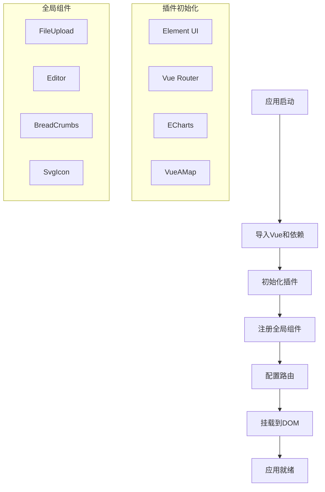

**关键配置:**
- Element UI主题自定义
- Axios基础URL和拦截器
- 全局工具函数
- 表单验证规则

**本节来源**
- [main.js:1-77](file://src/main/resources/admin/admin/src/main.js#L1-L77)
- [App.vue:1-31](file://src/main/resources/admin/admin/src/App.vue#L1-L31)

### 路由和导航
router-static.js定义应用程序的所有路由。

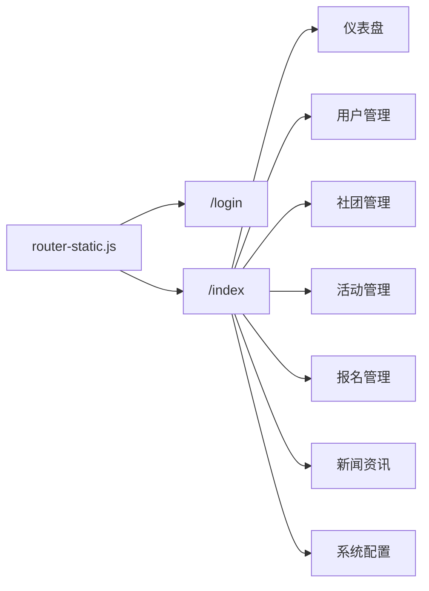

**路由特性:**
- 嵌套路由用于布局
- 路由守卫用于身份验证
- 动态路由生成
- 懒加载用于代码分割

**路由守卫:**
```javascript
router.beforeEach((to, from, next) => {
  // 检查身份验证
  // 检查权限
  // 允许或拒绝访问
})
```

**本节来源**
- [router-static.js:1-147](file://src/main/resources/admin/admin/src/router/router-static.js#L1-L147)

### 布局组件
布局组件定义管理面板的整体结构。

#### IndexHeader - 顶部导航
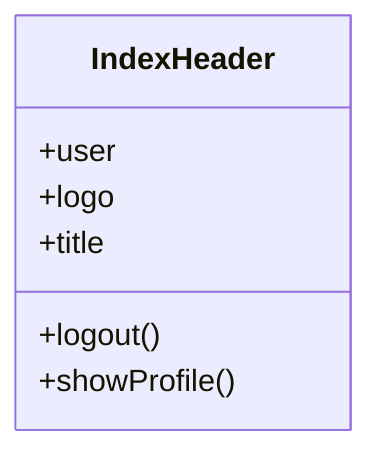

**功能:**
- 显示用户信息
- 登出功能
- 个人中心导航
- 面包屑集成

#### IndexAside - 侧边菜单
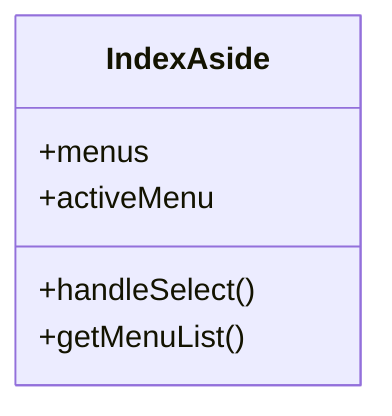

**功能:**
- 动态菜单生成
- 基于角色的菜单过滤
- 折叠/展开支持
- 图标集成

#### IndexMain - 主内容
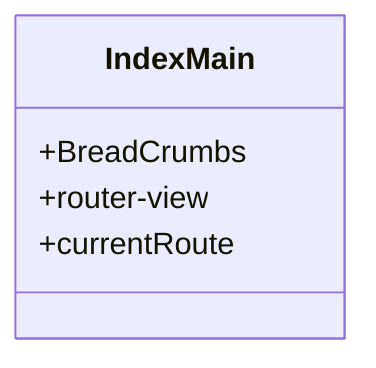

**功能:**
- 显示当前视图
- 面包屑导航
- 内容区域

**本节来源**
- [index.vue:1-33](file://src/main/resources/admin/admin/src/views/index.vue#L1-L33)
- [IndexHeader.vue:1-185](file://src/main/resources/admin/admin/src/components/index/IndexHeader.vue#L1-L185)
- [IndexAside.vue](file://src/main/resources/admin/admin/src/components/index/IndexAside.vue)
- [IndexMain.vue](file://src/main/resources/admin/admin/src/components/index/IndexMain.vue)

### CRUD模块实现
每个实体都有列表视图和添加/更新视图。

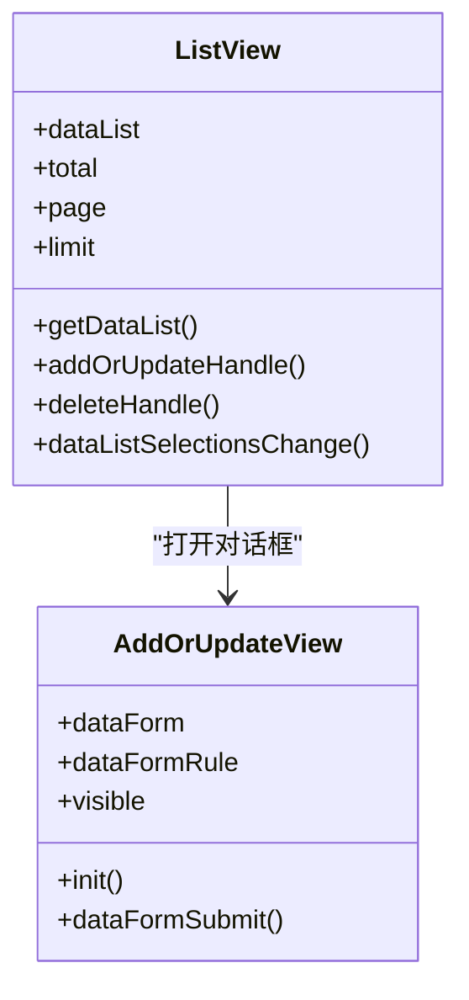

**列表视图特性:**
- Element UI表格组件
- 分页控件
- 搜索和过滤
- 批量选择
- 操作按钮（编辑、删除、查看）

**添加/更新视图特性:**
- Element UI表单组件
- 表单验证
- 文件上传
- 富文本编辑器
- 提交和取消

**本节来源**
- [users/list.vue](file://src/main/resources/admin/admin/src/views/modules/users/list.vue)
- [users/add-or-update.vue](file://src/main/resources/admin/admin/src/views/modules/users/add-or-update.vue)
- [shetuanxinxi/list.vue](file://src/main/resources/admin/admin/src/views/modules/shetuanxinxi/list.vue)
- [shetuanxinxi/add-or-update.vue](file://src/main/resources/admin/admin/src/views/modules/shetuanxinxi/add-or-update.vue)

### 自定义组件

#### FileUpload - 文件上传
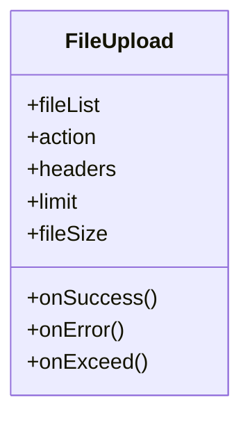

**功能:**
- 多文件上传
- 文件大小限制
- 文件类型过滤
- 进度指示
- 错误处理

#### Editor - 富文本编辑器
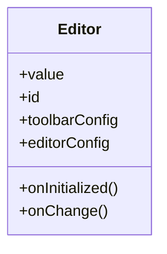

**功能:**
- 富文本编辑
- 工具栏自定义
- 图片上传
- 内容格式化

#### BreadCrumbs - 面包屑导航
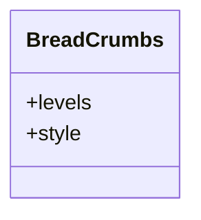

**功能:**
- 显示导航路径
- 可自定义样式
- 动态更新

**本节来源**
- [FileUpload.vue:1-138](file://src/main/resources/admin/admin/src/components/common/FileUpload.vue#L1-L138)
- [Editor.vue](file://src/main/resources/admin/admin/src/components/common/Editor.vue)
- [BreadCrumbs.vue](file://src/main/resources/admin/admin/src/components/common/BreadCrumbs.vue)

### HTTP客户端和API集成
http.js和api.js处理所有后端通信。

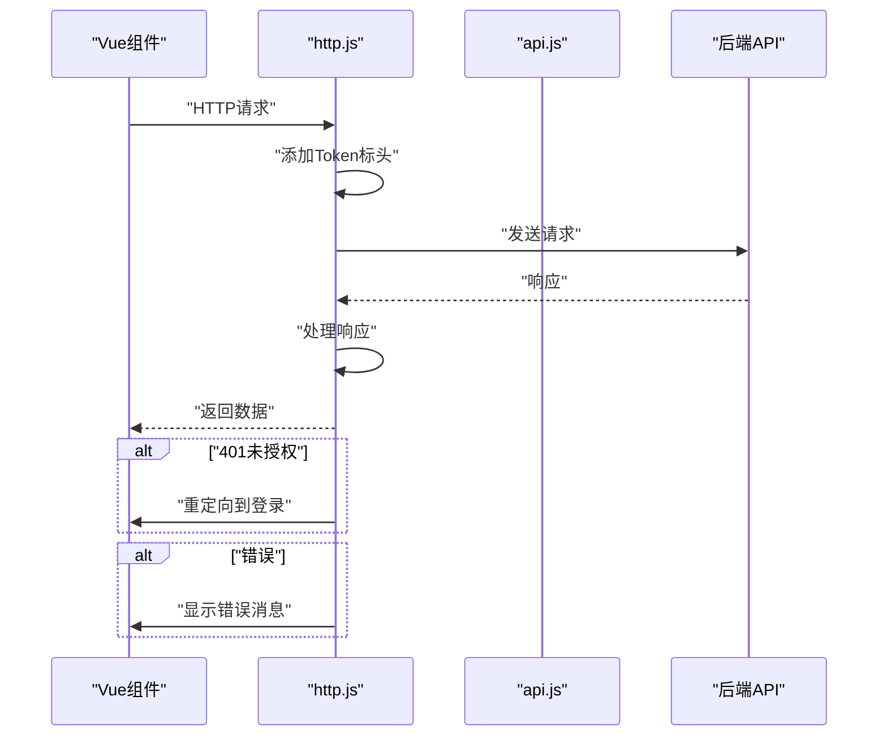

**HTTP客户端配置:**
```javascript
const http = axios.create({
  baseURL: process.env.VUE_APP_API_BASE_URL,
  timeout: 10000
})

// 请求拦截器
http.interceptors.request.use(config => {
  const token = localStorage.getItem('token')
  if (token) {
    config.headers['Token'] = token
  }
  return config
})

// 响应拦截器
http.interceptors.response.use(
  response => {
    if (response.data.code === 401) {
      localStorage.removeItem('token')
      window.location.href = '/login'
    }
    return response.data
  },
  error => {
    // 错误处理
    return Promise.reject(error)
  }
)
```

**本节来源**
- [http.js:1-29](file://src/main/resources/admin/admin/src/utils/http.js#L1-L29)
- [api.js:1-18](file://src/main/resources/admin/admin/src/utils/api.js#L1-L18)

### 表单验证
validate.js提供自定义验证规则。

**验证规则:**
- 必填字段
- 邮箱格式
- 手机号格式
- 密码强度
- 自定义验证器

**使用示例:**
```javascript
dataFormRule: {
  username: [
    { required: true, message: '请输入用户名', trigger: 'blur' }
  ],
  email: [
    { required: true, message: '请输入邮箱', trigger: 'blur' },
    { type: 'email', message: '请输入正确的邮箱格式', trigger: 'blur' }
  ]
}
```

**本节来源**
- [validate.js](file://src/main/resources/admin/admin/src/utils/validate.js)

## 依赖分析
管理面板依赖表现出清晰的层次：

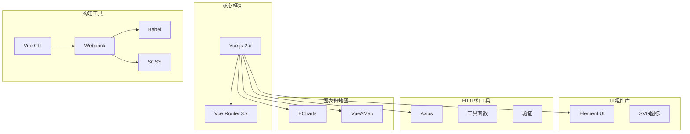

**依赖管理:**
- package.json定义所有依赖
- 版本锁定以确保一致性
- 开发和生产依赖分离

**本节来源**
- [package.json:1-63](file://src/main/resources/admin/admin/package.json#L1-L63)
- [vue.config.js:1-63](file://src/main/resources/admin/admin/vue.config.js#L1-L63)
- [babel.config.js](file://src/main/resources/admin/admin/babel.config.js)

## 性能考虑

### 构建优化
1. **代码分割**: 路由级懒加载
2. **Tree Shaking**: 移除未使用的代码
3. **压缩**: JS和CSS压缩
4. **图片优化**: SVG用于图标，WebP用于图片
5. **缓存**: 适当的缓存策略

### 运行时优化
1. **组件懒加载**: 按需加载组件
2. **虚拟滚动**: 大型列表优化
3. **防抖和节流**: 搜索和滚动事件
4. **缓存**: API响应缓存
5. **状态管理**: localStorage用于持久数据

### 网络优化
1. **HTTP/2**: 多路复用
2. **Gzip/Brotli**: 响应压缩
3. **CDN**: 静态资源分发
4. **最小化请求**: 合并文件

[本节提供一般性指导，无需来源]

## 故障排除指南

### 常见问题

**应用未加载:**
- 检查main.js语法错误
- 验证webpack配置
- 确保依赖已安装

**路由错误:**
- 验证router-static.js语法
- 检查路由守卫逻辑
- 确认组件路径正确

**API调用失败:**
- 检查http.js baseURL配置
- 验证Token是否正确
- 检查CORS配置

**组件渲染问题:**
- 验证组件导入路径
- 检查组件注册
- 验证prop传递

**表单验证问题:**
- 检查验证规则定义
- 验证数据绑定
- 检查自定义验证器

**构建失败:**
- 清除node_modules并重新安装
- 检查package.json依赖
- 验证webpack配置

**本节来源**
- [main.js:1-77](file://src/main/resources/admin/admin/src/main.js#L1-L77)
- [http.js:1-29](file://src/main/resources/admin/admin/src/utils/http.js#L1-L29)
- [vue.config.js:1-63](file://src/main/resources/admin/admin/vue.config.js#L1-L63)

## 结论
管理面板界面为学生社团活动管理系统提供了全面的管理解决方案：

- **Vue 2.x架构**: 成熟的SPA具有组件化设计
- **Element UI**: 丰富的UI组件库
- **模块化组织**: 按实体组织的清晰代码结构
- **CRUD操作**: 所有实体的完整实现
- **表单处理**: 强大的验证和错误处理
- **HTTP集成**: 集中式API通信
- **自定义组件**: 可重用的文件上传、编辑器等
- **路由守卫**: 安全的身份验证和授权
- **响应式设计**: 适应不同屏幕尺寸
- **主题定制**: SCSS变量用于样式自定义

该界面支持系统的所有管理功能，同时为管理员提供直观、高效的用户体验。

## 附录

### 技术栈

**核心框架:**
- Vue.js 2.x
- Vue Router 3.x
- Element UI

**工具库:**
- Axios
- ECharts
- VueAMap

**构建工具:**
- Vue CLI
- Webpack 4.x
- Babel
- SCSS

**开发工具:**
- ESLint
- Prettier
- Vue DevTools

### 模块列表

管理面板包含以下模块：

1. **用户管理** - 系统用户管理
2. **社团信息** - 社团信息管理
3. **社团活动** - 活动管理
4. **活动报名** - 报名管理
5. **新闻资讯** - 新闻发布
6. **社团分类** - 分类管理
7. **社团成员** - 成员管理
8. **加入社团** - 加入申请
9. **社长管理** - 社长账户
10. **学生管理** - 学生账户
11. **收藏管理** - 用户收藏
12. **评论管理** - 社团评论
13. **系统配置** - 系统设置

### 构建命令

```bash
# 安装依赖
npm install

# 开发模式
npm run serve

# 生产构建
npm run build

# 代码检查
npm run lint
```

### 开发指南

**创建新模块:**
1. 在views/modules中创建模块目录
2. 创建list.vue和add-or-update.vue
3. 在router-static.js中添加路由
4. 在api.js中添加API端点
5. 在菜单配置中添加菜单项

**最佳实践:**
- 遵循Vue单文件组件模式
- 使用Element UI组件
- 实现表单验证
- 处理错误情况
- 添加加载状态
- 实现权限检查

**本节来源**
- [package.json:1-63](file://src/main/resources/admin/admin/package.json#L1-L63)
- [vue.config.js:1-63](file://src/main/resources/admin/admin/vue.config.js#L1-L63)
