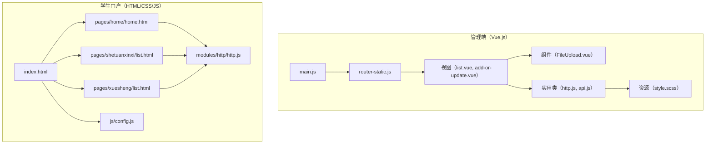
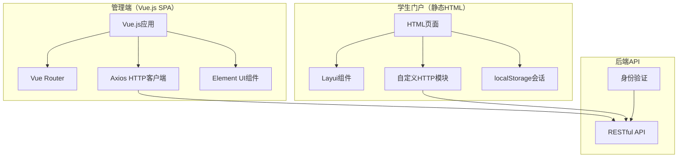
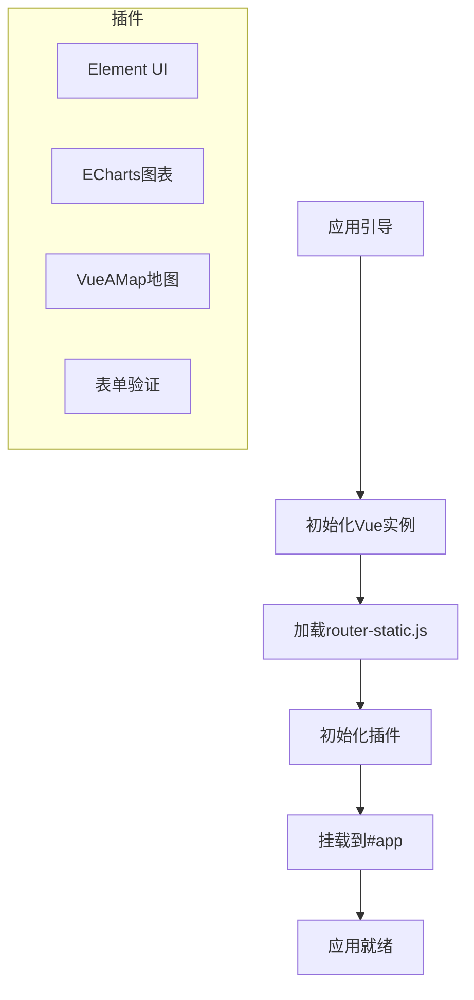
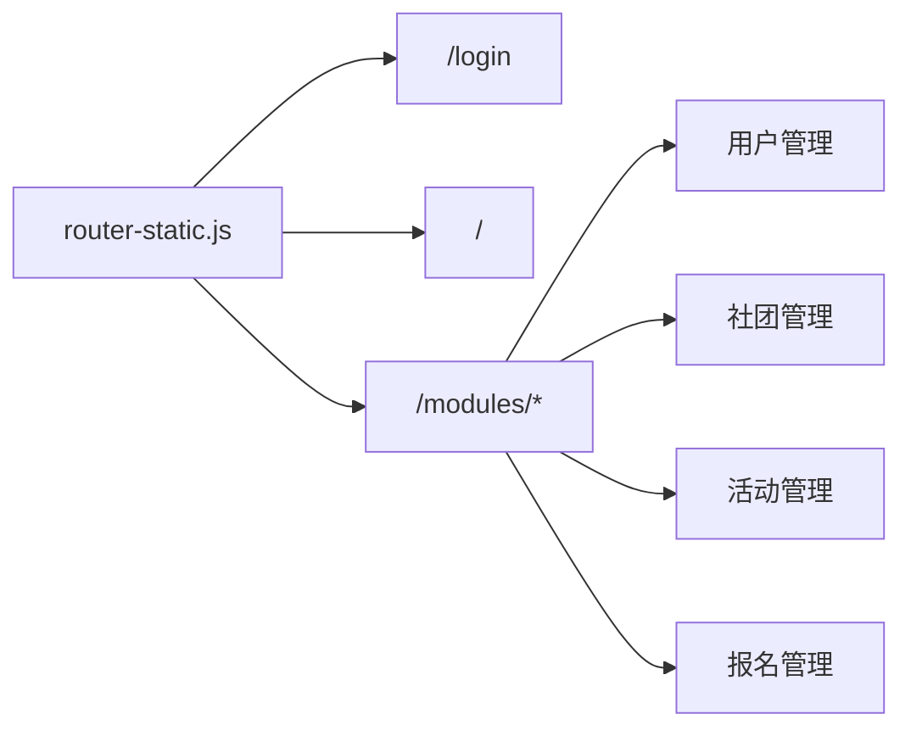
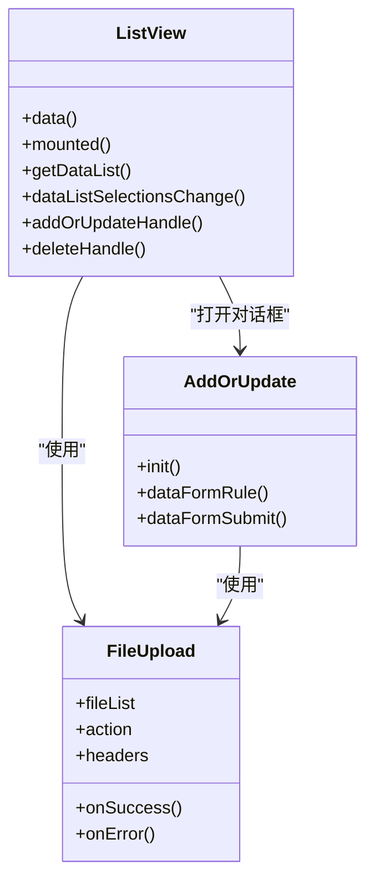
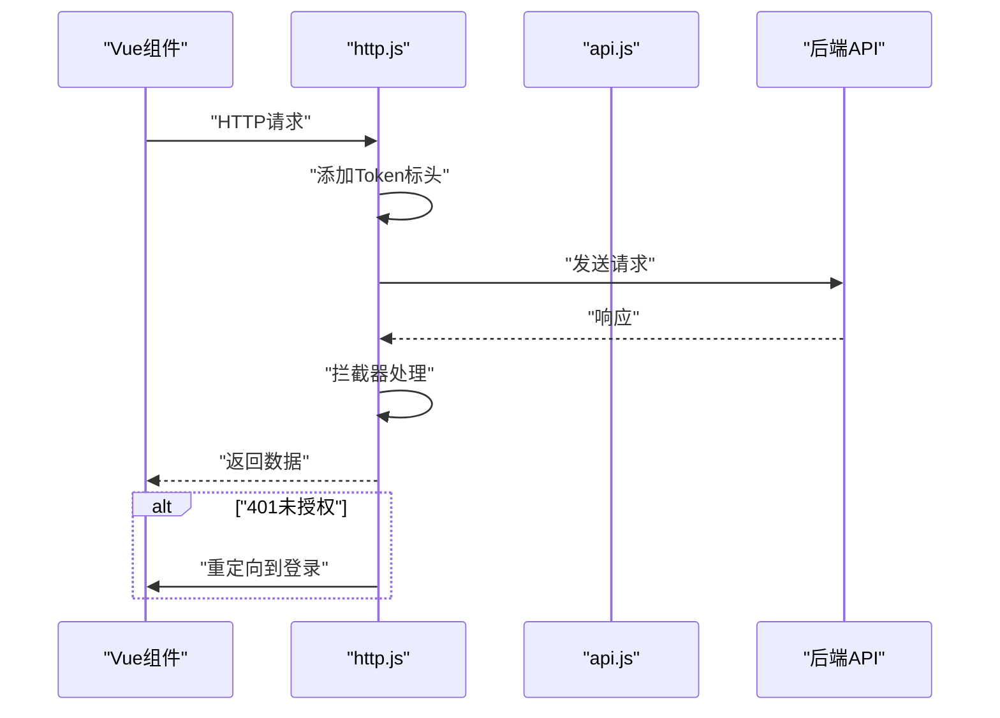
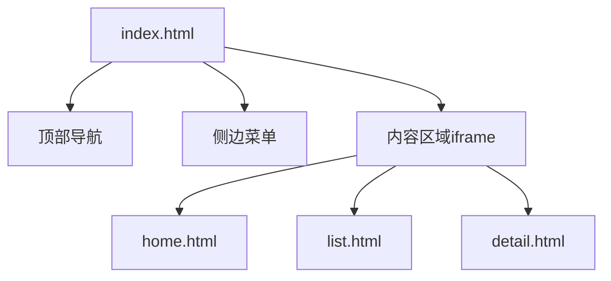
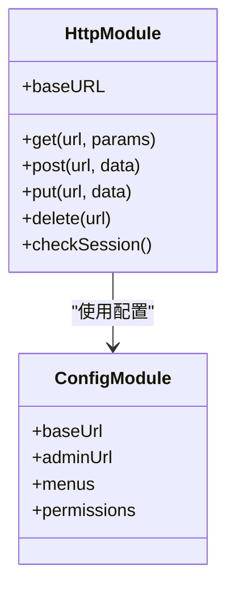
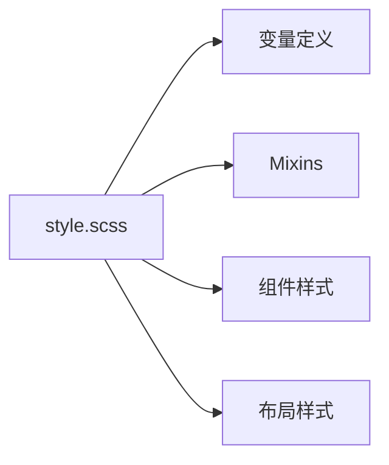
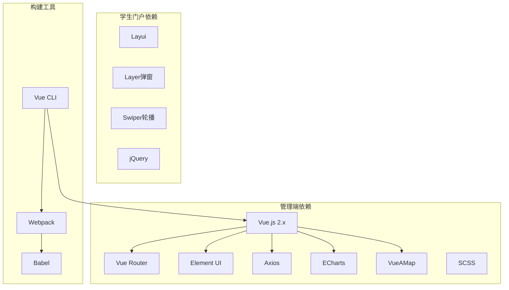

# 前端界面

<cite>
**本文档引用的文件**
- [package.json](file://src/main/resources/admin/admin/package.json)
- [vue.config.js](file://src/main/resources/admin/admin/vue.config.js)
- [main.js](file://src/main/resources/admin/admin/src/main.js)
- [App.vue](file://src/main/resources/admin/admin/src/App.vue)
- [router-static.js](file://src/main/resources/admin/admin/src/router/router-static.js)
- [style.scss](file://src/main/resources/admin/admin/src/assets/css/style.scss)
- [http.js](file://src/main/resources/admin/admin/src/utils/http.js)
- [api.js](file://src/main/resources/admin/admin/src/utils/api.js)
- [FileUpload.vue](file://src/main/resources/admin/admin/src/components/common/FileUpload.vue)
- [list.vue](file://src/main/resources/admin/admin/src/views/modules/shetuanxinxi/list.vue)
- [add-or-update.vue](file://src/main/resources/admin/admin/src/views/modules/shetuanxinxi/add-or-update.vue)
- [index.html](file://src/main/resources/front/front/index.html)
- [home.html](file://src/main/resources/front/front/pages/home/home.html)
- [list.html](file://src/main/resources/front/front/pages/shetuanxinxi/list.html)
- [xuesheng-list.html](file://src/main/resources/front/front/pages/xuesheng/list.html)
- [http.js](file://src/main/resources/front/front/modules/http/http.js)
- [config.js](file://src/main/resources/front/front/js/config.js)
</cite>

## 目录
1. [简介](#简介)
2. [项目结构](#项目结构)
3. [核心组件](#核心组件)
4. [架构概述](#架构概述)
5. [详细组件分析](#详细组件分析)
6. [依赖分析](#依赖分析)
7. [性能考虑](#性能考虑)
8. [故障排除指南](#故障排除指南)
9. [结论](#结论)
10. [附录](#附录)

## 简介
本文档描述了学生社团活动管理系统的前端界面架构。系统具有双界面设计：
- 使用Vue.js和Element UI构建的管理面板，用于管理任务，包括CRUD操作、表单处理、数据可视化和报告。
- 使用HTML、CSS、JavaScript和第三方库（Layer、Layui、Swiper）构建的学生门户，用于响应式、用户友好的导航和交互元素。

它涵盖组件关系、状态管理模式、API集成、样式架构、构建流程、跨浏览器兼容性、性能优化和无障碍考虑。

## 项目结构
前端组织为两个主要部分：
- 管理端（Vue.js + Element UI）：位于src/main/resources/admin/admin。
- 学生门户（HTML/CSS/JS + Layui/Swiper）：位于src/main/resources/front/front。

主要特点：
- 管理端使用Vue CLI，带有开发服务器、代理配置、SVG图标加载器和SCSS支持。
- 学生门户是通过简单Web服务器提供的静态站点，集成Layui组件和本地HTTP实用类。



**图表来源**
- [main.js:1-77](file://src/main/resources/admin/admin/src/main.js#L1-L77)
- [router-static.js:1-147](file://src/main/resources/admin/admin/src/router/router-static.js#L1-L147)
- [list.vue:1-706](file://src/main/resources/admin/admin/src/views/modules/shetuanxinxi/list.vue#L1-L706)
- [add-or-update.vue:1-651](file://src/main/resources/admin/admin/src/views/modules/shetuanxinxi/add-or-update.vue#L1-L651)
- [FileUpload.vue:1-138](file://src/main/resources/admin/admin/src/components/common/FileUpload.vue#L1-L138)
- [http.js:1-29](file://src/main/resources/admin/admin/src/utils/http.js#L1-L29)
- [api.js:1-18](file://src/main/resources/admin/admin/src/utils/api.js#L1-L18)
- [style.scss:1-47](file://src/main/resources/admin/admin/src/assets/css/style.scss#L1-L47)
- [index.html:1-856](file://src/main/resources/front/front/index.html#L1-L856)
- [home.html:1-553](file://src/main/resources/front/front/pages/home/home.html#L1-L553)
- [list.html:1-480](file://src/main/resources/front/front/pages/shetuanxinxi/list.html#L1-L480)
- [xuesheng-list.html:1-443](file://src/main/resources/front/front/pages/xuesheng/list.html#L1-L443)
- [http.js:1-146](file://src/main/resources/front/front/modules/http/http.js#L1-L146)
- [config.js:1-167](file://src/main/resources/front/front/js/config.js#L1-L167)

**本节来源**
- [package.json:1-63](file://src/main/resources/admin/admin/package.json#L1-L63)
- [vue.config.js:1-63](file://src/main/resources/admin/admin/vue.config.js#L1-L63)
- [main.js:1-77](file://src/main/resources/admin/admin/src/main.js#L1-L77)
- [router-static.js:1-147](file://src/main/resources/admin/admin/src/router/router-static.js#L1-L147)
- [index.html:1-856](file://src/main/resources/front/front/index.html#L1-L856)

## 核心组件
- 管理端Vue.js技术栈：
  - 应用程序引导初始化Element UI、全局组件、插件（ECharts、VueAMap）和全局实用类。
  - 路由器定义模块和页面的嵌套路由。
  - 视图使用Element UI组件、分页和对话框封装列表和编辑表单。
  - 实用类提供基于Axios的HTTP客户端，带有拦截器和API常量。
  - 资源定义基于SCSS的表单、表格和分页样式。

- 学生门户：
  - 单页应用程序外壳，使用基于iframe的导航到模块化页面。
  - 页面实现列表/搜索/过滤、分页和通过本地HTTP模块动态加载内容。
  - 配置脚本集中菜单、权限和运行时标志。

关键实现参考：
- 管理端应用初始化和插件：[main.js:1-77](file://src/main/resources/admin/admin/src/main.js#L1-L77)
- 管理端路由：[router-static.js:1-147](file://src/main/resources/admin/admin/src/router/router-static.js#L1-L147)
- 使用Element UI的列表视图：[list.vue:1-706](file://src/main/resources/admin/admin/src/views/modules/shetuanxinxi/list.vue#L1-L706)
- 带验证的编辑/添加表单：[add-or-update.vue:1-651](file://src/main/resources/admin/admin/src/views/modules/shetuanxinxi/add-or-update.vue#L1-L651)
- 上传组件：[FileUpload.vue:1-138](file://src/main/resources/admin/admin/src/components/common/FileUpload.vue#L1-L138)
- HTTP客户端（Axios）：[http.js:1-29](file://src/main/resources/admin/admin/src/utils/http.js#L1-L29)
- API常量：[api.js:1-18](file://src/main/resources/admin/admin/src/utils/api.js#L1-L18)
- 管理端样式：[style.scss:1-47](file://src/main/resources/admin/admin/src/assets/css/style.scss#L1-L47)
- 学生门户外壳：[index.html:1-856](file://src/main/resources/front/front/index.html#L1-L856)
- 学生HTTP模块：[http.js:1-146](file://src/main/resources/front/front/modules/http/http.js#L1-L146)
- 学生配置：[config.js:1-167](file://src/main/resources/front/front/js/config.js#L1-L167)

**本节来源**
- [main.js:1-77](file://src/main/resources/admin/admin/src/main.js#L1-L77)
- [router-static.js:1-147](file://src/main/resources/admin/admin/src/router/router-static.js#L1-L147)
- [list.vue:1-706](file://src/main/resources/admin/admin/src/views/modules/shetuanxinxi/list.vue#L1-L706)
- [add-or-update.vue:1-651](file://src/main/resources/admin/admin/src/views/modules/shetuanxinxi/add-or-update.vue#L1-L651)
- [FileUpload.vue:1-138](file://src/main/resources/admin/admin/src/components/common/FileUpload.vue#L1-L138)
- [http.js:1-29](file://src/main/resources/admin/admin/src/utils/http.js#L1-L29)
- [api.js:1-18](file://src/main/resources/admin/admin/src/utils/api.js#L1-L18)
- [style.scss:1-47](file://src/main/resources/admin/admin/src/assets/css/style.scss#L1-L47)
- [index.html:1-856](file://src/main/resources/front/front/index.html#L1-L856)
- [http.js:1-146](file://src/main/resources/front/front/modules/http/http.js#L1-L146)
- [config.js:1-167](file://src/main/resources/front/front/js/config.js#L1-L167)

## 架构概述
系统采用双前端架构：
- 管理端：使用Vue.js和Element UI构建的SPA。它通过带有基于令牌的身份验证和集中式拦截器的Axios与后端API通信。路由由带有嵌套模块的Vue Router处理。
- 学生门户：带有嵌入式JavaScript和Layui组件的静态HTML页面。它使用自定义HTTP模块调用后端端点，并通过localStorage管理用户会话和权限。



**图表来源**
- [main.js:1-77](file://src/main/resources/admin/admin/src/main.js#L1-L77)
- [router-static.js:1-147](file://src/main/resources/admin/admin/src/router/router-static.js#L1-L147)
- [http.js:1-29](file://src/main/resources/admin/admin/src/utils/http.js#L1-L29)
- [index.html:1-856](file://src/main/resources/front/front/index.html#L1-L856)
- [http.js:1-146](file://src/main/resources/front/front/modules/http/http.js#L1-L146)

## 详细组件分析

### 管理端Vue.js应用
管理端使用Vue CLI构建，带有SPA架构。



**应用初始化（main.js）:**
- 导入Vue、VueRouter和Element UI
- 注册全局组件（文件上传、富文本编辑器）
- 配置全局工具函数
- 设置Axios基础URL和拦截器
- 挂载Vue应用到DOM

**本节来源**
- [main.js:1-77](file://src/main/resources/admin/admin/src/main.js#L1-L77)

### 路由和导航
Vue Router处理管理端的导航。



**路由特性:**
- 嵌套路由用于模块化组织
- 路由守卫用于身份验证
- 懒加载用于代码分割
- 动态路由用于权限

**本节来源**
- [router-static.js:1-147](file://src/main/resources/admin/admin/src/router/router-static.js#L1-L147)

### 管理端视图组件
视图组件使用Element UI实现CRUD操作。



**列表视图特性:**
- 数据表格带分页
- 搜索和过滤
- 批量操作
- 对话框用于添加/编辑

**表单验证:**
- Element UI表单规则
- 自定义验证器
- 异步验证（如需要）

**本节来源**
- [list.vue:1-706](file://src/main/resources/admin/admin/src/views/modules/shetuanxinxi/list.vue#L1-L706)
- [add-or-update.vue:1-651](file://src/main/resources/admin/admin/src/views/modules/shetuanxinxi/add-or-update.vue#L1-L651)
- [FileUpload.vue:1-138](file://src/main/resources/admin/admin/src/components/common/FileUpload.vue#L1-L138)

### HTTP客户端和API集成
管理端使用Axios进行API通信。



**HTTP客户端（http.js）:**
```javascript
const http = axios.create({
  baseURL: process.env.VUE_APP_API_BASE_URL,
  timeout: 10000
})

// 请求拦截器
http.interceptors.request.use(config => {
  config.headers['Token'] = localStorage.getItem('token')
  return config
})

// 响应拦截器
http.interceptors.response.use(response => {
  if (response.data.code === 401) {
    window.location.href = '/login'
  }
  return response.data
})
```

**API常量（api.js）:**
- 集中API端点定义
- 易于维护和更新
- 避免硬编码URL

**本节来源**
- [http.js:1-29](file://src/main/resources/admin/admin/src/utils/http.js#L1-L29)
- [api.js:1-18](file://src/main/resources/admin/admin/src/utils/api.js#L1-L18)

### 学生门户架构
学生门户使用静态HTML页面和自定义HTTP模块。



**架构特性:**
- iframe-based导航实现模块化
- Layui组件用于UI元素
- 自定义HTTP模块用于API调用
- localStorage用于会话管理

**本节来源**
- [index.html:1-856](file://src/main/resources/front/front/index.html#L1-L856)
- [home.html:1-553](file://src/main/resources/front/front/pages/home/home.html#L1-L553)

### 学生门户HTTP模块
自定义HTTP模块处理API通信。



**HTTP模块特性:**
- 封装XMLHttpRequest或fetch
- 自动添加token
- 错误处理
- 会话检查

**本节来源**
- [http.js:1-146](file://src/main/resources/front/front/modules/http/http.js#L1-L146)
- [config.js:1-167](file://src/main/resources/front/front/js/config.js#L1-L167)

### 样式架构

#### 管理端（SCSS）
管理端使用SCSS进行样式化。



**样式特性:**
- SCSS变量用于主题
- Mixins用于可重用样式
- 组件级样式隔离
- 响应式设计支持

#### 学生门户（CSS）
学生门户使用纯CSS和Layui主题。

**样式特性:**
- Layui内置样式
- 自定义CSS覆盖
- 响应式布局
- 移动友好设计

**本节来源**
- [style.scss:1-47](file://src/main/resources/admin/admin/src/assets/css/style.scss#L1-L47)

## 依赖分析
前端依赖表现出清晰的层次：



**依赖管理:**
- 管理端：package.json定义依赖
- 学生门户：CDN或本地库
- 版本锁定以确保一致性

**本节来源**
- [package.json:1-63](file://src/main/resources/admin/admin/package.json#L1-L63)
- [vue.config.js:1-63](file://src/main/resources/admin/admin/vue.config.js#L1-L63)

## 性能考虑

### 管理端性能优化
1. **代码分割**: 路由级懒加载
2. **组件优化**: 使用v-show vs v-if
3. **虚拟化**: 大型列表使用虚拟滚动
4. **缓存**: API响应缓存
5. **构建优化**: Webpack压缩和treeshaking

### 学生门户性能优化
1. **资源压缩**: CSS和JS压缩
2. **图片优化**: 适当格式和尺寸
3. **懒加载**: 图片懒加载
4. **缓存**: 浏览器缓存策略
5. **CDN**: 静态资源CDN分发

### 通用优化
1. **HTTP/2**: 多路复用减少延迟
2. **Gzip/Brotli**: 响应压缩
3. **最小化请求**: 合并CSS和JS
4. **浏览器缓存**: 适当的Cache-Control标头

[本节提供一般性指导，无需来源]

## 故障排除指南

### 常见问题

**管理端问题:**
- Vue应用未加载：检查main.js和webpack配置
- 路由错误：验证router-static.js语法
- API调用失败：检查http.js baseURL和token
- 样式问题：验证SCSS编译

**学生门户问题:**
- iframe未加载：检查路径配置
- Layui组件不工作：验证库加载
- HTTP请求失败：检查config.js baseURL
- 会话问题：验证localStorage使用

**跨浏览器兼容性:**
- 测试Chrome、Firefox、Safari、Edge
- 使用CSS前缀
- 验证JavaScript兼容性
- 测试移动端浏览器

**性能问题:**
- 使用Chrome DevTools分析
- 检查网络请求
- 监控内存使用
- 优化大型组件

**本节来源**
- [main.js:1-77](file://src/main/resources/admin/admin/src/main.js#L1-L77)
- [http.js:1-29](file://src/main/resources/admin/admin/src/utils/http.js#L1-L29)
- [index.html:1-856](file://src/main/resources/front/front/index.html#L1-L856)

## 结论
前端界面架构为学生社团活动管理系统提供了全面的双界面解决方案：

- **管理端**: Vue.js SPA具有模块化架构和Element UI组件
- **学生门户**: 静态HTML页面具有Layui集成和自定义HTTP模块
- **状态管理**: localStorage用于会话，Vuex可选用于全局状态
- **API集成**: Axios和管理端，自定义HTTP和学生门户
- **样式**: SCSS用于管理端，CSS用于学生门户
- **性能**: 代码分割、懒加载和缓存优化
- **可维护性**: 清晰的组件层次和关注点分离

该架构支持系统的当前功能需求，同时为未来增强提供灵活性。

## 附录

### 技术栈

**管理端:**
- Vue.js 2.x
- Vue Router
- Element UI
- Axios
- ECharts
- VueAMap
- SCSS
- Webpack (Vue CLI)

**学生门户:**
- HTML5
- CSS3
- JavaScript (ES6)
- Layui
- Layer
- Swiper
- jQuery

### 构建和部署

**管理端构建:**
```bash
# 安装依赖
npm install

# 开发模式
npm run serve

# 生产构建
npm run build
```

**学生门户部署:**
- 静态文件由Spring Boot提供
- 无需构建步骤
- 直接编辑和部署

### 开发指南

**管理端开发:**
1. 在views/modules中创建新视图
2. 在router-static.js中添加路由
3. 使用Element UI组件
4. 遵循Vue单文件组件模式

**学生门户开发:**
1. 在pages中创建新HTML页面
2. 在index.html中添加菜单项
3. 使用Layui组件
4. 通过http.js调用API

**本节来源**
- [package.json:1-63](file://src/main/resources/admin/admin/package.json#L1-L63)
- [vue.config.js:1-63](file://src/main/resources/admin/admin/vue.config.js#L1-L63)
