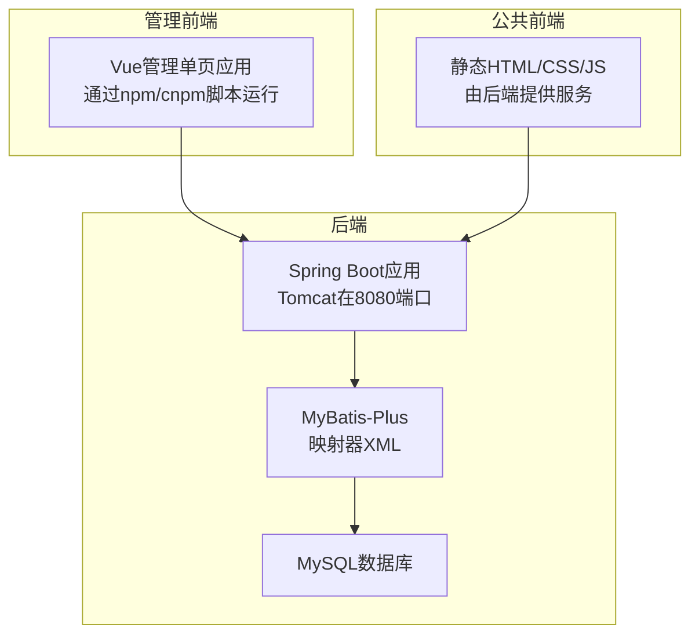
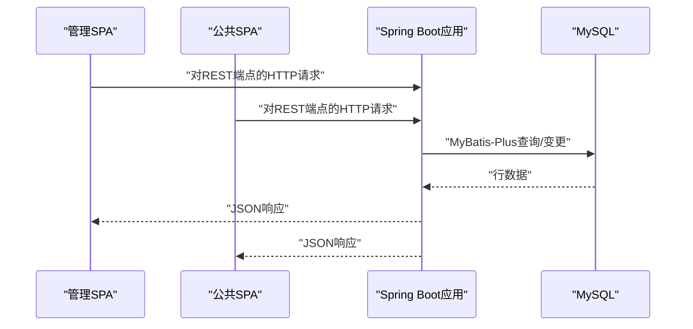
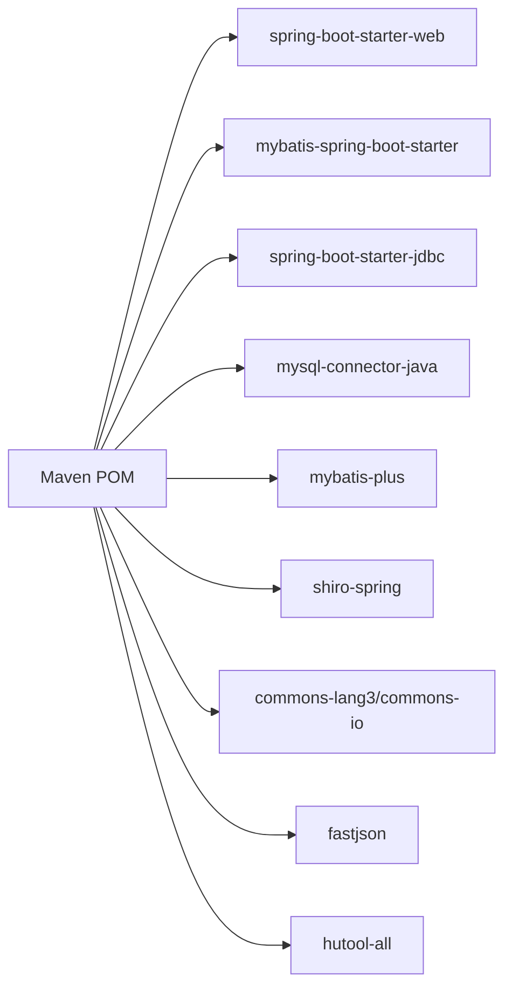

# 入门指南

<cite>
**本文档引用的文件**
- [pom.xml](file://pom.xml)
- [application.yml](file://src/main/resources/application.yml)
- [SpringbootSchemaApplication.java](file://src/main/java/com/SpringbootSchemaApplication.java)
- [package.json](file://src/main/resources/admin/admin/package.json)
- [1-install.bat](file://src/main/resources/admin/admin/1-install.bat)
- [2-run.bat](file://src/main/resources/admin/admin/2-run.bat)
- [3-build.bat](file://src/main/resources/admin/admin/3-build.bat)
- [config.js](file://src/main/resources/front/front/js/config.js)
- [database_changes.sql](file://docs1/database_changes.sql)
- [new_database_changes.sql](file://docs1/new_database_changes.sql)
</cite>

## 目录
1. [简介](#简介)
2. [项目结构](#项目结构)
3. [核心组件](#核心组件)
4. [架构概述](#架构概述)
5. [详细组件分析](#详细组件分析)
6. [依赖分析](#依赖分析)
7. [性能考虑](#性能考虑)
8. [故障排除指南](#故障排除指南)
9. [结论](#结论)
10. [附录](#附录)

## 简介
本指南帮助您在本地设置和运行学生社团活动管理系统。它涵盖了先决条件、环境设置、数据库配置、应用属性、依赖管理、构建和启动后端和前端、首次运行任务以及故障排除。

## 项目结构
该项目是一个Spring Boot应用程序，包含Java后端和两个Web前端：
- 后端：使用MyBatis-Plus、MySQL和嵌入式Tomcat服务器的Spring Boot应用程序。
- 管理前端：位于admin目录下的Vue 2管理面板。
- 公共前端：位于front目录下的静态HTML/CSS/JS站点。

主要运行时特征：
- 后端在端口8080上运行，带有上下文路径。
- 数据源配置为MySQL，具有默认用户名和密码。
- 从类路径和文件系统位置提供静态资源。
- 配置了MyBatis-Plus映射器XML和实体扫描。

**图表来源**
- [application.yml:1-53](file://src/main/resources/application.yml#L1-L53)
- [SpringbootSchemaApplication.java:1-24](file://src/main/java/com/SpringbootSchemaApplication.java#L1-L24)
- [package.json:1-63](file://src/main/resources/admin/admin/package.json#L1-L63)

**本节来源**
- [application.yml:1-53](file://src/main/resources/application.yml#L1-L53)
- [SpringbootSchemaApplication.java:1-24](file://src/main/java/com/SpringbootSchemaApplication.java#L1-L24)

## 核心组件
- 后端构建和依赖由Maven管理。
- 应用属性定义服务器端口、上下文路径、数据源、多部分限制、资源位置和MyBatis-Plus设置。
- 管理和公共前端使用npm兼容的脚本；项目包含用于cnpm的Windows批处理助手。

先决条件总结：
- Java JDK：Maven属性中指定了Java 8。
- MySQL：应用程序的关系数据需要。
- Node.js：构建和运行管理前端所需；包含的批处理脚本使用cnpm。
- Maven：用于构建Spring Boot后端。

**本节来源**
- [pom.xml:16-20](file://pom.xml#L16-L20)
- [application.yml:1-53](file://src/main/resources/application.yml#L1-L53)
- [package.json:1-63](file://src/main/resources/admin/admin/package.json#L1-L63)
- [1-install.bat:1-1](file://src/main/resources/admin/admin/1-install.bat#L1-L1)
- [2-run.bat:1-1](file://src/main/resources/admin/admin/2-run.bat#L1-L1)
- [3-build.bat:1-2](file://src/main/resources/admin/admin/3-build.bat#L1-L2)

## 架构概述
高级流程：
- 管理用户访问管理SPA，它与后端REST端点通信。
- 公共用户访问公共SPA，也由相同的后端支持。
- 后端通过MyBatis-Plus在MySQL中持久化数据。

**图表来源**
- [application.yml:1-53](file://src/main/resources/application.yml#L1-L53)
- [SpringbootSchemaApplication.java:1-24](file://src/main/java/com/SpringbootSchemaApplication.java#L1-L24)

## 详细组件分析

### 后端设置（Maven、Java、MySQL）
- Java要求：Maven属性中指定了Java 8。
- 构建工具：Maven构建Spring Boot应用程序。
- 数据库：在应用属性中配置了MySQL，具有默认URL、用户名和密码。
- 资源服务：静态位置包括类路径和admin、front及uploads的文件根目录。

步骤：
1. 安装Java JDK 8。
2. 安装Maven。
3. 安装MySQL并创建根据配置URL命名的数据库。
4. 使用您的MySQL主机、端口、数据库名、用户名和密码配置应用属性。
5. 使用Maven构建后端。
6. 启动Spring Boot应用。

验证：
- 确认服务器在端口8080上使用配置的上下文路径启动。
- 验证静态资源可访问。

**本节来源**
- [pom.xml:16-20](file://pom.xml#L16-L20)
- [application.yml:1-53](file://src/main/resources/application.yml#L1-L53)
- [SpringbootSchemaApplication.java:1-24](file://src/main/java/com/SpringbootSchemaApplication.java#L1-L24)

### 管理前端设置（Node.js、cnpm、脚本）
- 管理前端是一个带有npm脚本的Vue 2应用程序。
- 项目包含使用cnpm安装依赖、运行开发服务器和构建应用的Windows批处理脚本。
- 依赖和开发依赖在admin package.json中声明。

步骤：
1. 安装Node.js。
2. 全局安装cnpm或使用与脚本兼容的首选包管理器。
3. 运行安装脚本以获取依赖。
4. 运行serve脚本以启动管理开发服务器。
5. 可选运行build脚本以生成生产包。

注意：
- 脚本引用Vue CLI服务命令；如果直接运行脚本，请确保Vue CLI可用。
- 管理SPA旨在在生产环境中由后端构建和服务。

**本节来源**
- [package.json:1-63](file://src/main/resources/admin/admin/package.json#L1-L63)
- [1-install.bat:1-1](file://src/main/resources/admin/admin/1-install.bat#L1-L1)
- [2-run.bat:1-1](file://src/main/resources/admin/admin/2-run.bat#L1-L1)
- [3-build.bat:1-2](file://src/main/resources/admin/admin/3-build.bat#L1-L2)

### 公共前端配置
- 公共前端是由后端服务的静态站点。
- 配置模块为公共SPA定义运行时路径和菜单行为。

验证：
- 确保公共SPA路由在后端上下文路径下解析。

**本节来源**
- [config.js:1-167](file://src/main/resources/front/front/js/config.js#L1-L167)

### 数据库初始化
- 项目包含用于创建系统使用的附加表的SQL脚本。
- 在创建数据库后将脚本应用到您的MySQL数据库。

推荐顺序：
1. 创建数据库。
2. 应用新数据库变更脚本。
3. 应用附加消息表脚本。

**本节来源**
- [new_database_changes.sql:1-29](file://docs1/new_database_changes.sql#L1-L29)
- [database_changes.sql:1-18](file://docs1/database_changes.sql#L1-L18)

## 依赖分析
运行时依赖包括Spring Boot Web、MyBatis-Plus、MySQL Connector、Apache Shiro、commons-lang3、commons-io、FastJSON、Hutool等。

**图表来源**
- [pom.xml:22-113](file://pom.xml#L22-L113)

**本节来源**
- [pom.xml:22-113](file://pom.xml#L22-L113)

## 性能考虑
- 保持多部分大小与您的部署需求对齐。
- 为您的工作负载调整MyBatis-Plus设置。
- 确保MySQL和网络延迟对您的环境可接受。

[本节提供一般性指导，无需来源]

## 故障排除指南

常见问题和解决方案：
- 端口冲突（8080）：在应用属性中更改服务器端口。
- 数据库连接失败：验证MySQL正在运行，凭据与应用属性匹配，并且数据库存在。
- 依赖解析错误：确保Maven和Node/cnpm已安装并可访问；重试依赖安装。
- 管理SPA构建/运行失败：确认cnpm可用且Vue CLI存在；查看脚本输出以查找缺失的包。

首次运行检查清单：
- 确认数据库创建和脚本应用。
- 设置正确的数据源凭据。
- 使用Maven构建并运行后端。
- 构建管理SPA并确认它在后端上下文路径下服务。

验证步骤：
- 通过配置的上下文路径访问后端健康端点。
- 在上下文路径下加载管理SPA和公共SPA。
- 确认静态资源无404错误提供服务。

**本节来源**
- [application.yml:1-53](file://src/main/resources/application.yml#L1-L53)
- [pom.xml:16-20](file://pom.xml#L16-L20)
- [package.json:1-63](file://src/main/resources/admin/admin/package.json#L1-L63)
- [1-install.bat:1-1](file://src/main/resources/admin/admin/1-install.bat#L1-L1)
- [2-run.bat:1-1](file://src/main/resources/admin/admin/2-run.bat#L1-L1)
- [3-build.bat:1-2](file://src/main/resources/admin/admin/3-build.bat#L1-L2)

## 结论
您现在掌握了安装、配置和运行学生社团活动管理系统的基本知识。继续进行数据库设置、后端构建和启动、管理前端安装和构建，并在配置的上下文路径下验证两个SPA。

[本节进行总结而不分析特定文件，无需来源]

## 附录

### 逐步安装检查清单
- 安装Java JDK 8和Maven。
- 安装Node.js和cnpm。
- 安装并启动MySQL。
- 创建数据库并应用SQL脚本。
- 使用您的MySQL凭据更新应用属性。
- 使用Maven构建后端。
- 使用cnpm脚本构建管理SPA。
- 启动后端并验证端点和静态资源。

**本节来源**
- [pom.xml:16-20](file://pom.xml#L16-L20)
- [application.yml:1-53](file://src/main/resources/application.yml#L1-L53)
- [package.json:1-63](file://src/main/resources/admin/admin/package.json#L1-L63)
- [new_database_changes.sql:1-29](file://docs1/new_database_changes.sql#L1-L29)
- [database_changes.sql:1-18](file://docs1/database_changes.sql#L1-L18)
