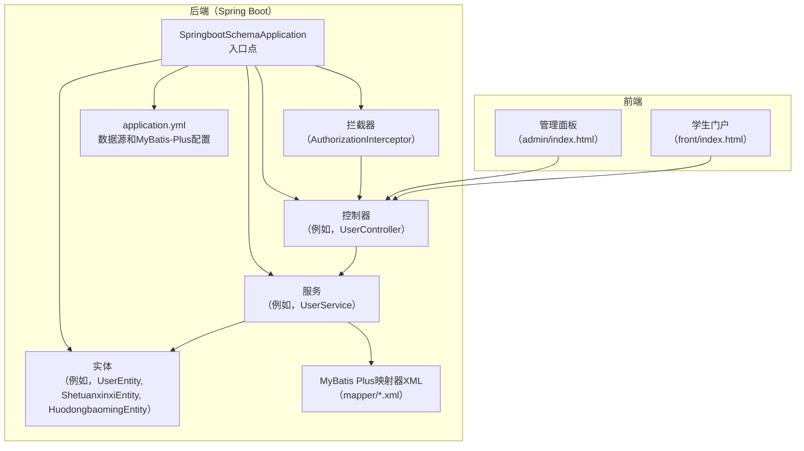
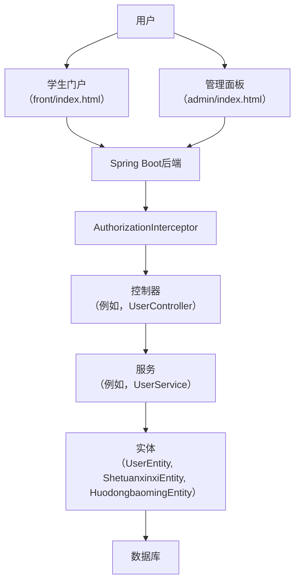
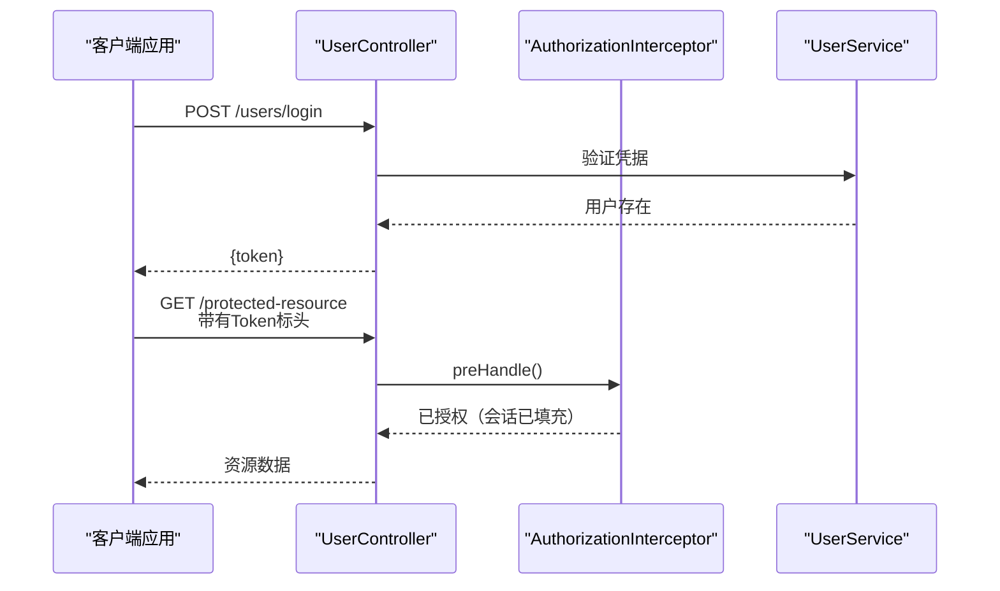
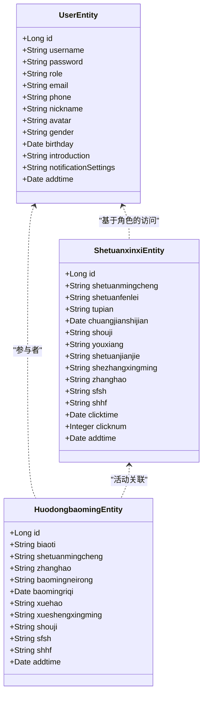
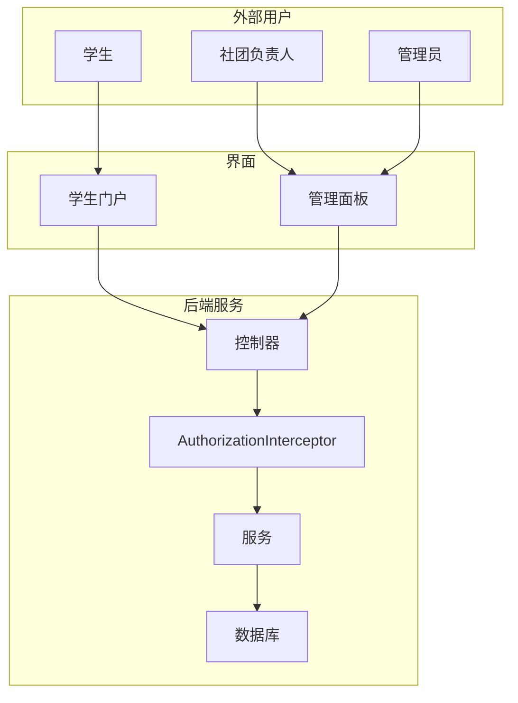
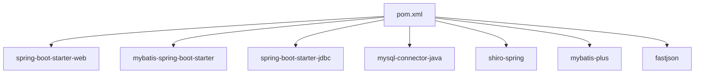

# 项目概述

<cite>
**本文档引用的文件**
- [SpringbootSchemaApplication.java](file://src/main/java/com/SpringbootSchemaApplication.java)
- [pom.xml](file://pom.xml)
- [application.yml](file://src/main/resources/application.yml)
- [AuthorizationInterceptor.java](file://src/main/java/com/interceptor/AuthorizationInterceptor.java)
- [UserController.java](file://src/main/java/com/controller/UserController.java)
- [UserEntity.java](file://src/main/java/com/entity/UserEntity.java)
- [ShetuanxinxiEntity.java](file://src/main/java/com/entity/ShetuanxinxiEntity.java)
- [HuodongbaomingEntity.java](file://src/main/java/com/entity/HuodongbaomingEntity.java)
- [UserService.java](file://src/main/java/com/service/UserService.java)
- [IgnoreAuth.java](file://src/main/java/com/annotation/IgnoreAuth.java)
- [LoginUser.java](file://src/main/java/com/annotation/LoginUser.java)
- [APPLoginUser.java](file://src/main/java/com/annotation/APPLoginUser.java)
- [index.html (Admin)](file://src/main/resources/admin/index.html)
- [index.html (Front)](file://src/main/resources/front/index.html)
</cite>

## 目录
1. [简介](#简介)
2. [项目结构](#项目结构)
3. [核心组件](#核心组件)
4. [架构概述](#架构概述)
5. [详细组件分析](#详细组件分析)
6. [依赖分析](#依赖分析)
7. [性能考虑](#性能考虑)
8. [故障排除指南](#故障排除指南)
9. [结论](#结论)
10. [附录](#附录)

## 简介
学生社团活动管理系统是一个集中化平台，旨在简化教育机构内学生组织及其活动的管理。它支持三个主要角色——学生、社团负责人（社长）和管理员——通过两个前端界面提供不同的功能：学生门户和管理面板。该系统支持社团浏览、活动注册、成员申请、活动跟踪和管理监督等功能。

主要目标：
- 提供统一的学生门户，用于发现社团、活动和注册参加活动。
- 使社团负责人能够管理成员、发布和审核活动，并监控注册情况。
- 为管理员提供全面的管理面板，用于内容审核、用户管理和系统配置。

技术基础：
- 后端使用Spring Boot和MyBatis Plus构建，用于强大的数据持久化和服务层抽象。
- 前端分为面向学生的门户和管理仪表板，使用现代Web框架和库实现。
- 通过拦截器和基于令牌的机制集成身份验证和会话管理。

## 项目结构
该项目采用分层架构，后端服务、前端界面和数据库配置之间有明确的分隔。后端暴露REST端点，而前端为学生门户和管理面板提供静态资产和路由。

**图表来源**
- [SpringbootSchemaApplication.java:10-22](file://src/main/java/com/SpringbootSchemaApplication.java#L10-L22)
- [application.yml:1-53](file://src/main/resources/application.yml#L1-L53)
- [AuthorizationInterceptor.java:28-104](file://src/main/java/com/interceptor/AuthorizationInterceptor.java#L28-L104)
- [UserController.java:38-40](file://src/main/java/com/controller/UserController.java#L38-L40)
- [UserService.java:18-25](file://src/main/java/com/service/UserService.java#L18-L25)
- [UserEntity.java:13-182](file://src/main/java/com/entity/UserEntity.java#L13-L182)
- [ShetuanxinxiEntity.java:31-312](file://src/main/java/com/entity/ShetuanxinxiEntity.java#L31-L312)
- [HuodongbaomingEntity.java:31-257](file://src/main/java/com/entity/HuodongbaomingEntity.java#L31-L257)
- [index.html (Admin)](file://src/main/resources/admin/index.html)
- [index.html (Front)](file://src/main/resources/front/index.html)

**本节来源**
- [SpringbootSchemaApplication.java:10-22](file://src/main/java/com/SpringbootSchemaApplication.java#L10-L22)
- [application.yml:1-53](file://src/main/resources/application.yml#L1-L53)
- [index.html (Admin)](file://src/main/resources/admin/index.html)
- [index.html (Front)](file://src/main/resources/front/index.html)

## 核心组件
- 多角色身份验证和会话管理：
  - 令牌的生成和验证集中处理，拦截器强制执行访问控制并为角色感知端点填充会话属性。
  - 注释支持选择性地绕过公共端点的身份验证。
- 学生门户：
  - 提供社团和活动的发现、用户注册和活动参与工作流。
- 管理面板：
  - 提供对社团、活动、成员和配置等实体的CRUD操作，以及审核工具。
- 数据模型：
  - 实体表示核心领域对象，包括用户、社团信息和活动注册，支持结构化数据操作。

实际示例：
- 多角色身份验证：
  - 登录端点为成功身份验证生成令牌；后续请求通过标头传递令牌以访问受保护的端点。
- 实时通信：
  - 虽然当前后端未暴露明确的WebSocket端点，但管理面板的实时图表和仪表板表明由后端数据检索驱动的动态UI更新。
- 活动跟踪：
  - 活动注册记录捕获参与者详细信息和时间戳，从而能够跟踪参与趋势和统计数据。

**本节来源**
- [AuthorizationInterceptor.java:36-103](file://src/main/java/com/interceptor/AuthorizationInterceptor.java#L36-L103)
- [IgnoreAuth.java](file://src/main/java/com/annotation/IgnoreAuth.java)
- [UserController.java:51-60](file://src/main/java/com/controller/UserController.java#L51-L60)
- [UserEntity.java:13-182](file://src/main/java/com/entity/UserEntity.java#L13-L182)
- [ShetuanxinxiEntity.java:31-312](file://src/main/java/com/entity/ShetuanxinxiEntity.java#L31-L312)
- [HuodongbaomingEntity.java:31-257](file://src/main/java/com/entity/HuodongbaomingEntity.java#L31-L257)

## 架构概述
该系统采用客户端-服务器架构，Spring Boot后端提供REST端点和两个前端客户端：学生门户和管理面板。请求经过授权拦截器进行令牌验证，之后控制器委托给由MyBatis Plus映射器和数据库实体支持的服务。

**图表来源**
- [AuthorizationInterceptor.java:36-103](file://src/main/java/com/interceptor/AuthorizationInterceptor.java#L36-L103)
- [UserController.java:38-40](file://src/main/java/com/controller/UserController.java#L38-L40)
- [UserService.java:18-25](file://src/main/java/com/service/UserService.java#L18-L25)
- [UserEntity.java:13-182](file://src/main/java/com/entity/UserEntity.java#L13-L182)
- [ShetuanxinxiEntity.java:31-312](file://src/main/java/com/entity/ShetuanxinxiEntity.java#L31-L312)
- [HuodongbaomingEntity.java:31-257](file://src/main/java/com/entity/HuodongbaomingEntity.java#L31-L257)
- [index.html (Admin)](file://src/main/resources/admin/index.html)
- [index.html (Front)](file://src/main/resources/front/index.html)

## 详细组件分析

### 身份验证和授权流程
此序列说明了用户如何通过后端进行身份验证和访问受保护的资源。

**图表来源**
- [UserController.java:51-60](file://src/main/java/com/controller/UserController.java#L51-L60)
- [AuthorizationInterceptor.java:36-103](file://src/main/java/com/interceptor/AuthorizationInterceptor.java#L36-L103)
- [UserService.java:18-25](file://src/main/java/com/service/UserService.java#L18-L25)

**本节来源**
- [AuthorizationInterceptor.java:36-103](file://src/main/java/com/interceptor/AuthorizationInterceptor.java#L36-L103)
- [UserController.java:51-60](file://src/main/java/com/controller/UserController.java#L51-L60)
- [IgnoreAuth.java](file://src/main/java/com/annotation/IgnoreAuth.java)

### 数据模型概述
以下类图突出了关键实体及其关系，重点关注用户、社团信息和活动注册。

**图表来源**
- [UserEntity.java:13-182](file://src/main/java/com/entity/UserEntity.java#L13-L182)
- [ShetuanxinxiEntity.java:31-312](file://src/main/java/com/entity/ShetuanxinxiEntity.java#L31-L312)
- [HuodongbaomingEntity.java:31-257](file://src/main/java/com/entity/HuodongbaomingEntity.java#L31-L257)

**本节来源**
- [UserEntity.java:13-182](file://src/main/java/com/entity/UserEntity.java#L13-L182)
- [ShetuanxinxiEntity.java:31-312](file://src/main/java/com/entity/ShetuanxinxiEntity.java#L31-L312)
- [HuodongbaomingEntity.java:31-257](file://src/main/java/com/entity/HuodongbaomingEntity.java#L31-L257)

### 系统上下文图
此图显示了学生门户和管理面板如何与后端服务和数据库交互。

**图表来源**
- [AuthorizationInterceptor.java:36-103](file://src/main/java/com/interceptor/AuthorizationInterceptor.java#L36-L103)
- [UserController.java:38-40](file://src/main/java/com/controller/UserController.java#L38-L40)
- [index.html (Admin)](file://src/main/resources/admin/index.html)
- [index.html (Front)](file://src/main/resources/front/index.html)

## 依赖分析
后端利用Spring Boot和MyBatis Plus进行快速开发和高效数据访问。Maven坐标定义了Web、JDBC、MySQL连接器、Shiro用于安全性和JSON处理的依赖关系。

**图表来源**
- [pom.xml:22-113](file://pom.xml#L22-L113)

**本节来源**
- [pom.xml:22-113](file://pom.xml#L22-L113)

## 性能考虑
- 基于令牌的身份验证减少了重复的凭据检查并集中了授权逻辑。
- MyBatis Plus配置强调驼峰命名映射和逻辑删除，提高了查询清晰度和数据生命周期管理。
- 静态资源服务配置为从类路径和文件位置有效地提供前端资产。

[本节提供一般性指导，无需来源]

## 故障排除指南
常见问题和解决方案：
- 身份验证失败：
  - 验证标头中的令牌是否存在，并确保拦截器配置为允许标记有ignore-auth注释的公共端点。
- 会话属性未填充：
  - 确认令牌验证成功，并且拦截器在控制器执行之前设置会话属性。
- CORS错误：
  - 检查拦截器标头中的Access-Control-Allow-Origin和相关CORS标头，以允许来自前端源的跨源请求。

**本节来源**
- [AuthorizationInterceptor.java:36-103](file://src/main/java/com/interceptor/AuthorizationInterceptor.java#L36-L103)
- [IgnoreAuth.java](file://src/main/java/com/annotation/IgnoreAuth.java)

## 结论
学生社团活动管理系统将Spring Boot后端与基于Vue.js的前端界面集成，为学生、社团负责人和管理员提供了一个 cohesive 平台。其模块化设计、基于令牌的身份验证和结构化数据模型实现了社团活动和成员的可扩展管理。该系统的架构支持未来的增强功能，如实时通信通道和高级分析。

[本节进行总结而不分析特定文件，无需来源]

## 附录
- 目标受众：
  - 学生：通过学生门户发现社团、浏览活动并参与。
  - 社团负责人：通过管理面板管理成员、发布活动和审核注册。
  - 管理员：监督内容、审核活动并维护系统配置。

[本节提供一般性指导，无需来源]
