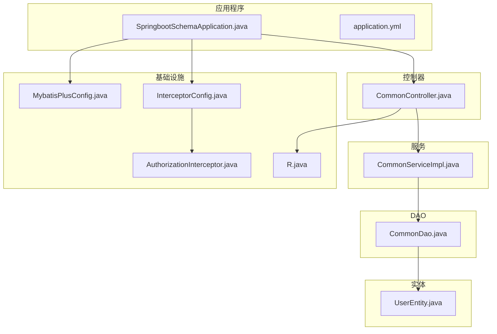
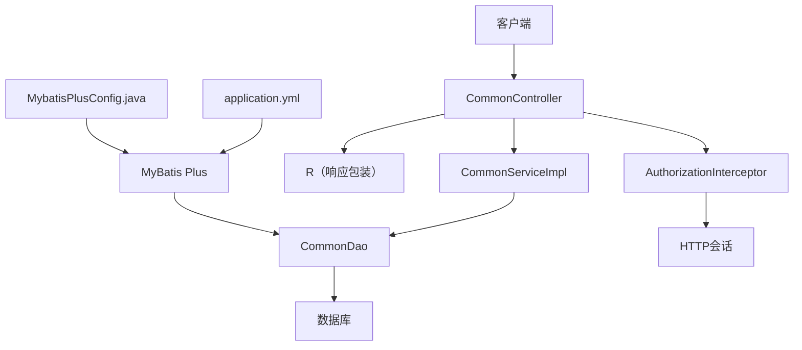
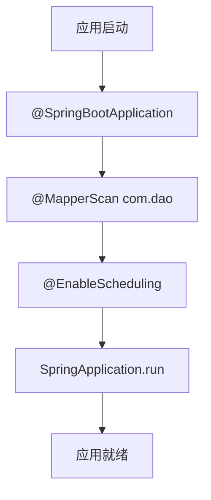
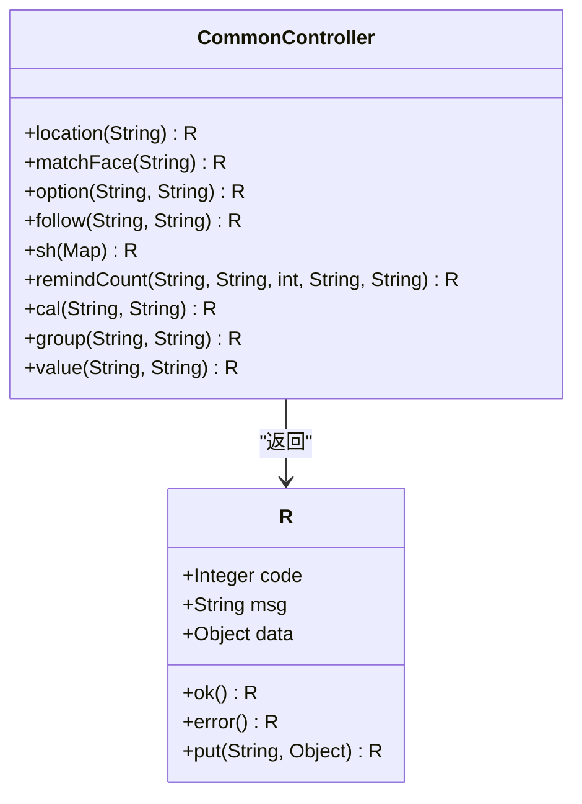
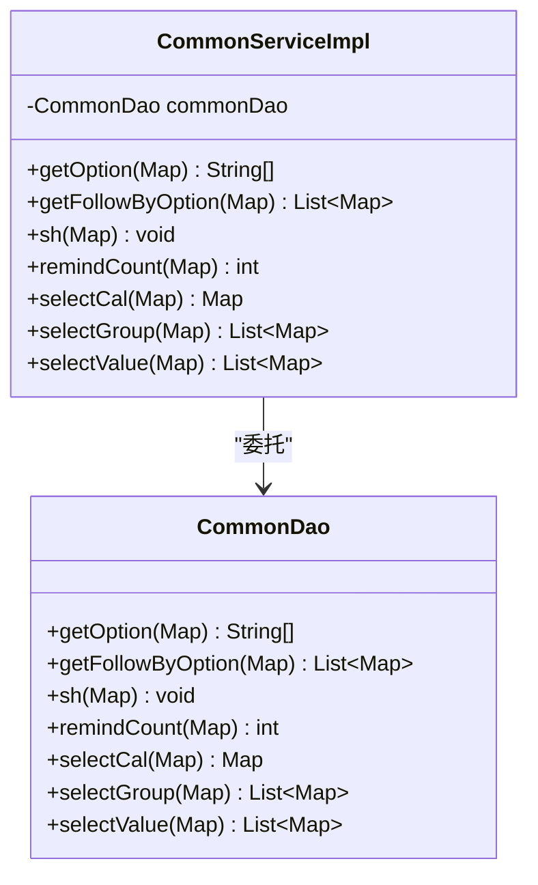
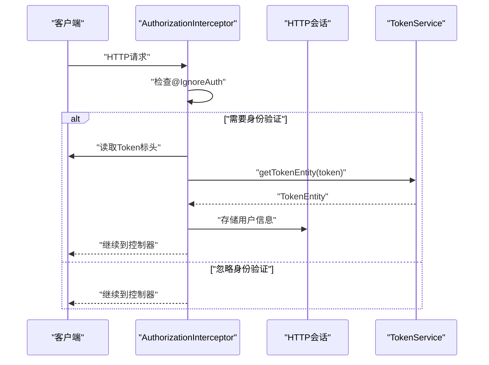
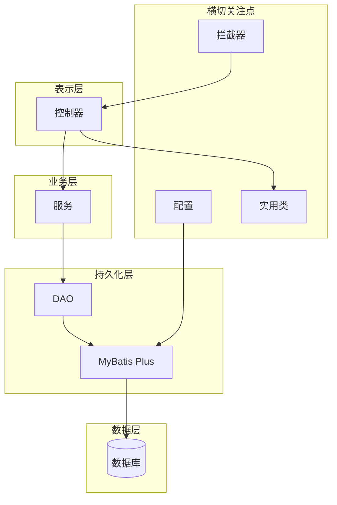

# 后端架构

<cite>
**本文档引用的文件**
- [SpringbootSchemaApplication.java](file://src/main/java/com/SpringbootSchemaApplication.java)
- [application.yml](file://src/main/resources/application.yml)
- [MybatisPlusConfig.java](file://src/main/java/com/config/MybatisPlusConfig.java)
- [InterceptorConfig.java](file://src/main/java/com/config/InterceptorConfig.java)
- [AuthorizationInterceptor.java](file://src/main/java/com/interceptor/AuthorizationInterceptor.java)
- [CommonController.java](file://src/main/java/com/controller/CommonController.java)
- [CommonServiceImpl.java](file://src/main/java/com/service/impl/CommonServiceImpl.java)
- [CommonDao.java](file://src/main/java/com/dao/CommonDao.java)
- [R.java](file://src/main/java/com/utils/R.java)
- [UserEntity.java](file://src/main/java/com/entity/UserEntity.java)
- [EIException.java](file://src/main/java/com/entity/EIException.java)
- [IgnoreAuth.java](file://src/main/java/com/annotation/IgnoreAuth.java)
- [LoginUser.java](file://src/main/java/com/annotation/LoginUser.java)
- [pom.xml](file://pom.xml)
</cite>

## 目录
1. [简介](#简介)
2. [项目结构](#项目结构)
3. [核心组件](#核心组件)
4. [架构概述](#架构概述)
5. [详细组件分析](#详细组件分析)
6. [依赖分析](#依赖分析)
7. [性能考虑](#性能考虑)
8. [故障排除指南](#故障排除指南)
9. [结论](#结论)

## 简介
本文档描述了实现分层架构的Spring Boot应用程序的后端架构，在控制器、服务和DAO层之间具有清晰的分离。它解释了Spring Boot应用程序结构、组件扫描配置和MVC模式的使用。它还记录了MyBatis Plus集成的数据访问，包括实体映射和查询优化，并详细介绍了服务层设计与业务逻辑封装和依赖注入。控制器层RESTful API设计记录了适当的HTTP方法和响应处理。解决了拦截器、CORS和静态资源的配置管理，以及组件关系、数据流模式和错误处理策略。

## 项目结构
后端遵循传统的Maven布局，Java源代码在src/main/java下，资源在src/main/resources下。应用程序按层组织：
- 应用程序入口点和配置
- 暴露REST端点的控制器
- 封装业务逻辑的服务
- 用于数据访问的DAO
- 用于MyBatis Plus映射的实体
- 用于横切关注点的实用类和注释
- MyBatis Plus XML映射器文件



**图表来源**
- [SpringbootSchemaApplication.java:10-22](file://src/main/java/com/SpringbootSchemaApplication.java#L10-L22)
- [application.yml:1-53](file://src/main/resources/application.yml#L1-L53)
- [CommonController.java:40-47](file://src/main/java/com/controller/CommonController.java#L40-L47)
- [CommonServiceImpl.java:18-22](file://src/main/java/com/service/impl/CommonServiceImpl.java#L18-L22)
- [CommonDao.java:10-26](file://src/main/java/com/dao/CommonDao.java#L10-L26)
- [UserEntity.java:13-182](file://src/main/java/com/entity/UserEntity.java#L13-L182)
- [MybatisPlusConfig.java:13-24](file://src/main/java/com/config/MybatisPlusConfig.java#L13-L24)
- [InterceptorConfig.java:11-41](file://src/main/java/com/config/InterceptorConfig.java#L11-L41)
- [AuthorizationInterceptor.java:28-104](file://src/main/java/com/interceptor/AuthorizationInterceptor.java#L28-L104)
- [R.java:9-51](file://src/main/java/com/utils/R.java#L9-L51)

**本节来源**
- [SpringbootSchemaApplication.java:10-22](file://src/main/java/com/SpringbootSchemaApplication.java#L10-L22)
- [application.yml:1-53](file://src/main/resources/application.yml#L1-L53)

## 核心组件
- 应用程序入口点：声明MyBatis映射器包的组件扫描并启用调度。
- 配置：数据库、多部分上传、静态资源位置和MyBatis Plus设置。
- MVC配置：全局拦截器注册和静态资源处理器。
- 拦截器：基于令牌的身份验证，支持CORS，并通过注释可选方法绕过。
- 控制器：使用标准化JSON响应暴露业务能力的REST端点。
- 服务：封装业务逻辑并委托给DAO。
- DAO：MyBatis Plus的数据访问契约。
- 实体：使用MyBatis Plus注释映射到数据库表的POJO。
- 实用类：标准化响应包装和自定义异常。

**本节来源**
- [SpringbootSchemaApplication.java:10-22](file://src/main/java/com/SpringbootSchemaApplication.java#L10-L22)
- [application.yml:9-53](file://src/main/resources/application.yml#L9-L53)
- [InterceptorConfig.java:11-41](file://src/main/java/com/config/InterceptorConfig.java#L11-L41)
- [AuthorizationInterceptor.java:28-104](file://src/main/java/com/interceptor/AuthorizationInterceptor.java#L28-L104)
- [CommonController.java:40-257](file://src/main/java/com/controller/CommonController.java#L40-L257)
- [CommonServiceImpl.java:18-59](file://src/main/java/com/service/impl/CommonServiceImpl.java#L18-L59)
- [CommonDao.java:10-26](file://src/main/java/com/dao/CommonDao.java#L10-L26)
- [UserEntity.java:13-182](file://src/main/java/com/entity/UserEntity.java#L13-L182)
- [R.java:9-51](file://src/main/java/com/utils/R.java#L9-L51)

## 架构概述
系统遵循经典的分层架构：
- 表示层：控制器暴露REST端点。
- 应用层：服务编排业务操作。
- 持久化层：DAO通过MyBatis Plus抽象数据访问。
- 基础设施：MyBatis Plus、拦截器和静态资源的配置。
- 数据模型：实体定义表映射和标识符。



**图表来源**
- [CommonController.java:40-257](file://src/main/java/com/controller/CommonController.java#L40-L257)
- [CommonServiceImpl.java:18-59](file://src/main/java/com/service/impl/CommonServiceImpl.java#L18-L59)
- [CommonDao.java:10-26](file://src/main/java/com/dao/CommonDao.java#L10-L26)
- [R.java:9-51](file://src/main/java/com/utils/R.java#L9-L51)
- [AuthorizationInterceptor.java:28-104](file://src/main/java/com/interceptor/AuthorizationInterceptor.java#L28-L104)
- [application.yml:29-53](file://src/main/resources/application.yml#L29-L53)
- [MybatisPlusConfig.java:13-24](file://src/main/java/com/config/MybatisPlusConfig.java#L13-L24)

## 详细组件分析

### 应用程序入口和配置
应用程序入口点使用@SpringBootApplication和@MapperScan初始化Spring上下文，扫描com.dao包并启用调度。



**配置亮点:**
- 组件扫描：自动检测com包中的Spring组件
- 映射器扫描：注册MyBatis映射器接口
- 调度：启用@Scheduled任务支持

**本节来源**
- [SpringbootSchemaApplication.java:10-22](file://src/main/java/com/SpringbootSchemaApplication.java#L10-L22)
- [application.yml:1-53](file://src/main/resources/application.yml#L1-L53)

### MVC模式和控制器设计
控制器使用@RestController暴露REST端点，使用@RequestMapping定义路由。



**控制器最佳实践:**
- 使用标准HTTP方法（GET、POST、PUT、DELETE）
- 通过R类返回标准化响应
- 实现输入验证
- 使用@Service注解注入服务依赖

**本节来源**
- [CommonController.java:40-257](file://src/main/java/com/controller/CommonController.java#L40-L257)
- [R.java:9-51](file://src/main/java/com/utils/R.java#L9-L51)

### 服务层设计和业务逻辑
服务封装业务逻辑并协调DAO操作。



**设计模式:**
- 依赖注入：通过@Autowired注入DAO
- 事务管理：使用@Transactional（如需要）
- 业务验证：在执行前验证输入
- 错误处理：抛出EIException处理业务错误

**本节来源**
- [CommonServiceImpl.java:18-59](file://src/main/java/com/service/impl/CommonServiceImpl.java#L18-L59)
- [CommonDao.java:10-26](file://src/main/java/com/dao/CommonDao.java#L10-L26)

### MyBatis Plus集成和数据访问
MyBatis Plus通过实体注释和XML映射器简化数据访问。

```mermaid
classDiagram
class UserEntity {
+Long id
+String username
+String password
+String role
+String email
+String phone
+Date addtime
}

class UserDao {
+selectListView(Wrapper) List~UserEntity~
}

class UserMapperXML {
"XML SQL定义"
}

UserEntity --> UserDao : "映射"
UserDao --> UserMapperXML : "实现"
```

**MyBatis Plus特性:**
- 自动映射：实体注释映射到表
- CRUD操作：内置基本CRUD方法
- 分页：PaginationInterceptor支持
- XML映射：复杂查询的自定义SQL

**配置:**
```yaml
mybatis-plus:
  mapper-locations: classpath:mapper/*.xml
  type-aliases-package: com.entity
  global-config:
    id-type: 0  # AUTO
    field-strategy: 2  # NOT_NULL
    db-column-underline: true
```

**本节来源**
- [UserEntity.java:13-182](file://src/main/java/com/entity/UserEntity.java#L13-L182)
- [MybatisPlusConfig.java:13-24](file://src/main/java/com/config/MybatisPlusConfig.java#L13-L24)
- [application.yml:29-53](file://src/main/resources/application.yml#L29-L53)

### 拦截器和身份验证
AuthorizationInterceptor为API端点实现token-based身份验证。



**身份验证流程:**
1. 拦截所有/api/**请求
2. 检查方法上的@IgnoreAuth注释
3. 如果忽略，允许请求通过
4. 否则，验证Token标头
5. 如果有效，存储用户信息到会话
6. 如果无效，返回401未授权

**CORS支持:**
- 为预检请求设置Access-Control-Allow-Origin
- 允许常见HTTP方法
- 允许所有标头

**本节来源**
- [AuthorizationInterceptor.java:28-104](file://src/main/java/com/interceptor/AuthorizationInterceptor.java#L28-L104)
- [InterceptorConfig.java:11-41](file://src/main/java/com/config/InterceptorConfig.java#L11-L41)
- [IgnoreAuth.java](file://src/main/java/com/annotation/IgnoreAuth.java)

### 异常处理和响应包装
系统使用标准化响应包装和自定义异常。

```mermaid
classDiagram
class R {
-Integer code
-String msg
+Object data
+R()
+ok() R
+ok(String) R
+ok(Object) R
+error() R
+error(String) R
+error(Integer, String) R
+put(String, Object) R
}

class EIException {
-String msg
+EIException(String)
+EIException(String, Throwable)
+getMessage() String
}

R --> "成功" : "code=0"
R --> "错误" : "code!=0"
EIException ..> R : "转换为错误响应"
```

**响应约定:**
- 成功：R.ok()或R.ok(data)
- 错误：R.error()或R.error(msg)
- 自定义数据：R.ok().put(key, value)

**异常类型:**
- EIException：业务逻辑异常
- RuntimeException：系统异常
- 自定义异常处理程序（如需要）

**本节来源**
- [R.java:9-51](file://src/main/java/com/utils/R.java#L9-L51)
- [EIException.java](file://src/main/java/com/entity/EIException.java)

## 依赖分析
系统组件具有清晰的单向依赖：



**依赖原则:**
- 单向依赖流：控制器→服务→DAO→数据库
- 接口分离：服务接口与实现分离
- 依赖注入：通过Spring IoC容器
- 无循环依赖

**本节来源**
- [SpringbootSchemaApplication.java:10-22](file://src/main/java/com/SpringbootSchemaApplication.java#L10-L22)
- [MybatisPlusConfig.java:13-24](file://src/main/java/com/config/MybatisPlusConfig.java#L13-L24)
- [InterceptorConfig.java:11-41](file://src/main/java/com/config/InterceptorConfig.java#L11-L41)

## 性能考虑

### 数据库性能
1. **连接池**: HikariCP配置以获得最佳性能
2. **分页**: 使用PaginationInterceptor避免大数据集
3. **索引**: 确保频繁查询列的适当索引
4. **批量操作**: 使用MyBatis Plus批量方法

### 应用性能
1. **懒加载**: 实体关系使用懒加载
2. **缓存**: 考虑频繁访问数据的缓存策略
3. **异步处理**: 使用@Async进行非阻塞操作
4. **资源管理**: 正确映射静态资源以避免控制器开销

### 查询优化
1. **N+1问题**: 使用JOIN或批量查询避免
2. **选择性查询**: 仅查询所需列
3. **分页查询**: 始终对列表使用分页
4. **索引使用**: 利用EXPLAIN分析查询计划

[本节提供一般性指导，无需来源]

## 故障排除指南

### 常见问题

**应用启动失败:**
- 检查数据库连接配置
- 验证端口可用性
- 确保所有依赖项在pom.xml中

**身份验证失败:**
- 验证Token标头正确发送
- 确认令牌未过期
- 检查@IgnoreAuth用法

**CORS问题:**
- 验证InterceptorConfig中的allowedOrigins
- 确保预检请求正确处理
- 检查浏览器网络选项卡

**数据库错误:**
- 分析SQL异常消息
- 验证实体映射
- 检查XML映射器语法

**性能问题:**
- 启用SQL日志以分析查询
- 监控连接池使用情况
- 分析慢查询日志

**本节来源**
- [application.yml:1-53](file://src/main/resources/application.yml#L1-L53)
- [InterceptorConfig.java:11-41](file://src/main/java/com/config/InterceptorConfig.java#L11-L41)
- [AuthorizationInterceptor.java:28-104](file://src/main/java/com/interceptor/AuthorizationInterceptor.java#L28-L104)

## 结论
后端架构实现了定义良好的分层设计，具有以下关键特性：

- **关注点分离**: 每一层都有明确的职责
- **可扩展性**: 分层架构促进功能扩展
- **可维护性**: 模块化组件简化更新和测试
- **安全性**: 基于令牌的身份验证与角色验证
- **灵活性**: MyBatis Plus支持复杂查询和映射
- **标准化**: 一致的响应格式和错误处理

该架构支持系统的当前功能需求，同时为未来增强提供坚实基础。通过适当的配置和优化，系统可以处理不断增长的用户群和数据量。
