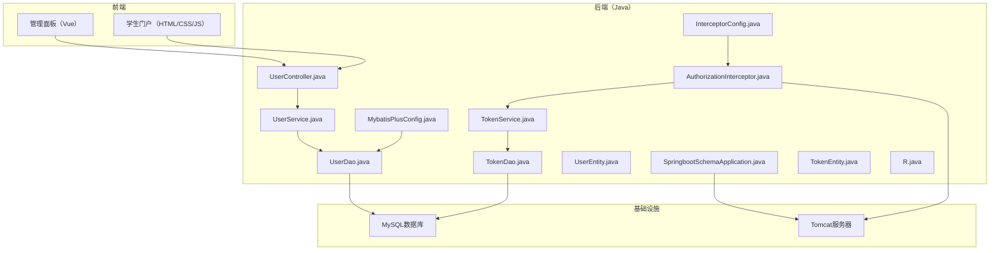
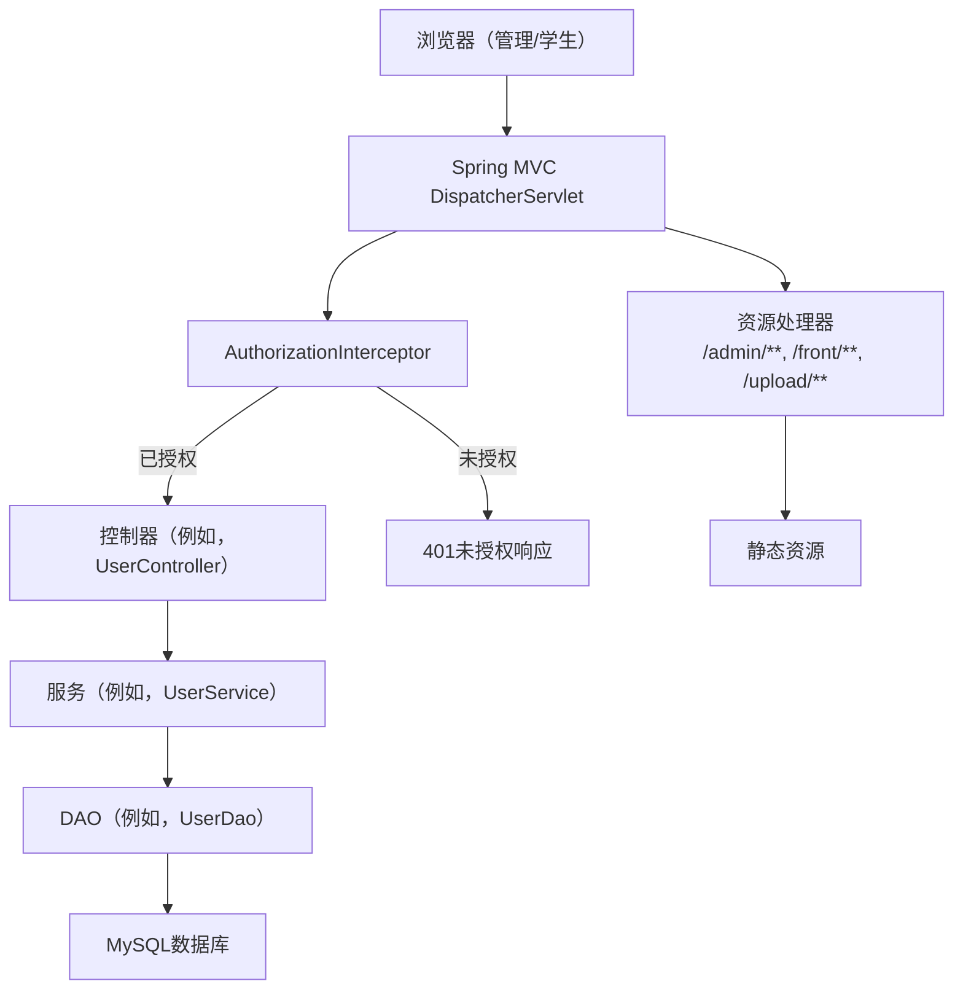
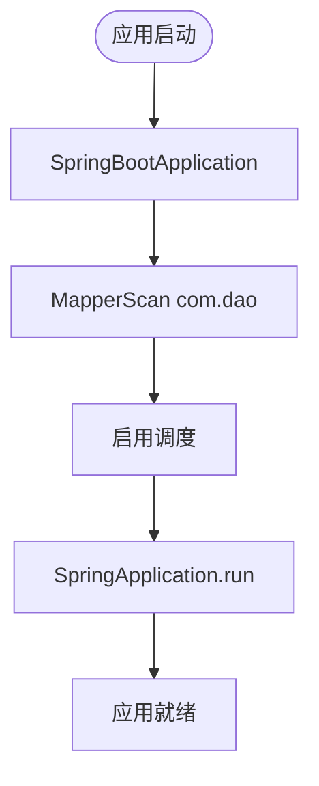
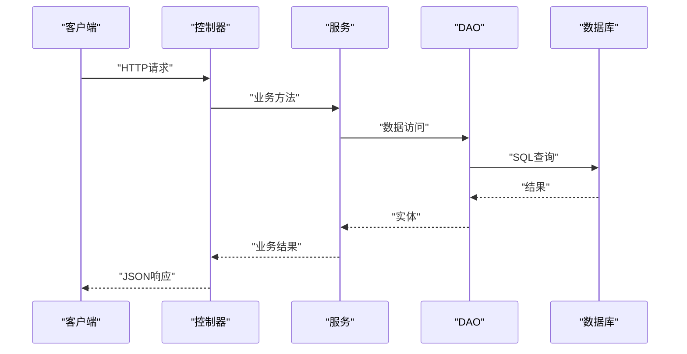
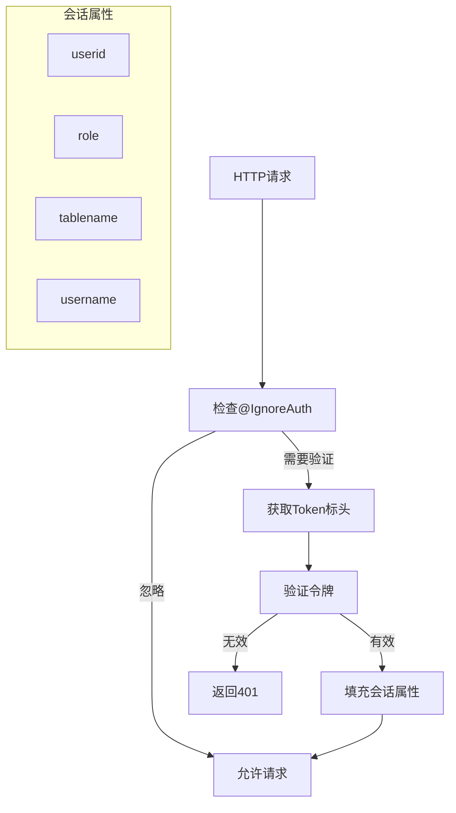
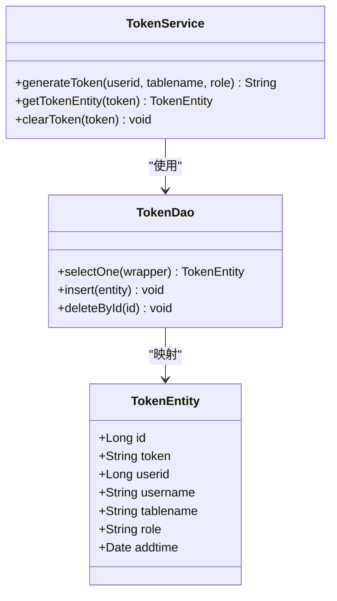
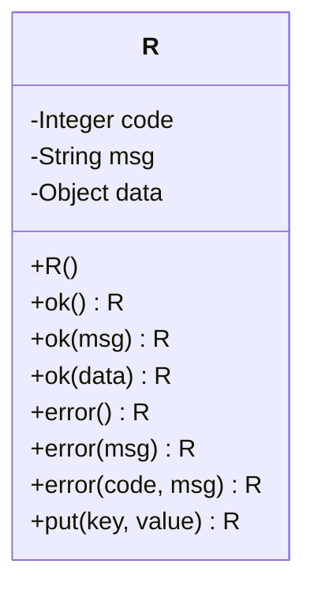
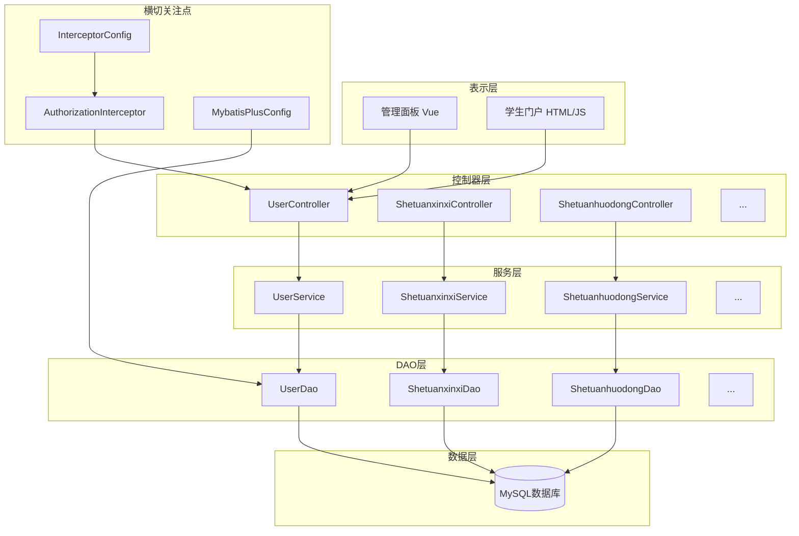
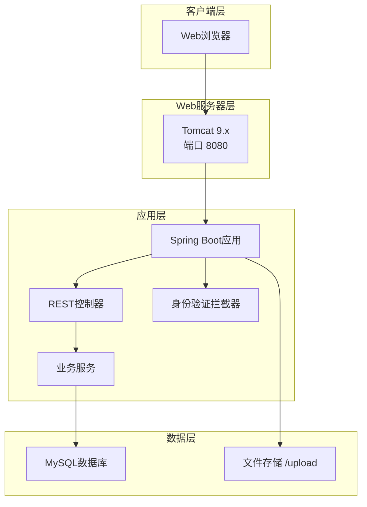

# 系统架构

<cite>
**本文档引用的文件**
- [SpringbootSchemaApplication.java](file://src/main/java/com/SpringbootSchemaApplication.java)
- [pom.xml](file://pom.xml)
- [application.yml](file://src/main/resources/application.yml)
- [MybatisPlusConfig.java](file://src/main/java/com/config/MybatisPlusConfig.java)
- [InterceptorConfig.java](file://src/main/java/com/config/InterceptorConfig.java)
- [AuthorizationInterceptor.java](file://src/main/java/com/interceptor/AuthorizationInterceptor.java)
- [UserController.java](file://src/main/java/com/controller/UserController.java)
- [UserService.java](file://src/main/java/com/service/UserService.java)
- [UserDao.java](file://src/main/java/com/dao/UserDao.java)
- [UserEntity.java](file://src/main/java/com/entity/UserEntity.java)
- [TokenService.java](file://src/main/java/com/service/TokenService.java)
- [TokenDao.java](file://src/main/java/com/dao/TokenDao.java)
- [TokenEntity.java](file://src/main/java/com/entity/TokenEntity.java)
- [R.java](file://src/main/java/com/utils/R.java)
- [vue.config.js](file://src/main/resources/admin/admin/vue.config.js)
- [config.js](file://src/main/resources/front/front/js/config.js)
</cite>

## 目录
1. [简介](#简介)
2. [项目结构](#项目结构)
3. [核心组件](#核心组件)
4. [架构概述](#架构概述)
5. [详细组件分析](#详细组件分析)
6. [依赖分析](#依赖分析)
7. [性能考虑](#性能考虑)
8. [故障排除指南](#故障排除指南)
9. [结论](#结论)
10. [附录](#附录)

## 简介
本文档描述了使用Spring Boot MVC和分层架构模式构建的学生社团活动管理系统的架构。该系统支持三个主要用户角色：管理员、社团负责人（社长）和学生（学生）。它暴露RESTful API，由两个前端应用程序消费：使用Vue.js构建的管理面板和交互式学生门户。身份验证通过自定义拦截器处理，该拦截器针对令牌存储验证Token标头，实现基于角色的访问控制。数据持久化利用MyBatis Plus和MySQL，而静态资源和文件上传从后端提供。跨域和CORS处理集中配置，系统包括调度功能。

## 项目结构
项目遵循经典的Maven布局，Java源代码在src/main/java下，资源在src/main/resources下。后端按层组织：
- com.controller：按域分组的REST端点（例如，UserController、Shetuan*控制器）
- com.service：服务接口和实现
- com.dao：MyBatis映射器接口
- com.entity：MyBatis实体POJO
- com.config：Spring配置（拦截器、MyBatis Plus）
- com.interceptor：Spring MVC拦截器
- com.utils：共享实用类（响应包装R、验证器等）
- 前端资源：
  - 管理面板：src/main/resources/admin/admin
  - 学生门户：src/main/resources/front/front



**图表来源**
- [SpringbootSchemaApplication.java:10-22](file://src/main/java/com/SpringbootSchemaApplication.java#L10-L22)
- [MybatisPlusConfig.java:14-22](file://src/main/java/com/config/MybatisPlusConfig.java#L14-L22)
- [InterceptorConfig.java:12-41](file://src/main/java/com/config/InterceptorConfig.java#L12-L41)
- [AuthorizationInterceptor.java:29-103](file://src/main/java/com/interceptor/AuthorizationInterceptor.java#L29-L103)
- [UserController.java:38-60](file://src/main/java/com/controller/UserController.java#L38-L60)
- [UserService.java:18-25](file://src/main/java/com/service/UserService.java#L18-L25)
- [UserDao.java:16-22](file://src/main/java/com/dao/UserDao.java#L16-L22)
- [UserEntity.java:13-182](file://src/main/java/com/entity/UserEntity.java#L13-L182)
- [TokenService.java:16-26](file://src/main/java/com/service/TokenService.java#L16-L26)
- [TokenDao.java:16-22](file://src/main/java/com/dao/TokenDao.java#L16-L22)
- [TokenEntity.java:13-133](file://src/main/java/com/entity/TokenEntity.java#L13-L133)
- [R.java:9-51](file://src/main/java/com/utils/R.java#L9-L51)

**本节来源**
- [SpringbootSchemaApplication.java:10-22](file://src/main/java/com/SpringbootSchemaApplication.java#L10-L22)
- [application.yml:1-53](file://src/main/resources/application.yml#L1-L53)
- [pom.xml:22-113](file://pom.xml#L22-L113)

## 核心组件
- 应用引导和扫描：
  - SpringBootApplication带有MapperScan，目标为com.dao并启用调度。
- 分层架构：
  - 控制器暴露REST端点并委托给服务。
  - 服务封装业务逻辑并协调DAO。
  - DAO定义用于数据访问的MyBatis映射器。
  - 实体表示数据库表。
- 拦截器和身份验证：
  - AuthorizationInterceptor验证Token标头并为授权请求填充会话属性。
  - TokenService/TokenDao管理用户的令牌记录。
- 响应抽象：
  - R在控制器中集中JSON响应形状。

**本节来源**
- [SpringbootSchemaApplication.java:10-22](file://src/main/java/com/SpringbootSchemaApplication.java#L10-L22)
- [AuthorizationInterceptor.java:29-103](file://src/main/java/com/interceptor/AuthorizationInterceptor.java#L29-L103)
- [TokenService.java:16-26](file://src/main/java/com/service/TokenService.java#L16-L26)
- [TokenDao.java:16-22](file://src/main/java/com/dao/TokenDao.java#L16-L22)
- [R.java:9-51](file://src/main/java/com/utils/R.java#L9-L51)

## 架构概述
系统采用多层RESTful API架构：
- 表示层：管理面板（Vue）和学生门户（HTML/JS）消费REST端点。
- API网关/入口：Spring MVC控制器处理HTTP请求。
- 业务逻辑：服务编排操作并强制执行验证。
- 持久化：通过XML文件和实体映射的MyBatis Plus映射器。
- 安全：自定义拦截器强制执行基于令牌的身份验证和CORS处理。
- 静态资源：通过资源处理器提供管理、前端和上传文件。



**图表来源**
- [InterceptorConfig.java:12-41](file://src/main/java/com/config/InterceptorConfig.java#L12-L41)
- [AuthorizationInterceptor.java:29-103](file://src/main/java/com/interceptor/AuthorizationInterceptor.java#L29-L103)
- [UserController.java:38-60](file://src/main/java/com/controller/UserController.java#L38-L60)
- [UserService.java:18-25](file://src/main/java/com/service/UserService.java#L18-L25)
- [UserDao.java:16-22](file://src/main/java/com/dao/UserDao.java#L16-L22)
- [application.yml:1-53](file://src/main/resources/application.yml#L1-L53)

## 详细组件分析

### 应用引导和配置
入口点通过@SpringBootApplication和@MapperScan初始化Spring上下文，启用调度并扫描DAO包。



**本节来源**
- [SpringbootSchemaApplication.java:10-22](file://src/main/java/com/SpringbootSchemaApplication.java#L10-L22)

### 分层架构实现
系统遵循严格的关注点分离：



**设计原则:**
- 控制器：HTTP处理、参数验证、响应格式化
- 服务：业务逻辑、事务管理、协调
- DAO：数据访问、查询执行、对象映射

**本节来源**
- [UserController.java:38-60](file://src/main/java/com/controller/UserController.java#L38-L60)
- [UserService.java:18-25](file://src/main/java/com/service/UserService.java#L18-L25)
- [UserDao.java:16-22](file://src/main/java/com/dao/UserDao.java#L16-L22)

### 身份验证和授权
AuthorizationInterceptor实现token-based身份验证：



**安全特性:**
- 基于令牌的无状态身份验证
- 角色驱动的访问控制
- 支持跨域请求（CORS）
- 通过@IgnoreAuth进行公共端点例外处理

**本节来源**
- [AuthorizationInterceptor.java:29-103](file://src/main/java/com/interceptor/AuthorizationInterceptor.java#L29-L103)
- [InterceptorConfig.java:12-41](file://src/main/java/com/config/InterceptorConfig.java#L12-L41)

### 令牌管理
TokenService和TokenDao管理用户会话的令牌：



**令牌生命周期:**
1. 登录时生成令牌
2. 每个请求验证令牌
3. 登出或过期时清除令牌

**本节来源**
- [TokenService.java:16-26](file://src/main/java/com/service/TokenService.java#L16-L26)
- [TokenDao.java:16-22](file://src/main/java/com/dao/TokenDao.java#L16-L22)
- [TokenEntity.java:13-133](file://src/main/java/com/entity/TokenEntity.java#L13-L133)

### 响应抽象
R类提供统一的JSON响应格式：



**响应约定:**
- code：状态码（0=成功，其他=错误）
- msg：人类可读消息
- data：响应有效载荷
- 所有控制器使用R进行一致的响应格式

**本节来源**
- [R.java:9-51](file://src/main/java/com/utils/R.java#L9-L51)

## 依赖分析
系统组件表现出清晰的依赖层次：



**依赖原则:**
- 单向依赖：控制器→服务→DAO→数据库
- 横切关注点：拦截器和配置
- 无循环依赖
- 通过接口松散耦合

**本节来源**
- [SpringbootSchemaApplication.java:10-22](file://src/main/java/com/SpringbootSchemaApplication.java#L10-L22)
- [MybatisPlusConfig.java:14-22](file://src/main/java/com/config/MybatisPlusConfig.java#L14-L22)
- [InterceptorConfig.java:12-41](file://src/main/java/com/config/InterceptorConfig.java#L12-L41)

## 性能考虑

### 数据库性能
1. **连接池**: 配置HikariCP以获得最佳连接管理
2. **分页**: 使用MyBatis Plus PaginationInterceptor避免大数据集
3. **索引**: 确保频繁查询的列上有适当的索引
4. **查询优化**: 使用显式列选择，避免SELECT *

### 应用性能
1. **静态资源**: 通过资源处理器提供，避免控制器开销
2. **缓存**: 考虑频繁访问数据的缓存策略
3. **令牌验证**: 保持拦截器逻辑轻量
4. **调度任务**: 使用@Scheduled高效处理后台任务

### 前端性能
1. **资源压缩**: 使用vue.config.js优化构建
2. **懒加载**: 实现路由级代码分割
3. **CDN**: 考虑静态资源的CDN分发

[本节提供一般性指导，无需来源]

## 故障排除指南

### 常见问题

**应用启动失败:**
- 验证数据库连接配置
- 检查端口冲突
- 确保所有依赖项在pom.xml中声明

**身份验证问题:**
- 确认Token标头正确发送
- 验证令牌在数据库中未过期
- 检查@IgnoreAuth用法以获取公共端点

**CORS错误:**
- 验证InterceptorConfig中的allowedOrigins
- 确保预检请求正确处理
- 检查浏览器网络选项卡中的CORS标头

**数据库连接问题:**
- 测试数据库服务器可访问性
- 验证凭据和数据库名称
- 检查连接池设置

**性能问题:**
- 分析慢查询
- 监控连接池使用情况
- 检查内存使用和垃圾收集

**本节来源**
- [application.yml:1-53](file://src/main/resources/application.yml#L1-L53)
- [InterceptorConfig.java:12-41](file://src/main/java/com/config/InterceptorConfig.java#L12-L41)
- [AuthorizationInterceptor.java:29-103](file://src/main/java/com/interceptor/AuthorizationInterceptor.java#L29-L103)

## 结论
学生社团活动管理系统采用定义良好的分层架构，具有以下关键优势：

- **关注点分离**: 每一层都有明确的职责
- **可扩展性**: 分层设计促进功能扩展
- **可维护性**: 模块化组件简化更新
- **安全性**: 基于令牌的身份验证与角色验证
- **灵活性**: MyBatis Plus支持复杂查询
- **用户体验**: 双前端满足不同用户需求

该架构支持系统的当前功能，同时为未来增强提供坚实基础。

## 附录

### 技术栈

**后端:**
- Java 8
- Spring Boot 2.2.2
- MyBatis Plus 3.x
- MySQL 5.7+
- Maven

**前端:**
- Vue.js（管理面板）
- HTML5/CSS3/JavaScript（学生门户）
- Element UI

**基础设施:**
- Tomcat 9.x
- HikariCP连接池
- 计划任务调度

### 配置要点

**application.yml关键设置:**
```yaml
server:
  port: 8080
  tomcat:
    uri-encoding: UTF-8

spring:
  datasource:
    driver-class-name: com.mysql.cj.jdbc.Driver
    url: jdbc:mysql://localhost:3306/dbname
    username: root
    password: password

mybatis-plus:
  mapper-locations: classpath:mapper/*.xml
  type-aliases-package: com.entity
```

### 部署架构



**本节来源**
- [pom.xml:22-113](file://pom.xml#L22-L113)
- [application.yml:1-53](file://src/main/resources/application.yml#L1-L53)
