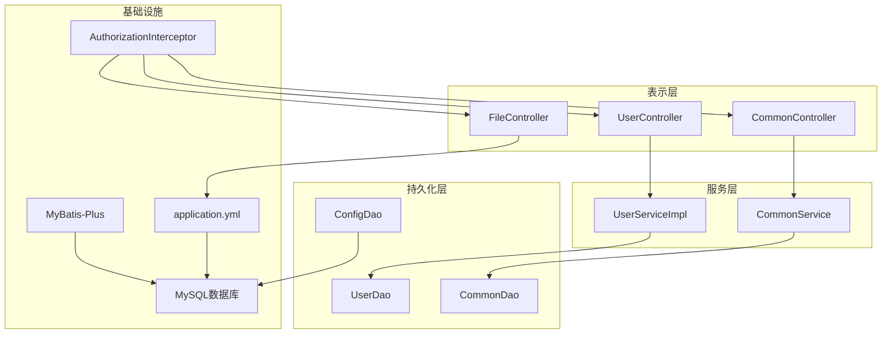
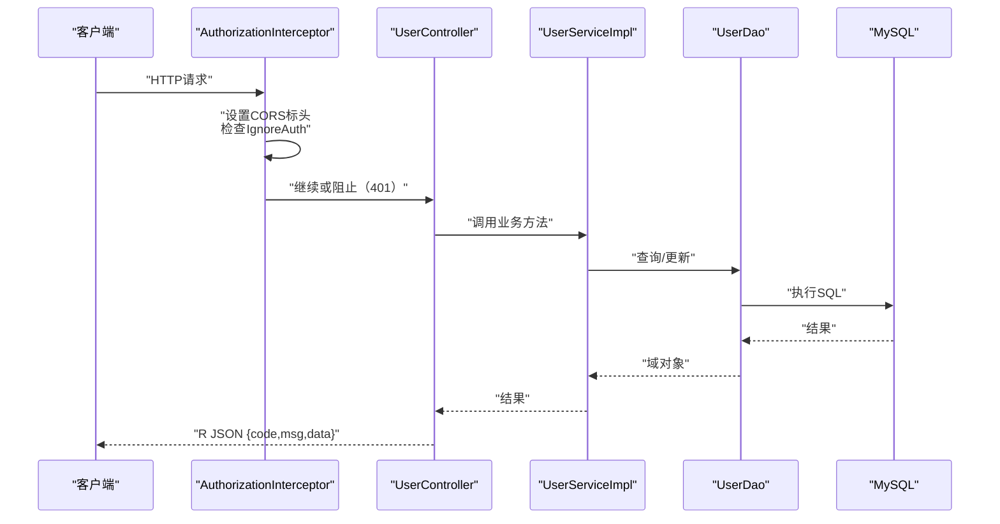
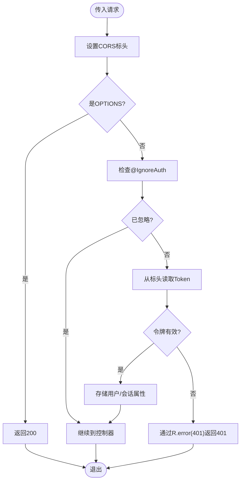
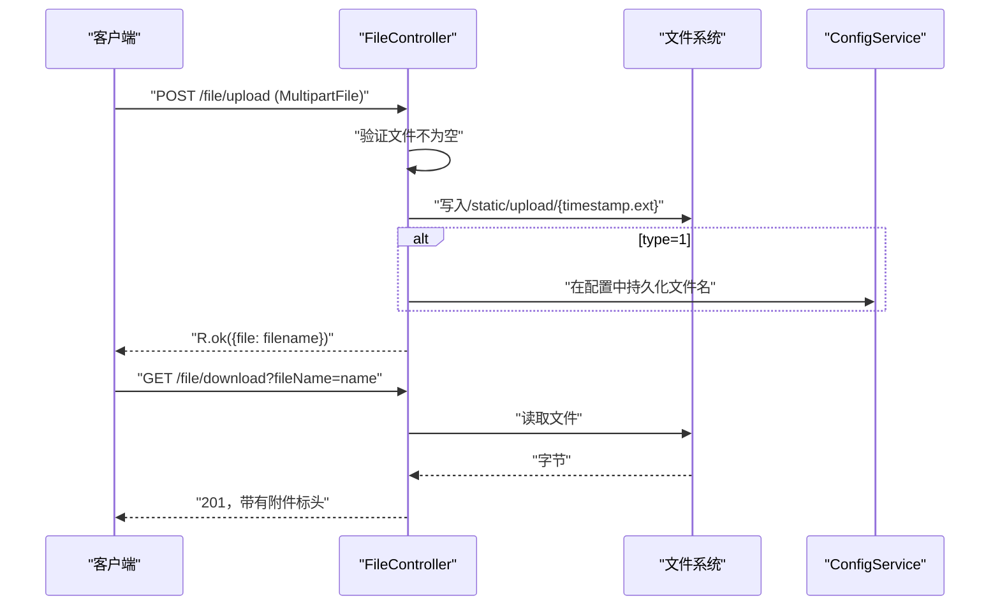
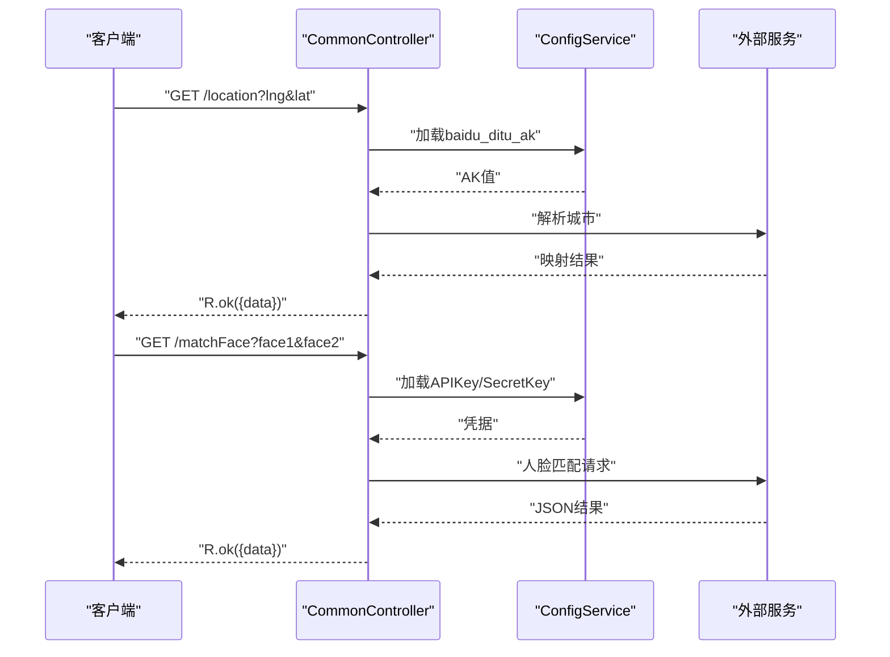
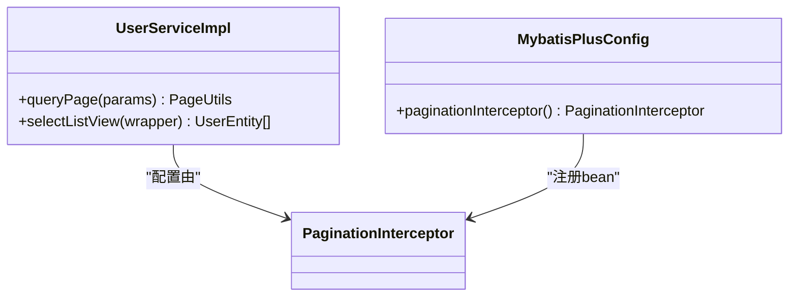
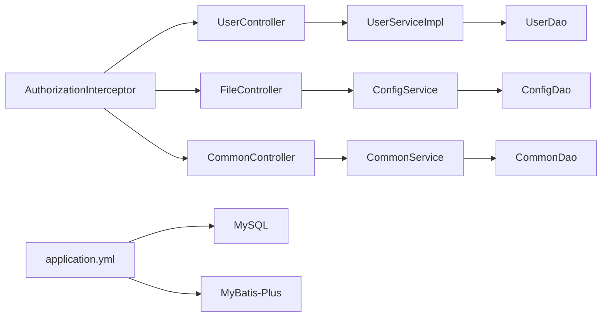

# 故障排除与常见问题

<cite>
**本文档引用的文件**
- [EIException.java](file://src/main/java/com/entity/EIException.java)
- [R.java](file://src/main/java/com/utils/R.java)
- [CommonController.java](file://src/main/java/com/controller/CommonController.java)
- [FileController.java](file://src/main/java/com/controller/FileController.java)
- [UserController.java](file://src/main/java/com/controller/UserController.java)
- [AuthorizationInterceptor.java](file://src/main/java/com/interceptor/AuthorizationInterceptor.java)
- [InterceptorConfig.java](file://src/main/java/com/config/InterceptorConfig.java)
- [application.yml](file://src/main/resources/application.yml)
- [MybatisPlusConfig.java](file://src/main/java/com/config/MybatisPlusConfig.java)
- [CommonDao.java](file://src/main/java/com/dao/CommonDao.java)
- [CommonService.java](file://src/main/java/com/service/CommonService.java)
- [FileUtil.java](file://src/main/java/com/utils/FileUtil.java)
- [ConfigEntity.java](file://src/main/java/com/entity/ConfigEntity.java)
- [ConfigDao.java](file://src/main/java/com/dao/ConfigDao.java)
- [UserServiceImpl.java](file://src/main/java/com/service/impl/UserServiceImpl.java)
- [front/index.html](file://src/main/resources/front/front/index.html)
</cite>

## 目录
1. [简介](#简介)
2. [项目结构](#项目结构)
3. [核心组件](#核心组件)
4. [架构概述](#架构概述)
5. [详细组件分析](#详细组件分析)
6. [依赖分析](#依赖分析)
7. [性能考虑](#性能考虑)
8. [故障排除指南](#故障排除指南)
9. [结论](#结论)
10. [附录](#附录)

## 简介
本文档为学生社团活动管理系统提供全面的故障排除和常见问题指导。它专注于诊断和解决常见问题，如数据库连接、身份验证失败、文件上传错误和API端点失败。它还解释了通过EIException类和R实用类响应格式的标准化错误处理，概述了系统化调试方法，并涵盖了性能优化、浏览器兼容性、CORS、安全性和部署/配置主题。

## 项目结构
系统遵循分层的Spring Boot架构：
- 控制器为业务功能（身份验证、上传、通用实用程序）暴露REST端点。
- 服务封装业务逻辑并协调DAO。
- DAO和MyBatis-Plus XML映射器处理持久化。
- 拦截器强制执行跨源和身份验证策略。
- 配置文件定义数据源、多部分限制、静态资源和MyBatis-Plus设置。

**图表来源**
- [UserController.java:38-253](file://src/main/java/com/controller/UserController.java#L38-L253)
- [FileController.java:31-108](file://src/main/java/com/controller/FileController.java#L31-L108)
- [CommonController.java:37-257](file://src/main/java/com/controller/CommonController.java#L37-L257)
- [UserServiceImpl.java:24-50](file://src/main/java/com/service/impl/UserServiceImpl.java#L24-L50)
- [CommonService.java:6-21](file://src/main/java/com/service/CommonService.java#L6-L21)
- [CommonDao.java:10-27](file://src/main/java/com/dao/CommonDao.java#L10-L27)
- [ConfigDao.java:10-12](file://src/main/java/com/dao/ConfigDao.java#L10-L12)
- [AuthorizationInterceptor.java:28-105](file://src/main/java/com/interceptor/AuthorizationInterceptor.java#L28-L105)
- [application.yml:1-53](file://src/main/resources/application.yml#L1-L53)
- [MybatisPlusConfig.java:13-25](file://src/main/java/com/config/MybatisPlusConfig.java#L13-L25)

**本节来源**
- [application.yml:1-53](file://src/main/resources/application.yml#L1-L53)
- [InterceptorConfig.java:11-41](file://src/main/java/com/config/InterceptorConfig.java#L11-L41)

## 核心组件
- 标准化响应格式：R实用类返回一致的JSON信封，包含code和msg字段，以及可选的负载数据。
- 自定义异常：EIException携带错误消息和数字代码，用于受控的错误传播。
- 身份验证和CORS：AuthorizationInterceptor验证令牌并设置宽松的CORS标头；InterceptorConfig为API路径注册拦截器，同时排除静态资源。
- 文件处理：FileController支持具有可配置限制和存储位置的上传和下载。
- 通用实用程序：CommonController暴露位置解析、人脸匹配、选项/组/值统计和提醒。

**本节来源**
- [R.java:9-52](file://src/main/java/com/utils/R.java#L9-L52)
- [EIException.java:7-52](file://src/main/java/com/entity/EIException.java#L7-L52)
- [AuthorizationInterceptor.java:28-105](file://src/main/java/com/interceptor/AuthorizationInterceptor.java#L28-L105)
- [InterceptorConfig.java:11-41](file://src/main/java/com/config/InterceptorConfig.java#L11-L41)
- [FileController.java:31-108](file://src/main/java/com/controller/FileController.java#L31-L108)
- [CommonController.java:37-257](file://src/main/java/com/controller/CommonController.java#L37-L257)

## 架构概述
典型请求的运行时流涉及拦截器、控制器、服务和持久化。CORS在拦截器中集中处理，身份验证依赖于传播到会话属性的Token标头。

**图表来源**
- [AuthorizationInterceptor.java:36-103](file://src/main/java/com/interceptor/AuthorizationInterceptor.java#L36-L103)
- [UserController.java:38-253](file://src/main/java/com/controller/UserController.java#L38-L253)
- [UserServiceImpl.java:24-50](file://src/main/java/com/service/impl/UserServiceImpl.java#L24-L50)
- [application.yml:9-27](file://src/main/resources/application.yml#L9-L27)

## 详细组件分析

### 身份验证和令牌验证
- 令牌检索：拦截器读取Token标头并针对TokenService进行验证，成功后存储用户/会话属性。
- CORS处理：拦截器设置Access-Control-*标头并短路预检OPTIONS请求。
- 路径注册：InterceptorConfig为API路由注册拦截器，同时排除static/admin/front/upload。

**图表来源**
- [AuthorizationInterceptor.java:36-103](file://src/main/java/com/interceptor/AuthorizationInterceptor.java#L36-L103)
- [InterceptorConfig.java:19-26](file://src/main/java/com/config/InterceptorConfig.java#L19-L26)

**本节来源**
- [AuthorizationInterceptor.java:31-103](file://src/main/java/com/interceptor/AuthorizationInterceptor.java#L31-L103)
- [InterceptorConfig.java:19-41](file://src/main/java/com/config/InterceptorConfig.java#L19-L41)

### 文件上传和下载
- 上传端点：验证非空文件，确定扩展名，写入配置的static/upload路径，并可选择更新人脸文件的配置键。
- 下载端点：从static/upload提供具有适当标头的文件；在IO错误时返回500。
- 存储和限制：application.yml定义多部分限制和静态位置。

**图表来源**
- [FileController.java:44-105](file://src/main/java/com/controller/FileController.java#L44-L105)
- [application.yml:21-27](file://src/main/resources/application.yml#L21-L27)

**本节来源**
- [FileController.java:44-105](file://src/main/java/com/controller/FileController.java#L44-L105)
- [application.yml:21-27](file://src/main/resources/application.yml#L21-L27)
- [FileUtil.java:13-28](file://src/main/java/com/utils/FileUtil.java#L13-L28)

### 通用实用程序和统计
- 位置解析：使用配置的API密钥从坐标解析城市。
- 人脸匹配：从配置加载凭据，编码图像，并调用外部服务。
- 选项/组/值统计：通过CommonService提供级联下拉选项和聚合查询。

**图表来源**
- [CommonController.java:52-105](file://src/main/java/com/controller/CommonController.java#L52-L105)
- [ConfigDao.java:10-12](file://src/main/java/com/dao/ConfigDao.java#L10-L12)
- [ConfigEntity.java:12-53](file://src/main/java/com/entity/ConfigEntity.java#L12-L53)

**本节来源**
- [CommonController.java:52-105](file://src/main/java/com/controller/CommonController.java#L52-L105)
- [ConfigEntity.java:12-53](file://src/main/java/com/entity/ConfigEntity.java#L12-L53)

### 数据访问和分页
- MyBatis-Plus配置启用分页并禁用缓存以获得确定性行为。
- UserServiceImpl将分页和列表查询委托给基础映射器。

**图表来源**
- [UserServiceImpl.java:24-50](file://src/main/java/com/service/impl/UserServiceImpl.java#L24-L50)
- [MybatisPlusConfig.java:13-25](file://src/main/java/com/config/MybatisPlusConfig.java#L13-L25)

**本节来源**
- [application.yml:28-53](file://src/main/resources/application.yml#L28-L53)
- [UserServiceImpl.java:27-48](file://src/main/java/com/service/impl/UserServiceImpl.java#L27-L48)

## 依赖分析
- 控制器依赖于服务和实用类；服务依赖于DAO和配置服务。
- 拦截器依赖于TokenService并写入标准化响应。
- application.yml集中数据源、多部分、静态位置和MyBatis-Plus设置。

**图表来源**
- [UserController.java:40-47](file://src/main/java/com/controller/UserController.java#L40-L47)
- [FileController.java:35-39](file://src/main/java/com/controller/FileController.java#L35-L39)
- [CommonController.java:41-46](file://src/main/java/com/controller/CommonController.java#L41-L46)
- [application.yml:9-53](file://src/main/resources/application.yml#L9-L53)

**本节来源**
- [application.yml:9-53](file://src/main/resources/application.yml#L9-L53)

## 性能考虑
- 数据库查询
  - 为大型数据集启用分页以避免内存压力。
  - 通过批量获取相关数据或在适当时使用联接来避免N+1选择。
  - 在开发期间保持缓存禁用以获得可预测的结果；仅在需要时启用。
- 内存使用
  - 文件上传被缓冲；保持合理的max-file-size以防止OOM。
  - 对于人脸匹配，确保管理临时文件并避免加载过大的图像。
- 响应时间
  - 在拦截器中集中CORS处理以减少每控制器开销。
  - 最小化控制器中的同步阻塞；如有需要将繁重任务卸载到异步工作器。
- 静态资源
  - 从application.yml中配置的类路径或文件系统位置提供静态资产以减少延迟。

[本节提供一般性指导，无需来源]

## 故障排除指南

### 数据库连接问题
症状
- 应用无法启动或抛出连接异常。
- 查询超时或间歇性失败。

诊断步骤
- 验证application.yml中的数据源URL、用户名和密码。
- 确认MySQL服务器在指定的主机/端口上可访问。
- 检查JDBC URL中的时区和字符编码参数。
- 确保数据库存在且用户具有权限。

解决方案
- 更正application.yml中的凭据和URL。
- 如果与数据库服务器不匹配，调整serverTimezone和characterEncoding。
- 更改后重新启动应用。

**本节来源**
- [application.yml:10-19](file://src/main/resources/application.yml#L10-L19)

### 身份验证失败
症状
- 请求返回401"请登录"。
- CORS预检OPTIONS返回200，但后续请求仍然失败。

诊断步骤
- 确认Token标头存在且有效。
- 检查拦截器是否为请求的路径注册。
- 验证IgnoreAuth注释未错误地应用于受保护的端点。
- 检查拦截器设置的会话属性。

解决方案
- 为受保护的端点在Token标头中提供有效令牌。
- 确保拦截器路径模式与您的API路由匹配。
- 从需要身份验证的端点移除@IgnoreAuth。

**本节来源**
- [AuthorizationInterceptor.java:36-103](file://src/main/java/com/interceptor/AuthorizationInterceptor.java#L36-L103)
- [InterceptorConfig.java:19-26](file://src/main/java/com/config/InterceptorConfig.java#L19-L26)

### 文件上传错误
症状
- 上传端点抛出"文件不能为空"。
- 下载返回内部服务器错误。

诊断步骤
- 检查application.yml中的多部分限制。
- 验证上传目录存在且可写。
- 确认下载的fileName参数与存储的文件匹配。

解决方案
- 确保选择了文件且不为空。
- 如有需要增加max-file-size。
- 确认static/upload路径存在且权限正确。

**本节来源**
- [FileController.java:44-74](file://src/main/java/com/controller/FileController.java#L44-L74)
- [FileController.java:79-105](file://src/main/java/com/controller/FileController.java#L79-L105)
- [application.yml:21-27](file://src/main/resources/application.yml#L21-L27)

### API端点失败
症状
- 意外的500错误，带有通用消息。
- 业务逻辑返回不一致的错误代码。

诊断步骤
- 检查控制器方法是否抛出EIException或返回R.error()。
- 检查集中错误处理模式和响应代码。
- 验证输入参数和约束。

解决方案
- 使用R.error(code, msg)进行显式错误响应。
- 抛出具有适当代码的EIException以进行受控处理。
- 记录请求URL和处理器类型以进行关联。

**本节来源**
- [R.java:16-30](file://src/main/java/com/utils/R.java#L16-L30)
- [EIException.java:7-52](file://src/main/java/com/entity/EIException.java#L7-L52)
- [AuthorizationInterceptor.java:90-102](file://src/main/java/com/interceptor/AuthorizationInterceptor.java#L90-L102)

### CORS问题
症状
- 跨源请求被浏览器阻止。
- 预检OPTIONS成功，但实际请求失败。

诊断步骤
- 确认拦截器中设置了Access-Control-*标头。
- 验证Access-Control-Allow-Origin与请求源匹配。
- 确保拦截器处理OPTIONS预检。

解决方案
- 在拦截器中保留CORS标头；不要删除Allow-Origin通配符。
- 使拦截器路径模式与您的前端源对齐。

**本节来源**
- [AuthorizationInterceptor.java:43-53](file://src/main/java/com/interceptor/AuthorizationInterceptor.java#L43-L53)

### 浏览器兼容性和前端集成
症状
- iframe内未应用样式。
- 混合内容或CSP警告。

诊断步骤
- 检查前端索引中注入的样式和跨源限制。
- 检查admin/front/upload的静态资源服务。

解决方案
- 仅在同源时注入样式；预期跨源限制。
- 从配置的位置提供静态资源以避免混合内容。

**本节来源**
- [front/index.html:644-855](file://src/main/resources/front/front/index.html#L644-L855)
- [application.yml:25-27](file://src/main/resources/application.yml#L25-L27)

### 安全问题
症状
- 未授权访问受保护的端点。
- 弱凭据检查或缺少输入验证。

诊断步骤
- 确保@IgnoreAuth未应用于敏感端点。
- 验证令牌验证和会话属性填充。
- 检查适当的输入验证和清理。

解决方案
- 仅将@IgnoreAuth应用于公共端点。
- 在拦截器中强制执行令牌存在和有效性。
- 添加输入验证并清理用户提供的数据。

**本节来源**
- [AuthorizationInterceptor.java:55-87](file://src/main/java/com/interceptor/AuthorizationInterceptor.java#L55-L87)
- [UserController.java:51-60](file://src/main/java/com/controller/UserController.java#L51-L60)

### 部署和环境问题
症状
- 应用在意外端口或上下文路径上启动。
- 静态资源未提供服务。

诊断步骤
- 检查application.yml中的server.port和server.servlet.context-path。
- 确认static-locations包括upload和admin/front路径。
- 验证特定于环境的覆盖（如适用）。

解决方案
- 为生产环境设置正确的端口和上下文路径。
- 确保static-locations提供admin、front和upload目录。

**本节来源**
- [application.yml:2-8](file://src/main/resources/application.yml#L2-L8)
- [application.yml:25-27](file://src/main/resources/application.yml#L25-L27)

### 常见问题
- 标准化响应格式是什么？
  - 响应使用R，包含code、msg和可选的数据负载字段。
- 如何表示错误？
  - 使用R.error(code, msg)或抛出具有代码/消息的EIException。
- 哪些端点受令牌验证保护？
  - InterceptorConfig中注册的API路由被拦截；static/admin/front/upload被排除。
- 如何配置上传？
  - 最大文件/请求大小和上传目录在application.yml中定义。
- CORS如何工作？
  - 拦截器设置Access-Control-*标头并处理预检OPTIONS。
- 是否有内置的统计端点？
  - CommonController提供选项/组/值/统计端点。
- 如何处理分页？
  - 通过配置启用MyBatis-Plus分页拦截器。

**本节来源**
- [R.java:9-52](file://src/main/java/com/utils/R.java#L9-L52)
- [EIException.java:7-52](file://src/main/java/com/entity/EIException.java#L7-L52)
- [InterceptorConfig.java:19-26](file://src/main/java/com/config/InterceptorConfig.java#L19-L26)
- [application.yml:21-27](file://src/main/resources/application.yml#L21-L27)
- [CommonController.java:113-254](file://src/main/java/com/controller/CommonController.java#L113-L254)
- [MybatisPlusConfig.java:19-22](file://src/main/java/com/config/MybatisPlusConfig.java#L19-L22)

## 结论
本指南整合了学生社团活动管理系统的实用故障排除步骤、标准化错误处理模式和操作最佳实践。通过利用基于拦截器的身份验证/CORS设置、R实用类的响应格式和EIException类，团队可以快速诊断和解决大多数问题。遵守性能和安全建议可确保跨环境的可靠运行。

## 附录

### 错误代码解释
- 401未授权：需要身份验证或令牌无效。
- 500未知错误：通用失败；检查日志和堆栈跟踪。
- 自定义代码：对特定于域的错误使用具有显式代码的EIException。

**本节来源**
- [AuthorizationInterceptor.java:95-102](file://src/main/java/com/interceptor/AuthorizationInterceptor.java#L95-L102)
- [R.java:16-30](file://src/main/java/com/utils/R.java#L16-L30)
- [EIException.java:23-33](file://src/main/java/com/entity/EIException.java#L23-L33)
